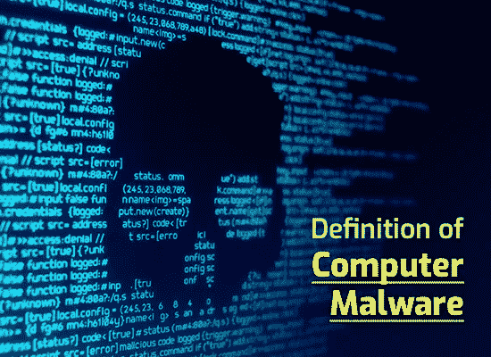

# 恶意软件和攻击技术

> 原文：<https://blog.devgenius.io/malware-attack-technologies-e01b44b2f855?source=collection_archive---------38----------------------->

恶意软件是“恶意软件”的简称。它是对计算机或用户有恶意的任何程序。恶意软件有很多种。恶意软件进行的大多数网络攻击都是在互联网上传播的。因为，在恶意软件创建的背后有一些技术，我们应该更好地有我们的方式来保护我们自己。

**恶意软件的分类:**恶意软件有很多种。明智的做法是对它们进行分类，以便采用更系统的方法。这种分类让我们能够深入了解恶意软件的特征和性质，以便我们能够应对各种恶意软件。类别的第一个维度是恶意软件是独立的程序还是嵌入了另一个程序。第二维决定恶意软件是永久的还是暂时的。大多数恶意软件安装在永久存储中，而一些恶意软件驻留在内存中，一旦设备重启就会被删除。第三个维度仅适用于持久性恶意软件，根据安装和运行恶意软件的系统堆栈层对恶意软件进行分类。第四个维度是恶意软件是自己运行还是被用户激活。当一个自动传播的恶意软件开始时，它会在互联网上寻找其他易受攻击的计算机并将其安装在这些计算机上，已安装的计算机也会这样做，等等。同时，另一种需要用户手动安装运行，传播速度较慢。第五维度是恶意软件是不断更新还是静态的。大多数现代恶意软件都是由恶意软件基础结构更新的。第六个维度是恶意软件是单独行动还是协同网络的一部分。

**恶意软件的恶意活动:**我们可以使用网络杀伤链模型来分析网络攻击，该模型显示了典型网络攻击的步骤。第一步，侦察，是攻击者识别受害者。下一步是渗透目标计算机，例如发送一封名为“武器化和交付”的电子邮件。一旦这个完成，一个新的恶意软件被下载并安装，这被称为安装。这是攻击者的主要武器。现在大多数恶意软件都遵循这些步骤，因为有工具包可以更容易地创建使用这些步骤的恶意软件。僵尸网络是由攻击者控制的受感染设备的数字大军。僵尸网络恶意软件在每个机器人上运行，并经常与命令&控制(C & C)服务器保持联系，以获取更新和新命令。当使用网络杀伤链模型来分析网络攻击时，需要逐步检查攻击的活动。

**恶意软件分析:**分析恶意软件非常关键。该过程有助于我们找出恶意软件的目的和结构，以及与现有恶意软件相比的性质。这使我们能够针对这种特定的威胁建立适当的防御措施，并可能出于良好的目的使用恶意软件的编码结构。

恶意软件分析是提取并检查其源代码，或者只是在适当的分析环境中运行它。有几种技术可以调查恶意软件。分析潜在恶意软件的方法基本上是 1)恶意软件格式分析 2)静态分析 3)动态分析。最后两个步骤可以结合起来协作。

**分析技术:**这是学习恶意软件机制的动作。由于恶意软件复杂性的频繁变化，需要进行分析。

**静态分析:**分析恶意软件的代码而不激活它。

**动态分析:**与静态分析相反，恶意软件运行是为了分析其行为。与静态分析相比，它在揭示软件的某些特性方面更先进，尤其是那些从源代码中不太明显的特性。

**Fuzzing:** 这是一种通过提供随机生成的输入来调查错误、异常、内存泄漏和漏洞以及一些可能的极限情况的自动化方法。

**符号执行:**与正常执行不同，在这种方法中，变量和表达式被存储为符号，以便在运行时模拟检查点的可能路径分支的每一个组合。每个执行场景(案例)都有助于揭示某种不可预测的后果。

**Concolic 执行:**顾名思义，它是具体执行方法和符号执行方法的混合，旨在克服这两种方法的局限性，这两种方法仍然以迭代的方式执行输入，同时在普通空间和符号空间之间分配分支选择平面。

**分析环境:**分析恶意软件通常需要一个专用系统，以便让动态分析工具工作。基于分析技术及其局限性的决策的系统设计选择。应该保持分析有效性和成本(工作量和时间)之间的平衡。

**安全和生存环境要求:**显然，在分析恶意软件时，网络和数据的安全是必不可少的。然而，即使静态分析是最安全的，它在分析潜在威胁方面也非常有限。此外，恶意软件需要通过互联网连接他们的 C & C 服务器来获取攻击指令，积累私人信息等等。这就是为什么恶意软件捕获的系统需要是“活的”。

**虚拟化网络环境:**大多数恶意软件分析系统都是虚拟系统。虚拟化允许用户在一个设备中创建一个或多个虚拟机，即严格控制下的 fish glass，其破坏不会影响主机设备，即使这些虚拟机就像普通计算机一样，并且可以访问互联网。

**反分析和规避技术:**恶意软件开发者(MD)试图避免他们的恶意产品被轻易检测到，因为他们在最近的技术中进行了调整。

**规避分析方法:**打击恶意软件的主要问题之一是无法筛选出它们的源代码。此外，MDs 实现了反反汇编技术，给分析器带来了误导性的源代码。此外，他们现在只在运行时需要时才解包代码，或者从随机字节码中生成大量可能的恶意软件样本，同时使静态分析工具瘫痪。

因此，结合静态和动态分析工具是一个好主意。

**识别分析环境:**此外，恶意软件还使用控制流触发器来监控环境，无论它是否被困在沙箱中。对付这种情况的最佳方法是使用它们的快照来迫使各种输入解锁恶意软件的规避措施。恶意软件偶尔会使用红药丸测试或检查设备型号、注册表值、进程或系统目录，甚至键盘和鼠标活动，以检测他们是否过着“虚假的生活”。如果恶意软件嗅到了可疑的东西，它就会播放莫莉。

**恶意软件检测**

**识别恶意软件的存在:**对抗恶意软件的战争艺术需要掌握收集和处理所有可能揭示恶意实体的线索和证据。这有时需要侦探的机智和灵活，这直接来自柯南道尔或阿加莎克里斯蒂的小说。

**大海捞针找到恶意软件:**传播恶意软件的主要风险是从互联网下载。一些可疑的痕迹可能是危险的第一个迹象。然而，恶意软件在大量涌入目标系统的毛细血管(目录)后，仍会不时地悄悄潜伏。监视网络数据传输中的异常情况或搜寻臭名昭著的 IP 地址可能有助于识别它们。

***规避和对策*** 恶意软件开发者的一些最佳实践是多态和包转移，作为合法应用程序的常规更新，这也给了他们修改和实施新的恶意活动的机会。

**恶意软件攻击的检测:**剖析每一个恶意软件通常不是明智的选择。我们需要从总体上区分它们。

**基于主机和基于网络的监控:**这一概念包括异常检测或误用检测，例如对(特别重要的)系统文件的未授权访问，连接到恶意僵尸网络 C & C 主机。基于网络的监控侧重于数据流量、电子邮件流量(垃圾邮件检测)、发送的可疑数据模式(DDoS 检测)或大量文件修改(勒索软件加密)。

**基于机器学习的安全分析:**基于 ML 的模型有利于在对实验组进行训练的基础上推广恶意软件。这种方法具有识别恶意软件世界中的新奇和混合成员的巨大优势。

**规避、对策和限制:**由于攻击者知道如何抵御他们的恶意攻击，他们确保恶意软件保持低水平。除了限制它们的活动，恶意软件还模仿良性软件扮演驯服。另一个不错的老把戏是故意将大量不相关的垃圾代码放入恶意软件中，以欺骗可能的分析工作。这也称为噪声注入或毒害数据。

不同 ML 模型的组合可能效果更好。基于现有恶意软件模式的误用检测方法对于新的攻击甚至现有攻击的新版本并不那么有效。因此，实际情况可能比理论上复杂得多。

**恶意软件响应:**如果感染范围很广，考虑拿下恶意软件传播的指挥和控制基础可能是更好的选择。

**恶意软件操作中断:**

如果恶意软件检查集中式服务器的域名，我们应用 sinkholing 技术来抵消 C&C 域。如果他们通过 P2P 机制分散操作，最好是毒化恶意软件的通信链接。

**规避和对策:**安全性的努力有时会遇到一些障碍，如算法生成的域、防弹主机或 P2P“加固”集中式 C 服务器以防其崩溃等。此外，采取行动是没有成效的，除非它炸毁所有的恶意软件服务器。在这一点上，恶意软件询问进入揭示与受害设备通信的所有主要和备份机制的阶段。

**归因:**官方通常会揭露网络攻击背后的主谋。追溯他们的别名或调查恶意软件的数据，风格，配置等。可能会暴露他们。通过比较恶意软件特征和行为获得的线索也可能揭示故事的反面人物。

**规避和对策:**恶意软件开发者通常利用各种工具包定制和修改他们自己的恶意软件。这也是为什么，一些简单的恶意软件有时会产生毁灭性的影响。另一种规避方法是在软件中放置“虚假标记”。这增加了综合考虑每一条线索的重要性。甚至 WHOIS 信息中的一些模式也可能揭示所谓的独立事件和网络暴行。

**结论**

恶意软件以各种方式和形式进行恶意活动，嵌入在程序中或作为独立实体传输。他们可能会展示有组织的攻击、更新、无声的活动来迷惑我们。他们实现了大量的规避方法，如定制和隐藏源代码、通信备份机制、反反汇编技术等。

针对他们的努力应该结合几种方法以及静态和动态分析技术，以提高检测的准确性，同时评估许多线索，以否认披着羊皮的狼。

正如猎人有他们的陷阱，狐狸也知道他们的方式。

参考

[https://www.cybok.org/](https://www.cybok.org/)