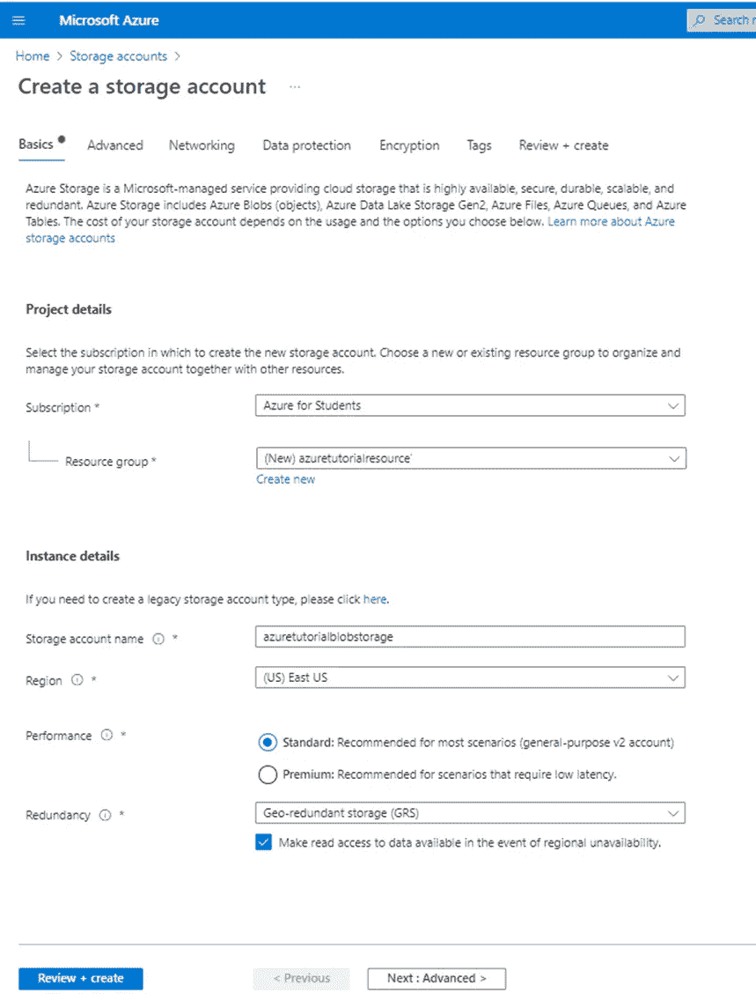

# 在 NestJS 中管理 Azure Blob 存储

> 原文：<https://blog.devgenius.io/manage-azure-blob-storage-in-nestjs-daf5cb5125d4?source=collection_archive---------6----------------------->


在 NestJS 中管理 Azure Blob 存储

大家好！😀

在这篇文章中，我将讨论 azure blob 存储，以及我们如何一步一步地从 NestJS 应用程序上传、删除、读取和下载我们的文件/图像。

🚀让我们开始今天的内容吧

*   什么是 Azure blob 存储
*   创建存储帐户
*   创建资源
*   创建容器
*   创建 NestJS 端点

# 什么是 Azure Blob 存储

嘿，你知道在构建应用程序时如何管理大量存储吗？🤔。我相信 Azure Blob 存储服务将是您的答案之一😋。

如果你不知道，不要着急！在接下来的几分钟里，你会了解到这一点。开始吧！😎

Azure 为我们提供了各种 web 服务，blob 存储就是其中之一。Azure Blob 存储是微软的云对象存储解决方案，它基本上是为存储大量非结构化数据而优化的。非结构化数据是不符合特定数据模型或定义的数据，如文本或二进制数据。Blob 存储可通过 azure storage、rest API、azure PowerShell、Azure CLI 或 Azure Storage 客户端库进行访问。

Azure blob 存储主要由三种类型的资源组成，即存储帐户、容器和 blob。下图显示了这三种资源之间的关系。


Azure Blob 存储

# 存储帐户

我们存储账户中的所有数据都在服务端自动加密。存储帐户在 Azure 中为我们的数据提供了唯一的名称空间😮。我们存储在 Azure 存储中的每个对象都有一个地址，其中包含我们唯一的帐户名。帐户名和 Azure 存储服务端点的组合构成了我们的存储帐户的端点。

例如，如果我们将我们的存储帐户命名为“myazurestorageaccount”，那么 blob 存储的默认端点是，

[*http://myazurestorageaccount.blob.core.windows.net*](http://myazurestorageaccount.blob.core.windows.net)

*在命名存储帐户时，我们应该考虑帐户名的字符长度。它的长度应该在 3 到 24 个字符之间。它只能包含数字和小写字母。另一件事是没有两个存储帐户可以有相同的名称。*

# *容器*

*一个存储帐户可以有无限数量的容器，容器可以有无限数量的 blobs，当您决定容器名称时，请确保使用小写字母。😀*

# *一滴*

*有三种类型的斑点*

*   *Block blobs 存储文本和二进制数据*
*   *追加 blobs 针对追加操作进行了优化*
*   *页面 blobs*

*当我们命名容器和 blobs 时，我们必须遵循一些规则。您可以参考这些规则以及官方文档中关于 Blob 存储的更多信息👇。*

*[https://docs . Microsoft . com/en-us/azure/storage/blobs/storage-blobs-简介](https://docs.microsoft.com/en-us/azure/storage/blobs/storage-blobs-introduction)*

*现在我们对 blob 存储有了一个简单的概念，让我们看看如何一步一步地创建 blob 存储😃。*

# *正在创建 Azure Blob 存储*

***第一步**:登录 Azure 门户后，可以看到下面的仪表盘。然后点击存储帐户选项。*

**

*创建 Azure Blob 存储步骤 01*

*如果您看不到这样的“存储帐户”，您可以在搜索栏上搜索并选择它。*

***第 2 步**:在下一个窗口中，点击“创建存储账户”选项。*

**

*创建 Azure Blob 存储步骤 02*

*第三步:填写表格并创建一个存储账户*

*在此窗口中，我们需要填写订阅、资源组、存储帐户名、区域、性能和冗余。*

*   *订阅:因为我是大学生，所以我有一个免费的 azure 学生订阅。因此，我在这里选择它，如果您没有订阅，您可以使用免费试用选项。*
*   *资源组:在这个字段中，我将创建一个新的资源组，并将其命名为“azuretutorialresource”*
*   *存储帐户名称:在此输入一个唯一的名称，该名称将显示在基址上。*
*   *地区:您可以选择最近的地区或您喜欢的地区。这里我不打算改变它，我选择默认的。*
*   *性能:您可以选择 premium 或 standard subscription，但是如果您使用的是试用版，请选择 standard subscription。*

*在这里你可以看到我填好的表格。*

**

*创建 Azure Blob 存储步骤 03*

*完成表格后，您可以将其余选项设为默认值，或者通过单击“下一步:高级”按钮来更改这些选项。因此，您可以根据自己的喜好更改选项。但在这里，我不会更改其余选项，我将单击“查看+创建”按钮。*

*第四步:然后它会验证我们的选项。完成验证后，我们可以单击“创建”按钮来创建存储帐户。*

**

*创建 Azure Blob 存储步骤 04*

*完成该过程后，您将能够看到这种窗口。*

**

*创建 Azure Blob 存储步骤 04*

***第 5 步:**然后按下“**转到资源”**按钮，您将重定向到存储帐户控制面板。然后你可以看到一个左边栏，它有各种选项。从那里，选择位于**数据存储**类别下的“**容器”**选项*

**

*创建 Azure Blob 存储步骤 05*

***第六步:**现在点击创建资源按钮，右边会出现一个表单。填写表格，给出容器的**名称**和**公共访问级别**(您可以根据需要使用任何选项)。在这里，您可以在一个存储帐户下创建任意数量的容器。*

**

*创建 Azure Blob 存储步骤 05*

*完成表格后，点击创建按钮。*

*酷！😎我们已经设置了 Azure blob 存储，现在我们需要将我们的 NestJS 应用程序与 blob 存储连接起来。让我们这样做😁。*

# *创建 NestJS 应用程序*

*我希望您已经熟悉了 NestJS 并安装了 NestJS CLI。因此，您可以使用下面的 create 命令直接创建 NestJS 应用程序。如果您尚未安装 CLI，可以在创建应用程序之前安装 CLI。创建应用程序后，我们可以使用 run 命令运行应用程序。*

# *安装 CLI 的命令:*

```
***$** **npm i -g @nestjs/cli***
```

# *创建 NestJS 应用程序的命令:*

```
***$ nest new your_project_name***
```

# *在开发模式下运行应用程序的命令:*

```
***$ npm run start:dev***
```

# *为 Azure Blob 存储安装 npm 包*

```
***$ npm install @azure/storage-blob***
```

# *安装 multer & uuid npm 软件包*

*这里，我们将使用 Multer 包来管理文件处理操作，UUID 用于为每个 blob 生成一个唯一的名称。*

```
***$ npm install --save @types/multer****$ npm install uuidv4***
```

# *从 Azure 门户复制凭据*

*当我们向 Azure storage 发送请求时，它们应该得到授权。为此，Azure 提供了两个密钥，每个密钥都有一个连接字符串。因此，现在我们需要将凭证作为连接字符串添加到 NestJS 应用程序中。*

*您可以从左侧菜单中的 Security + networking 类别下的 Access keys 部分复制一个连接字符串。*

**

*从 Azure 门户复制凭据*

*然后选择 Show keys 选项并复制一个连接字符串值。现在我们需要将这个值赋给环境变量。我们可以在应用程序中直接使用这个凭证。但是不推荐。因为这些凭据是我们的存储帐户所独有的，如果这些凭据落入外人之手，他们就可以访问我们的数据😶。*

*在应用程序的根目录下创建一个. env 文件，并创建一个变量。然后分配从 Azure 门户复制的连接字符串。*

**

*将连接字符串分配给环境变量*

*为了在我们的应用程序中使用这个变量，我们需要安装所需的依赖项。*

```
***$ npm i --save @nestjs/config***
```

*由于这个@nestjs/config 包内部使用了 dotenv，所以我们不需要再次安装 dotenv 包。安装完成后，我们需要将 ConfigModule 导入到根 AppModule.ts 文件中。*

**

*appmodule.ts 文件*

# *创建 NestJS 端点*

*首先，我将创建一个单独的服务来实现我们的文件操作逻辑，然后我将在需要时调用这个服务。*

*在这里，您可以使用下面的命令创建一个服务，然后将在 src/目录下创建新的服务文件夹。*

```
***$ nest g service service-name***
```

*在进入实现之前，我们应该了解 azure blob storage 提供的三个类。使用以下三个类，我们可以与 Azure 资源进行交互。*

1.  *BlobServiceClient——允许我们操作 azure 存储资源和 blob 容器。*
2.  *container client——允许我们操作 azure 存储容器及其 blobs。*
3.  *blobs client——允许我们操作 azure 存储 blob。*

*现在让我们创建端点。*

# *创建用于上载的端点*

*现在，我们将在之前创建的服务文件中实现文件上传逻辑。您可以在我们默认的 app.service 文件中实现这个逻辑。但是当我们的应用程序变得更复杂时，如果我们在一个服务文件中实现所有的东西，就很难操作了。这就是为什么我为这个过程创建了一个单独的服务。*

***src/azure-blob/azure-blob . service . ts***

**

*创建用于上载的端点*

*第 1 行:进口 UUID*

*第 3 行:从@azure/storage-blob 导入 BlobServiceClient 和 BlockBlobClient*

*第 6 行:分配 Azure 连接字符串。env 文件添加到名为 azureConnection 的类属性中。*

*第 7 行:声明一个名为 containerName 的类属性来分配容器名，我们将从 getBlobClient 方法中访问这个变量。*

*第 9–14 行:这里 getBlobClient 方法从我们指定的“Blob”中返回“BlockBlobClient”(这里 Blob 表示我们要上传的文件)。*

*第 10 行:将 azure 连接字符串配置到 BlobServiceClient 中*

*第 11 行:配置容器。*

*第 12–13 行:配置要上传的 blob(文件)名称。这里，我将 UUID 和文件名连接起来。因为如果我们上传一个已经存在于容器中的同名文件，那么它将覆盖先前的记录。那么我们将丢失以前的文件。然后返回“BlockBlobClient”实例。“BlockBlobClient”现在包含所有配置，如连接、容器和文件名。*

*第 16–21 行:我们从控制器文件中调用这个方法，这个方法包含将文件上传到 azure blob 存储的逻辑。它有两个参数，第一个是 Multer 类型的文件。文件，第二个参数是容器名。*

*第 17 行:将传递的容器名赋给类属性 container name。*

*第 18 行:使用我们之前讨论过的 getBlobClient 方法获取“BlockBlobClient”实例。*

*第 19 行。从 BlockBlobClient 实例使用 uploadData 方法调用文件上载调用。uploadData 将文件缓冲区作为输入。*

*在 **app.controller.ts** 文件中，我将创建一个端点来上传图像。*

**

*第 6 行:将一个容器名分配给名为 container name 的类属性。*

*第 8 行:AzureBlobService(我们之前实现的)是通过类构造函数注入的。*

*第 11- 16 行:这里，我们创建了一个名为'/upload '的端点，它允许 HTTP Post 请求到这个端点。FIleInterceptor 从表单数据值(' myfile ')中读取所有文件流，@UploadedFile() decorator 抓取所有文件信息并赋给名为 file 的变量，其类型为 Express.Multer.File，最后将文件传递给 upload 方法，该方法位于 AzureBlobService 中。*

*呜哇！🤩我们已经实现了上传操作，现在我们需要通过 postman 或任何 API 测试工具来检查它。*

**

*然后转到 Azure 容器，检查我们上传的 blob 是否可用。如果您的代码不工作，请查看我的 GitHub 资源库，该资源库在本文末尾有链接。*

**

# *创建一个读取端点*

*在服务文件中，我正在创建另一个方法，通过使用 BlockBlobClient 实例的 download()方法从 Azure 存储中获取相关图像。这个方法也有两个参数，我们分别传递 filename 和 containerName。*

***src/azure-blob/azure-blob . service . ts***

**

*创建一个读取端点*

*现在，让我们创建一个端点来检索 app.controller.ts 文件中的图像。*

***src/app.controller.ts***

**

*@Header() decorator 用于指定“内容类型”,其值为“image/jpeg”。由于这个头值，图像流将在浏览器上呈现。@Res() decorator 是响应对象。@Query() decorator 用于捕获查询参数。在第 21 行，我们将文件名和容器名传递给 azureBlobService 中的 getfile 方法。从 Azure Blob 存储中获取文件流后，我们将该流刷新到响应对象中。*

*然后，您可以使用 postman 或 web 浏览器测试我们的端点。*

**

# *创建要删除的端点*

***src/app.controller.ts***

*这个新端点用于删除文件。当我们调用这个端点时，我们需要将文件名作为参数传递。在第 27 行，我们调用了位于 azure-blob.service.ts 文件中的 deletefile 方法，并传递了文件名和容器名。*

**

***src/azure-blob/azure-blob . service . ts***

*deleteIfExists 方法将删除文件(如果 Azure blob 存储中存在)。*

**

*同样，我们可以使用 postman 检查这个端点。*

**

# *创建下载文件的端点*

*如果您需要下载图像，您只需要创建另一个端点。为此，我们可以使用与读取 azure-blob.service.ts 中的文件相同的方法，因此，服务文件中没有什么需要更改的。*

***src/app.controller.ts***

*这个 downloadImage 方法类似于 readImage 方法，我们以前用来读取文件。唯一的区别是我们在这里使用了 Content-Disposition 头。Content-Disposition header 是一个标题，指示内容是否希望在浏览器中以内联方式显示，作为网页或网页的一部分，或者作为下载并本地保存的附件。*

****

*最后，我们使用 NestJS 完成了 Azure Blob 存储中的文件操作🤩。*

# *我们今天做了什么？⏳*

*在这里，我们已经了解了 Azure Blob 存储，并且使用 NestJS 应用程序进行了创建、读取、删除和下载操作。我希望你能从这篇文章中学到一些重要和有趣的东西，我也很乐意听到你对这篇文章的反馈和建议。所以，别忘了在下面的评论区留下你的评论。*

# *源代码:*

*[https://github . com/wan uja 97/azure-blob-storage-integration-nestjs](https://github.com/Wanuja97/azure-blob-storage-integration-nestjs)*

*我会赶上你的，很快会有另一篇有趣的文章👋。*

# *感谢阅读！❤️*

*[](https://www.buymeacoffee.com/wanuja18)

给我买杯咖啡*