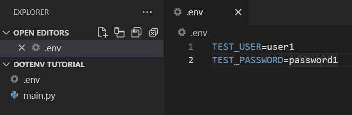
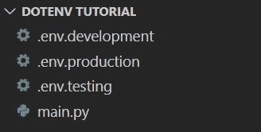

# 在 Python 中使用 dotenv 管理环境变量

> 原文：<https://blog.devgenius.io/manage-environment-variables-using-dotenv-in-python-a4118b53adaa?source=collection_archive---------19----------------------->

## 在本文中，我们将探索如何使用 Python 中的 [dotenv](https://github.com/theskumar/python-dotenv) 模块来管理环境变量


由[马特·阿特兹](https://unsplash.com/@mattartz?utm_source=unsplash&utm_medium=referral&utm_content=creditCopyText)在 [Unsplash](https://unsplash.com/images/nature/tree?utm_source=unsplash&utm_medium=referral&utm_content=creditCopyText) 上拍摄的照片

**目录**

*   介绍
*   创造。环境文件
*   从加载环境变量。环境文件
*   使用管理多个环境。环境文件
*   结论

# 介绍

在关于 Python 中[环境变量的介绍文章中，我们讨论了如何使用 *os* 模块手动获取和设置环境变量。](https://pyshark.com/environment-variables-in-python/)

随着 Python 项目的增长，您可能会使用更多的环境变量，或者您可能希望在执行代码时设置环境变量。

您可以创建一个**，而不是手动设置这些环境变量，或者将它们硬编码到代码中，或者使用命令行参数来设置环境变量。env** 文件，并使用来自 *python-dotenv* 模块的功能，在运行时将它们加载到您的 python 环境中。

为了继续学习本教程，我们需要以下 Python 库: *os* 和 *python-dotenv* 。

Python 中已经内置了 [os](https://docs.python.org/3/library/datetime.html) 模块，所以我们只需要安装 [python-dotenv](https://pypi.org/project/python-dotenv/) 模块。

```
pip install python-dotenv
```

# 创造。环境文件

第一步是创建一个**。项目根目录下的 env** 文件。

这个文件将包含我们希望为这个项目设置的环境变量的键值对。


作者图片

对于这个项目，让我们用一些值创建一个和 *TEST_PASSWORD* 环境变量，这样你的**。env** 文件应该包含以下键值对:

```
TEST_USER=user1
TEST_PASSWORD=12345
```

看起来像这样:



作者图片

接下来，我们将看到如何为当前会话将这些变量加载到 Python 环境中！

# 从加载环境变量。环境文件

一旦我们创造了**。env** 文件，其中包含项目所需的环境变量，下一步是将它们加载到当前的 Python 环境中。

dotenv 模块的 **load_dotenv()** 函数从**加载环境变量。env** 文件导入到 Python 环境中。

上面写着**。env** 文件并设置文件中指定的环境变量。

一旦完成这一步，我们就可以使用 os 模块的功能 **os.environ** 轻松访问这些环境变量:

```
#Import the required dependencies
import os
from dotenv import load_dotenv

#Load environment variables from .env file
load_dotenv()

#Get specific environment variables
user_var = os.environ['TEST_USER']
pwd_var = os.environ['TEST_PASSWORD']

#Print environment variables
print(user_var)
print(pwd_var)
```

您应该得到:

```
user1
12345
```

这些是在**中指定的环境变量的值。env** 文件。

# 使用管理多个环境。环境文件

本节面向使用 Python 应用程序的多种环境(如测试、开发和生产)的高级用户。

为了使用管理多个环境。env 文件，您需要为每个环境创建一个. env 文件，并在其中存储所需的环境变量。

例如，假设您有 3 个环境:

1.  测试
2.  发展
3.  生产

您需要为它们分别创建一个. env 文件:

*   **.env.testing**
*   **.env.development**
*   **.env.production**

因此，您的根项目文件夹将如下所示:



作者图片

以下是每个**的样本内容。env** 文件:

**.env.testing**

```
API_KEY=test_api_12345
SECRET_KEY=test_12345
```

**env . development**

```
API_KEY=dev_api_12345
SECRET_KEY=dev_12345
```

**.env.production**

```
API_KEY=prod_api_12345
SECRET_KEY=prod_12345
```

现在，假设项目的当前环境正在测试，那么我们将从适当的**中访问环境变量。env** 文件(本例中为 **.env.testing** ):

```
#Import the required dependencies
import os
from dotenv import load_dotenv

#Set the current environment
env = 'testing'

#Load the appropriate .env file
if env == 'testing':
    load_dotenv('.env.testing')
elif env == 'development':
    load_dotenv('.env.development')
elif env == 'production':
    load_dotenv('.env.production')

#Get specific environment variables
api_key = os.environ['API_KEY']
secret_key = os.environ['SECRET_KEY']

#Print environment variables
print(api_key)
print(secret_key)
```

您应该得到:

```
test_api_12345
test_12345
```

# 结论

在本文中，我们探索了如何使用**管理环境变量。Python 中的 env** 文件和 dotenv 模块。

当您处理多个环境变量和敏感信息，并且不想将这些值硬编码到代码中时，python-dotenv 可以成为管理 python 项目中的环境变量和配置选项的非常有用的工具。

如果你有任何问题或对编辑有任何建议，请随时在下面留下评论，并查看更多我的 [Python 编程](https://pyshark.com/category/python-programming/)教程。

*原载于 2022 年 12 月 21 日 https://pyshark.com*[](https://pyshark.com/manage-environment-variables-using-dotenv-in-python/)**。**