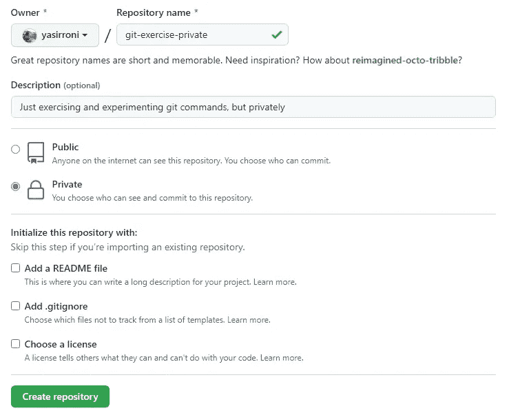

# 管理您的“私有”git 分支

> 原文：<https://blog.devgenius.io/manage-your-private-git-branch-9f79cb7796a6?source=collection_archive---------3----------------------->

凯拉·霍泽尔在 [Unsplash](https://unsplash.com?utm_source=medium&utm_medium=referral) 上拍摄的照片

您是否希望在一个存储库中为您的公共和私有分支建立一个单独的分支？您可能还想将公共分支上的每个新提交合并到您的私有分支中。这种情况通常发生在您创建一个公共存储库，但又想将其用于您的私人项目的时候。可悲的是，GitHub 不允许在公共存储库上建立私有分支。在这里，我将向您展示我发现的最佳解决方案。

# 1.创建您的公共回购(包括内容)

如果您已经有了存储库，请跳过这一部分。如果你还没有，去 https://github.com/new[创建你的公共知识库。确保您的公共存储库不为空。](https://github.com/new)

创建包含一些内容的公共存储库

或者，您可以从派生一个公共组件来制作您自己的副本开始。如果你愿意，你可以派生这个例子[仓库](https://github.com/yasirroni/git-exercise-private)。

# 2.克隆您的公共存储库

使用 *git clone* 将您的公共远程存储库克隆到您的本地存储库:

例如，使用:

现在，我们称之为您的本地存储库。

# 3.创建您的私有存储库(无内容)

现在，这是您将存储您的私有远程存储库的地方。不要担心，即使我们使用单独的远程存储库，本教程也将为您带来一个可以轻松合并的本地存储库。为了简单起见，使用一个空的存储库。如果你想合并一个已建立的私有库，请等待下一篇文章。希望我能尽快完成这篇文章！

创建没有任何内容的私有存储库

# 4.从本地存储库中，添加远程

从本地存储库中，将您的私有远程存储库添加为远程存储库。在这个例子中，我们用昵称 *private-remote* 来命名我们的新私有存储库:

例如，使用:

# 5.在本地存储库上创建新的专用分支

从本地存储库中，创建一个新的分支。该分支将成为专用分支的主分支。下面是创建名为 *private-branch* 的新分支的命令。

# 6.将您的专用分支推到专用远程

这不仅仅是简单的推送，而是改变当前分支推拉行为的推送。使用 *-u* 命令，您的*私有分支*将指向您昵称为*私有远程*的远程存储库。

这个推送还会在您私有存储库上创建一个名为 *private-branch* 的新分支。这是这种解决方法的缺点，专用存储库中的主分支或主要分支不能与公共存储库同名，因为两个分支在本地存储库中的名称不同。本地存储库和远程存储库之间可能有不同的分支名称，但是还有另一个缺点，这里就不讨论了。现在，只是拥抱不同的名字。

# 7.尝试进行更改、添加、提交和推送至私有-远程

从您的私有分支，进行一些更改。之后，尝试添加、提交和推送您的新提交。

# 8.检查一切是否正常

您可以通过打开分支列表来检查一切工作是否顺利:

或者，您可以在 VS 代码上使用 Git Graph 来查看您的网络。

一个本地存储库有两个不同的远程存储库

# 代码片段

让我们将所有内容打包到一个代码片段中。这是:

# 奖金！尝试将您的公共存储库提交到您的私有存储库

下面是结果~

将提交从公共存储库合并到私有存储库