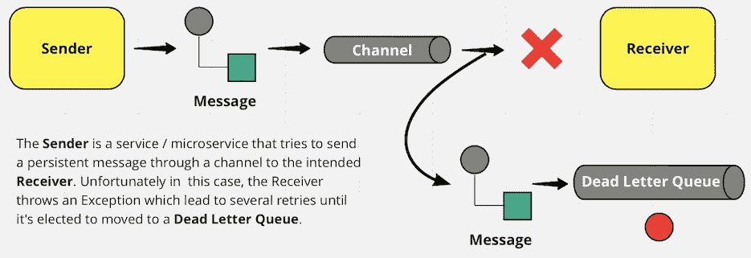
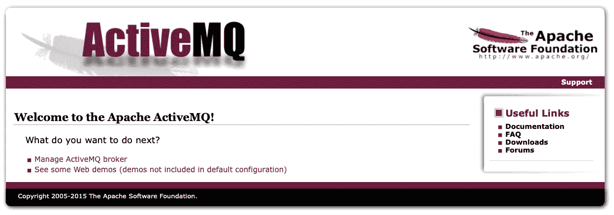
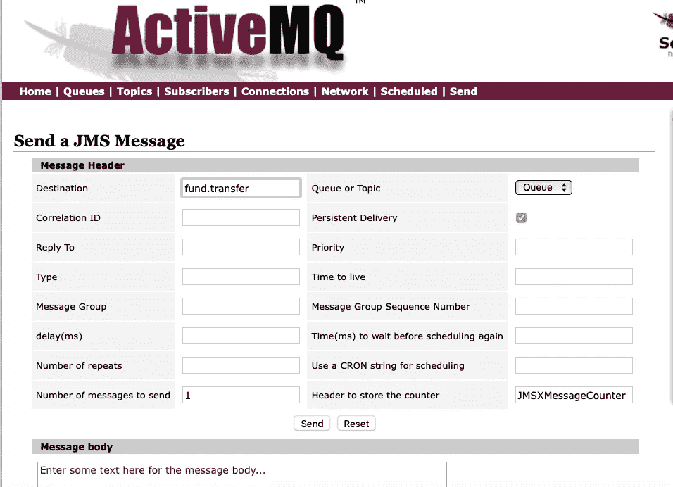
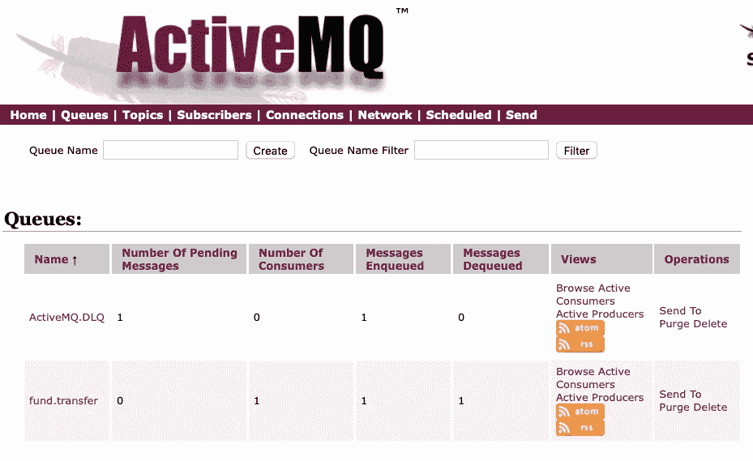
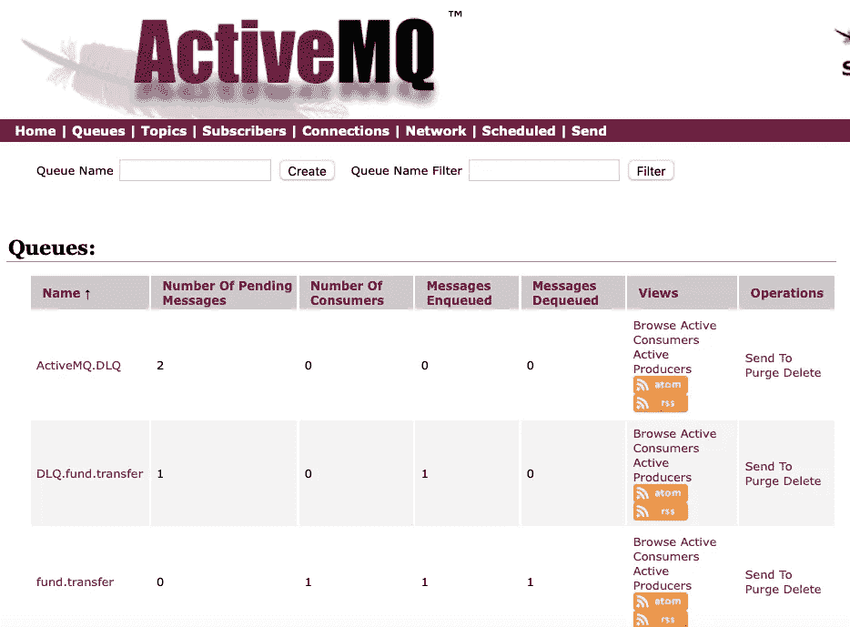

# 微服务:死信队列

> 原文：<https://blog.devgenius.io/managing-dead-letter-queues-be30672fc73f?source=collection_archive---------0----------------------->

## 使用个人死信策略

[Goran Ivos](https://unsplash.com/@goran_ivos?utm_source=medium&utm_medium=referral) 在 [Unsplash](https://unsplash.com?utm_source=medium&utm_medium=referral) 上的照片

从一个微服务到另一个微服务交换消息从未如此简单。随着现代 web 框架的出现，我们现在能够以最少的配置从头启动微服务，例如 Spring Boot，它更喜欢传统而不是配置。还值得一提的是 Spring JMS API——JMS 的一个抽象层，它使开发变得更容易，因为所有连接、会话和 JNDI 上下文都被抽象掉了。将此与 Spring Integration Framework 结合起来，Spring Integration Framework 允许服务通过消息通道进行通信，从而使整个架构松散耦合。

虽然我提到的这些事情都很好，但我们不能忽视正在进行的权衡。

# 最终一致性

在 miro.com 创建的图表

关于一个整体中的事务——原子性很容易实现。在 Spring 中，这可能就像用`@Transactional`注释一个方法一样简单，但是异步消息传递却不是这样。我们可能会选择将交易限制在有限的范围内，这很好，但我们不能完全避免，即与不同银行的`Fund Transfer`相关的功能请求。考虑这样一个场景，其中要转账的金额已经从付款人处借记，但是当试图将其贷记到收款人处时，另一个银行服务发生了异常——我们需要执行某种回滚来实现最终的一致性，为此我们将利用一个`Dead Letter Queue`。

> 免责声明:我将要演示的解决方案过于简单，不能反映金融系统的复杂业务规则。这篇文章的主要焦点是管理死信队列，我将为任何想学习的人提供一个逐步的指南。

# 如何将消息移动到死信队列？

注意:我们将在这个演示中使用 ActiveMQ。

当一个消费者尝试处理一条消息并失败了几次时——根据 ActiveMQ，它会尝试七次——如果所有这些尝试都失败了，那么这条消息将被转移到名为`ActiveMQ.DLQ`的`Default Dead Letter Queue`。

让我们从头开始，一切从头开始。我会在 docker 上安装 ActiveMQ(个人喜好所以很容易删除)。

## 1.安装 ActiveMQ

`JMX broker`监听端口 61616，`Web Console`监听端口 8161，容器名为 activemq，并作为后台进程(-d)运行。访问 http://localhost:8161 ，您将看到 ActiveMQ 现在已经启动并运行。

启动并运行 ActiveMQ

既然我们在 ActiveMQ 的 Web 控制台，让我们尝试使用 Web 控制台发送一条消息，为`Receiver`服务做准备——这样它将有一条消息可以使用。我们可以通过点击“管理 ActiveMQ 代理”，然后点击“发送”选项卡来访问该工具。

使用 ActiveMQ 发送消息(用于测试目的)

确保**检查**和`Persistent Delivery`。默认情况下，非持久性消息不会被路由到死信队列。

## 2.创建 Spring Boot 应用程序(消费者)

我敢打赌，我们大多数人已经知道如何创建一个 maven/gradle 项目或使用 Spring Initialzr。我将跳过这一部分，继续讨论所需的依赖项和应用程序属性。

pom.xml

应用程序.属性

然后，创建主类。如果使用 Spring Initialzr，主类可能已经存在。这个主类没有什么特别值得我们注意的，不管怎样，我会把它包含进来，这样每个人都可以看到不需要任何额外的注释。

Main.java

因为我们使用的是`Spring Integration`，所以让我们继续进行允许通过`channels`消费消息的配置。

IntegrationConfig.java

你可能已经注意到了`line 37`上的评论。通过 Spring 集成，这是使用事务回滚消息的方式。

最后，让我们定义`Receiver`服务，在这里我们显式地抛出一个 RuntimeException 来模拟图表中的场景。为 receive 方法添加`@Transactional`注释是多余的，因为`receive`方法隐式地使用了来自`messageListenerContainer`的事务管理。

假设消息出现在`fund.transfer`队列中——在运行应用程序时，我们现在应该在名为`ActiveMQ.DLQ`的死信队列中看到一条消息。

ActiveMQ:队列页面

如前所述，`ActiveMQ.DLQ`是默认的死信队列。您可能想知道——如果我们正在处理来自不同队列的几条消息会怎么样？我们如何以不同的方式处理这些信息？—使用`Individual Dead Letter Strategy`。

# 使用个人死信策略

假设这种策略已经到位— ActiveMQ 将按照配置中指定的格式，自动为每个队列创建一个单独的死信队列。

在创建配置之前，让我们后退一步，首先确定我们使用的代理(ActiveMQ)是`Embedded`还是`External`代理。我提到这一点是因为我当时犯了一个错误，假设我能够在应用程序中配置死信策略，而忽略了我正在使用一个`External` ActiveMQ 的事实。

对于这个演示——显然我们使用的是通过 Docker 安装的`External` ActiveMQ。

## 将 ActiveMQ 配置为使用单独的死信策略

让我们访问 dockerized 容器中的 ActiveMQ 安装，并在这个目录中查找名为`activemq.xml`的文件:`/opt/apache-activemq-${version}/conf`。然后用这个目标策略替换`<broker>`元素内的`<destinationPolicy>`元素。

个人死信策略的目的地策略

为了避免混淆，我只包括了相关的部分，但是如果出于某种原因你想看完整的配置，这里是: [activemq.xml](https://gist.github.com/emyasa/d1cbf7feefe42f008c4f6ff98a246d38) 。基于这个配置，每个死信队列现在都有一个前缀`DLQ.`。

注意:重新启动 ActiveMQ 是此配置生效的必要条件。

ActiveMQ:使用单独的死信策略

`DLQ.fund.transfer`现在出现在队列中。另外，使用死信队列与使用任何其他队列基本上是一样的。

# 结论

在处理异步消息传递时，我们可以使用死信队列来实现最终的一致性。此外，使用单独的死信策略将允许我们为每个队列创建一个单独的死信队列。

我希望你喜欢阅读这篇文章。

编码快乐！