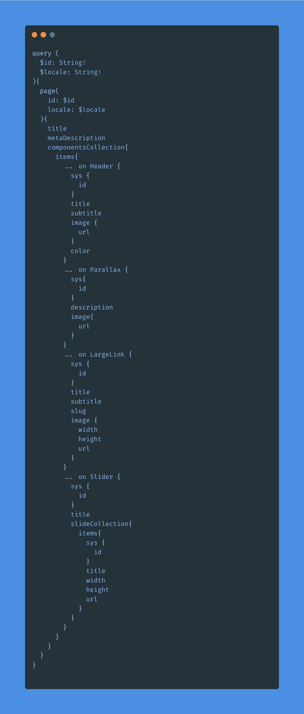
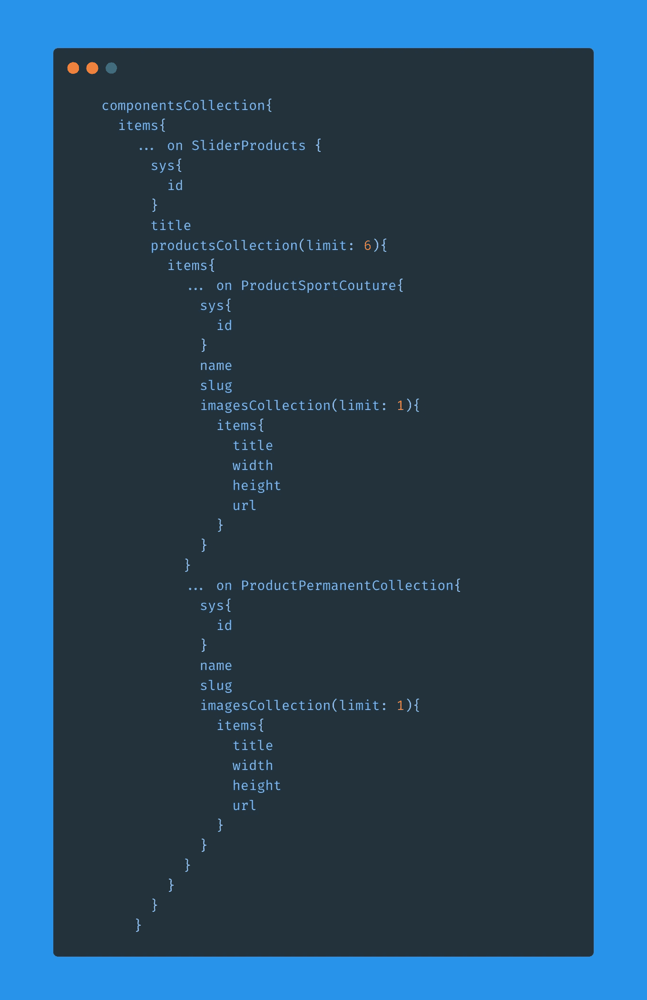
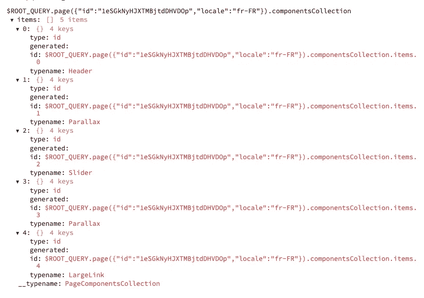
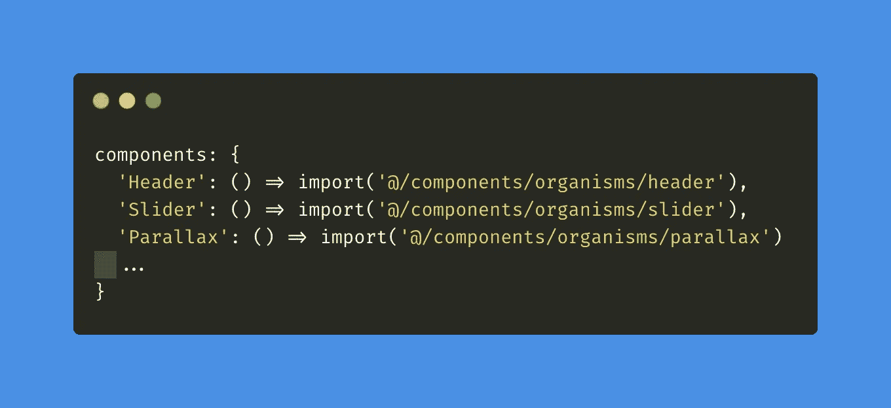
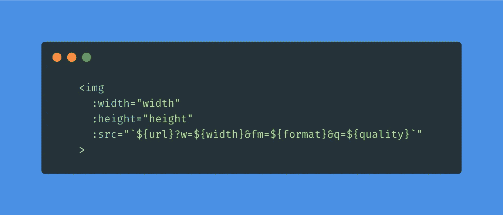
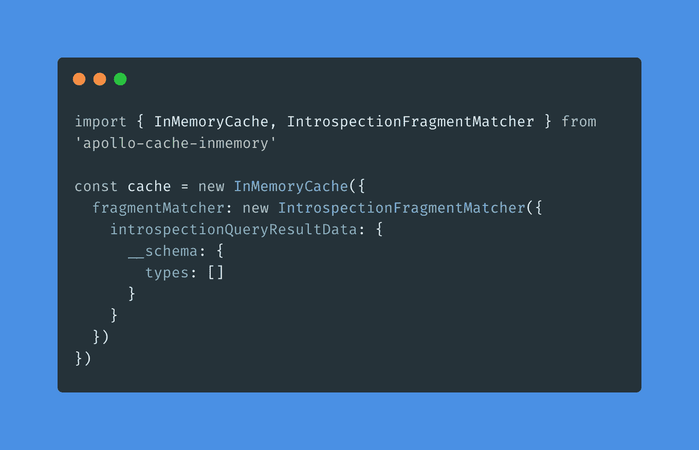

# 用 GraphQl 管理动态布局系统

> 原文：<https://blog.devgenius.io/managing-dynamic-layouts-systems-with-graphql-bed2d1cd2f06?source=collection_archive---------3----------------------->

我最近参与了一个项目，涉及一个多语言内容的平台，其中有必要用一个组件系统来模拟页面内容，该组件系统可以处理高水平的艺术指导和体验，保持清晰的轮廓和可访问性，以及顶级的性能水平。

我相信分享我的实现之旅会对其他负责设计系统的人有益。

**技术选择** 从目标来看，一个 web 应用加上一个服务器端页面生成的无头 CMS 似乎是合适的解决方案。

像往常一样，我使用我最喜欢的前端堆栈 Nuxt/Apollo，它提供了一个强大的缓存系统以及一个简单的服务器端渲染实现。Nuxt/Apollo 也提供了比 React/Next 更好的性能——但这一点可能会引起争议😅。

在 Contenful 和 Prismic 之间对 CMS 解决方案进行了快速基准测试后，我选择了 Contenful，它为 GraphQl API 提供了更简单的设置，并且与 Apollo 完美耦合，无需添加任何额外的脚本。响应时间，图像 API，分发也不错。

以下原则可以很容易地应用于一个苗条或反应应用程序。

**原则** 

页面模型中组件模型堆叠的视图。

下面是 graphQl 请求页面的示例，以及与 Vue 组件名称相对应的类型命名:

我们称之为有序的和未定义数量的类型，“标题”，“视差”，“大链接”和“滑块”。前者包括另一种类型的集合“幻灯片”。

我们经常需要调用嵌套类型来创建对象之间的关系。下面的例子展示了一个滑动条是如何聚集不同类型的产品的，这个滑动条本身可以在这个页面上返回多次。它的每一个产品都包含了一系列的图片。为了降低查询的复杂性，根据在管理界面中为用户设置的限制，对每种类型设置了限制。

嵌套的联合可能很快超过 API 允许返回的 11，000 个实体的最大数量；因此，我们必须限制他们。

下面是从 Apollo dev 工具看到的页面查询返回的数组:

此时，我们可以循环遍历 componentCollection 数组，并动态加载相应的组件:

键入每个组件，因为它们可以用不同的数据重复。

如果您迭代大量这样的组件，组件的动态导入是一个很好的实践:

**网格和图像大小调整** Contenful 提供了一个完整的图像 API 解决方案，有效地避免了使用冗长的响应图像语法，并在一行中准确地满足了客户的需求。

一个图像标记的例子，其中的值是基于应用程序打开时和组件中设置的变量计算的。

在本例中:

*   “宽度”变量是(屏幕宽度*屏幕密度)/(网格的总列数*图像覆盖的列数)。
*   “format”变量是所请求的图像的扩展名，在我的例子中是“webp ”,如果不支持的话，可以回退到“png”。
*   质量(范围为 0 到 100)是根据下行速度和网络有效类型计算的，对于不支持网络信息 API 的浏览器，质量值会回落到中等。

当然，响应逻辑可能会稍微复杂一点，所以您可能需要一些额外的逻辑用于组件中的“width”变量，与 CSS 指令和视口宽度相对应。

此外，服务器端处理不会获得任何窗口对象信息，因此您必须为此设置一些回退。

**使用异步组件**
在收到 API 响应后创建您的布局需要考虑自身的约束。例如，在页面级别，挂载的钩子不能保证子组件的标记是可用的，这些标记只有在 Apollo 数据更新后才被挂载。此后，你可能需要使用 [$nextThick](https://www.raymondcamden.com/2019/02/22/what-is-nexttick-in-vue-and-when-you-need-it) 函数，当 Vue 将你的更改传播到 DOM 时，该函数提供一个回调，这意味着布局已经挂载，只有在这个时候才能进行进一步的操作。在服务器端生成模式中，不需要考虑这一点，事实上，如果你的页面不包含太多的逻辑，这是我推荐的模式。

**启发式片段匹配器警告** 你可能会遇到这个错误。虽然很难简单地总结一下(这里有更多关于它的信息)，但基本上 Apollo 缓存不知道 graphQl 查询会带来什么，因为它加载了不确定数量的类型，这将导致缓存操作失败。

我找到的解决方案如下:当创建我们的 ApolloClient 实例时，在缓存配置中，我使用了片段匹配器插件，它根据您的 GraphQL 模式生成一个自省文件。然后，我为每组查询结果设置一个空的类型数组。

一个解决方案，沉默错误相关的启发式片段匹配。

**结论** 最终实现了以下目标:

*   在布局构成方面完全自由。
*   无与伦比的性能，我获得了 200 毫秒的平均页面加载时间，图像的延迟加载和内容可见性的 CSS 属性设置在组件上——与 SSG 模式。
*   不管布局的多样性和复杂性如何，每页一个查询。
*   一种用原子设计/风格指南逻辑一致地组织和维护组件库的方法。
*   这也让我可以轻松地在组件上添加一层基于滚动的动画。
*   当开始与编辑、文案、图标师和设计师一起工作时，这是一个可扩展的高效解决方案。

感谢您的阅读，

我很想听听也实现了这种类型系统的开发人员的意见。