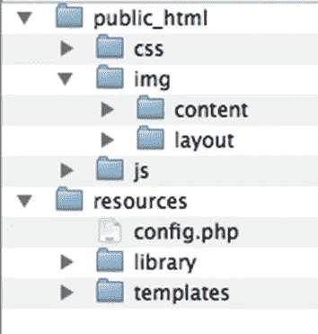
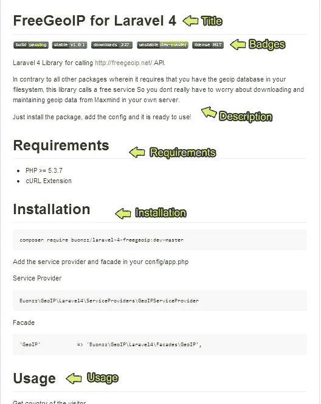
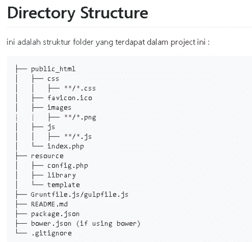

# 在上下文中管理编程资源

> 原文：<https://blog.devgenius.io/managing-programming-resources-in-context-fe8d60025269?source=collection_archive---------7----------------------->

朋友们好。我是新加坡卡拉旺大学的阿贡·普拉博沃。这次我将分享一点如何根据上下文管理编程资源。我们将讨论根据上下文和内容组织文件夹和子文件夹，并创建一个“readme”文件，其中包含编程资源的解释。让我们开始第一次讨论。

# 组织文件夹和子文件夹

首先，我们将讨论如何组织文件夹和子文件夹。我们创建的文件夹和子文件夹是根据其上下文和内容排列的。

# 创建“自述”文件

然后我们将讨论“readme”文件。将创建一个“自述”文件，其中包含文件夹结构/层次结构的说明以及编程资源的说明。通常，自述文件的扩展名为 md (markdown)

## 文件“自述”部分

## 文件夹结构

Readme.md 也可以配备您已经创建的项目的文件夹结构。

# 结论

编程资源的准备是根据上下文执行的，并且可以附带一个自述文件，其中包含对文件夹结构/层次结构和编程资源的解释。在此之前，我写的博客是关于根据上下文管理编程资源的。希望它能对阅读它的人有用

谢谢你