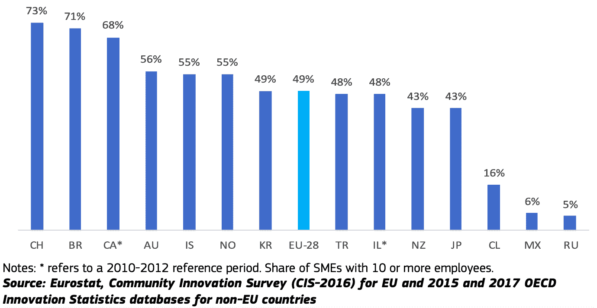
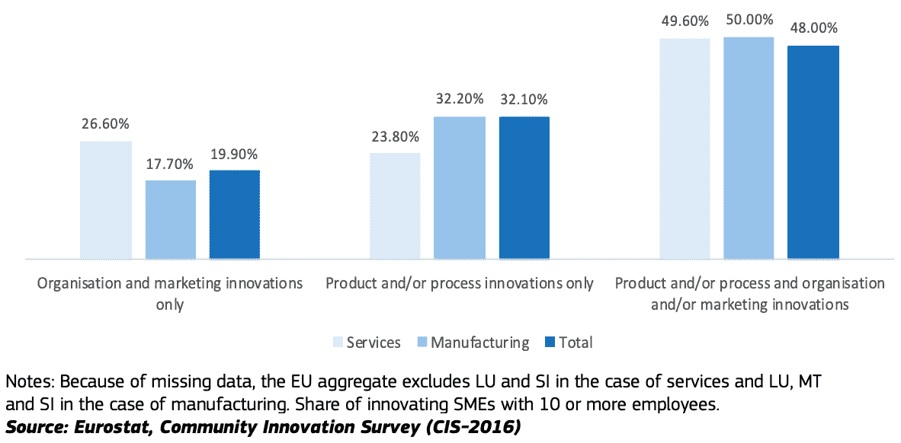
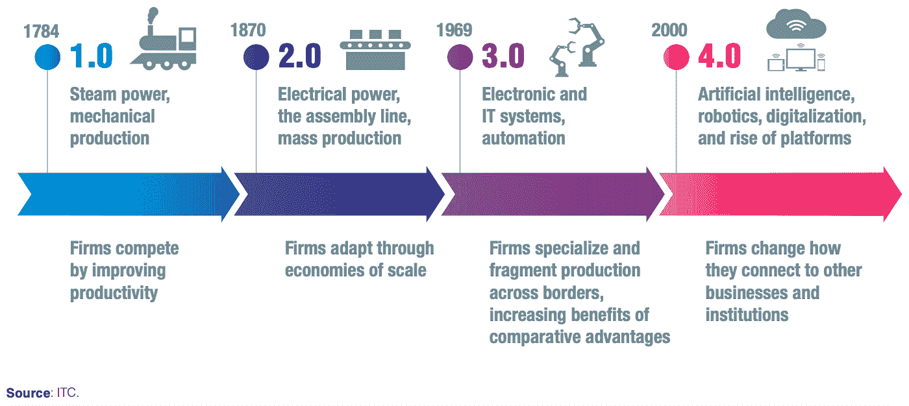

# 全世界的制造商，联合起来！

> 原文：<https://blog.devgenius.io/manufacturers-of-the-world-unite-54137ff571cc?source=collection_archive---------26----------------------->

诺德伍德主题公司在 [Unsplash](https://unsplash.com?utm_source=medium&utm_medium=referral) 上拍摄的照片

是团结的时候了。它从来没有像现在这样重要。全球供应链正在断裂。企业正在努力适应，他们迫切需要帮助。而且，这还没有结束。

这场危机是我们通过数字化团结起来的机会！

**全球化是的，但也要数字化。**

这都是关于投入、生产和产出。我们希望我们的投入在价格和质量上具有竞争力，生产效率高，我们的产品畅销。如果我们不能全部在本地完成，我们就放眼全球。对大公司来说很容易，但对中小企业来说就不那么容易了。

欧洲联盟(欧盟)有近 200 万家制造企业。**制造业是附加值最大的行业，中小企业占该行业所有企业的 99.2%！他们是我们经济的支柱，为我们提供工作，对我们的福祉至关重要。**

但是中小企业比大公司更加艰难。根据未来商业调查，最常见的挑战包括:

*   吸引顾客
*   增加收入
*   和保持盈利能力

为了克服这些挑战，一些中小企业使用在线工具。主要是展示他们的产品或服务，提供信息，但较少管理他们的内部业务流程。

根据经合组织的一份报告，不到 28%的中小企业使用企业资源规划(ERP)软件应用程序来管理业务信息流，而大公司的这一比例为 78%。云计算也存在相当大的采用差距，这将允许较小的公司使用大数据，而无需高昂的 ICT 投资固定成本。

然而，数字技术的使用对于地方和全球竞争力至关重要。**数字技术提高了市场智能，并以相对较低的成本简化了⏤进入全球市场和知识网络的途径。**

*图 1:2014-2016 年，创新型中小企业在 EU-28 国和其他选定的经合组织国家中的份额。来源:* [欧盟委员会，中小企业 2018/2019 年度报告](https://op.europa.eu/en/publication-detail/-/publication/cadb8188-35b4-11ea-ba6e-01aa75ed71a1/language-en)。

使用数字技术的公司可以更容易地创新他们的产品或服务，并改善生产流程。他们对公司内部的流程、客户和合作伙伴的需求以及整体商业环境有了更好的理解。他们可以发现一系列扩大规模的新机会和不同形式的业务增长。

*图 2:*2014–2016 年引入各种创新的创新型欧盟中小企业在服务业和制造业中的份额。*资料来源:* [欧盟委员会，中小企业 2018/2019 年度报告](https://op.europa.eu/en/publication-detail/-/publication/cadb8188-35b4-11ea-ba6e-01aa75ed71a1/language-en)。

分享是关爱。

正如没有人是一座孤岛，没有一个运转良好的生态系统，任何企业都无法兴旺发达。根据埃森哲战略研究公司的研究，与那些试图建立和拥有整个网络的制造商相比，使用更高比例的第三方的制造商更有可能拥有更高的生产率、收入和利润。随着客户需求变得越来越复杂，**企业需要更加依赖灵活的生态系统，利用战略合作伙伴和数字技术来共享资源、技能和知识。**

中小企业受益于定制和区分产品的更大灵活性和能力。这为它们在全球市场上提供了相对于大公司的竞争优势，因为它们可以快速应对不断变化的市场条件和越来越短的产品生命周期。这使它们成为灵活生态系统中的完美伙伴。

根据上述经合组织报告和未来商业调查，只有少数中小企业直接出口。然而，有一半的受访者认为“向国外销售”是一个挑战，原因是寻找商业伙伴、市场准入限制和法规。

然而，通过它们的间接贡献，作为出口的大型国内企业或跨国公司的供应商，**中小企业的贡献可能占总出口增值的一半以上**。因此，连接大公司和中小企业的生态系统对双方都有利。

根据 2018 年中小企业竞争力展望，数字平台正在成为商业生态系统的主导者。他们取代了专业提供商，将商业服务整合成一站式商店。数字平台提高了竞争力，因为它们:

*   降低市场进入和交易的成本
*   为买家和供应商提供更广泛的渠道
*   提供更方便的信息访问
*   增加获得金融资本的机会
*   甚至更低的性别偏见

图 3:工业革命对商业生态系统的影响。来源: [国际贸易中心，中小企业竞争力展望 2018](http://www.intracen.org/publication/SME-Competitiveness-Outlook-2018-Business-Ecosystems-for-the-Digital-Age/) 。

因此，毫不奇怪，在由 Agility，**进行的一项调查中，86%的中小企业认为技术正在为他们的全球运营“创造公平的竞争环境”**。

通过参与数字平台和共享数据，企业不仅为自己，也为他们运营的整个生态系统开辟了新的机会。

像 GLIS(全球物流信息系统)这样的平台将中小企业和大公司联合起来，帮助他们建立灵活的生态系统，让每个人都能最有效地参与到全球价值链中。

**来源:**

欧盟统计局(2020 年)。制造业统计。可在[https://EC . Europa . eu/Eurostat/statistics-explained/index . PHP/Manufacturing _ statistics _-_ NACE _ rev . _ 2](https://ec.europa.eu/eurostat/statistics-explained/index.php/Manufacturing_statistics_-_NACE_Rev._2)【2020 年 6 月 18 日】查阅

脸书、经合组织、世界银行(2016 年)。商业调查的未来。可在[https://data for good . FB . com/WP-content/uploads/2016/09/Future _ of _ Business _ Survey _ Report-1 . pdf](https://dataforgood.fb.com/wp-content/uploads/2016/09/Future_of_Business_Survey_Report-1.pdf)【2020 年 6 月 18 日】

经合组织(2018 年)。加强中小企业和创业精神，促进生产力和包容性增长。关键问题文件。可在[https://www . OECD . org/cfe/SMEs/minimum/documents/2018-SME-minimum-Conference-Key-issues . pdf](https://www.oecd.org/cfe/smes/ministerial/documents/2018-SME-Ministerial-Conference-Key-Issues.pdf)【2020 年 6 月 18 日】

欧盟委员会(2019)。中小企业 2018/2019 年度报告:中小企业的研发和创新。可在[https://op . Europa . eu/en/publication-detail/-/publication/cadb 8188-35 B4-11ea-ba6e-01 aa 75 ed 71 a 1/language-en](https://op.europa.eu/en/publication-detail/-/publication/cadb8188-35b4-11ea-ba6e-01aa75ed71a1/language-en)【2020 年 6 月 18 日】

埃森哲战略(2017)。制造业的未来。可在[https://www . Accenture . com/_ ACN media/Accenture/conversion-assets/dot com/documents/global/pdf/strategy _ 8/Accenture-manufacturing-ecologies . pdf](https://www.accenture.com/_acnmedia/accenture/conversion-assets/dotcom/documents/global/pdf/strategy_8/accenture-manufacturing-ecosystems.pdf)上查阅【2020 年 6 月 18 日】

国际贸易中心(2018)。2018 年中小企业竞争力展望:数字时代的商业生态系统。可查阅[http://www . intra cen . org/publication/SME-competitivity-Outlook-2018-Business-ecologies-for-the-Digital-Age/](http://www.intracen.org/publication/SME-Competitiveness-Outlook-2018-Business-Ecosystems-for-the-Digital-Age/)[2020 年 6 月 18 日]

敏捷(2019)。为成功而运输。在 https://www.agility.com/insights/ship-for-success/[可用](https://www.agility.com/insights/ship-for-success/)【2020 年 6 月 18 日】

**作者:**

Liisi Karindi 是 GLIS 的共同创始人，这是一个在全球供应链和物流网络中进行信息共享和可追溯性的空间。要了解更多关于 GLIS 的信息，请通过 [liisi@procyon.ee](mailto:liisi@procyon.ee) 联系我们。

**GLIS——巨大变化的一小步**

