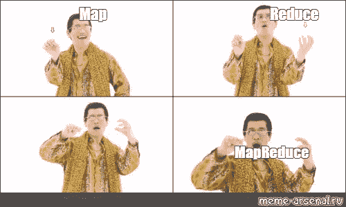
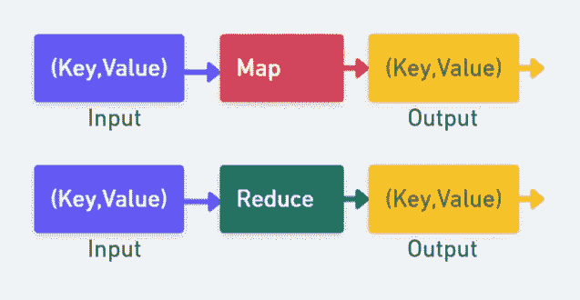
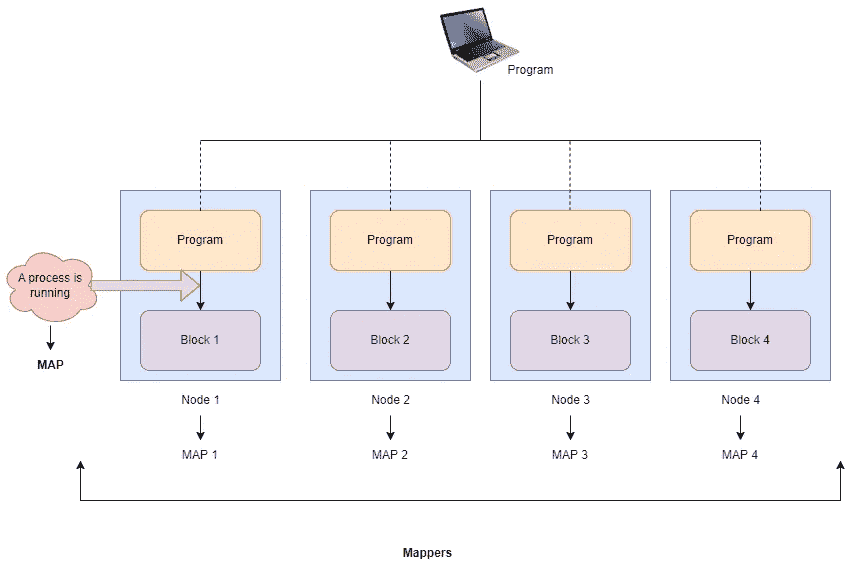
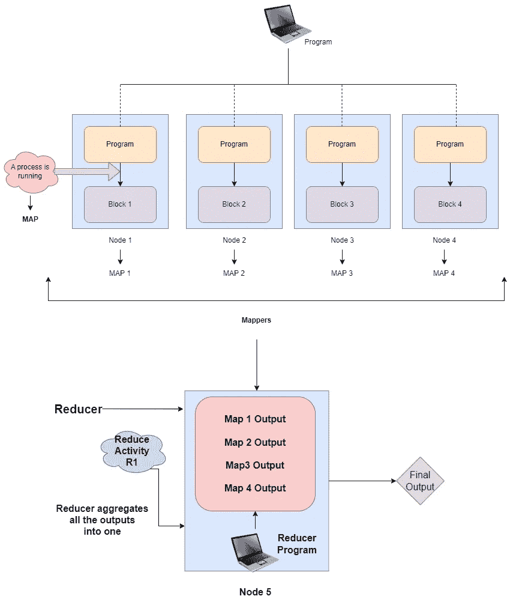
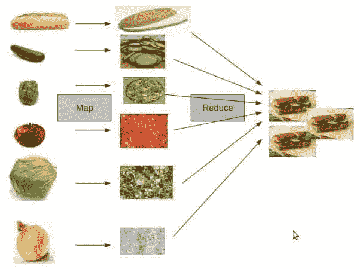

# 地图缩小

> 原文：<https://blog.devgenius.io/map-reduce-48f75605a299?source=collection_archive---------10----------------------->

映射它并减少它😈😈

今天天气真好🌞我们已经准备好开始下一个主题，即 **Map Reduce** 。我们已经了解了什么是大数据、Hadoop 和 HDFS。你可以回溯⏪点击这个[链接](https://medium.com/@prikshitsingla78/list/hadoop-and-hdfs-0622d3db2a6a)，到目前为止你所需要做的一切(这个列表包含了所有你需要浏览的关于 Map Reduce 的文章)。够了，谈谈过去吧⏳学习让我们从今天的话题开始讨论。我们今天要开始一些真正令人兴奋的事情🔥。那我们开始吧…

🤯🤯💥

当数据保存在一台机器上时，传统的编程模型可以工作。但是当谈到**大数据**时，数据以分布式方式保存在各种机器上，我们无法使用传统方式处理它，因此我们需要一种新的编程模型来解决这个问题，这种编程模式就是 **Map Reduce。它用于以分布方式处理驻留在许多机器上的数据。**

它有两个阶段…

1.  地图
2.  减少

# Map 和 Reduce 的输入和输出

这两个贴图和还原都在**键**上工作🔑**值**对。

(键，值)对示例:- ( *卷号*，*名称*)。

这就像 python 中的字典一样。

因此**映射阶段**将接受键值对作为输入，并将输出键值对作为输出，类似地**缩减阶段**将接受键值对作为输入，并将输出键值对作为输出。

作为输入和输出的键和值

# 地图阶段

让我们借助一个例子来理解这一点。假设我们有一个 4 节点集群和一个 500 MB 的文件。所以，我们应该有 500MB / 128 MB (Hadoop 默认块大小)= 4 个块。

> 注意:- Hadoop 的工作原理是**数据局部性。**这意味着数据在保存的地方被处理。在我们的简单系统中，数据很小，所以数据会变成代码，而在 Hadoop 的情况下，代码会变成数据，因为与数据相比，它的大小要小得多。例如:-数据块为 128 MB，代码为 20 KB，因此移动代码更容易。

**什么是地图流程？**

每当一个程序在一个块上运行时，我们就说运行了一个映射或运行了一个映射器。这个过程称为映射过程。每个程序块上运行的程序称为**图。**它将基于**数据局部性**的原则工作，代码/程序将包含映射器逻辑。

**Map** 是在每个块上并行运行的一段代码，提供并行性。

# 减少阶段

因此，Reduce 阶段将来自 map 阶段的输出作为键、值对，然后聚合该输出，最后将输出作为键、值对返回。

映射器(Mapper):-在一个程序块上运行的程序被称为映射器。在上面的例子中，我们有 4 个映射器。Mapper 负责并行处理。

**减速器** :-在 mappers 输出上运行的程序被称为减速器。在上面的例子中，我们有一个减速器。

我们在日常生活中使用了大量的地图简化🤣👩🏻‍🍳

让我们简短地讨论一下，我知道我们今天讨论得很少，但是我们学到的东西都很重要，你应该花时间去理解它。当你继续前进时，你会发现人们会把映射器和减速器称为映射器机器和减速器机器，但不会混淆😵用这个。他们仍在谈论正在运行的程序。不要把 Reducer 和 Mapper 进程曲解为机器。最初，许多人在学习时会犯这个错误，所以请记住这一点，🧠.

下一次我们仍将继续强化我们在 Map Reduce 上的学习，我们将通过使用 **Map Reduce** 编程模型执行一个基本任务**来计算文件中每个单词**的频率。它会给我们很大的洞察力👁‍🗨谈 Map Reduce 如何工作。

直到下一次，伙计们，直到那时，继续学习，享受旅程🚆。

让我们结束这个博客吧🤗暂时的！

在学习中享受乐趣🤗🤗

**干杯🤗读者们，如果你们已经走了这么远..**

**谢谢！为了阅读。**

如果你喜欢这个博客，请鼓掌回应👏

**跟随..☺️** [**我**](https://medium.com/@prikshitsingla78) **更多这样有见地的 articles✍️**

请在评论中分享你的想法，并请分享对需要改进的部分的反馈，以便我下次改进。

祝大家有美好的一天！