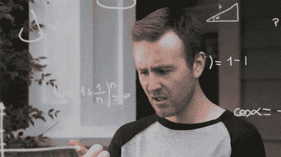
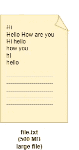
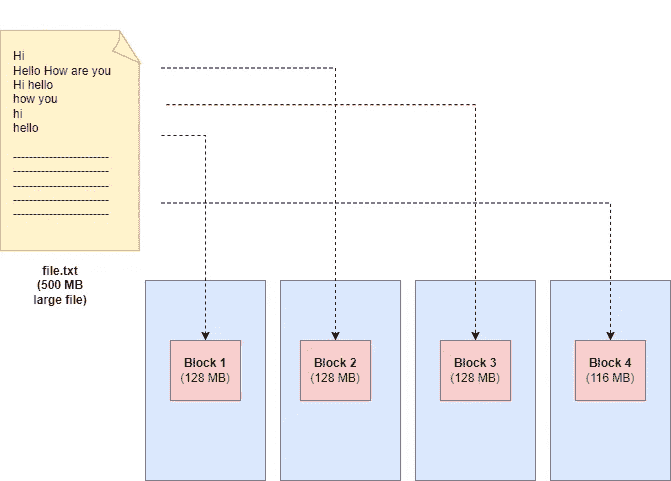
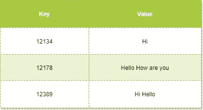
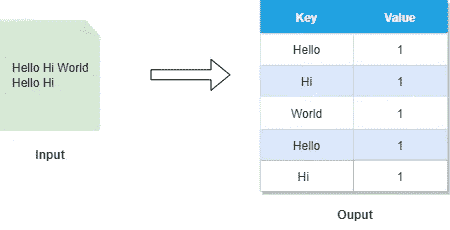
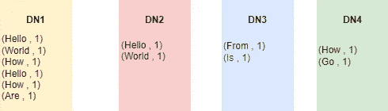
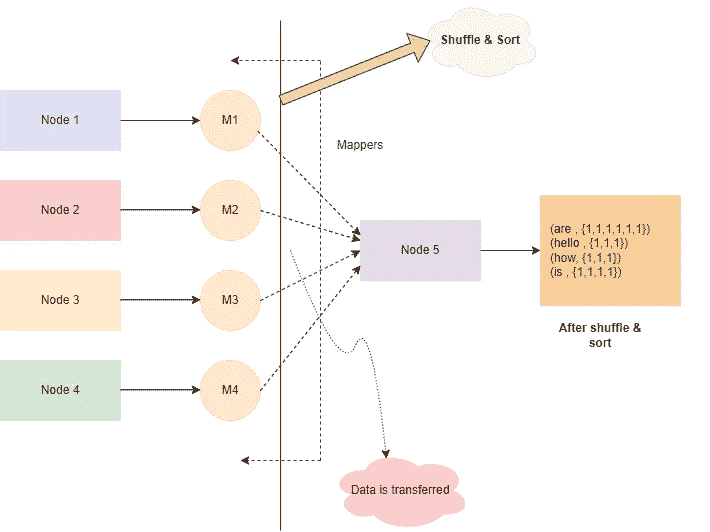
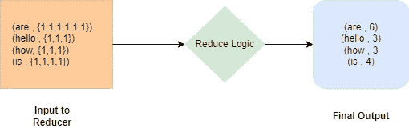
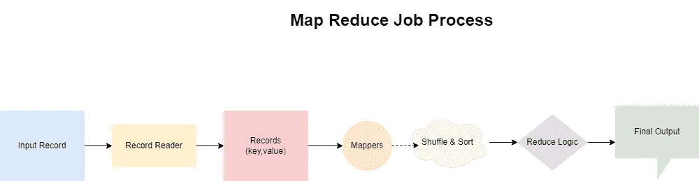

# 地图缩小示例

> 原文：<https://blog.devgenius.io/map-reduce-example-89bd529e4277?source=collection_archive---------10----------------------->

我是来拯救🦸‍♀️的

在上一篇[文章](https://medium.com/@prikshitsingla78/map-reduce-48f75605a299)中，我们了解了什么是 Map Reduce 及其阶段，还了解到它将一个键、值对作为输入，并将一个键、值对作为输出。该潜水了🌊深入地图，缩小和理解它，这样它会感觉更接近我们的心💖。

我们将借助一个例子来理解 Map Reduce。我们将**在一个大文件中统计每个词的频率**📁使用 Map Reduce 编程模型。

# **统计文件中每个单词的出现频率**

有这么多单词😵🔄

假设我们有一个 500 MB 的文件(这个文件很大，只是为了计算，我们保持它很小🤭).

**文件预览**

现在，如果我们只是手动操作，而忽略大小写的敏感性。解决方案将是

> 嗨:3
> 
> 你好:3
> 
> 如何:2
> 
> 分别是:1
> 
> 你:2

手动操作的话，你必须检查每一个单词，并计算它在文件中出现的次数。在这里，我们只是在预览中看到文件的一部分，如果这个文件有**100 万字**并且它太大(大约几 Pb 大小)以至于你的机器装不下它。然后你将如何计算其中每个单词的频率。假设你懂编程，你编写程序来计算频率，即使这样也要花很多时间才能得到结果，因为文件太大了😣。

地图缩小是我们的救星。让我们看看👀它将如何计算这个文件中每个单词的频率。

Hadoop 默认的块大小是 **128 MB** 。所以，我们将得到 500 MB /128 MB = **4 个块。**

我们已经知道 Map Reduce 对键值对起作用，但是如果我们看到我们的**输入记录**是 file.txt，它没有(key，value)对形式的数据。所以，我们必须使它们成为(键，值)对。这项工作可以在**记录阅读器的帮助下完成。**

# 唱片阅读器

不要担心原始数据**记录阅读器**会把你的地图还原回来🤣🤩

记录读取器的作用是将每个输入行转换成适合映射器读取的(键，值)对。它将生成随机地址作为密钥🔑并以全线为价值。

现在，这个输入应该转到 mapper。映射器逻辑现在应该由开发人员编写。

这些键与我们的逻辑相关吗？

不，所以我们应该只关注值的逻辑，应该忽略键，但只是为了逻辑的目的。因此，对于频率计数，首先要做的是，我们应该根据空间分割每个单词。

正如我们所看到的，输出有分裂的词，每个词被计算一次。所以，到目前为止，我们并不关心这个单词是出现了 2 次还是 3 次，我们只是对每个单词进行计数，并将其计数为 1。我们将在 **Reduce 阶段完成这个聚合部分。**

因为我们有 **4 个数据块**，所以运行的映射器数量应该是 4。**映射器的数量=数据块的数量。**映射器的数量总是等于数据块的数量。但是，对于减速器来说，情况并非如此。

假设我们有一个 4 节点集群。每台机器都会给我们类似的结果，如上图所示。

你看，在上面的图中，我改变了上面例子中的单词。没什么好困惑的，只要想想这些是文件中的单词。如上图所示，我们只是看到了文件预览。现在，我们已经得到了所有映射器的映射器输出，现在是时候进入**减少阶段**并最终得到我们的答案了。

# 洗牌和排序(简化阶段)

所有**映射器**的输出到达另一个节点或 4 个节点之一。

**映射器的输出从映射器到缩减器的移动被称为洗牌。**洗牌是一个耗时的过程。因此，每当我们执行地图缩减工作时，我们会尽可能地避免洗牌，或者我们会尽量保持它不占用太多时间。甚至，有些任务不需要 reduce 部分，因此取消了洗牌。洗牌后，所有键值对都将在一台机器上

洗牌后将会有**排序**。排序将发生在 Reducer 机器上(运行 Reducer 逻辑的机器，这里是节点 5)。排序将按升序对键进行排序。

这将作为减速器的输入。

(是，{1，1，1，1，1})

(你好，{1，1，1})

(怎么，{1，1，1})

(是，{1，1，1，1})

经过**排序**后，所有相同的钥匙将会在一起。无序排序由 Map Reduce 框架本身负责。

缩减器逻辑必须由开发人员编写。

Reducer 逻辑→迭代列表和总结

# 结论

映射器提供并行性

减速器聚集并给出最终输出

# 下一步是什么…

🤩🤩

瞧啊。💯我们刚刚使用 **Map Reduce** 逻辑解决了一个问题，并且我们能够一步一步地完成它。最初，我们在不同的机器上分离我们的数据，然后我们聚合它以得到答案。我希望你喜欢它。

下一次，我们将使用另一个例子，也将增加减速器的数量，问题将比这个更难。将来我们会编码👩🏻‍💻这种映射逻辑减少了词频工作。在那之前，玩得开心，享受你的一天😊。

让我们结束这个博客吧🤗暂时的！

直到下次我们 meet🥰🥰

干杯🤗读者们，如果你们已经走了这么远..

**谢谢！为了阅读。**

**如果你喜欢这个博客，请鼓掌回应👏**

**跟随..☺️** [**我**](https://medium.com/@prikshitsingla78) **更多这样有见地的 articles✍️**

**在评论中分享你的想法，并请分享对需要改进的部分的反馈，以便我下次改进。**

**祝大家愉快！**