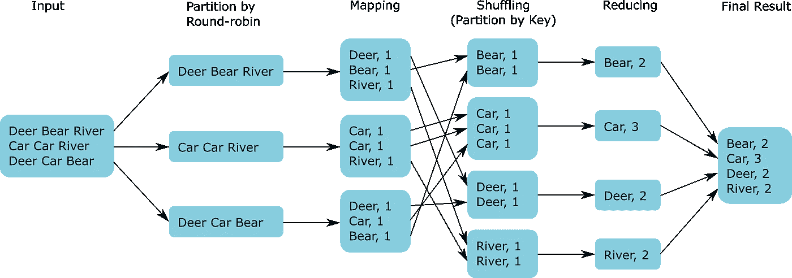
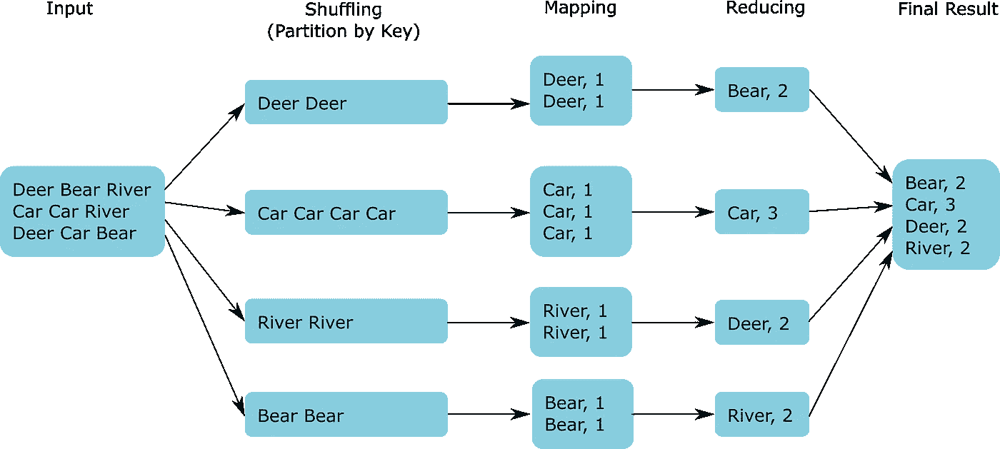
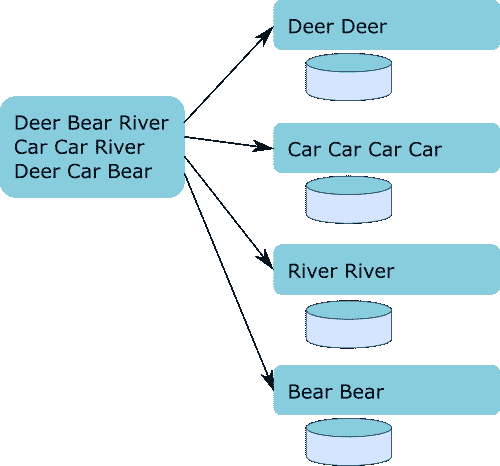

# 地图缩小——你被错误地教导了

> 原文：<https://blog.devgenius.io/map-reduce-you-have-been-wrongly-taught-a9e2bff49931?source=collection_archive---------4----------------------->

首先，如果你正在看这个，请分享一下。令人惊讶的是，如此多的工程师接受了错误的概念，就好像它是正确的一样。

甚至在维基百科中有一个关于 [Map Reduce](https://en.wikipedia.org/wiki/MapReduce) 模式的完全错误的解释。虽然，我不确定这是否是最初的模式，或者只是这个问题没有被解决。

我相信上图描述了一个典型的 Map Reduce 实现。对于一个高级数据工程师来说，这显然是一个糟糕的设计。但让我再详细解释一下:

*   所谓的混洗层增加了不必要的处理复杂性。实际上，在数据处理中，这是一种反模式，原因很简单——第二层，我称之为“循环分区”,是一种常见的数据分区操作，也是一种更快的操作，但稍后在第四层，我们会做一些称为“重新分区”的事情，这是在数据处理中我们通常试图避免的(或以更聪明的方式)。
*   现在，我并不是说不应该使用重新分区，我说的是重新分区不是规则，而是例外，必须有标准地使用(对于任何数据处理工作都是如此)。

话虽如此，我们的数据管道的更好实现应该是:

*   现在请注意，在最新的图表中，我们只是移动了洗牌层——更恰当的名称应该是按键分区——但它实际上是同一层。其次，我们删除了“循环分区”层。这个过程看起来更干净、简单，并且不需要额外的 CPU 来执行完全相同的任务。

现在让我告诉你一个小秘密，在数据处理中，这甚至不是一个设计模式，或编程模型或什么的。这里我们只是运用常识，遵循一些简单的规则。这没什么特别的。

# 分区和重新分区

现在，我想让您更好地理解分区和重新分区功能。

分区在处理过程中有一些特殊的效果，最重要的是它产生了并行性。但是让我们首先从串行处理开始。串行作业是在单个操作系统(OS)进程中运行的作业。如您所知，一个操作系统进程可能有几个线程，但对于多个线程，这不是并行性。如果多线程作业在单个操作系统进程中实例化，它仍然是串行的。

现在让我们回到分区。这种数据操作允许多个作业获取一部分数据并对其进行处理。但是真正支持分区的是 Hadoop 分布式文件系统(HDFS)。正如你可能猜到的，这不是一个新概念，它在相当老的系统中使用，但是在不同的名称和不同的技术下。HDFS 为每个作业提供了自己的数据暂存区，但不会失去数据的统一性。这意味着 HDFS 保留了多个文件，就像它是一个。

在这个概念下，我们可以说串行文件实际上由一个分区组成。同样，串行流程也将分配一个串行暂存区。为了构造一个并行作业，我们必须将一个串行源(在本例中是我们的输入)转换成一个分布式文件。而这其实是任何技术中任何分区函数的目标，不仅仅是 Hadoop。

当我们使用分布式文件系统时，我们需要小心数据操作，如连接或聚集(减少)功能，因为在串行和并行作业中表现不同，但这是不同帖子的主题。

现在，重新分区意味着更改以下一项或两项:

*   分区数据的并行度(就像第一个例子一样，映射前我们有 3 个分区，洗牌后我们有 4 个分区)。
*   分区内记录的分组(同样作为我们的第一个例子，我们以一种方式对数据进行分组，但是在洗牌之后，数据组被重新排列)。

有 3 个分区意味着并行度为 3，有 4 个分区意味着同一作业有 4 个进程，依此类推(我想您明白了)。

对于重新分区，有非常明确的规则。您可能需要重新分区，以便执行以下操作:

*   将已经分区的数据文件读入具有更多分区的组件，以加快处理速度。
*   连接两个具有不同并行度的处理阶段，以便较慢的阶段可以受益于更多的并行度。
*   通过在不同的处理阶段设置不同程度的并行性来平衡处理器之间的作业负载，以便将某些阶段分配到特定的处理器上。
*   对分布式文件执行全局排序。
*   在全局排序中，对每个分区中的记录进行排序，编号较低的分区中的所有记录在排序顺序上都低于编号较高的分区中的记录。全局排序有两个共同的目标:1)计算整个数据集的分位数，如中位数或百分位数。2)通过连接全局排序的分布式文件的分区来产生单个排序的串行文件。

我希望这篇文章足够清楚，有助于更好地理解数据处理。