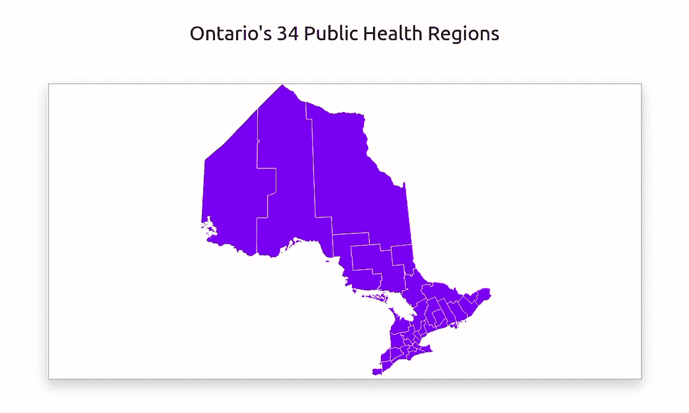
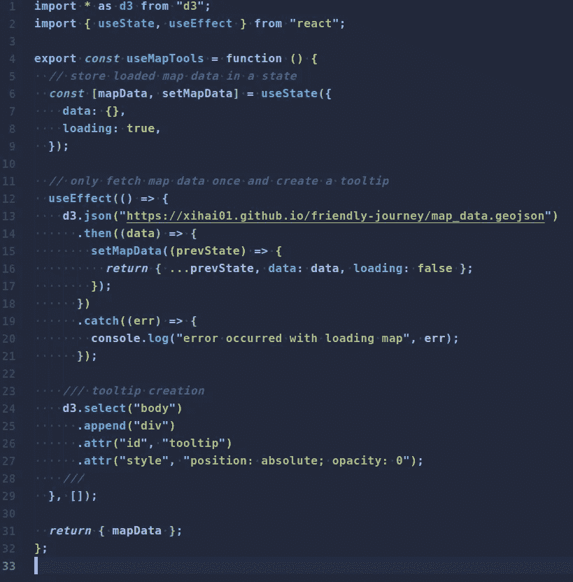
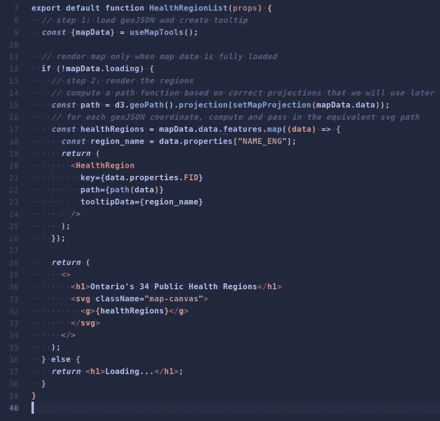
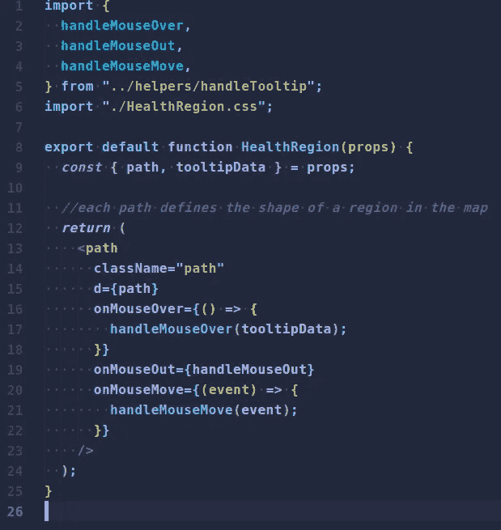
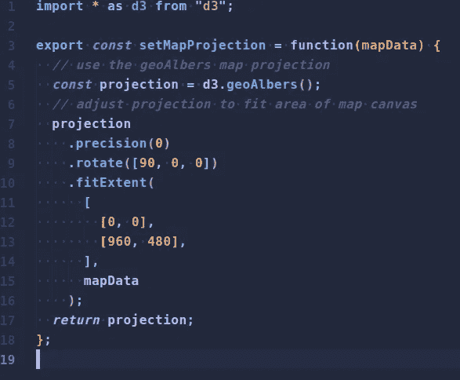
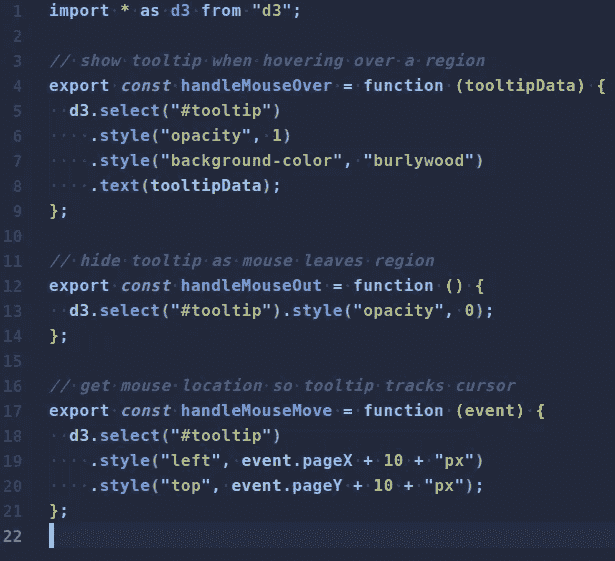

# 使用 React with d3.js 进行地图渲染

> 原文：<https://blog.devgenius.io/map-rendering-using-react-with-d3-js-76e12f77eb2c?source=collection_archive---------7----------------------->

d3.js 是一个强大的数据可视化库，用于制作漂亮的东西，如图形、图表和地图。在 Bootcamp 的最终项目中，我们的团队开发了一个疫情跟踪系统，显示安大略省 34 个公共卫生地区的 covid 统计数据。开发一个交互式地图是我们设计的核心特征，所以我们使用 d3.js 来创建它。我们是使用这个软件包的新手，所以我们在互联网上搜索，试图找到如何开始的教程。这是一个痛苦，因为我们的技术栈使用 React 作为状态管理和 DOM 操作的前端。大多数教程是为普通 JS 编写的。因此，我写这篇文章是为了提供一个教程，帮助初学者集成 d3 地图和 react 组件。

我还在这里创建了一个 [**github repo**](https://github.com/xihai01/d3-mapping-with-react) ，你可以使用它来跟随。



演示

# **安装包**

首先，安装软件包并将其导入到您的项目中，如下所示:

```
import * as d3 from “d3”;
```

通配符*导入所有 d3 包。

# **加载数据**

我创建了一个名为 useMapTools 的自定义钩子来加载我从安大略省公共卫生部网站下载的 geoJSON 文件中的地图数据，并将其托管在 Github 页面上。如果您有 topoJSON 文件，请将其转换为 d3 要求的 geoJSON 格式。好的包装是 [topojson](https://github.com/topojson/topojson) 。

在 useMapTools 中，mapData 状态将保存成功加载的 geoJSON 数据和布尔变量 Loading，以表示数据是否已成功提取。

我们还将一个 div 元素附加到主体上作为工具提示，并将其不透明度设置为 0(稍后将详细介绍)。

如果不清楚的话，useEffect 钩子有一个空的依赖数组，因为我们只想取一次数据。



useMapTools.js

# **绘制地图**

有两个组件负责绘制地图。

*   健康区域列表
*   健康区域

HealthRegionList 设置用于渲染的画布区域，解析 geoJSON 数据并计算 HealthRegion 的等效 SVG 路径。因此，每个 HealthRegion 组件将直观地表示 34 个健康区域中的一个。

在 HealthRegionList 中，mapData 状态下的 loading 属性用于检查 geoJSON 数据是否已加载。如果还没有加载，则返回一个简单的 h1 标记“正在加载…”。否则，使用 d3.geoPath()计算路径函数并设置其投影，以便地图不失真并适合画布区域。

接下来，映射 geoJSON 对象中包含的 features 数组，并返回一个 HealthRegion 组件，该组件具有唯一的键 id 和计算出的路径。

HealthRegion 将返回一个带有 d 属性的简单路径元素。path 函数将 features 数组中的每个坐标转换为等效的路径字符串，d 属性可以使用该字符串绘制区域形状。我还提取了工具提示的区域名称。



HealthRegionList.js



健康区域. js

# **setMapProjection**

这个辅助函数帮助调整 path 函数，以确保我们的 mapData 适合画布区域。d3 带有许多类型的投影，如 geoAlbers、墨卡托等。选择 geoAlbers 投影是因为只显示了一个省。

精度方法通过使用 d3 称为[“自适应重采样”](https://bl.ocks.org/mbostock/3795544)的方法来定义区域线的精度。通过将其设置为 0，可以关闭自适应重采样，这样可以提高缩放或平移地图时的性能。

rotate 方法采用两个或三个元素的数字数组[lambda，phi，gamma],指定围绕每个球面轴的旋转角度(以度为单位)。(这些对应于偏航、俯仰和滚转。).在找到最好的一个之前，你可能需要调整这些数字。对我来说，最初的地图旋转了大约 90 度，所以我必须在投影上指定一个旋转来抵消它。

fitExtent 方法将投影映射到边界框。在这种情况下，边界框是画布区域的宽度和高度。画布区域设置为 960 像素乘 480 像素。基本上，这确保了原始 geoJSON 坐标被限制在您的画布中。



setMapProjection.js

# **工具提示**

最初，我们创建了一个空的 div 并附加到主体上，作为工具提示。在 HealthRegion 中，事件侦听器被添加到路径中以显示工具提示。

在 handleTooltip 中，定义了以下三个回调函数，

*   handleMouseOver:当光标在一个区域上时，用 burlywood 颜色显示工具提示
*   handleMouseOut:当鼠标离开某个区域时隐藏工具提示
*   handleMouseMove:动画显示工具提示的位置以跟随光标



handleTooltip.js

# **结论**

我只是使用 react 组件在 d3.js 中绘制了一些基本的地图，但是我希望这篇教程可以帮助你开始使用 d3 探索无限的可能性。请随意使用回购，并以此为基础进行建设。

*   回购链接:[https://github.com/xihai01/d3-mapping-with-react](https://github.com/xihai01/d3-mapping-with-react)
*   下面是很棒的资源: