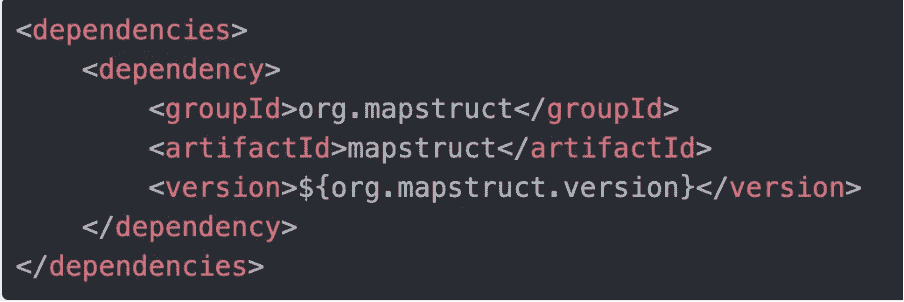
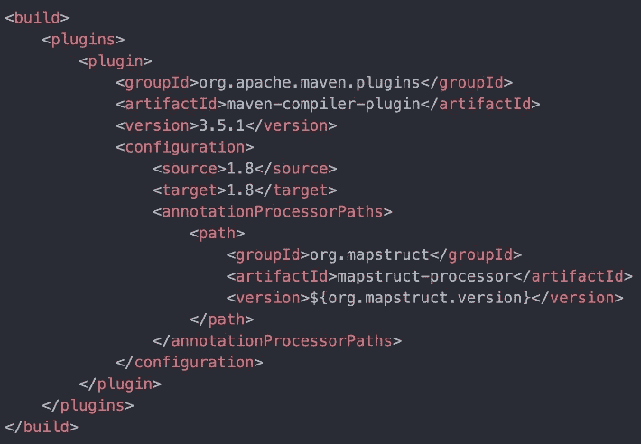
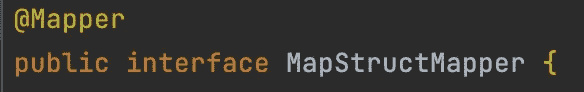
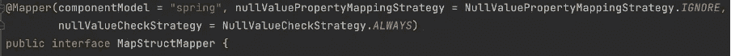
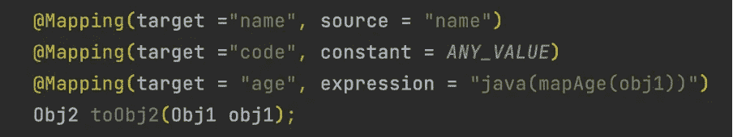
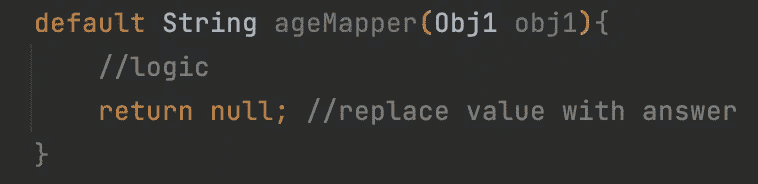

# 映射结构及其基础

> 原文：<https://blog.devgenius.io/map-struct-and-its-basics-4bde55ebc16c?source=collection_archive---------3----------------------->

各种领域的软件开发人员肯定都以这样或那样的方式处理过数据映射。从使用 DTO 映射值到使用高级技术映射列表或复杂的 JSON，每个人都使用过数据映射技术。传统上，每个人都从创建结果和请求的 POJO 开始，并使用 getters 或 setters 来映射值。

照片由[特雷西·亚当斯](https://unsplash.com/@tracycodes?utm_source=medium&utm_medium=referral)在 [Unsplash](https://unsplash.com?utm_source=medium&utm_medium=referral) 拍摄

随着时间的推移，这种非常方便的对象创建方法变得不那么方便了，因为它需要大量的行、高代码复杂性和许多测试用例来覆盖映射器行。为了更好地理解这一点，想象一个由 100 个不同的键值对组成的复杂 JSON。这意味着至少要做 100 次 obj1.set(json.get())并且在编写测试用例时不要忘记 100x 的行数。

为了降低复杂性，开发人员想出了地图绘制器和许多地图构建器来帮助自动绘制地图。MapStruct 就是这样一种技术。根据定义，“MapStruct 是一个**开源的基于 Java 的代码生成器**，它为映射实现创建代码。它**在编译期间使用注释处理来生成映射器类**实现，并大大减少了通常由手工编写的样板代码的数量”。非正式地解释，这是 OG spring-boot 提供的另一个@ somehing。

**使用 MapStruct**

根据定义，MapStruct 使用注释，并为我们提供了对象映射的模板。帮助我们使用 MapStuct 的依赖关系是:-

上面的版本应该很容易通过 [Maven 资源库](https://mvnrepository.com/artifact/org.mapstruct/mapstruct)找到。为了解释工作原理，让我们考虑 2 个对象，即 obj1 和 obj2。Obj1 是一个 POJO，包含两个字段 name 和 age。Obj2 也是一个 POJO，它有 3 个字段名称、代码和年龄。我们这里不需要消气剂。

由于 MapStruct 在编译时工作，我们还需要在构建中添加插件，允许 spring 在进行 mvn 全新安装或 mvn spring-boot:run 时生成源代码。

从开发开始，首先我们需要一个用 **@Mapper 注释的接口。**例如

另一个例子是:-

Mapper()中的值是这样的配置:-

1. *ComponentModel* 告诉 MapStruct，在生成映射器实现类时，我们希望通过 Spring 使用依赖注入支持来创建它。

2.nullValuePropertyMappingStrategy 告诉 spring 忽略是否映射了任何空值。

3.nullValueCheckStrategy 告诉 spring 在任何值映射之前总是检查 null。它所做的只是添加 if(obj1.getKey()！=空)

其次，我们需要为对象编写等价的映射来告诉 spring，什么与谁映射。这可以通过以下方式实现

1. **@Mapping** 是完成我们所有工作的核心注释。Target 是引用 Obj2 中字段的值，source 是引用 Obj1 的值。

2.第 2 行是第 1 行的替代，它展示了一个场景，其中我们需要硬编码一个值或将常量赋给结果集。

3.第 3 行是一个经典的例子，其中我们有一些逻辑，但映射不能直接完成。它可以像使用 if-else 一样简单，也可以是复杂的开关情况。Java()告诉 spring 对象的映射必须使用函数 mapAge()，其中包含 paramerer obj1。

要写一个函数，我们只需要做。注意:-这必须在我们编写@Mapping(target，source)的同一个接口中编写。

现在要使用创建的映射器，我们只需要自动连接映射结构映射器并在我们想要的函数中使用 mapper.toObj2(obj1 ),我们就可以开始了。

MapStruct 用@Mapping()和@Mapper()提供了很多选项。我们可以在@Mapping 中使用 checks @NotNull、@Nullable，或者使用我们自己的定制验证器。最后，您不需要实际运行代码来查看映射器如何工作。我们可以进行 mvn 全新安装，在**目标文件夹> src > our_class** 中我们应该有等价的映射。试着检查一下这个文件，你会惊讶地发现从 Spring 开始我们的手动工作已经减少了多少。

我希望这有助于开始使用 MapStruct。更详细的用法可以从 spring 官方社区的文档中获得。感谢阅读。别忘了点个赞然后关注:)