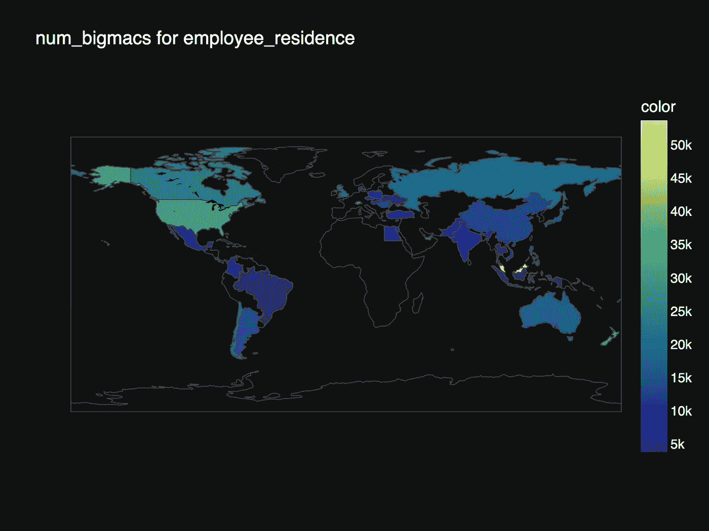
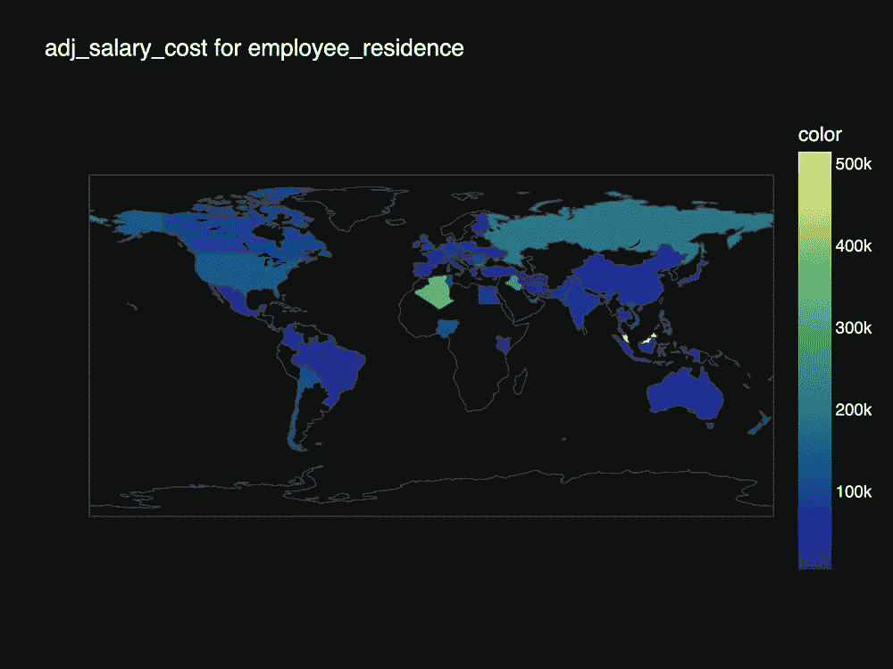

# 使用 plotly express 绘制薪酬数据图

> 原文：<https://blog.devgenius.io/mapping-data-sience-salaries-with-plotly-express-af520e278d5c?source=collection_archive---------21----------------------->

# 介绍

在浏览 Kaggle 数据集时，我偶然发现了这个包含数据科学工作薪水信息的数据集。因为我在市场上(Okt。2022，提示提示:-))，我想看看数据是什么样子的。

与该数据集相关联的[顶级笔记本](https://www.kaggle.com/datasets/ruchi798/data-science-job-salaries/code?datasetId=2268489&sortBy=voteCount)都对可用数据进行了彻底的剖析。但对我来说，得出的结论似乎有点不对劲。通常情况下，当我觉得有什么不对劲的时候，我的头脑就开始发痒，我需要满足我的好奇心。

不要误会我；我明确地说，我投入到分析数据集的工作非常出色——这是对 [Nguyen Thi Cam Lai](https://www.kaggle.com/nguyenthicamlai) 的一次特别大喊，他抓住了数据的欺骗性。

以下是直接引自赖的结论:

> 如果一名员工想获得尽可能高的薪水，美国应该是他们的选择。但是当然，这个分析纯粹是基于工资的。要回答这个问题，我们还应该分析生活成本、医疗保健等。”

# 开始挠痒痒的想法

那么，我该如何考虑生活成本、税收和其他影响实际工资的因素呢？一种方法是通过相对成本指数来调整数据集中的工资，比如经合组织的这个指数。另一个想法是观察每个国家的相对购买力，并以此来比较工资。这两种观点都依赖于购买力平价。

> **“购买力平价** ( **PPP** )是对不同国家价格的衡量，它使用特定商品的价格来比较各国货币的绝对[购买力](https://en.wikipedia.org/wiki/Purchasing_power)，并在某种程度上比较其人民的生活水平。在许多情况下，购买力平价产生的通货膨胀率等于一个地点的一篮子商品的价格除以另一个地点的一篮子商品的价格。由于关税和其他[交易成本](https://en.wikipedia.org/wiki/Transaction_cost)，购买力平价通货膨胀和汇率可能不同于[市场汇率](https://en.wikipedia.org/wiki/Exchange_rate)。[【2】](https://en.wikipedia.org/wiki/Purchasing_power_parity#cite_note-2)
> 
> 购买力平价指标可用于比较各经济体的国内生产总值、劳动生产率和实际个人消费，在某些情况下，还可用于分析价格趋同和比较各地之间的生活费用。根据经合组织的说法，购买力平价的计算是通过一篮子商品进行的，其中包括“最终产品清单，涵盖大约 3000 种消费品和服务、30 种政府职业、200 种设备商品和大约 15 个建筑项目”。[【4】](https://en.wikipedia.org/wiki/Purchasing_power_parity#cite_note-4)——[维基百科](https://en.wikipedia.org/wiki/Purchasing_power_parity)

# 数据

只要可能和可行，我喜欢尽可能地从接近源头的地方获取数据。对于来自 Kaggle 的工资数据，这意味着要查找数据的来源。原来，这些数据来自 https://salaries.ai-jobs.net/。该网站收集并发布世界各地的数据科学薪水，并允许用户下载其数据(以 CSV 或 JSON 格式)。

价格水平有点棘手。关于价格水平的几个指标和研究包括:欧盟统计局、国际货币基金组织、T2、T4、经合组织、世界银行和世界银行的数据

幸运的是[https://www.worlddata.info/cost-of-living.php](https://www.worlddata.info/cost-of-living.php)已经为我们汇总了相对成本和购买力。**但是这个数据可信吗？这是一个重要的问题，答案是:视情况而定。**

粗略查看之后，比较每个数据集中的值，聚集的数据似乎有意义，并且似乎与源数据在相同的范围内。对于本文来说，来自 worlddate.info 的聚合数据应该足够了。在更严格的应用中(比如市场调查，或者硕士论文)，我会犯*不可信*的错误，从不同的来源收集数据。同样的考虑也适用于工资数据。

# 使用 plotly express 映射数据

眼下的任务是，如果你想拿到最高的薪水，想出住在哪里也能买到最多的东西，你就住在哪里。为了可视化数据，我将使用 plotly express 内置的 choropleth 地图，因为这是(据我所知)绘制世界地图最简单的方法之一。

首先是必要的进口:

```
import pandas as pdimport plotly.express as pximport country_converter as cocodf = pd.read_csv('./data/salaries.csv')
```

工资数据直接来自数据源，包含 1186 行和 11 列。数据中没有 NaN 值。为了彻底分析数据的样子，我会参考 Kaggle 上的这两个笔记本( [1](https://www.kaggle.com/code/nguyenthicamlai/data-science-job-salaries-eda-q-a/data) 、 [2](https://www.kaggle.com/code/wonduk/eda-on-data-science-job-salaries) )，不会重复他们做了什么。

对于我想做的事情，一些清理工作仍然是必要的。也就是说，我不需要大量的数据，我希望将国家转换为标准代码，以便能够与其他数据框合并。

我想看的第一件事是价格平价数据。为了让这个概念变得切实可行，我决定使用《经济学人》发布和维护的巨无霸指数。这里的想法是，一个全球可获得的产品应该在每个国家测量相同的相对价格。所以问题变成了*“在 X 国，数据科学的工资中位数能买多少汉堡？”*使用汉堡经济学是一种有趣而又切实的方法来看待薪资差异。

数据可以直接从 Github 下载。我已经使用 pandas to_datetime 函数将日期转换为 DateTime。由于工资数据框最早的日期始于 2019 年，巨无霸指数的数据被过滤以匹配并按年分组(巨无霸指数每半年计算一次，所以我使用年平均值)。然后，我将工资数据与巨无霸指数数据合并。最后，我用工资除以巨无霸的调整价格，计算出在一个国家，给定的工资可以买多少个汉堡。

因为我将映射三个不同的想法，所以我将创建一个函数来实现这一点。该函数将一个数据框、一个包含测量值的列和另一个包含位置的列作为输入。

第一步是根据尺寸和位置进行分组(在这种情况下，根据一个人可以买多少个汉堡)。根据这一分组，计算出每个地点的工资中位数。

使用 plotly 表示 choropleth 图，传递位置和相应的测量值，并定义一个配色方案以及一个模板和标题。Plotly express 内置了美国各州和世界地图，因此我不必麻烦地加载 GeoJSON 地图。



根据巨无霸数量调整的工资

使用巨无霸指数的问题在于，并非所有国家都被《经济学人》计算在内。使用的 R 脚本可以在这里找到[。如果我们将国家传递给经济学人脚本，就有可能计算出我们需要的所有国家的指数。](https://github.com/TheEconomist/big-mac-data/blob/master/Big%20Mac%20data%20generator.ipynb)

世界信息公司的数据被载入，以观察根据相对成本或相对购买力进行调整是否会有所不同。为此，我将使用 pandas.read_html()函数，它将为我创建一个数据帧。数据清理和合并步骤与对巨无霸指数数据所做的类似。最后，调用 create_map 函数可以让我们可视化数据。



根据购买力(左)和相对成本(右)调整工资时的对比

# 结论

看起来，当工资根据相对成本和购买力进行调整后，在一个 GDP 较低的国家从事数据科学工作是有利的。不过，这可能具有欺骗性，因为在马来西亚的例子中，只有一个数据点。所列工资据报由美国的一家公司支付，员工在远程工作。

最高相对工资的数据量很小。阿尔及利亚只有一个数据点，尼日利亚有三个。在这个特定的数据集中，甚至俄罗斯也只有四份报告的薪水。

这是什么意思？

好吧，我会小心地将任何国家归入数据科学工作的绝对最高工资，只要有这么少的数据点。可以说的是，在数据科学领域工作似乎可以支付生活工资(平均一天可以买 78 个汉堡，这似乎很多)。

祝你愉快。