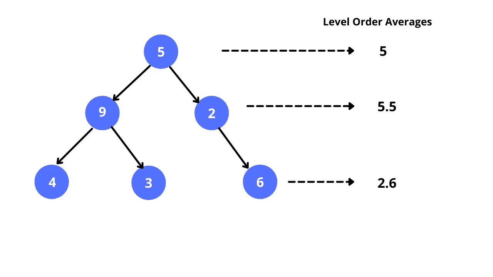

# 2021 年 3 月 LeetCoding 挑战—第 5 天:二叉树的平均水平

> 原文：<https://blog.devgenius.io/march-leetcoding-challenge-2021-day-5-average-of-levels-in-binary-tree-ac886b2b42e8?source=collection_archive---------8----------------------->

今天，我们将解决三月电码挑战的第五个问题。


# 问题陈述

给定一个非空的二叉树，以数组的形式返回每层节点的平均值。

**例一:**

```
**Input:**
    3
   / \
  9  20
    /  \
   15   7
**Output:** [3, 14.5, 11]
**Explanation:**
The average value of nodes on level 0 is 3,  on level 1 is 14.5, and on level 2 is 11\. Hence return [3, 14.5, 11].
```

# 解决办法

根据问题，我们必须找到二叉树中每一层的平均值。我们可以把这个问题想成一个层次顺序遍历问题。点击 阅读更多关于等级顺序遍历 [**的内容。**](https://www.geeksforgeeks.org/level-order-tree-traversal/)

让我们试着想象一下这个问题。所以我们做层次顺序遍历的时候，会找到每一层的平均值。这似乎很简单，对吗？让我们看一遍代码。



二叉树中的平均水平和

我们有`levels`列表来保存水平总和。我们使用一个`queue`来进行层次顺序遍历。我们首先检查队列的大小，这个大小表示二叉树的特定级别中的节点数。我们将节点的所有值相加，求出它们的平均值，并将其存储在列表中。最后，我们返回列表。

代码可以在这里找到

[](https://github.com/sksaikia/LeetCode/tree/main/src/MarchLeetcodeChallenge2021) [## sksaikia/LeetCode

### 在 GitHub 上创建一个帐户，为 sksaikia/LeetCode 开发做贡献。

github.com](https://github.com/sksaikia/LeetCode/tree/main/src/MarchLeetcodeChallenge2021)