# 边际概率与条件概率

> 原文：<https://blog.devgenius.io/marginal-vs-conditional-probabilities-visualizations-and-models-in-r-e7288ad26cb9?source=collection_archive---------4----------------------->

## r 中的可视化和模型。

当我们比较各组时，我们愿意相信任何发现的差异都可以归因于所做的比较。例如，如果我观察一组女性和男性，并比较他们的身高，我愿意相信这种差异是由性别造成的。这是生物学上的差异。

如果我在 SAT 考试中比较男性和女性，我看到了差异，我愿意相信 SAT 分数的差异是由性别造成的。当然，这种说法比身高差异更敏感，大多数人会要求在分析中包括第三、第四和第五个变量。这就是辛普森悖论的根源。这就是条件概率发挥最大作用的地方。

边际概率和条件概率的区别其实很简单。边际平均值。条件意味着依赖。因此，边际概率，或边际均值，或边际什么的，就是平均值。在男性和女性之间的差异中，发现的差异取决于被观察者的性别。这意味着对一个人的身高或 SAT 分数的观察取决于其性别。条件概率/发现。现在，如果我们只报告平均长度或 SAT 分数，我们会有一个边际发现。

条件概率的问题在于，有许多已知和未知的因素需要考虑。事实上，这个清单如此之长，又如此不为人知，以至于似乎不可能把它们都考虑进去。这就是为什么[随机化](https://medium.com/@marc.jacobs012/general-introduction-to-design-of-experiments-in-animal-science-using-sas-for-codes-fe1c5272b37a)被认为是实验设计如此重要的一个方面，但却不是万无一失的。这就是为什么[阻塞](https://medium.com/@marc.jacobs012/building-and-optimizing-randomized-complete-block-designs-using-sas-c973d127d862)，或者分层随机化被发明出来。然而，[随机化并不能防止不正确的模型规格](https://medium.com/@marc.jacobs012/randomization-needs-numbers-bb4c85faaebe)，因此未知因素，即使随机分布，仍然会在背景中产生影响。

条件概率处于[贝叶斯分析](https://medium.com/@marc.jacobs012/pr-non-vax-icu-pr-icu-non-vax-f7af477896ad)、[以及科学](https://medium.com/@marc.jacobs012/why-science-is-beautifully-human-and-very-frail-4f6225d32bb0)的最前沿，但它们是建模所固有的[。](https://medium.com/@marc.jacobs012/multivariate-relationships-three-is-seldom-a-crowd-8c0a9e09b5c)

今天，我想向你们展示如何通过图表和模型更深入地研究条件概率。我将使用 R 标准的 diamonds 数据集，因此分析更容易复制。然而，我想敦促你在你自己的数据集上尝试所有这些。仅仅运行代码和“查找熟悉的东西”的危险在于学习过程会更加平淡。它没有让灰质得到应有的激活。

让我们开始吧。请记住，这些示例向您展示了如何寻找依赖关系以及如何处理它们。事实上，只要确定你期望依赖。

当考虑概率或影响者时，想象是关键。我们是视觉生物，所以你需要视觉化来看到数据中的一些东西，这些东西可能会使边际概率变得没有意义。

```
library(tidyverse)
library(plotly)
library(gridExtra)names(diamonds)
head(diamonds)
ggplot(diamonds,aes(x=price,y=depth, 
                    col=as.factor(cut)))+geom_point(alpha=0.2)+theme_bw()
ggplot(diamonds,aes(x=price,y=depth, 
                    col=as.factor(cut)))+
  facet_grid(~clarity)+
  geom_point(alpha=0.2)+theme_bw()
ggplot(diamonds,aes(x=price,y=depth, 
                    col=as.factor(clarity)))+
  facet_grid(~cut)+
  geom_point(alpha=0.2)+theme_bw()
```

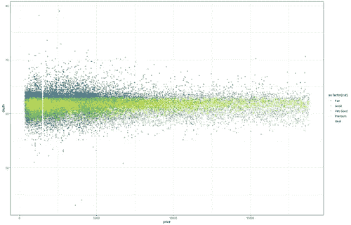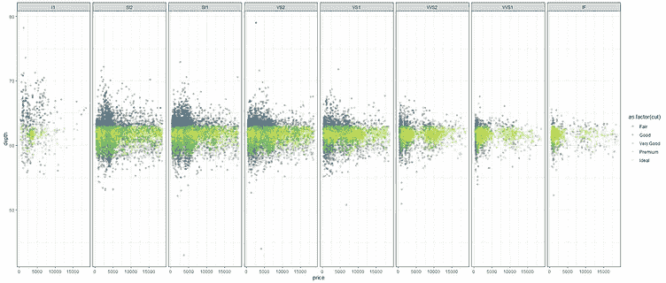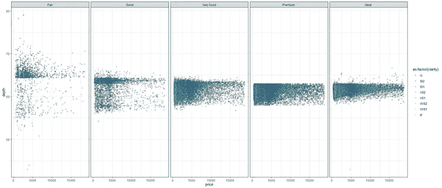

尽管散点图很好，但它们在这里并没有什么实际作用。条件密度图呢？

```
cdplot(diamonds$cut ~ diamonds$price)
cdplot(diamonds$cut ~ diamonds$price, bw = 2)
cdplot(diamonds$cut ~ diamonds$price, bw = "SJ")
spineplot(diamonds$cut ~ diamonds$price)
```

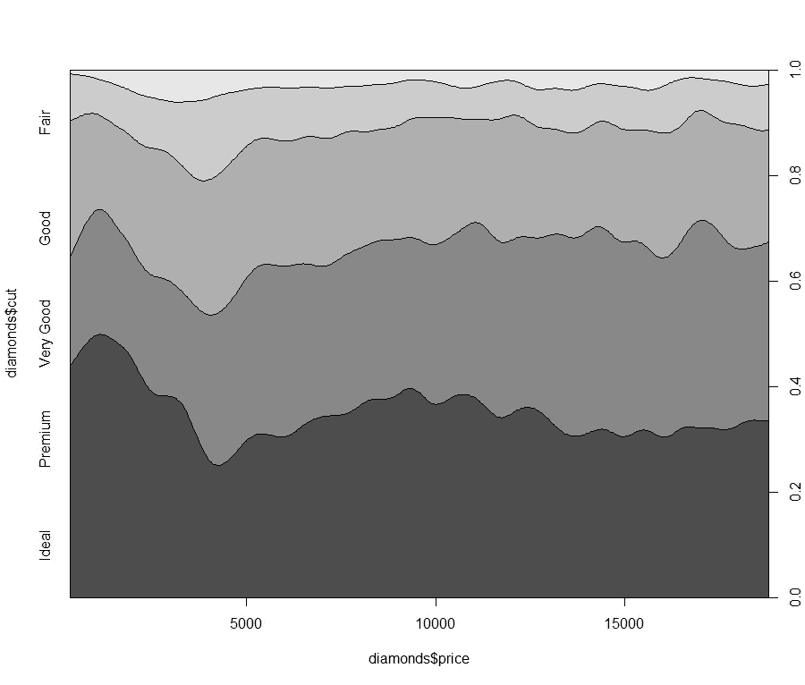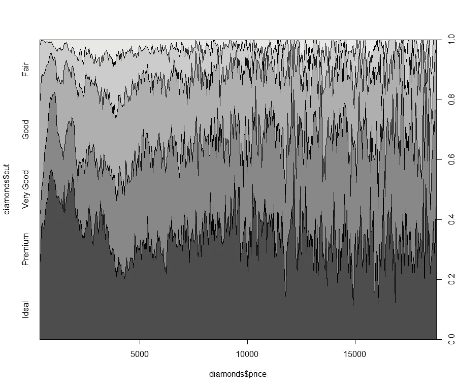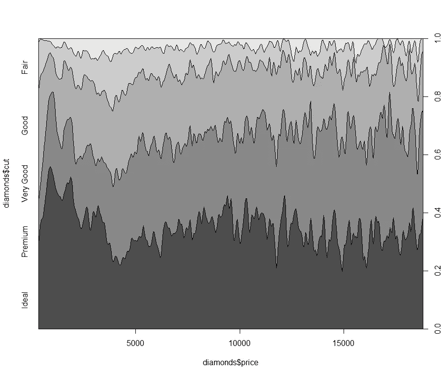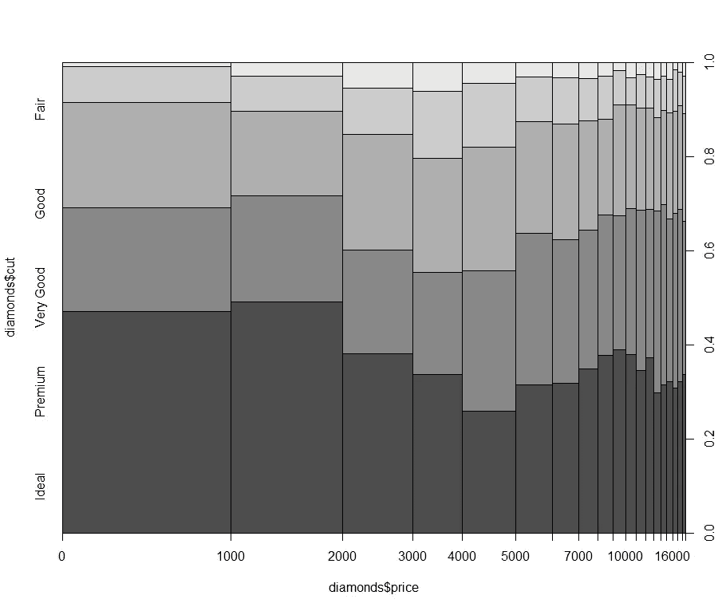

我们也可以在 ggplot2 中重新创建它。下面并没有暗示交互作用的存在，但这并不意味着达到特定价格的概率不依赖于切割。如果完全没有效果，水平和垂直拆分将完全均匀分布。

```
ggplot(diamonds, aes(x=price, fill=as.factor(cut))) + 
  geom_density(position='fill', alpha = 0.5) + 
  xlab("Price") + labs(fill='Cut') +
  theme(legend.text=element_text(size=12), 
        axis.title=element_text(size=14))+theme_bw()
```

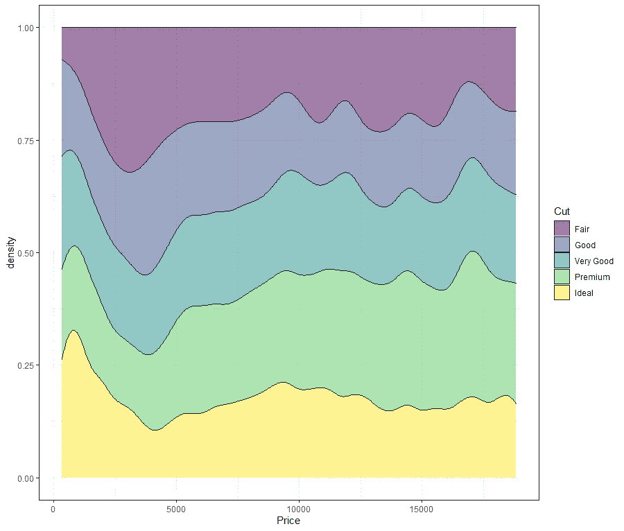

让我们添加另一个变量，使事情变得更有趣，更有条件！

```
ggplot(diamonds, aes(x=price, fill=as.factor(cut))) + 
  geom_density(position='fill', alpha = 0.5) + 
  xlab("Price") + labs(fill='Cut') +
  facet_grid(~clarity)+
  theme(legend.text=element_text(size=12), 
        axis.title=element_text(size=14))+theme_bw()
```

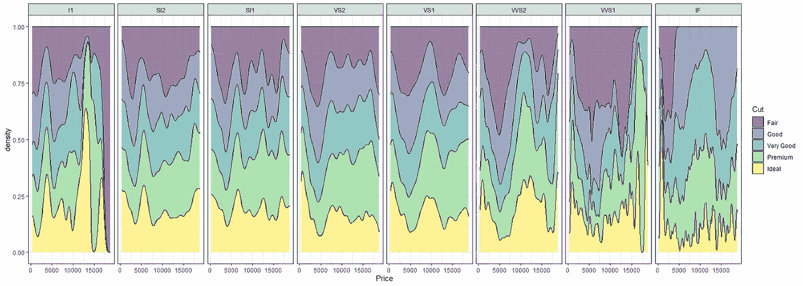

被*颜色*分裂没有被*清晰度*分裂那么强烈，但是条件效应是有的。如果不是这样，这些面将会是彼此的精确副本。

```
ggplot(diamonds, aes(x=price, fill=as.factor(cut))) + 
  geom_density(position='fill', alpha = 0.5) + 
  xlab("Price") + labs(fill='Cut') + facet_wrap(~color)+
  theme(legend.text=element_text(size=12), 
        axis.title=element_text(size=14))+theme_bw()
```

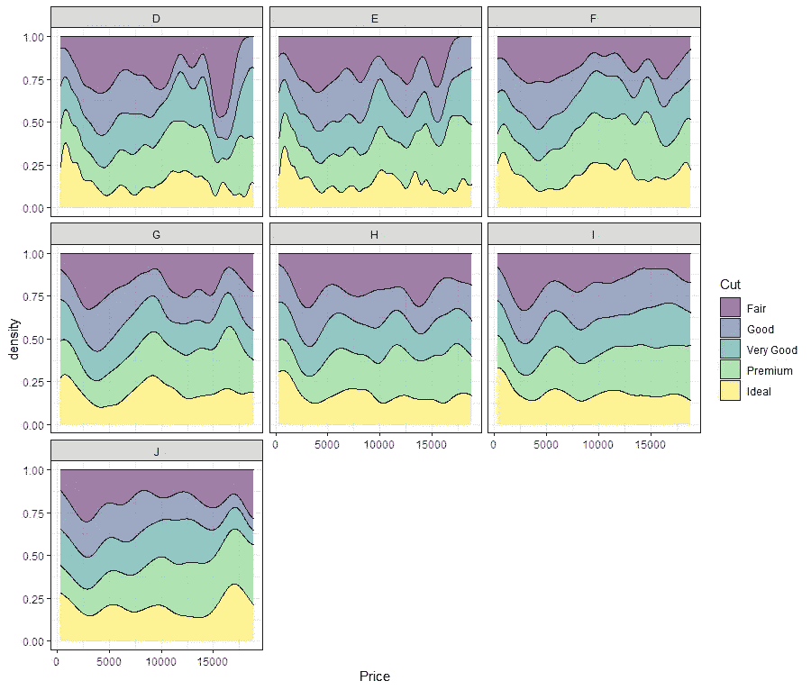

让我们拥有一切——色彩和清晰度*。虽然它看起来像一个极端的条件矩阵，但在制作一些非常奇怪的图形时，您也会看到数据的稀疏性下降。*

*不要错误地分割数据集，否则每次分割都只能得到一个或更少的观测值。条件概率也必须有意义，或者至少是假设的一部分。*

```
*Γggplot(diamonds, aes(x=price, fill=as.factor(cut))) + 
  geom_density(position='fill', alpha = 0.5) + 
  xlab("Price") + labs(fill='Cut') +
  facet_grid(color ~ clarity, margins = TRUE)+
  theme(legend.text=element_text(size=12), 
        axis.title=element_text(size=14))+theme_bw()*
```

*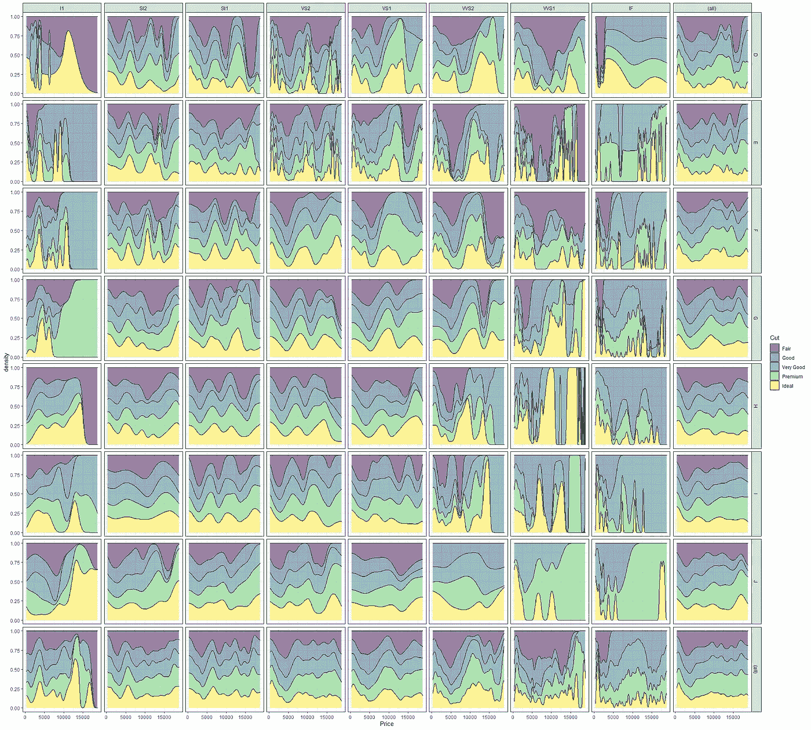*

*上面的矩阵已经显示了，我也将在下面显示的，是右外侧的边际图。最边缘的图是右下角的图。这些图表非常棒，因为您可以直观地检查这些图表的偏差，以寻找条件概率的线索。*

```
*diamonds$cut<-factor(diamonds$cut, ordered=FALSE)
preproc1 <- preProcess(diamonds, method=c("center", "scale"))
norm1 <- predict(preproc1, diamonds)
summary(norm1)ggplot(norm1, aes(x=carat, 
                  y=price, 
                  size=depth, 
                  col=as.factor(cut))) + 
  geom_point(alpha = 0.5) + 
  facet_grid(color ~ clarity, margins = TRUE)+
  xlab("Price") + labs(col='Cut') +
theme(legend.text=element_text(size=12), 
      axis.title=element_text(size=14))+theme_bw()*
```

*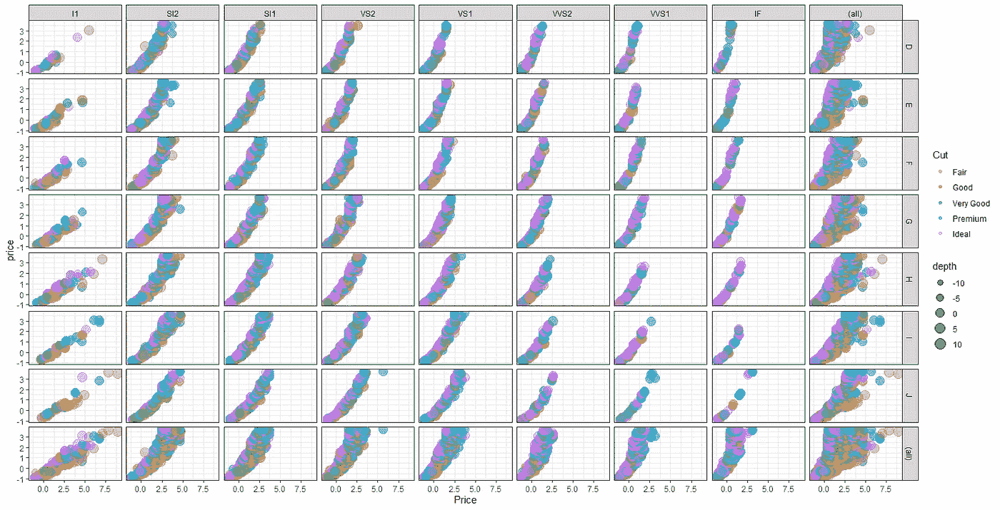*

```
*g1<-ggplot(norm1, aes(x=carat, 
                  y=price, 
                  z=depth))+
geom_hex(bins=60) + coord_fixed() +
  scale_fill_viridis(option="magma") + theme_bw()g2<-ggplot(norm1, aes(x=carat, 
                  y=depth, 
                  z=price))+
  geom_hex(bins=60) + coord_fixed() +
  scale_fill_viridis(option="magma") + theme_bw()g3<-ggplot(norm1, aes(x=carat, 
                  y=depth, 
                  z=price))+
  geom_hex(bins=60) + coord_fixed() + facet_grid(~color)+
  scale_fill_viridis(option="magma") + theme_bw()
grid.arrange(g1,g2,g3)*
```

*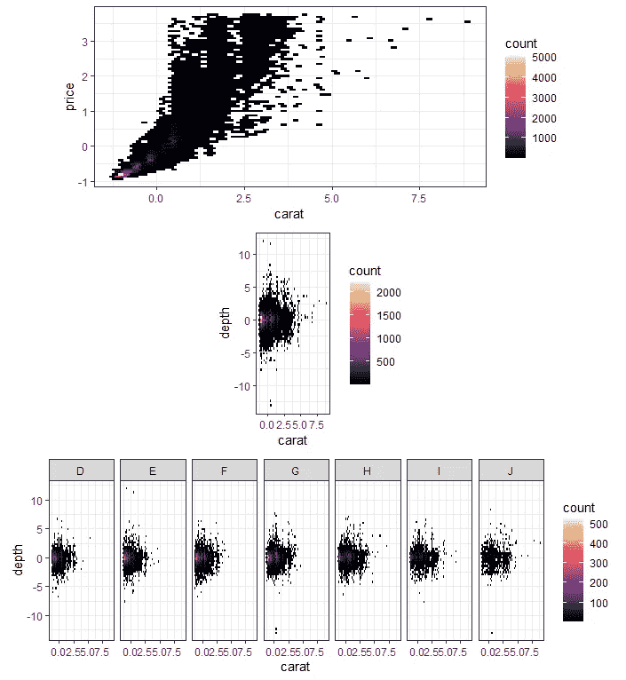*

*好了，是时候离开图形，开始构建模型了。图表对于检查数据集中是否存在已知的生物相关性，以及寻找未知因素非常重要。有了模型，您甚至可以指定您想要如何测试关系。*

*下面你看到一个[混合模型](https://medium.com/@marc.jacobs012/introduction-to-mixed-models-in-r-9c017fd83a63)，使用 lme4 包。我包括了[样条](https://medium.com/@marc.jacobs012/analysis-of-bodyweight-in-grower-finisher-pigs-using-mixed-models-splines-and-bootstrapping-in-r-4a997a04f77d)，以及双向和三向交互。模型很重，可能太重了，我们需要检查一下。*

```
*m1<-lme4::lmer(price~ns(depth,3) + 
                     ns(table,3) + 
                     ns(carat,3) + 
                     ns(carat,3):ns(depth,3):ns(table,3) +
                 ns(depth,3):cut+
                 ns(table,3):cut+
                 ns(carat,3):cut+
              (1|color) + 
              (1|clarity),
            data=norm1)
summ(m1)
tab_model(m1)
plot_model(m1, show.values = TRUE, value.offset = .3, type = "std")+theme_bw()
g1<-plot_model(m1, type = "pred", terms="depth [all]") +theme_bw()
g2<-plot_model(m1, type = "pred", terms="table [all]") +theme_bw()
g3<-plot_model(m1, type = "pred", terms="carat [all]") +theme_bw()
grid.arrange(g1,g2,g3,ncol=3)*
```

*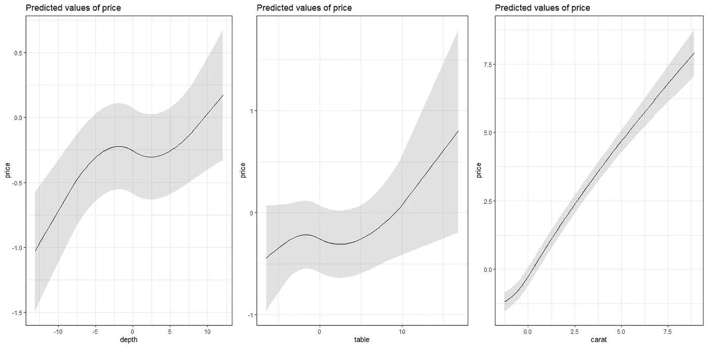*

*你可以在这里看到模型的主要效果。样条似乎有优点，但正如我们将在后面看到的，模型过于拟合。*

```
*g1<-plot_model(m1, type = "pred", terms=c("depth [all]", "cut")) +theme_bw()
g2<-plot_model(m1, type = "pred", terms=c("table [all]", "cut")) +theme_bw()
g3<-plot_model(m1, type = "pred", terms=c("carat [all]", "cut")) +theme_bw()
grid.arrange(g1,g2,g3,ncol=3)*
```

*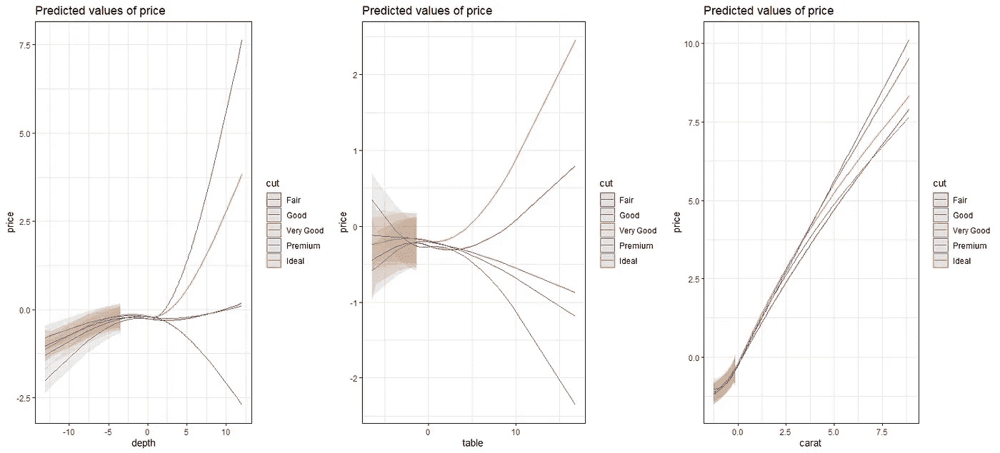*

*这里你可以看到溢出。图中的置信区间突出显示了实际数据所在的位置。在某个地方，这个模型超越了它的舒适区。*

```
*g1<-interact_plot(m1, pred = depth, modx = cut, plot.points = TRUE)
g2<-interact_plot(m1, pred = table, modx = cut, plot.points = TRUE)
g3<-interact_plot(m1, pred = carat, modx = cut, plot.points = TRUE)
grid.arrange(g1,g2,g3,ncol=3)*
```

*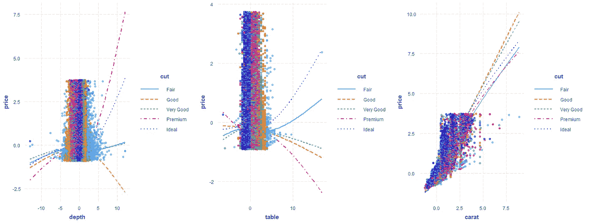*

*我在前面两张图下面说的，终于在这里显示出来了。样条超出了它们的舒适区，尽管前面的图/图确实暗示了条件概率，但这里的模型拟合得太多了。你总是需要检查你所做的是有意义的，是可辩护的。*

```
*g1<-interact_plot(m1, pred = depth, modx = carat, plot.points = TRUE)
g2<-interact_plot(m1, pred = depth, modx = table, plot.points = TRUE)
g3<-interact_plot(m1, pred = table, modx = carat, plot.points = TRUE)
grid.arrange(g1,g2,g3,ncol=3)*
```

*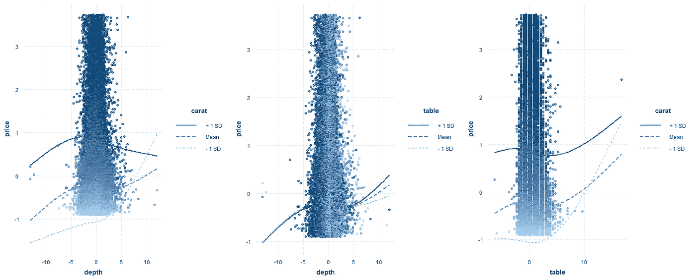*

*相同的故事*

*因此，引入样条函数可能不是一个好主意。通常，我会尽可能地使用样条函数，因为它们不会像多项式那样过度拟合(或者至少会超出它们的舒适区)，而且它们很好地消除了方差。但这次不是，所以我将回到线性，但仍然包括双向和三向交互。*

```
*m2<-lme4::lmer(price~depth + 
                 table + 
                 carat +
                 depth:table+
                 depth:carat:
                 table:carat+
                 carat:depth:table +
                 depth:cut+
                 table:cut+
                 carat:cut+
                 (1|color) + 
                 (1|clarity),
               data=norm1)
g1<-plot_model(m2, type = "pred", terms="depth") +theme_bw()
g2<-plot_model(m2, type = "pred", terms=c("depth", "cut")) +theme_bw()
g3<-interact_plot(m2, pred = depth, modx = cut,interval = TRUE,
              int.width = 0.8)
grid.arrange(g1,g2,g3,ncol=3)*
```

*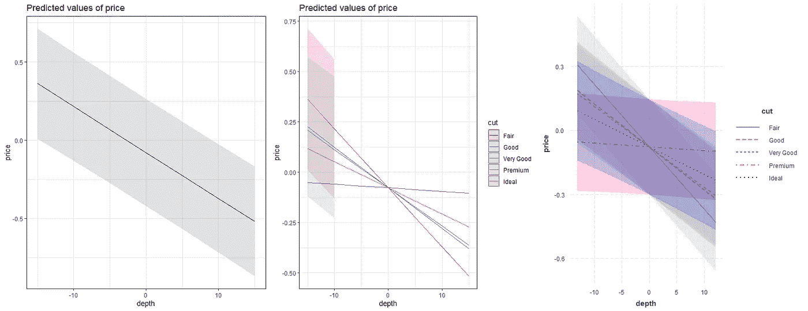*

*即使在线性模型中，某些东西也一直出错。边际模型不够，在**深度**和**价格**依赖**切**之间有明确的条件关系，但并不是五个等级中的每一个加起来都是等幂的。*

```
*g1<-plot_model(m2, type = "pred", terms="table") +theme_bw()
g2<-plot_model(m2, type = "pred", terms=c("table", "cut")) +theme_bw()
g3<-interact_plot(m2, pred = table, modx = cut,interval = TRUE,
              int.width = 0.8)
grid.arrange(g1,g2,g3,ncol=3)*
```

*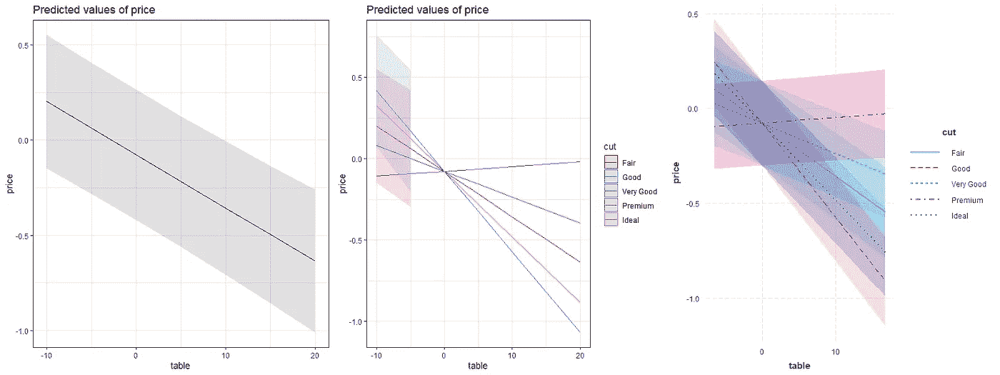*

***工作台**和**切刀**之间的交互效果清晰。*

```
*g1<-plot_model(m2, type = "pred", terms="carat") +theme_bw()
g2<-plot_model(m2, type = "pred", terms=c("carat", "cut")) +theme_bw()
g3<-interact_plot(m2, pred = carat, modx = cut, interval = TRUE,
              int.width = 0.8)
grid.arrange(g1,g2,g3,ncol=3)*
```

*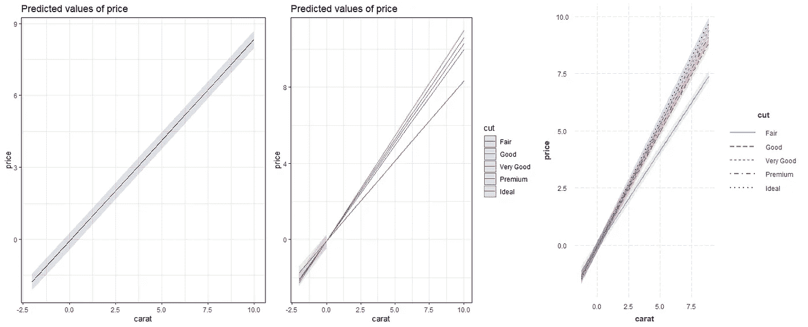*

***克拉**和**切工**之间的交互效果最强。*

*让我们更深入地看看这些交互。[交互包](https://www.rdocumentation.org/packages/interactions/versions/1.1.5)有很好的工具来可视化交互的存在，无论是图形化的还是通过测试过程。*

```
*ss <- interactions::sim_slopes(m2, pred = depth, modx = table)
plot(ss)
as_huxtable(ss)*
```

*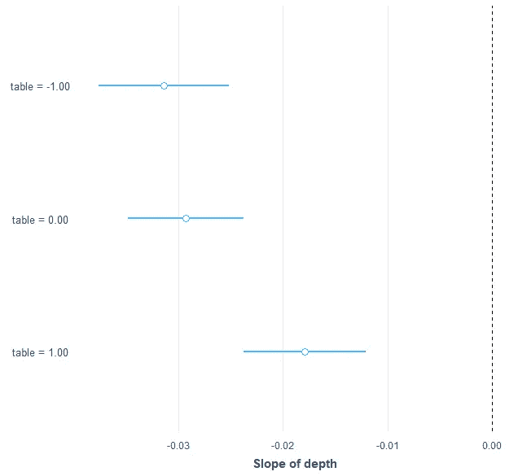*

*深度和表格的交互效果清晰。*

*展示互动效应的一个很好的方法是展开[约翰逊-内曼图](https://interactions.jacob-long.com/reference/johnson_neyman.html)。下面你会发现两种方法，给你同样的结果。记住，我使用的是标准化数据。Johnson-Neyman 图有助于理解在多元线性回归中，简单斜率在相互作用的环境中的重要性。*

```
*sim_slopes(m2, pred = depth, modx = table,jnplot = TRUE)johnson_neyman(m2, pred = depth, modx = table, alpha = .05, control.fdr = TRUE)JOHNSON-NEYMAN INTERVALWhen table is OUTSIDE the interval [3.88, 7.80], the slope of
depth is p < .05.Note: The range of observed values of table is [-6.47, 16.80]*
```

*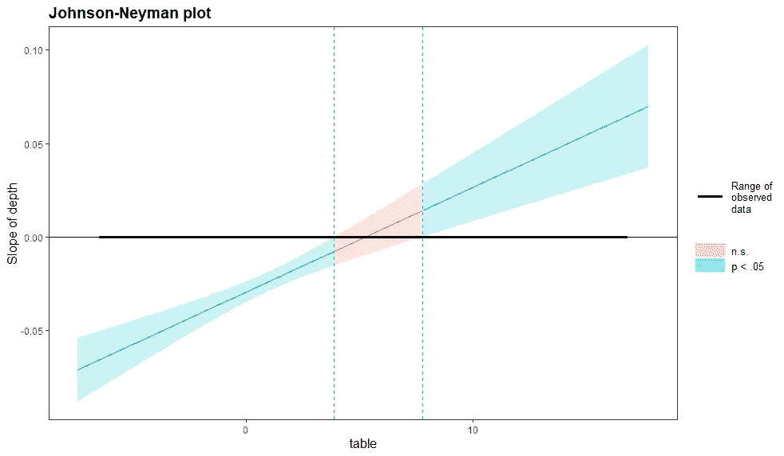*

*正如你所看到的，深度 T1 和 T2 价格 T3 之间的相互作用并不总是对调节变量 T4 表 T5 的每一个级别都有意义。所以，我所关注的是预测变量**深度**，对**价格**的影响，以及调节变量**表**对预测和结果之间关系的影响。*

```
*m3<-lme4::lmer(price~depth + 
                 table + 
                 carat +
                 depth:table+
                 depth:carat:
                 table:carat+
                 depth:cut+
                 table:cut+
                 carat:cut+
                 carat:depth:table +
                 carat:depth:cut+
                 (1|color) + 
                 (1|clarity),
               data=norm1)
interact_plot(m3, 
              pred = depth, 
              modx = table, 
              mod2 = carat)*
```

*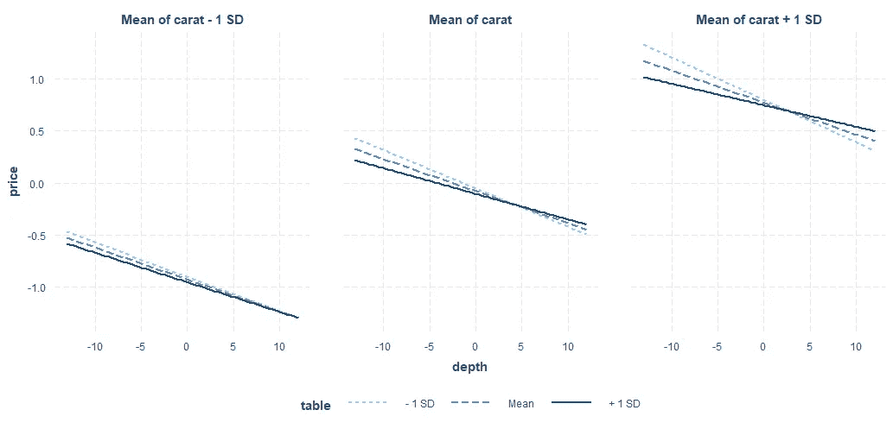*

*在这里，你再次看到一个图表，显示了深度对价格的影响，通过表格调节。上面的 Johnson-Neyman 图可能看起来更直观，但需要将两个图结合起来，以获得关于三个变量相互影响的感觉。*

```
*sim_slopes(m3, pred = depth, 
           modx = table, 
           mod2 = carat,
           jnplot = TRUE)*
```

*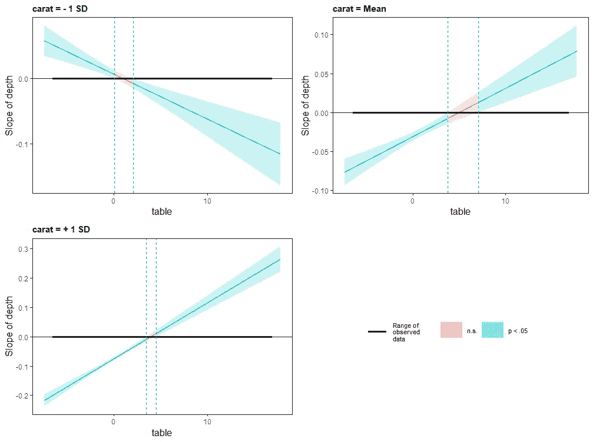*

*清楚地看到**表**对**价格**的影响取决于**克拉**。*

```
*interact_plot(m3, 
              pred = depth, 
              modx = carat, 
              mod2 = cut)*
```

*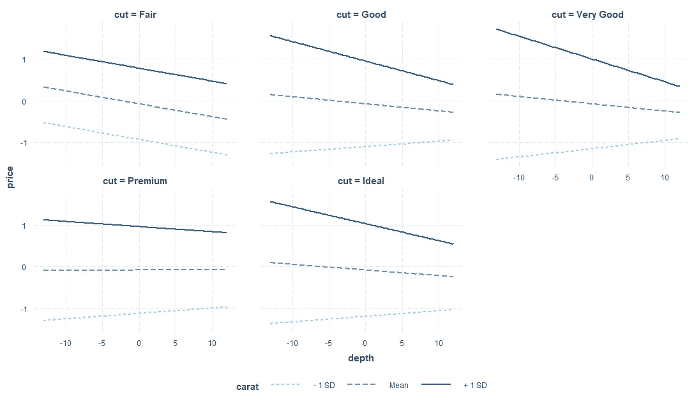*

*而且这里看起来好像是**深度**对**价格**的影响取决于**切割**，但肯定不是在**切割**的每一个层次上。事实上，这是一个很难把握的互动。*

```
*ss3 <- sim_slopes(m3, pred = depth, 
                  modx = table, 
                  mod2 = carat)
plot(ss3)*
```

*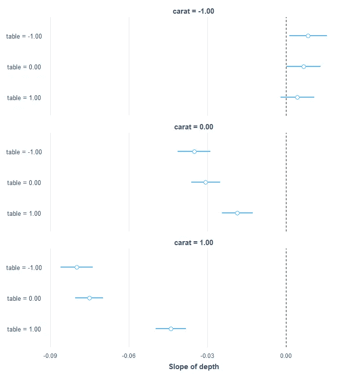*

*另一幅图显示了**深度**和**价格**通过**切割**的反向相互作用。*

*我必须承认，我不喜欢让我的第一个样条模型超出它的舒适区。所以，我想再试一次，展示一下一般加性车型的美。混合模式版本会更好，但我会留给你。现在，让我们看看如何使用样条和张量积对交互进行建模。*

```
*m4 <- gam(price ~ s(table, by=cut), data = norm1)
gam.check(m4)
m4_p<-tidymv::predict_gam(m4)
m4_p%>%ggplot(., aes(table, fit)) + geom_smooth_ci(cut)+theme_bw()*
```

*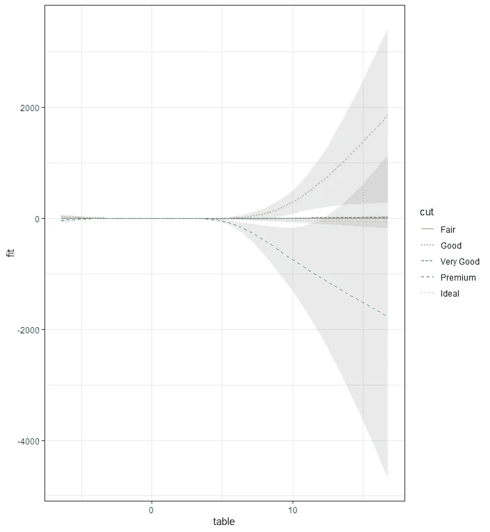*

*不是最好的互动图。我们已经看到了**切割**的调制效果在每一关都不一样，有时会很混乱。*

*我们试试别的，建立一个相互作用张量( *ti* )。然后，我想把它的预测形象化。*

```
*m5 <- gam(price ~ s(table) + s(depth) + ti(table, depth) + color, data = norm1)
m5_p<-tidymv::predict_gam(m5)m5_p%>%ggplot(aes(table, depth, z = fit)) +
  geom_raster(aes(fill = fit)) +
  geom_contour(colour = "white") +
  scale_fill_viridis(option="magma") +
  theme_minimal() +
  theme(legend.position = "top")*
```

*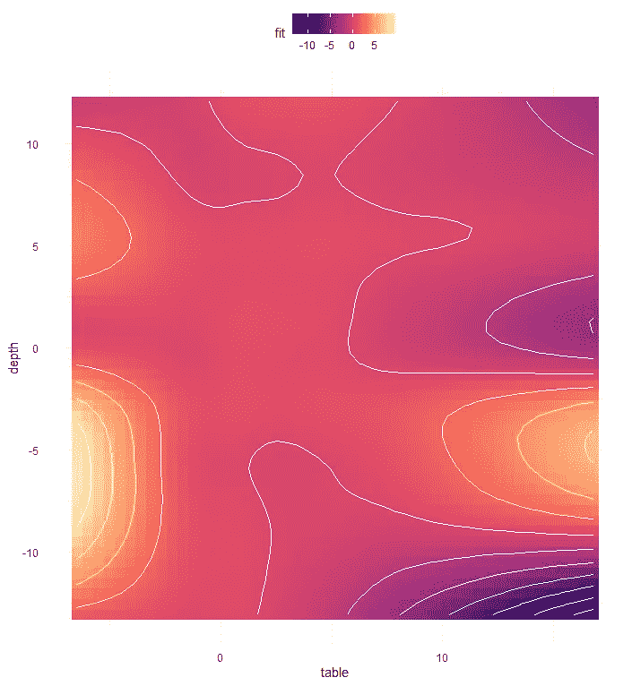*

*似乎发生了什么事。*

```
*m5_p%>%ggplot(aes(table, depth, z = fit)) +
  geom_raster(aes(fill = fit)) +
  geom_contour(colour = "white") +
  facet_grid(~color)+
  scale_fill_viridis(option="magma") +
  theme_minimal() +
  theme(legend.position = "top")*
```

*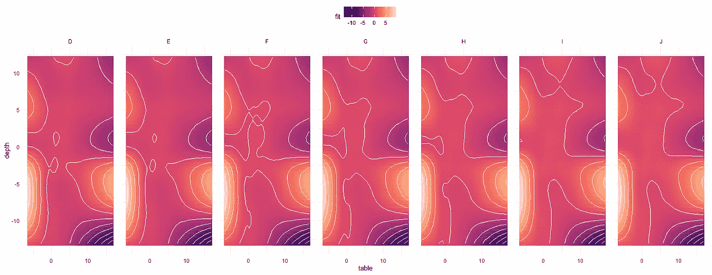*

*但不是为了颜色。也许，因为我只把颜色作为一种主要效果，而不是一种互动。*

*所以，我希望这篇文章对展示如何可视化和建模条件关系有所帮助。请记住，没有生物学上的关系是真正边缘的——总有第二、第三、第五或第六个预测者潜伏着，他们会把以前发现的关系颠倒过来！*