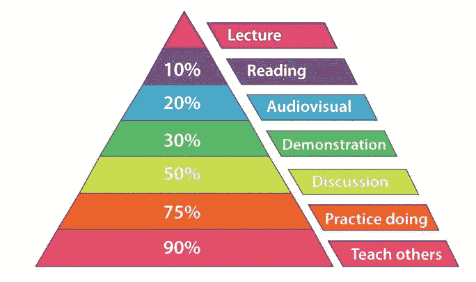

# 马里奥兄弟水平和开发实践

> 原文：<https://blog.devgenius.io/mario-bros-levels-and-dev-practices-6e734b7b1ef6?source=collection_archive---------7----------------------->

想着在不同公司的不同经历，我已经开始觉得软件就像马里奥的关卡。每一关都有自己的挑战，但是帮助你释放下一关的力量。

我认为你所知道的实践和技术与你解决大规模问题的能力之间存在某种关系。

## 大学

当我在大学学习如何发展时，问题很容易。我的意思是，你只是需要一些时间来思考如何解决问题，并写出解决方案。大多数问题最多在一周内得到解决。练习总是由两个人一起完成，我们有时会在实验室或家里一起工作。

我们没有一个合适的[版本控制系统](https://en.wikipedia.org/wiki/Version_control)，所有东西都由一个磁盘共享。我们很少创建二进制文件，我们总是向老师展示代码，我们通常必须做某种演示来解释代码在做什么。
在这方面发生了一些意外，我记得至少有一次我们无法运行我们的应用程序，我们不得不去家里拿一份已经完成的工作的副本。

## 第一公司

这和我在一家公司工作的头几年没什么不同。确实，代码不太重要，我们只关心二进制文件以及如何将它们安装到我们要安装的机器上。一切都是非常手动的工作，我们只是在本地机器上创建二进制文件，然后将一切部署到生产机器上，只是复制文件。

在我的第二份工作中，我开始使用 [SVN](https://subversion.apache.org/) 来跟踪我们对代码所做的变更。但是我们直接在生产机器上开发，人们有一个帐户，我们在那台机器上远程开发。我在一个三人小组中工作，所以部署到 prod 是协调的，只是意味着将一些文件复制到生产目录。
此外，我们直接在生产机器上测试，我不能说我们在生产中测试，因为在我们开发时没有人使用我们的代码。完成后，我们开始安装硬件，并对我们开发的东西做一些演示。

这很有趣，因为在那段时间里，我犯了职业生涯中最大的错误。当我们在生产机器上测试时，我正在处理一些需要在生成文件后删除它们的代码。所以我用 root 运行这段代码，并删除了安装这段代码的所有文件夹。糟糕的是，这个文件夹还包含 SVN 服务器和安全副本。所以我删除了为那个项目所做的所有工作，我们只能检索一个月的备份副本。

这是一个很大的错误，不仅仅是因为我的错误，而是因为许多错误的决定导致了最终的混乱。你知道，当这些事情发生时，似乎是不可避免的。

> 在《招致灾难的 T2》一书中，詹姆斯·r·奇里斯称这些为“系统中的漏洞”他将一个濒临失败的复杂系统比作一块金属上有细微裂纹的钢板。在压力下，裂纹会越来越快地扩展。最终，裂纹传播速度超过音速，金属发生爆炸。最初的触发因素和裂纹扩散到系统其余部分的方式，以及损坏的结果，统称为故障模式。
> [发布吧！第二版](https://www.amazon.co.uk/Release-Production-Ready-Software-Pragmatic-Programmers/dp/0978739213)

这次大失败是我最大的知识点之一。从那时起，我真正理解了为什么[低特权原则](https://en.wikipedia.org/wiki/Principle_of_least_privilege)如此重要，为什么版本控制系统和备份在同一台机器上不是一个好主意，以及为什么我们需要频繁保存备份。

我也了解到失败是知识的巨大来源，我开始思考如何控制失败的后果。我很幸运(在我看来)，因为我在一个没有人因为这个问题指点我的地方工作，所以我没有因为这个受到那么大的创伤。在另一个地方，也许我会试着不要失败，这发生在很多人身上。失败是不可避免的，我们不得不接受它，但我们可以用一种方式工作，使失败的后果更少，我们可以从失败中吸取教训，而无需付出很大的代价。

在那个问题之后，我开始在另一家公司工作，我只是在早上工作。这很重要，因为我下午开始在一所学院教书。这让我有可能为不同的公司教授几门课程，并帮助我学习设计模式、Javascript、Maven、Jenkins 和许多后来我会开始使用的技术。

[学习金字塔](https://www.onlinecoursefacts.com/the-learning-pyramid-what-percentage-of-learning-is-retained/)

## 第一个专业发展环境

大约十年前，我开始在一个我们试图遵循敏捷的环境中工作。事实上，我们在做一种混战。我们有一个版本控制系统和一个负责测试的 Jenkins。此外，我们被鼓励为我们的代码编写单元测试，人们试图照顾他们创造的设计和代码。
这些天，在如此专业的环境中工作，我感到非常兴奋，我们有小额门票，我们对自己的工作负责。但是我们有一个手动流程来部署到生产中。我们遵循了一组预定义的步骤，并运行一些脚本，以便能够每两周部署一次到生产环境中。
在那个年代，每个人都明白 sprint 的结束意味着部署到生产中(甚至是编写 Scrum 指南的人)。

那段时间我学到了很多技术，我也开始做测试。通常的做法是在我们写完代码后再写测试，我们写的测试和我们做的实现是紧密相连的。我们曾经为每个类创建测试，并在类之间进行大量模拟。我们就我们的设计和坚实的原则进行了长时间的讨论，每个人都读过[干净代码](https://www.amazon.co.uk/Clean-Code-Handbook-Software-Craftsmanship/dp/0132350882)的书(假新闻)。

我还记得人们试图遵循 MVC 模式，却没有很好地理解这是一个分层的架构。所以我们有不同的包来放类，但是后来我们把代表数据库的类发送到 JSP 中。我喜欢称之为“分层有孔建筑”。

## 技术教练

有意思的是，那家公司雇佣了一名技术教练，就在他开始工作的同一天，雇佣他的人离开了公司。所以他不知道该怎么办，就开始和我合作。这是我职业生涯中最大的变化之一，他教会了我。我们在一个 JavaScript 的小项目中一起工作，移除我们在公司使用的一个旧系统。我真的认为他疯了，在写代码之前先写测试，甚至他想先写断言再写代码。他教我如何使用我的 IDE (Eclipse)的快捷键，也就是那个叫做 Refactors 的奇怪菜单的意思。

他教会了我 [YAGNI](https://martinfowler.com/bliki/Yagni.html) 的含义，这个简单的词对我理解我们的前期设计有多糟糕帮助很大。我们编写的大量无用的特性和函数，以及我们创造怪物来解决我们没有的问题的惊人能力。

## 平台团队

在那家公司中存在着他们所谓的平台团队，这是一个负责一些公共库的团队，也是一种架构团队。我在那个团队工作了几年，但是我读了 Martin Fowler 的这篇文章[“谁需要架构师”](http://files.catwell.info/misc/mirror/2003-martin-fowler-who-needs-an-architect.pdf)，我意识到我必须回到一个特性团队。

自主团队的想法开始在我脑海中成长。

## 有问题的团队

我想帮助一个有问题的团队，我知道成长的最好方式是接受挑战。我想证明自己，所以我决定去那个没人想去的队。一个团队面临着一个巨大的挑战，那就是用一个全新的微服务、别致的架构替换一个旧的整体式系统。
问题是他们拖延了很多时间，没有编写测试，也没有做微服务架构的经验。这是灾难的最佳滋生地。我们创造了一个分布式的整体架构，而不是 T4 的微服务架构。
我们决定采用一种分支模型，我们认为这种模型可以帮助我们提高代码的质量。这是个坏主意，我们有一种错误的安全感。那些分支和孤立地测试它们的想法伤害了我们很多。每一次冲刺，我们都有延迟和大量的错误要在第二年春天解决。QA 帮助我们孤立地手动测试我们的代码，这给生产制造了一个很大的瓶颈。

所以一旦形势不稳定，就会有好事发生，你知道，在非常时期需要非常手段。我认为这是进行[代码冻结](/deployment-freeze-df43b77f080f?sk=70acde808816ed140ac1619c6c3808e1)以提高质量的唯一理由。
在三个月的时间里，我能够帮助我的队友创建测试，重写我们代码的一些部分以使其工作。降低我们代码的复杂性，总的来说就是让它工作。
不增加更多功能，不与旧系统竞争，只让核心功能工作并可维护。

我必须学习如何处理遗留代码(没有测试的代码)，如何引入测试但尽早开始重构，而不是等待几个月来改进。我记得我开始阅读书[“有效地使用遗留代码”](https://www.amazon.com/Working-Effectively-Legacy-Michael-Feathers/dp/0131177052)，思考我学到的关于 TDD 的知识和我从“重构”中学到的东西，让我的代码永远绿色的想法浮现在我的脑海中。

## 有可能让我的代码一直处于可发布状态吗？

我认为 100%是不可能的，但是如果我能让我的代码在 99%的时间里都处于可发布状态呢？

我的意思是，即使当我开发新的解决方案时，如果我能以不破坏任何东西的方式重构我的代码呢？。
我能不能以一种可以非常频繁地推送代码并确保一切正常的方式进行开发？
我需要将我的开发建立在手工检查和调试的基础上吗，或者一旦我确信一切正常，我可以推迟吗？

所以我开始学习如何做[基于主干的开发](https://trunkbaseddevelopment.com/)(我们称之为 master only)[持续集成](https://javi-kata.medium.com/ci-cd-for-dummies-b45ed917f9dc?sk=28eede1d5fec71121eea4954583130e9)开始有了真正的意义。这个想法不仅仅是让 Jenkins 管道不时地运行测试，而是使用管道来证明我们的代码处于可发布的状态。这个想法逐渐形成，我们意识到我们应该[只有一个登台环境](/long-lived-environments-93f097786aa6?sk=84eba6ba390918a6a9a89fff6454e3b4)，在那里我们可以手动检查我们已经实现了什么。
如果有人引入了管道没有检测到的 bug，我们也可以使用那个环境更快地知道。

在那些日子里，我们做代码审查，我们不使用拉请求，而是在事情“完成”时进行同步代码审查。但是基于主干的开发意味着什么呢？，如果我们做小的频繁的提交，就不可能同步提交合并前的代码审查。

人们认为代码评审对于提高质量是有用的，但是他们给了代码评审很多其他的好处，比如知识共享。在那些日子里，我们尝试了[合并后的代码评审](https://copyconstruct.medium.com/post-commit-reviews-b4cc2163ac7a)。这个问题揭示了一个需要考虑的更深层次的问题，我们需要合作到什么程度？

## 思想作品

这是我知识上的另一个重大变化，我发现了一个解决方案——代码审查、基于主干的开发和协作。
结对编程，一个新的大挑战，但是一个学习大量新事物的伟大旅程。
我也意识到人际交往对实现你的目标有多重要

> “不管一开始看起来如何，这总是一个人的问题。”
> T5【杰拉·温伯格】

我还学习了 Mob 编程，以及它的有效性。我明白了它[起作用](/one-developer-one-task-b9bd52af925c?sk=6fb3ee21d0f2a8000f17c2a9bdeec019)的原因。

在 Thoughtworks 工作是我第一次听说 [NoEstimates 运动](https://ronjeffries.com/xprog/articles/the-noestimates-movement/)，在我看来这是关键。NoEstimates 的关键部分是理解更小的东西更容易投入生产，所以我们应该把你的[用户故事的范围缩小到足够小](/the-atom-of-agile-ff0b3537643f?sk=ac3b9f9c3cfbc379fdafaa02047cad38)，唯一有效的估计是“足够小吗？”那我们就做吧，不，那就分了它。

我了解了[4 个关键指标](https://www.thoughtworks.com/en-es/radar/techniques/four-key-metrics)，什么是真正的团队，什么是[高绩效团队](/software-teams-karate-421ff1ce5425?sk=35ae3ddbd707d5d86d681e1d8a08524b)，持续改进和精益实践的理念有多重要。

总的来说，我学到的所有东西都帮助我解决了当时遇到的问题，同时也让我思考这些实践所隐含的新挑战。当你打开一扇新的门时，大量的问题会浮现在你的脑海中。
**软件是知识的旅行，游戏永远不会结束。**