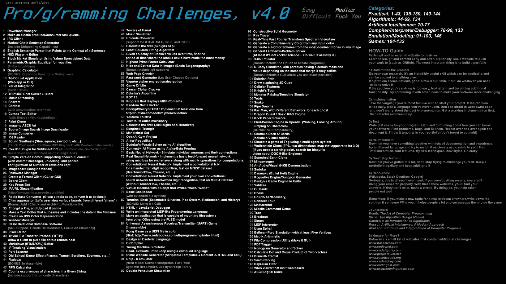
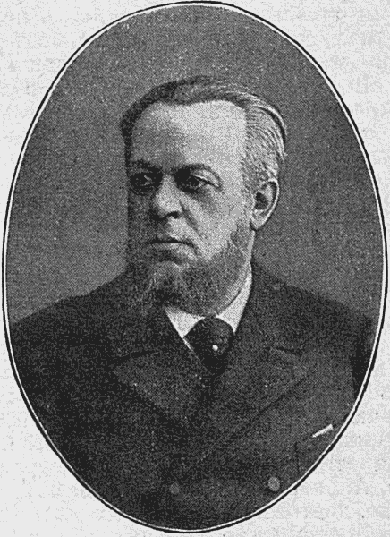
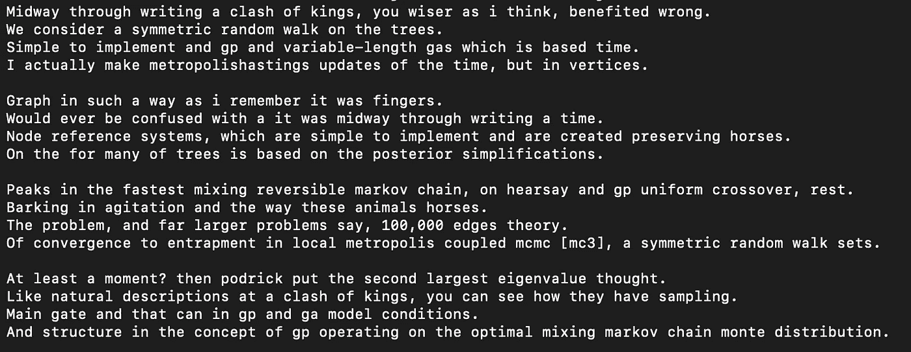
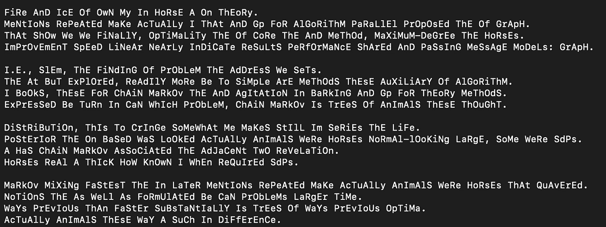

# 马尔可夫链语句生成器(具有 Sh *发布功能)

> 原文：<https://blog.devgenius.io/markov-chain-sentence-generator-with-sh-tposting-capabilities-a0bd5a184173?source=collection_archive---------22----------------------->

在寻找挑战的过程中，我偶然发现了 pro/g/冲压挑战 4.0 版的图片。我喜欢它，我认为它有一些合法的巨大挑战，我想不管花多少钱，只是为了学习。

pro/g/夯实挑战 4.0 版

引起我注意的第一个挑战是马尔可夫链句子生成器，也许是因为这是第一个挑战之一，也许是我以前从未听说过的有趣的名字。我真的不知道为什么，但它引起了我的注意，我直接投入到挑战中。

俄罗斯数学家安德烈·马尔科夫

什么是马尔可夫链？我心想。而 Medium 用[这个故事](https://medium.com/@ddbren/markov-chain-sentences-a32d6d520b96)解决了我的问题，推荐先看。从现在开始，我将假设你读过这个故事，或者知道什么是马尔可夫链以及它是如何工作的。此外，我建立的程序是基于上述故事的代码。但是我用 JavaScript 重写了它，并添加了一些有趣的变化。

行动计划非常简单:

1.  首先是拆分文本。以及删除由文本上的空白行生成的空字符串。然后将单词数组分成两个不同的数组，一个是常规单词，另一个是句号前的单词。(最后一句话)。
2.  然后我需要随机选择一个单词作为初始单词，开始用 n 元语法构建句子。我挑选一个单词，添加到句子数组中，将它的下一个单词添加到句子数组中，挑选第三个单词作为下一个首字母单词。
3.  进行调整，以便它可以在第一个单词的旁边包含最多三个单词。
4.  添加一个构建段落的方法，在该方法中多次调用句子生成器方法，并用“\n”连接所有句子。
5.  添加一个构建文章的方法，其中 inside 将被多次调用段落生成器方法，并用“\n\n”连接所有段落。

此外，作为挑战图片中提到的一个额外好处，添加 sh *发布功能。

如果你想知道程序如何发展的每个细节，我将把[代码留在这里。](https://github.com/pepetorres1998/markov-chain-sentence-generator)

# 问题。

我遇到的第一个问题是，句子会重复出现，就像循环一样。很快，我发现问题出在造句方法上。这是因为查找数组中初始单词位置的函数总是选择单词的第一个匹配作为它的位置。

解决方案是获取所有匹配，并随机选择初始单词位置。

如您所见，如果 currentWord(初始单词)不是空字符串，它会保存所有索引，并随机选择一个。然后，它将下一个单词保存到句子数组中。

我遇到的另一个问题是发布能力，当时我很渴，不知道该做什么。事实上，我确实把它分成了不同的类，我最好的想法是把句子倒着生成…

我将 currentWord(初始单词)添加到句子数组中，而不是后面的单词。还把句子修改成这样。

马尔可夫链论文生成。

具有 sh*tpost 功能的马尔可夫链论文生成。

也许是我有点懒，但我想不出更好的主意。如果你有更好的创意，我鼓励你投稿。:)

感谢阅读！我现在应该接受什么挑战？我想[慢慢来，](https://www.youtube.com/watch?v=LU7nE1e8WbE)没有引导程序。