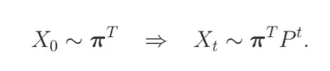
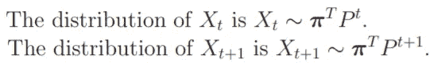
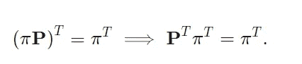
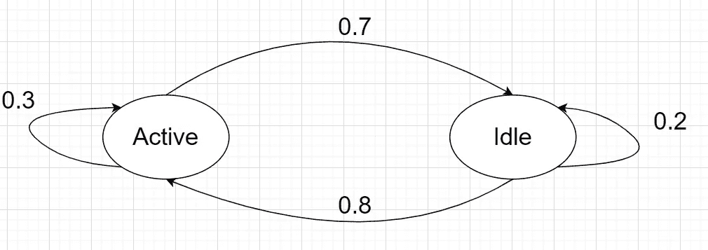
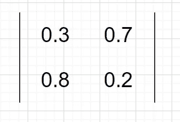
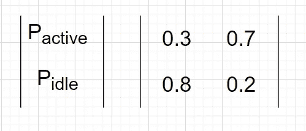
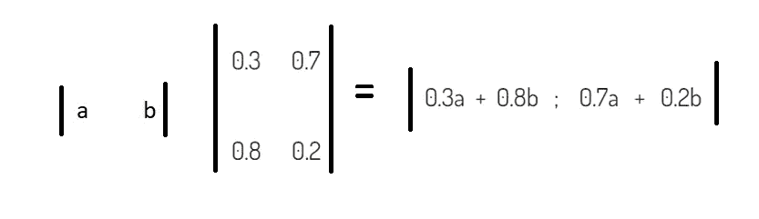

# 幼儿马尔可夫链教程-2

> 原文：<https://blog.devgenius.io/markov-chain-tutorial-for-toddlers-2-cce583eac064?source=collection_archive---------20----------------------->

正如在之前的故事中所解释的那样——“[Markov Chain Tutorial for Tutorial-1](https://medium.com/@abhishek3khare1/markov-chain-tutorial-for-toddlers-b32de55035a0)”,
我们现在知道了一些关于 Markov Chain 的细节，并且知道了 Markov Chain 和构建转移矩阵的基础知识。

在前面的故事中，我们通过迭代地乘以转移矩阵来预测人口分布的即将到来的状态(找到期望值)。本质上，我试图用那个例子来解释这个基本定理—

这里，X₀是人口分布的初始状态，而 Xₜ是 tₜₕ时间步的人口分布状态。

**平稳分布**对于马尔可夫过程—
现在让我们考虑这样的场景，在经过长时间的试验后，分布趋向于某个特定的配置，也就是说，分布接近一个稳态值。如果以下条件成立，将会出现这种类型的系统行为—

让我们举一个这样的平稳分布的例子，机器有两种状态(“活动”和“空闲”)，这是一个离散时间过程，用户可以以某种概率切换状态或保持相同的状态。下面是我们模型的示意图—

机器的 DT 马尔可夫链

这里，概率在相应的箭头上表示，例如—
P(活动—>空闲)= 0.7 和 P(空闲—>活动)= 0.8，等等

在上面的过程中，我们把它的转移矩阵形成为—

跃迁矩阵

为了计算下一个状态，我们可以用下面的公式

现在，我们计算矢量的稳态值-

a 和 b——平稳概率

为了计算稳态概率，我们把这个结式矩阵等同于矩阵[a b]

所以我们得到— [0.3a + 0.8b 0.7a + 0.2b] = [a b]

我们得到两个方程—
a = 0.3a+0.8b
b = 0.7a+0.2b

解完以上两个方程，我们得到比值→ b: a = 8:7

现在，由于总概率应该是 1，因此我们有 a + b = 1，所以现在我们分别求解 a 和 b-
，稳态分布结果为-(8/15，7/15)

因此，这意味着在大量迭代(接近无穷大)之后，机器处于活动状态的概率将是 8/15，即 53.3%，而机器处于空闲状态的概率将是-7/15，即 46.6 %