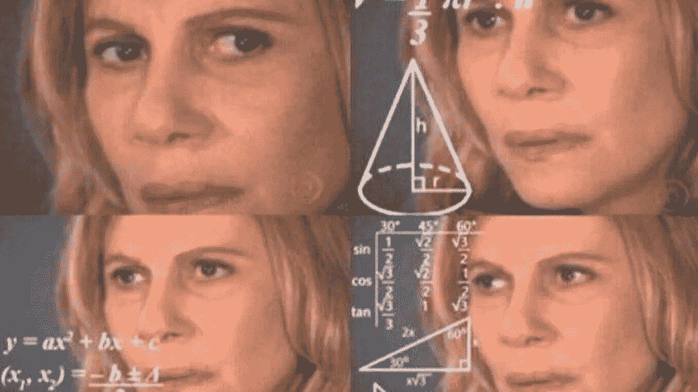
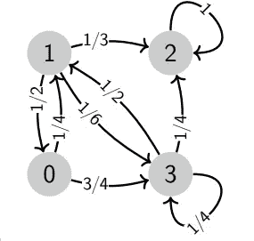
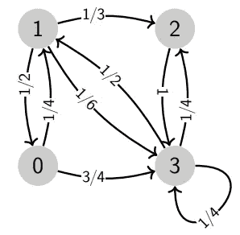
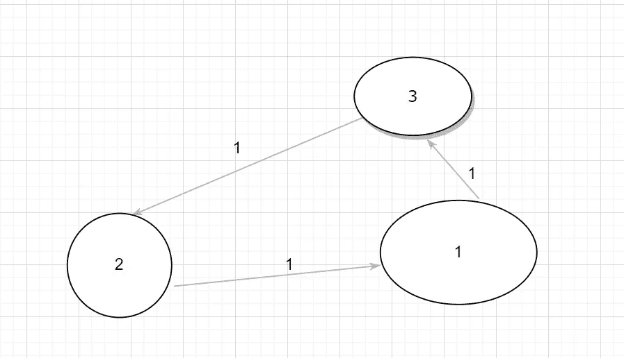

# 幼儿马尔可夫链教程-3

> 原文：<https://blog.devgenius.io/markov-chain-tutorial-for-toddlers-3-8e692daa86e4?source=collection_archive---------14----------------------->

马尔可夫链基础知识请看前面的故事—
[幼儿马尔可夫链教程—1](https://medium.com/@abhishek3khare1/markov-chain-tutorial-for-toddlers-b32de55035a0)
[幼儿马尔可夫链教程—2](https://medium.com/@abhishek3khare1/markov-chain-tutorial-for-toddlers-2-cce583eac064)

在这个故事中，我们将讨论马氏链的两个重要方面，马氏链的不可约性和非周期性。

对孩子来说太容易学习的东西(只适合初学走路的孩子)

**不可约性** —如果每一个状态(节点)都可以从每一个其他节点访问，则称马尔可夫链是不可约的。也就是说，如果至少有一个节点没有到其他节点的直接或间接路径，那么这个马尔可夫链就叫做可约的。

“可约”马尔可夫链的例子—

图 1 —样本可约马尔可夫链

正如我们在图 1 中看到的，一旦我们到达状态“2”，我们将不能到达任何其他状态，因此上面显示的马尔可夫链是可简化的，因为没有从状态“2”到每个状态的直接/间接路径。

现在，我们将看到一个不可约马尔可夫链的例子—

图 2 —不可约马尔可夫链

如图 2 所示，我们看到马尔可夫链中的每个状态都可以被马尔可夫链中的每个其他状态访问。样本路径— 2 →3 → 1 → 0 等
因此，图 2 中的链是不可约的马尔可夫链，每个状态都被认为是不可约的。我们还观察到，图 2 所示的马尔可夫链可以看作是一个强连通图。

**非周期性** —马尔可夫链被认为是周期性的当且仅当它的所有状态都是周期性的。即，马尔可夫链的所有状态应该具有大于 1 的周期性。那么，节点的周期性是什么意思？我们将使用下面图 3 中的例子来了解这一点。

周期性马尔可夫链的例子—

图 3 —周期性马尔可夫链示例

在上面的例子中，我们看到每个节点都直接或间接地与其他节点相连，因此这是一个不可约的马尔可夫链。
现在我们计算每个节点的周期，让我们从计算节点 1 的周期开始—

为了计算一个节点的周期，我们必须取遍历马尔可夫链并回到同一个节点的所有可能路径长度的最高公因数(最大公约数)

所以如果我们从节点 1 开始，从上图回到节点 1 的可能路径是——
1→***3→2→1***= = = = =路径长度= 31→****3→2→1→3→2→1****= = =路径长度= 6*1 【T21*

*依此类推，所以我们看到遍历回节点的可能路径长度是 3，6，9。12 …等等
所以节点 1 的周期= GCD (3，6，9，12…) = 3
因此在这种情况下节点 1 的周期是 3。如果周期结果是 1，那么我们认为这种状态是非周期性的*

*同样，我们可以计算节点 2 和 3 的周期，结果也是 3。因此，图 3 中显示的马尔可夫链的周期是 3。*

*有没有人猜测图 1 所示的马尔可夫链中状态 2 的周期是多少？它将是 1，因此在图 1 中表示的马尔可夫链中的状态 2 的情况下，状态是非周期性的。*