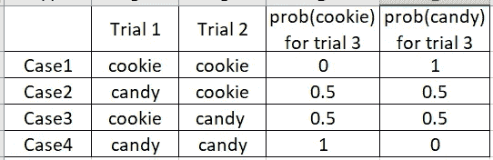
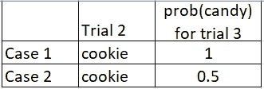
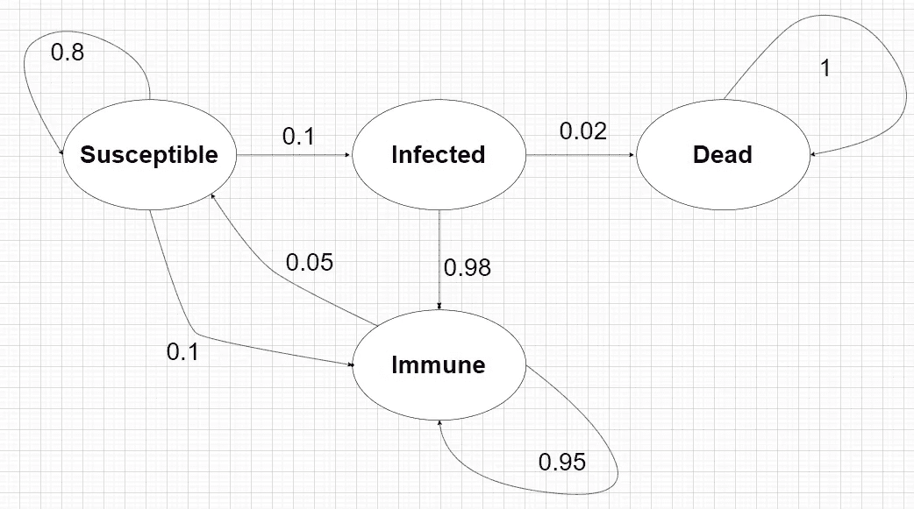
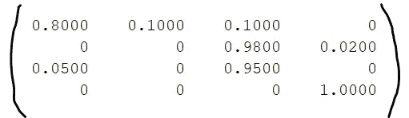
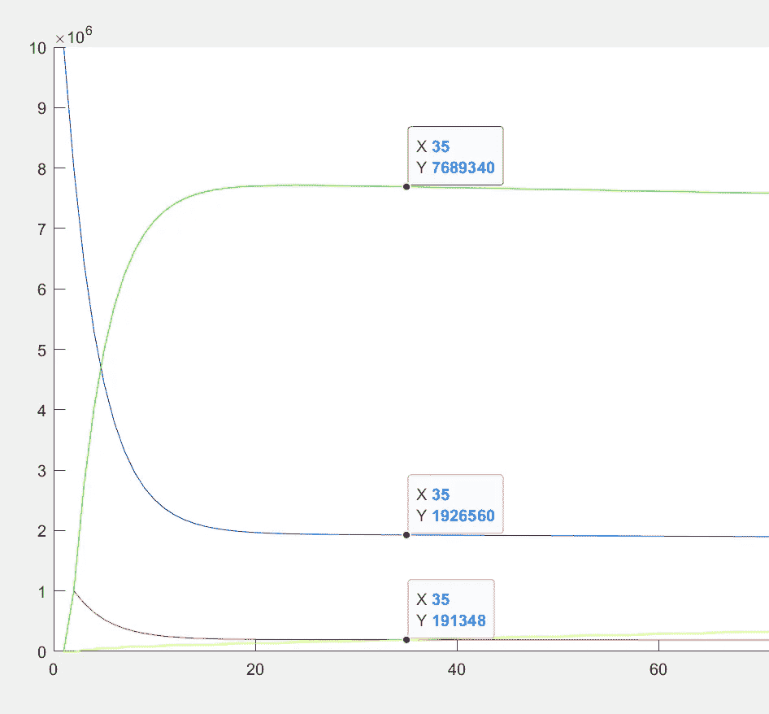

# 幼儿马尔可夫链教程-1

> 原文：<https://blog.devgenius.io/markov-chain-tutorial-for-toddlers-b32de55035a0?source=collection_archive---------7----------------------->

大家好，这是我试图用最简单的方式解释一个概念的尝试之一。这将有助于我更好地解释东西，也有助于初学者(这里是幼儿)理解这些主题的基础。

现在让我们跳到马尔可夫链这个话题上，因为你正在读这篇文章(显然是给初学走路的孩子看的)，所以我假设你是一名正在学习马尔可夫链的本科生。你可能正在学习概率论、随机过程或人工智能。

现在，让我们问一个基本问题——什么是马尔可夫链？马尔可夫链只不过是随机过程的一个“模型”,在这个模型中，一个事件发生的概率只取决于“立即”发生的前一个事件，在前一个事件之前发生的所有事件对下一个事件的发生概率没有决定作用。所以，用专业术语来说，这是一个“无记忆”的随机过程。

现在是举例的时候了，首先让我们看看一个被**而不是**建模为马尔可夫链的过程(也就是说，它不满足无记忆的马尔可夫性质)——
假设一个包里有 4 样东西——(2 块饼干和 2 块糖果)，现在假设我们盲目地(无偏地)一次拿出一件东西，所以挑选糖果或饼干的初始概率是:- 2/4 或 0.5，现在创建一系列实验，在这些实验中，我一次拿出 1 件东西那么假设我们进行了 2 次迭代的实验，我们要计算第三次迭代得到糖果的概率。现在这可以有四种方式——



两次尝试后第三次尝试获得饼干/糖果的概率



从上面可以看出，假设如果情况 1 或情况 2 发生，并且我们在“立即”之前的事件(即**试验 2** )中获得了一个 cookie，那么在试验 3 中获得糖果的概率应该只取决于我的试验 2 的结果，即试验 3 的概率(糖果)对于情况 1 和情况 2 应该是相同的，因为我的试验 2 的结果对于这两种情况都是相同的(如 1！= 0.5)
我们可以看到，它也依赖于我的试验 1 的结果，因此，它不满足“无记忆”的性质。

**马尔可夫链示例—**

我们可以使用马尔可夫链来模拟各种事情，一个这样的应用是模拟流行病(如新冠肺炎),这有助于我们预测疫情将传播多快，以及疫情将影响我们多长时间。

让我们以新冠肺炎疫情的传播模型为例。我们可以建立一个模型，其中有不同状态的人存在。让我们将这些状态创建为—“易感”、“感染”、“免疫”和“死亡”。在我们的模型中，一个人可以属于这些状态中的任何一种(注意:康复/接种疫苗的人将属于“免疫”类别，而未接种疫苗的人将属于“易感”类别)。

提议的模型—



Covid19 的建议马尔可夫链模型

在这个马尔可夫链模型中，我们已经在相应的箭头上示出了状态转换的概率，因此，例如，从“受感染”状态转换到“死亡”状态的概率是-
P(受感染->死亡)= 0.02，即 2%。
“易感”人群接种疫苗的概率取 0.1，即 10%，以此类推。(P(Sus - > Imm) = 0.1)

因此，为了详细研究这个模型，我们首先创建一个名为“转移矩阵”的矩阵，它将帮助我们预测一些人口在一段时间内的状态变化。

为了准备一个转移矩阵，我们首先以行向量的形式表示群体状态—[“sus”、“感染”、“免疫”、“死亡”]。因此，在任何时候，如果有 10 个易感人群，20 个受感染人群，80 个免疫人群，2 个死亡人群，我们可以用[10，20，80，2]来表示当时的人群

现在，为了计算下一时刻的人口，我们将当前向量乘以转移矩阵。

["sus_next "，" infected_next "，" immune_next "，" dead_next"] =
[10，20，80，2]*T

这里，t 是由—
t =【tᵢⱼ】= p(I—>j)形成的转移矩阵

所以在我们的例子中 T =



测试矩阵参考图

这种类型的马尔可夫链可用于预测大流行早期阶段的数字。
于是我从一个状态开始——【10，000，000；0 ;0 ;也就是说，最初在 1000 万人口中，所有 1000 万人都是易感者。现在，随着时间的推移，我们在转移矩阵的帮助下计算受影响的人口(这里，就我们的模型而言，假设每个时间步长为 20 天|我们以离散时间马尔可夫链为例)

因此，20 天后(即下一次实例)的预期数字是-
【10，000，000；0 ;0 ;0]***T**=【8000000；1,000,000 ;1,000,000 ;因此，对于每一次迭代，我们可以计算受影响的人口，我们可以运行一个模拟，并绘制出结果—

我们模型的模拟图—



时间实例 35(即 700 天)的模拟结果

免疫—绿色
易感—蓝色
红色—感染
黄色—死亡

这只是使用马尔可夫链模型的一个非常基本的例子，在接下来的文章中，我将深入这个主题并解释更多与此相关的概念。

Matlab 仿真代码

```
transition_mat = [0.8 0.1 0.1 0; 0 0 0.98 0.02; 0.05 0 0.95 0;0 0 0 1];
current_status = transpose([10000000;0;0;0]);
susceptible = [current_status(1)];
infected = [current_status(2)];
immune = [current_status(3)];
dead = [current_status(4)];
for i=1:100
    current_status = current_status*transition_mat;
    susceptible = [susceptible current_status(1)];
    infected = [infected current_status(2)];
    immune = [immune current_status(3)];
    dead = [dead current_status(4)];
endfigure;
hold on;
plot(susceptible,'Color','b');
plot(infected,'Color','r');
plot(immune,'Color','g');
plot(dead,'Color','y');
```