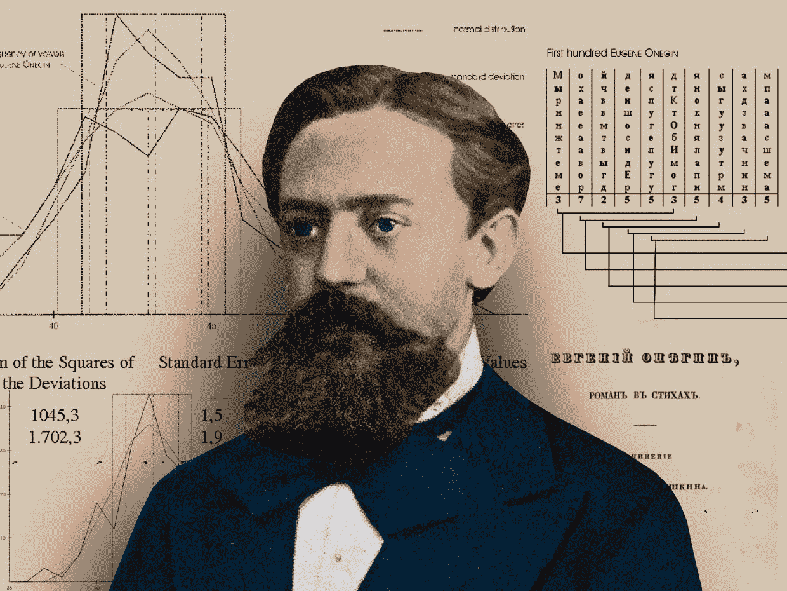
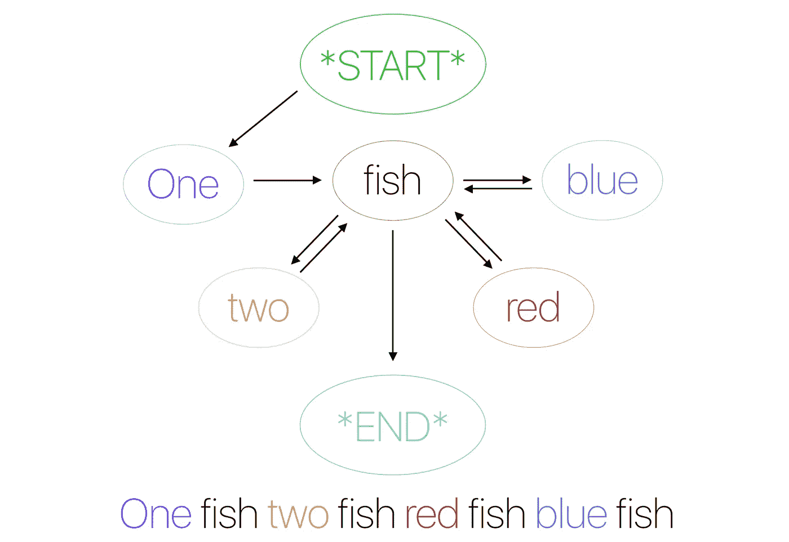
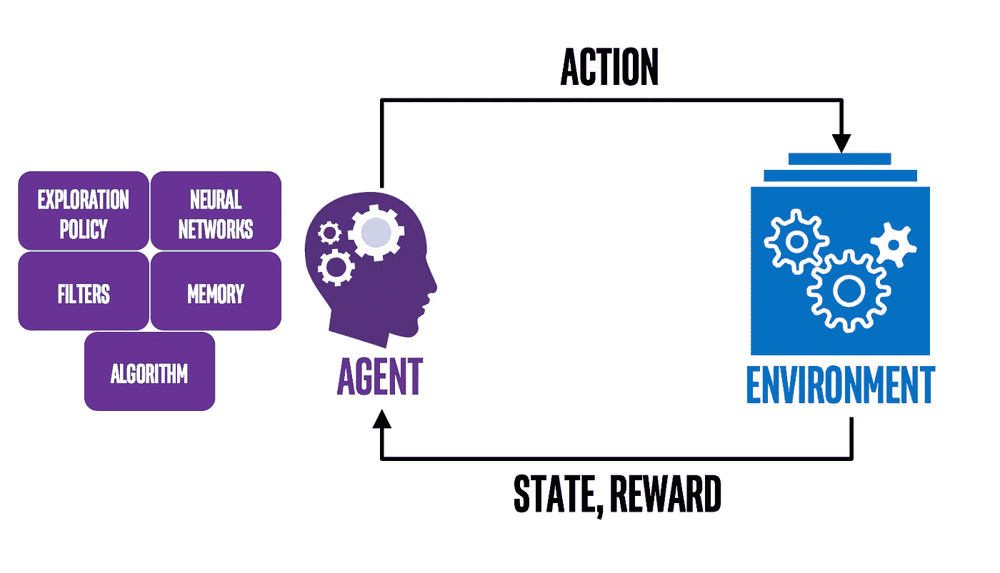
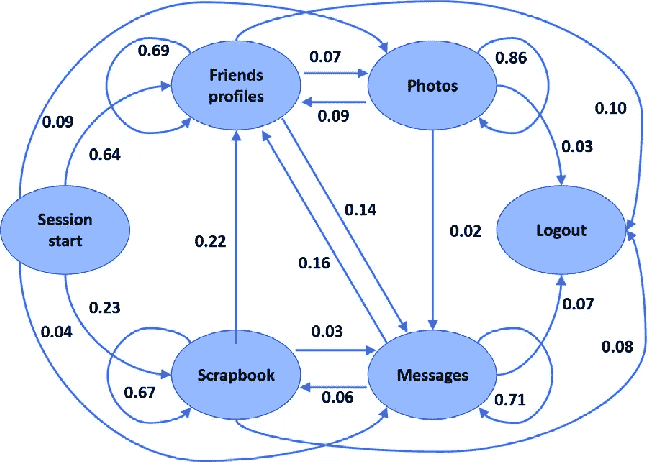
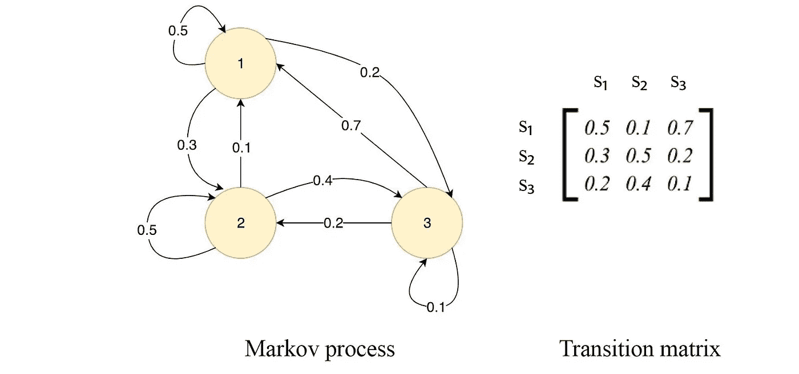

# Markov:计算机科学中的未知人物之一

> 原文：<https://blog.devgenius.io/markov-one-of-the-unknown-figures-in-computer-science-eb660fdda762?source=collection_archive---------5----------------------->

他的工作引领了计算机科学和人工智能。

一位 20 世纪的数学家独自负责了大多数 21 世纪的技术。在这里，我们将概述马尔科夫对计算机科学的贡献。

## 单语言模型

你能想象一边看书一边找语言模型吗？安德烈·马尔科夫在一个世纪前发现了它。他发现，在阅读一本书，跨越每个单词，只写每个单词的元音。在那之后，他发现这个模型已经被创造出来，由俄语中的单词头韵组成。这就是马尔可夫链和自然语言处理是如何产生的。此外，它变得足够复杂，可以在模型中使用，以创建人工智能的基础之一。

## 2-信息学理论基础

看来马尔可夫链不仅仅应用于它的语言模型。由于拉普拉斯在数学中证明了著名的卷积定理和拉普拉斯分布，它们也成为创建背景信息学理论的最后一块垫脚石。继拉普拉斯之后，傅立叶利用傅立叶级数、变换和分析，在更大程度上允许许多计算机科学家创建与今天和未来的标准兼容的复杂系统，以满足我们不断增长的需求。

## 3-人工智能基础

马尔可夫决策过程怎么样？马尔可夫矩阵的使用？那么，他通过寻找马尔可夫决策过程，并用他的矩阵可视化，为人工智能中的机器学习和强化学习做出了贡献，怎么样？他带路

## 4-强化学习的基础

当数学家在自然界中寻找决策过程时，他们中的许多人是有不同方法的理论家。但是当马尔科夫工作的时候，他并没有发现他著名的贡献，他对这些贡献做了更多的贡献，导致了人工智能的建立，五十年后，一群数学家试图创造一个可以与生物学相匹配的思维系统。

## 5-网络

随着他的隐马尔可夫模型的建立，大多数人工智能专家和教授过去常常在这个模型和众所周知的马尔可夫链的帮助下应用联网的原则。尽管它们已经有几十年没有被使用，其价值甚至在我们的时间线中也没有被完全理解，所有领域的计算机科学家已经利用这些研究的网络来创造可能的最佳输出。

## 6-机器学习

看起来我们需要马尔可夫决策过程来进行机器学习。一种统计算法被用来教机器做一些类似于深度学习的事情。但是区别是在机器学习算法需要训练集的时候设置的。由于统计学中的马尔可夫过程，人工智能技术变得更加准确，有能力完成艰巨的任务，让我们的生活变得更加轻松。

我们都应该感谢安德烈·安德烈耶维奇·马尔科夫，这些伟大的发明让我们的生活变得更加轻松。

*你如何看待马尔科夫对计算机科学的贡献？在下面的评论区分享你的想法。*