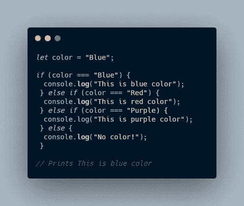

# 8 分钟掌握 JavaScript 基础知识

> 原文：<https://blog.devgenius.io/master-javascript-basics-in-8-minutes-97b3c679eade?source=collection_archive---------0----------------------->

## 8 分钟学会 JavaScript


由**[**Eugene Goh**](https://medium.com/u/e4b30737c09a?source=post_page-----97b3c679eade--------------------------------)制作的 **JavaScript** 图片**

> *****在阅读之前，我必须说这只是针对绝对初学者的。*****

**到底什么是 JavaScript？**

****

**照片由[艾米丽·莫特](https://unsplash.com/@emilymorter?utm_source=medium&utm_medium=referral)在 [Unsplash](https://unsplash.com?utm_source=medium&utm_medium=referral) 上拍摄**

**JavaScript 被认为是现代网络浏览器的现代语言。多年来，JavaScript 一直在不断发展。**

**JavaScript 是一种极其强大、灵活和快速的编程语言。从**前端**到**后端**都可以使用。**

**你可以使用 **JavaScript** too 结合 [**ElectronJS**](https://www.electronjs.org/) 来构建一个桌面应用。可以用[](https://reactjs.org/)**构建 [**SPA(单页应用)**](https://en.wikipedia.org/wiki/Single-page_application) 。可以用 [**NodeJS**](https://nodejs.org/en/) 做一个后端。任何你命名的东西。****

****大家系好安全带！确保你一路上做笔记，理解基础将为你建立复杂的概念。****

## ******注意:Java** 不是 **JavaScript！******

# ****1)控制台****

****如果我们想打印一些在屏幕上看到的东西，使用**控制台的**关键字。内置在**控制台**对象中的一个动作或方法是**。日志**方法。****

****当我们将一些东西放入 **console.log()** 时，它会被打印或记录到控制台。****

# ******例如:******

********

******console.log()** 用法示例****

# ******2)注释******

****编程通常是高度合作和协作的。注释让其他开发人员知道代码在做什么。超级有用。****

****有时你不想让你的代码被编译，你会想考虑使用注释。****

****你也可以对**伪代码**使用注释！对于那些不知道什么是**伪代码**的人来说，简称****伪代码**就像是在打出你的代码之前，先起草或记下你想做的事情和下一步要做的事情。******

# ********例如:********

```
****// This is for single-line comment
/* This is multi-line 
   comment */****
```

************

********注释**的用法示例******

# ******3)数据类型******

******JavaScript 中有 7 种不同的数据类型:******

*   ********数字:**任何数字，包括整数或小数。**比如 6，60，3.142。********
*   ********布尔:**有两个可能值**真**或**假的数据类型之一。**就像一个具体问题的答案要么****【否】。**********
*   ********对象:**数据集合。******
*   ********字符串:**一组字符，必须用**双引号("这是一个字符串")**或**单引号('这是一个字符串')括起来。********
*   ********未定义:**变量已声明，但尚未赋值。******

```
****For example:var meal;
console.log(meal);
// Prints undefined****
```

*   ********Null:** 表示没有值的特殊关键字。******

```
****For example:var meal = null;
console.log(a);
// Prints null****
```

*   ********符号:**充当唯一标识符，用在复杂代码中。******

# ********例如:********

************

********数据类型的示例********

# ******4)算术运算符******

******你在小学学过加减乘除吗？对，就是这样！******

******你甚至可以在编程语言中应用数学！******

## ******在 JavaScript 中，它看起来像这样:******

```
****1) Add: +
2) Minus: -
3) Multiply: *
4) Divide: /
5) To find remainder: %
// To find remainder is also known as modulo.****
```

# ********例如:********

************

********算术运算符**的示例******

# ********5)方法********

******方法通常是我们可以在 JavaScript 中执行的动作。******

******我们可以通过调用以下方法来使用这些方法:******

*   ******点运算符******
*   ******方法的名称******
*   ******左括号和右括号******

************

********方法的示例********

******我们也可以打印出来！******

# ******例如:******

************

********方法的示例********

******如果你想了解更多关于JavaScript 中的方法，你可以在这里参考 [**MDN 文档。**](https://developer.mozilla.org/en-US/docs/Web/JavaScript/Reference/Global_Objects/String)******

# ********6)字符串串联********

******简而言之，字符串连接意味着我们能够将所有字符串连接在一起形成一个句子。******

# ******例如:******

************

********字符串串联**的例子******

# ******7)属性******

******通过使用属性，您可以通过将属性信息附加到带有点的特定字符串来获取属性信息。******

# ******例如:******

************

********属性的示例********

## ******所以，直到此时，你可能会问**方法&属性**有什么区别？******

*   ******属性是“属于”对象的东西。******

******例如，我们有一个对象叫做 ***唐纳鸭*** :******

```
****We want to find his age we can do it like this -> **donaldDuck.age******
```

*   ******方法涉及将作用于对象的“动作”。******

******例如，我们希望 ***donaldDuck*** 说法语或任何其他语言。******

```
****We can do it like this -> **donaldDuck.speak()******
```

# ********8)内置对象********

******内置对象也指内置在 JavaScript 中的对象。******

******内置对象在执行复杂的数学计算时很有用。******

******要了解更多信息，请务必在这里查看[**MDN 文档**](https://developer.mozilla.org/en-US/docs/Web/JavaScript/Reference/Global_Objects) 关于内置对象。******

# ******例如:******

************

********内置对象的例子********

# ********9)变量********

******如果你太紧张，冷静下来，JavaScript 中的变量可能会让你感到困惑。******

******简而言之，变量是用来存储数据的东西。******

******在 JavaScript 中，我们有 ***var*** ， ***let*** ，以及 ***const*** 用于声明**变量**。******

# ********示例为*变量* :********

************

********var** 的例子******

******记住，当你声明一个变量时，变量名不能以整数和浮点数开头。******

******变量名区分大小写意味着 ***myFood*** 和 ***myfood*** 不一样。******

# ********let 的例子:********

******用*可以改变*中存储的数据。你说的改变是什么意思？也许可以看看下面的例子。********

****************

**********字母**的例子********

********一旦你在 ***let*** 中存储了任何值，它可以在以后被修改。********

# **********常量示例:**********

********你在科学课上听过常量变量吗？********

********对，就是这样！它在 JavaScript 中，用 **const** 你也可以存储数据。********

****************

**********常量**的示例********

********当你把它重新赋值给另一个值时，为什么会出错？为什么会出现**类型错误**？********

********因为 **const** 的意思是*的常量，数据一旦被赋值以后就不能再修改了。*********

> **********如果你想稍后重新分配变量中的值，使用* ***让*** *。**********
> 
> **********如果你不想在以后重新分配变量的值，使用****const****。**********

# ***********10)使用变量**进行计算*********

*********你甚至可以进一步用 JavaScript 做一些计算。*********

# ***********例如:***********

******************

***********计算示例***********

*********你甚至可以通过析构来使它更简单，但仍然以同样的方式运行。*********

# ***********解构后:***********

******************

***********计算示例***********

# *********11)动作中的增量和减量*********

*********我们可以把这个数字增加或减少 1。*********

# *********例如:*********

******************

***********增量&减量**示例*********

# ***********12)使用变量**的字符串插值*********

*********我们可以用变量来组合一个字符串。它将把代码的可读性提高到一个新的水平。*********

# ***********例如:***********

******************

***********字符串插值**示例*********

# ***********13)检查数据类型***********

*********要检查数据类型可以使用( ***【类型】*** )。*********

# ********例如:********

****************

**********类型的示例**********

# **********14)条件语句**********

## ********什么是条件语句？********

********条件语句是允许你决定下一步要发生什么的语句。********

> ********试着问问自己，如果你这么做了，接下来会发生什么？如果你喝了很多水，接下来会发生什么？********

********在 JavaScript 中，我们可以用 ***if*** 语句轻松做到这一点:********

# ********例如:********

********我们可以说，如果说的是真的，那么我们就可以把陈述打印出来。********

****************

**********if** 的例子********

********你可能会问如果是假的呢？我们可以在 **JavaScript** 中使用 ***else*** 作为备份。********

# **********例如:**********

****************

**********其他**的例子********

********如果它不说话，我们会得到一个输出“ ***我不说话*** ”。********

# ********15)使用比较运算符********

********您可以在 JavaScript 中使用一些比较运算符，例如:********

*   ********小于(********
*   ********More than (>)********
*   ********大于或等于(> =)********
*   ********小于或等于(<=)********
*   ********Not equal to (!==)********
*   ********Strict equal to (===)********

# ********For example:********

****************

********Example of **比较运算符**********

# ********16) Else If 语句********

********如果我们想给 ***if…else*** ，是的我们可以通过使用 ***else if*** 。********

# ********例如:********

****************

**********else if** 的例子********

********如果你愿意，你可以添加更多的 ***else if*** 让它变得更复杂。如果你加上 的话，其他多少 ***都没关系。***********

# **********17)开关、外壳、断路**********

********Switch，case，break 提供了更易于阅读的语法，也增加了可读性。它具有与 **else if** 相同的功能。********

# ********例如:********

****************

**********开关、外壳、断路器**的示例********

*   ***********开关*** 关键字启动语句。就像 ***如果*** 关键字一样。********
*   ***********case*** 关键字将检查其是否与指定值匹配。从我们的例子来看，我们指定的值是午餐。********
*   ***********break*** 关键字将退出代码块不执行更多代码。********
*   ********如果没有匹配，那么它将运行 ***默认*** 程序块。然后我们会得到一个输出" ***今天没有饭吃了！*** ”。********

# **********总之**********

********就是这样！作为初学者你应该知道的 JavaScript 基础知识！现在，球在你的手中，记住运用你到目前为止学到的东西。继续打开你最喜欢的 IDE，输入一些东西。我希望您能够通过这篇文章获得一些 JavaScript 的基础知识。编码快乐！********

********如果你还没有看过我之前的文章，请点击这里查看:********

********[](https://medium.com/dev-genius/why-did-i-start-teaching-myself-to-code-1e1a5a51610c) [## 为什么我开始自学编码？

### 如果你从来没有先学会如何爬行，你就永远不会学会如何行走。

medium.com](https://medium.com/dev-genius/why-did-i-start-teaching-myself-to-code-1e1a5a51610c) 

通过 [**LinkedIn**](https://www.linkedin.com/in/eugene-goh-5236241a9/) 和 [**Twitter**](https://twitter.com/EugeneGohHere) 与我取得联系。********