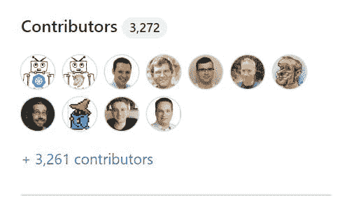
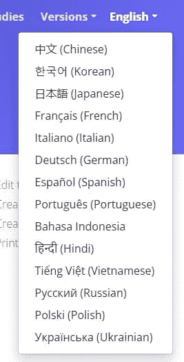
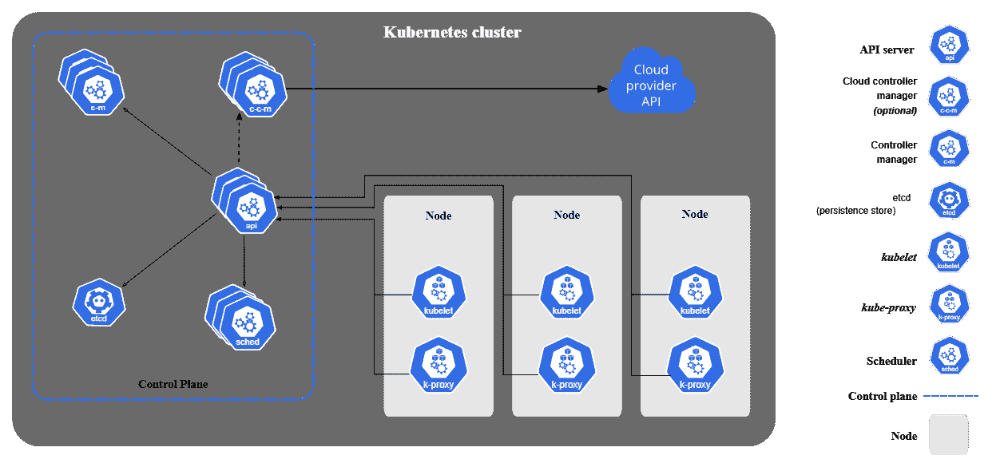
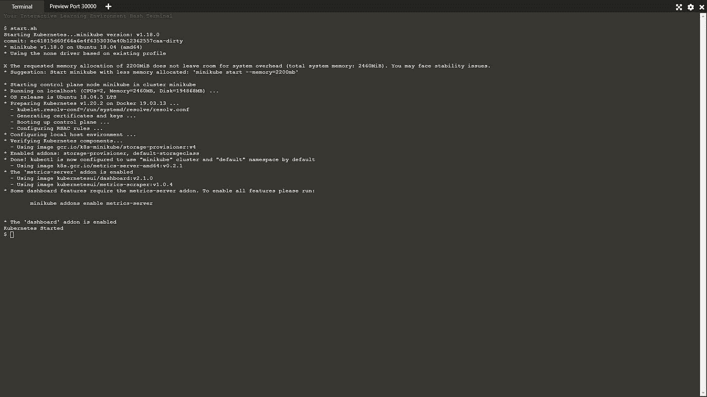
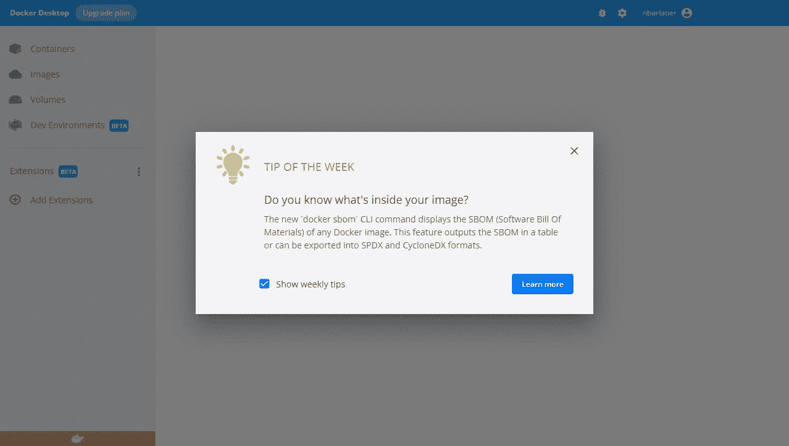
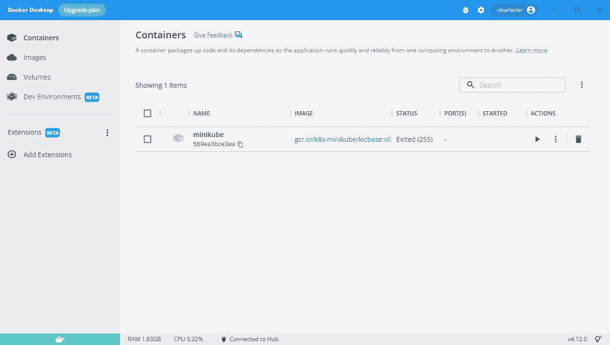
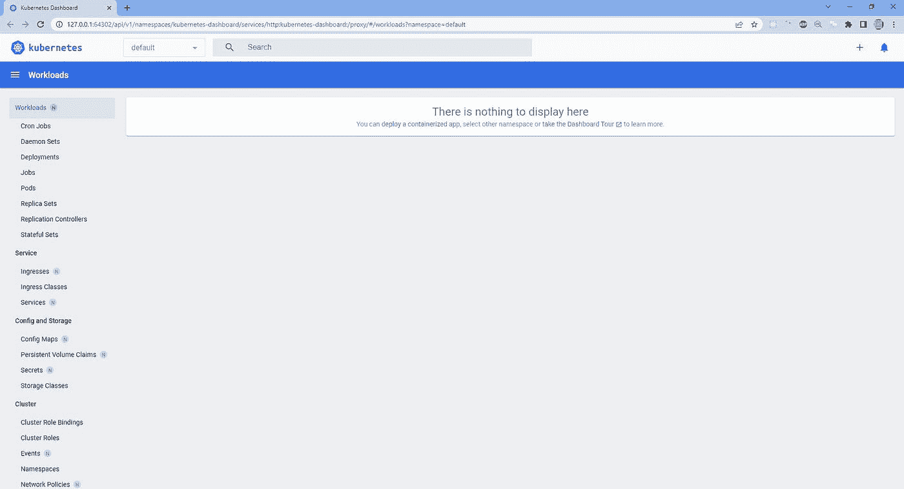
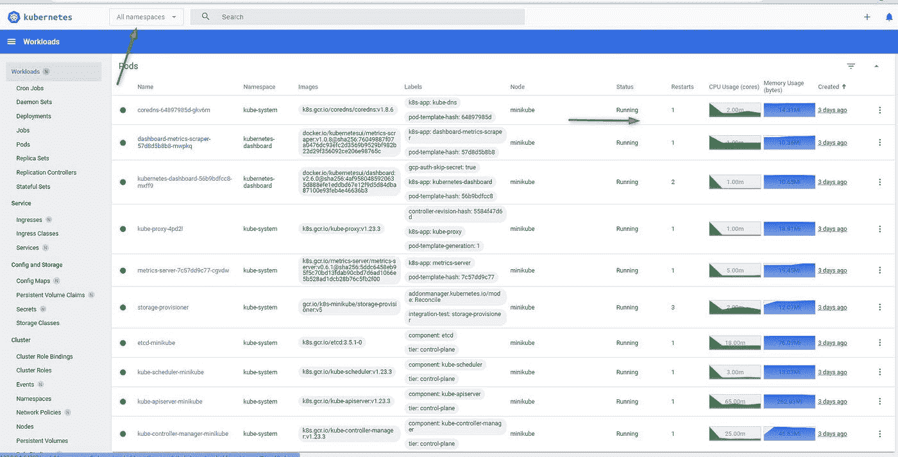

# 掌握 Kubernetes:如何开始第 1 部分

> 原文：<https://blog.devgenius.io/mastering-kubernetes-how-to-start-part-1-9150c24aa118?source=collection_archive---------12----------------------->

# 介绍

这篇文章是我们轻松学习 Kubernetes 的第一步。这条路确实很长，但很容易走。

我的文章将帮助你迈出第一步。

我们开始吧！

我们都听说过最大的 GitHub 项目之一:Kubernetes！

我们可以找到全球 Github 项目:

[GitHub Kubernetes](https://github.com/kubernetes)

我们可以通过 77 个资源库看到 64 个项目(2022 年 10 月 22 日)！刚开始，我们可能有点不知所措！

不要担心，首先我们只需要关注以下三个项目:

*   **库伯内特**(库伯内特本身)
*   **网站**(Kubernetes 文档)
*   Minikube (在本地机器上运行 Kubernetes)

我们可以在以下链接中找到 Kubernetes 框架:

[GitHub Kubernetes 框架](https://github.com/kubernetes/kubernetes)

这是一个庞大的项目，有超过 562 个版本(2022 年 10 月 22 日)和超过 3200 个贡献者:



我们可以找到官方文档:

[Kubernetes 文档](https://kubernetes.io/docs/home/)

本文档有不同的语言版本:



但是，除非你不掌握或不喜欢英语，否则你最好使用美式英语版本，因为它更容易理解。翻译并不总是好的。

即便如此，英文文档听起来并不总是那么地道，因为是一个法国人(像我一样)写的！

我们可以看到 GitHub Kubernetes 文档项目:

[GitHub Kubernetes 文档](https://github.com/kubernetes/website/)

# 如何开始？

我们转到文档欢迎页面:

[Kubernetes 欢迎页面](https://kubernetes.io/docs/home/)

我建议你从以下两部分开始:

如果你没有耐心并且知道 Kubernetes，你应该跳到教程。

# 了解 Kubernetes

如果你已经知道所有关于 Kubernetes 的理论，你可以跳过它！

## Kubernetes 概念、架构和组件

否则，当我们需要它的时候，你会在这里找到一个关于 Kubernetes 是什么，它解决了什么问题的温和介绍:[kubernetes.io/docs/concepts/overview](https://kubernetes.io/docs/concepts/overview/)

然后解释了 Kubernetes 的架构和组件:[kubernetes.io/docs/concepts/overview/compon..](https://kubernetes.io/docs/concepts/overview/components/)



## 通过 API 与 Kubernetes 通信

这一部分向我们解释了如何通过 API 与 Kubernetes 集群进行通信:直接通过 REST API 或者通过工具 Kubectl。

我们大部分时间会使用 Kubectl。例如，当我们需要创建一个监控 Kubernetes 集群的应用程序时，REST API 会很有用。

见链接[kubernetes.io/docs/concepts/overview/kubern..](https://kubernetes.io/docs/concepts/overview/kubernetes-api/)

> *大多数操作都可以通过 kubectl 命令行界面或其他命令行工具来执行，比如 kubeadm，它们反过来使用 API。然而，您也可以使用 REST 调用直接访问 API。*

最后但同样重要的是，我们需要理解我们需要处理的所有主要对象:【kubernetes.io/docs/concepts/overview/workin..

这是理论中最重要的部分，你需要完整地阅读它。写得很好，所以值得！

基本上，有两种处理 Kubernetes 对象的方法。我们需要了解他们:[kubernetes.io/docs/concepts/overview/workin..](https://kubernetes.io/docs/concepts/overview/working-with-objects/object-management/#management-techniques):

*   命令式方法:我们确切地告诉 Kubernetes API 我们想要创建什么
*   声明方式:我们在哪里表达我们的愿望，Kubernetes API 将决定如何协调我们想要的理想状态和真实的集群状态。

我们将在 95%的时间里使用第二种管理技术:通过使用文件和/或目录的声明方式。

我真的建议你看看链接[kubernetes.io/docs/concepts](https://kubernetes.io/docs/concepts/)，重点关注:

*   集群架构
*   容器
*   工作量
*   服务、负载平衡和网络

那么当你全部读完的时候，你就可以读其他的部分了。

最后，你可以阅读其他更集中的部分。一旦你掌握了其他部分，你就会需要它们。

您必须了解以下工作流程:

入口= >服务=> Pod = >容器

# 尝试 Kubernetes 与 Minikube

文章将在 Windows 11 上使用 Minikube。但在 Mac 或 Linux 上也很容易理解。

首先，官方文件在那里:[minikube.sigs.k8s.io/docs](https://minikube.sigs.k8s.io/docs/)

一旦您对什么是 Kubernetes、什么是体系结构以及它的用途有了清晰的认识，我们将一起看看如何在我们的开发机器上创建一个由单个节点组成的简单的 Kubernetes 集群。

这对于我们的开发需求来说绰绰有余。

我建议去看看:[kubernetes.io/docs/tutorials/hello-minikube](https://kubernetes.io/docs/tutorials/hello-minikube/)

我们将在 Windows 上使用 Minikube，但它在 Mac 和 Linux 上也很容易使用！

您可以在这里选择:

*   我们可以用远程环境在线测试 minikube
*   我们可以在本地安装 minikube。

如果您使用该网站，您直接在提供远程虚拟环境的网页上遵循在线说明，我们将获得:



开始时非常方便，但是我建议您在本地机器上安装 minikube，这样我们就可以在本地开发机器上工作。此外，我们可以享受 minikube 和 kubernetes 的最后版本！

我们现在将向您展示如何做到这一点。

你可以在我之前的文章中找到我们需要安装最新 Minikube 版本的所有细节，以及如何在一个节点上运行(现在我们可以在多个节点上运行)，以及如何安装 github.com/kubernetes/dashboard[和 github.com/kubernetes-sigs/metrics-server](https://github.com/kubernetes/dashboard)[的度量服务器](https://github.com/kubernetes-sigs/metrics-server)

请转到链接:

[nicolasbarlatier.hashnode.dev/net-core-tip-..](https://nicolasbarlatier.hashnode.dev/net-core-tip-2-how-to-troubleshoot-memory-leaks-within-a-net-console-application-running-in-a-linux-docker-container-in-kubernetes)

我将在此提醒主要步骤:

首先，我们需要检查您的操作系统是否能够处理虚拟化。

你需要做的就是:

你需要检查的只是 Hyper-V 需求部分。如果您在每一行都看到“是”，这意味着我们的操作系统可以处理虚拟化！

你也可以阅读链接上的说明:[kubernetes.io/fr/docs/tasks/tools/install-m..](https://kubernetes.io/fr/docs/tasks/tools/install-minikube/#tab-with-md-2)

这是法语，奇怪的是不是英语，但不难理解，这里是翻译:)

> *要检查 Windows 8 及更高版本是否支持虚拟化，请在 Windows 终端或命令提示符下运行以下命令。*
> 
> *系统信息*
> 
> *如果您得到以下输出，则 Windows 支持虚拟化。*
> 
> *Hyper-V 要求:虚拟机监控模式扩展:是在固件中启用虚拟化:是二级地址转换:是可防止数据执行:是*
> 
> *如果您看到以下输出，您的系统已经安装了虚拟机管理程序，您可以跳过下一步。*
> 
> *Hyper-V 要求:已检测到虚拟机管理程序。Hyper-V 所需的功能将不会显示。*

要启用 Hyper-V，您可以阅读:

[learn.microsoft.com/fr-fr/virtualization/hy..](https://learn.microsoft.com/fr-fr/virtualization/hyper-v-on-windows/quick-start/enable-hyper-v)

它适用于 Windows 10 企业版、专业版或教育版。

之后你会看到这条线

```
Hyper-V Requirements: A hypervisor has been detected. Features required for Hyper-V will not be displayed.
```

然后我们可以用安装程序安装 Minikube。

github.com/kubernetes/minikube/releases/dow..

然后我们只需要运行安装程序，一旦完成，我们只需要启动 Minikube！

首先，让我们看看我们可以使用的所有命令:

让我们检查一下状态:

正如你所看到的，minikube 在幕后使用 docker。但是我们没有安装和启动 docker(docker 守护进程没有运行)

我们需要首先安装 docker 桌面并启动它。

正如人们所说:

> *如果 minikube 无法启动，请查看驱动程序页面以获得设置兼容容器或虚拟机管理器的帮助。*

让我们安装 Docker 桌面:[docs.docker.com/desktop/install/windows-ins..](https://docs.docker.com/desktop/install/windows-install/)

我们可以启动 Docker 桌面后:



一旦 Docker 守护进程启动，我们就会得到:

```
λ minikube status minikube type: Control Plane host: Stopped kubelet: Stopped apiserver: Stopped kubeconfig: Stopped
```

我们可以用默认驱动程序启动 Minikube:docker

我们准备好了！我们已经安装并配置了 Kubectl，以便与一个节点的 minikube 集群进行通信。

```
λ minikube status minikube type: Control Plane host: Running kubelet: Running apiserver: Running kubeconfig: Configured
```

我们可以启用两个附加组件:

```
λ minikube addons enable metrics-server λ minikube addons enable dashboard
```

最后，我们得到以下附加组件列表:

让我们用仪表板检查一下我们的集群:

```
λ minikube dashboard * Verifying dashboard health ... * Launching proxy ... * Verifying proxy health ... * Opening http:
```



让我们检查“所有名称空间”,我们可以检查我们可以从 metrics server 中看到所有对象，如 pod 及其资源(内存、cpu)使用情况图表！



让我们检查本地 kubectl 是否配置为使用 minikube 节点:

```
λ kubectl config current-context minikube
```

让我们检查一下，我们有一个单一节点:

```
λ kubectl get nodes NAME STATUS ROLES AGE VERSION minikube Ready control-plane,master 3d22h v1.23 .3
```

最后，让我们获得节点的所有名称空间的所有资源:

我们还没有准备好在本地机器上使用 Kubernetes。

# 结论

这是我们学习 Kubernetes 路线图的第一步。我希望它是有用的，如果你喜欢它，请订阅并给它一个掌声:)再次感谢阅读这篇文章！

*最初发布于*[*https://nicolasbarlatier . hash node . dev*](https://nicolasbarlatier.hashnode.dev/mastering-kubernetes-how-to-start-part-1)*。*