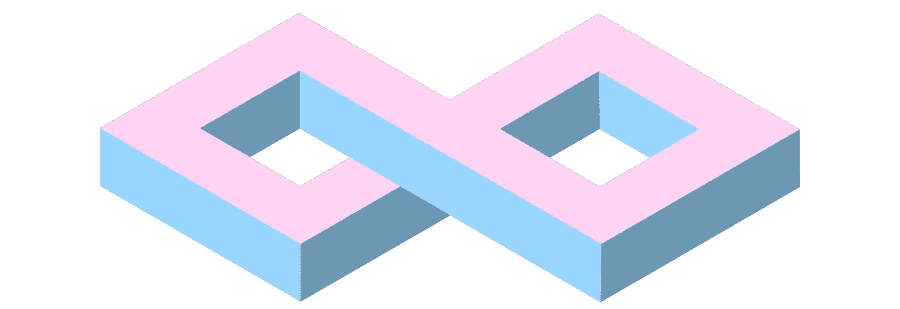
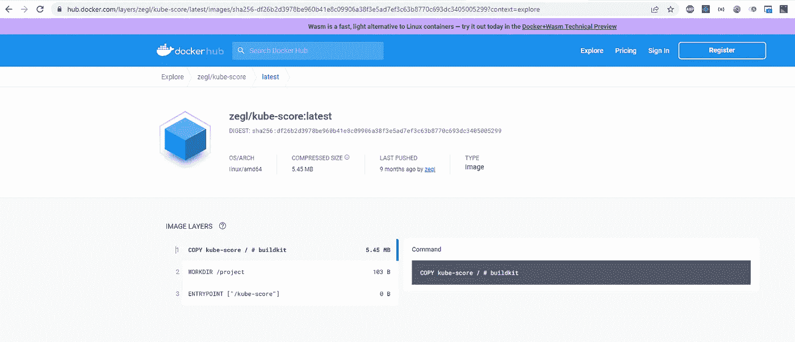

# 掌握 Kubernetes:如何验证 Kubernetes YAML 文件第 3 部分

> 原文：<https://blog.devgenius.io/mastering-kubernetes-how-to-validate-kubernetes-yaml-files-part-3-964ec40100a?source=collection_archive---------5----------------------->



库贝分数

# 介绍

在使用我们的工具 Kubectl 发送我们的工作负载 YAML 文件之前，我们需要确保我们遵循了这些文件中的最佳设置和实践。

我们需要一个工具来帮助我们检查和验证我们的 YAML 文件。

今天我们将关注 kube-score，这是一个对 Kubernetes 对象定义执行静态代码分析的工具。正是我们需要的！

# Kube-Score 怎么用？

像往常一样，我们有几个选项来安装工具

*   命令行工具
*   码头工人

我们将首先使用 Docker 选项，因为它非常简单:)

我们可以在链接中找到 docker 图片

[](https://github.com/zegl/kube-score) [## GitHub-zegl/kube-score:Kubernetes 对象分析，提供提高可靠性的建议…

### kube-score 是一个对 Kubernetes 对象定义进行静态代码分析的工具。输出是一个列表…

github.com](https://github.com/zegl/kube-score)  [## 码头枢纽

### 编辑描述

hub.docker.com](https://hub.docker.com/r/zegl/kube-score/) 

我们所需要的是拉码头形象与:

```
docker pull zegl/kube-score
```

我们开始吧！

```
λ docker pull zegl/kube-score
Using default tag: latest
latest: Pulling from zegl/kube-score
1b9df04e6215: Pull complete
3e6314b120ac: Pull complete
Digest: sha256:df26b2d3978be960b41e8c09906a38f3e5ad7ef3c63b8770c693dc3405005299
Status: Downloaded newer image for zegl/kube-score:latest
docker.io/zegl/kube-score:latest
```

我们可以查看我们的本地回购:

```
λ docker images                                                                              
REPOSITORY                             TAG               IMAGE ID       CREATED        SIZE  
zegl/kube-score                        latest            6afa21f585fe   8 months ago   18.8MB
```

我们可以看到它非常小。

现在我们已经运行了 Minikube 集群，我们已经用 docker 安装了 YAML 文件验证器，我们如何创建我们的第一个工作负载 YAML 部署文件并验证它呢？

让我们看看！

# 工作量 YAML 部署文件创建和验证

为了方便地为 Kubernetes 创建一个简单的工作负载 YAML 部署文件，我们可以使用带有 create 命令的 Kubectl 工具。

```
 kubectl create deployment mydeployment --image=myimage --dry-run=client -o yaml > mydeployment.yaml 
```

我们只是将部署 YAML 文件通过管道传输到一个名为 mydeployment.yaml 的文件中，其中有一个假的 docker 映像“myimage ”,这只是一个例子。

我们不会运行这个部署，我们只是用 kube-score 来验证它！

让我们看看 YAML 文件的内容:mydeployment.yaml

```
λ cat mydeployment.yaml
apiVersion: apps/v1
kind: Deployment
metadata:
  creationTimestamp: null
  labels:
    app: mydeployment
  name: mydeployment
spec:
  replicas: 1
  selector:
    matchLabels:
      app: mydeployment
  strategy: {}
  template:
    metadata:
      creationTimestamp: null
      labels:
        app: mydeployment
    spec:
      containers:
      - image: myimage
        name: myimage
        resources: {}
status: {}
```

我们可以看到虚拟 docker 图像:myimage，其余的都是标准的。

让我们使用 docker 和 kube-score 来验证我们的 YAML 文件:

```
λ docker run -v %cd%:/project zegl/kube-score:latest score mydeployment.yaml
apps/v1/Deployment mydeployment                                               �
    [CRITICAL] Container Resources
        · myimage -> CPU limit is not set
            Resource limits are recommended to avoid resource DDOS. Set
            resources.limits.cpu
        · myimage -> Memory limit is not set
            Resource limits are recommended to avoid resource DDOS. Set
            resources.limits.memory
        · myimage -> CPU request is not set
            Resource requests are recommended to make sure that the application
            can start and run without crashing. Set resources.requests.cpu
        · myimage -> Memory request is not set
            Resource requests are recommended to make sure that the application
            can start and run without crashing. Set resources.requests.memory
    [CRITICAL] Container Image Tag
        · myimage -> Image with latest tag
            Using a fixed tag is recommended to avoid accidental upgrades
    [CRITICAL] Container Security Context ReadOnlyRootFilesystem
        · myimage -> Container has no configured security context
            Set securityContext to run the container in a more secure context.
    [CRITICAL] Container Ephemeral Storage Request and Limit
        · myimage -> Ephemeral Storage limit is not set
            Resource limits are recommended to avoid resource DDOS. Set
            resources.limits.ephemeral-storage
    [CRITICAL] Pod NetworkPolicy
        · The pod does not have a matching NetworkPolicy
            Create a NetworkPolicy that targets this pod to control who/what
            can communicate with this pod. Note, this feature needs to be
            supported by the CNI implementation used in the Kubernetes cluster
            to have an effect.
    [CRITICAL] Container Security Context User Group ID
        · myimage -> Container has no configured security context
            Set securityContext to run the container in a more secure context.
```

让我们解释一下这个命令:

```
docker run -v %cd%:/project zegl/kube-score:latest score mydeployment.yaml
```

我们在直接链接中找到了 docker 命令:[https://github.com/zegl/kube-score#example-with-docker](https://github.com/zegl/kube-score#example-with-docker)

[](https://github.com/zegl/kube-score#example-with-docker) [## GitHub-zegl/kube-score:Kubernetes 对象分析，提供提高可靠性的建议…

### kube-score 是一个对 Kubernetes 对象定义进行静态代码分析的工具。输出是一个列表…

github.com](https://github.com/zegl/kube-score#example-with-docker) 

据说是这样运行的，例如:

```
docker run -v $(pwd):/project zegl/kube-score:latest score my-app/*.yaml
```

Well $(pwd)确实能在 Linux/Mac 或 Powershell 上工作，如果你使用 Windows ms-dos 我们必须使用 **%cd%** 来代替。

我们可以看到，我们需要一个卷来绑定到容器内的工作区**/项目**，所以我们保留这个目录，以便 kube-score 可以找到我们的 YAML 文件。

我们可以用 docker 图像层检查这一点，我们可以看到**工作目录确实是:/project。**



我认为文档应该更好地强调这一点。我徒劳地尝试使用-v % CD %/usr/tmp，它说:

```
Failed to score files: open mydeployment.yaml: no such file or directory
```

记得去 docker hub 里看看，之前查过 docker 图片图层，很有用！

然后我们通过参数 **score** 告诉 kube-score 给我们的 YAML 文件打分。

我们可以看到我们的 YAML 文件是无效的，有许多关键点需要解决。

*   我们应该首先对 CPU、内存提出请求/限制。
*   然后，我们需要给 docker 图像添加一个标签，并避免使用“最新的”默认标签。
*   必须设置容器安全上下文

我们应该阅读 Kube-Score 的文档以获得更多信息。

下面我们可以找到检查列表

[](https://github.com/zegl/kube-score/blob/master/README_CHECKS.md) [## kube-score/README _ checks . MD at master zegl/kube-score

### Kubernetes 对象分析及提高可靠性和安全性的建议- kube-score/README_CHECKS.md 位于…

github.com](https://github.com/zegl/kube-score/blob/master/README_CHECKS.md) 

或者我们可以运行:

```
λ docker run zegl/kube-score:latest list
ingress-targets-service,Ingress,Makes sure that the Ingress targets a Service,default
cronjob-has-deadline,CronJob,Makes sure that all CronJobs has a configured deadline,default
container-resources,Pod,Makes sure that all pods have resource limits and requests set. The --ignore-container-cpu-limit flag can be used to disable the requirement of having a CPU limit,default
container-resource-requests-equal-limits,Pod,Makes sure that all pods have the same requests as limits on resources set.,optional
container-cpu-requests-equal-limits,Pod,Makes sure that all pods have the same CPU requests as limits set.,optional
container-memory-requests-equal-limits,Pod,Makes sure that all pods have the same memory requests as limits set.,optional
container-image-tag,Pod,Makes sure that a explicit non-latest tag is used,default
container-image-pull-policy,Pod,Makes sure that the pullPolicy is set to Always. This makes sure that imagePullSecrets are always validated.,default
container-ephemeral-storage-request-and-limit,Pod,Makes sure all pods have ephemeral-storage requests and limits set,default
container-ephemeral-storage-request-equals-limit,Pod,Make sure all pods have matching ephemeral-storage requests and limits,optional
container-ports-check,Pod,Container Ports Checks,optional
statefulset-has-poddisruptionbudget,StatefulSet,Makes sure that all StatefulSets are targeted by a PDB,default
deployment-has-poddisruptionbudget,Deployment,Makes sure that all Deployments are targeted by a PDB,default
poddisruptionbudget-has-policy,PodDisruptionBudget,Makes sure that PodDisruptionBudgets specify minAvailable or maxUnavailable,default
pod-networkpolicy,Pod,Makes sure that all Pods are targeted by a NetworkPolicy,default
networkpolicy-targets-pod,NetworkPolicy,Makes sure that all NetworkPolicies targets at least one Pod,default
pod-probes,Pod,Makes sure that all Pods have safe probe configurations,default
container-security-context-user-group-id,Pod,Makes sure that all pods have a security context with valid UID and GID set ,default
container-security-context-privileged,Pod,Makes sure that all pods have a unprivileged security context set,default
container-security-context-readonlyrootfilesystem,Pod,Makes sure that all pods have a security context with read only filesystem set,default
container-seccomp-profile,Pod,Makes sure that all pods have at a seccomp policy configured.,optional
service-targets-pod,Service,Makes sure that all Services targets a Pod,default
service-type,Service,Makes sure that the Service type is not NodePort,default
stable-version,all,Checks if the object is using a deprecated apiVersion,default
deployment-has-host-podantiaffinity,Deployment,Makes sure that a podAntiAffinity has been set that prevents multiple pods from being scheduled on the same node. https://kubernetes.io/docs/concepts/configuration/assign-pod-node/,default
statefulset-has-host-podantiaffinity,StatefulSet,Makes sure that a podAntiAffinity has been set that prevents multiple pods from being scheduled on the same node. https://kubernetes.io/docs/concepts/configuration/assign-pod-node/,default deployment-targeted-by-hpa-does-not-have-replicas-configured,Deployment,Makes sure that Deployments using a HorizontalPodAutoscaler doesn't have a statically configured replica count set,default
statefulset-has-servicename,StatefulSet,Makes sure that StatefulSets have an existing headless serviceName.,default
deployment-pod-selector-labels-match-template-metadata-labels,Deployment,Ensure the StatefulSet selector labels match the template metadata labels.,default
statefulset-pod-selector-labels-match-template-metadata-labels,StatefulSet,Ensure the StatefulSet selector labels match the template metadata labels.,default
label-values,all,Validates label values,default
horizontalpodautoscaler-has-target,HorizontalPodAutoscaler,Makes sure that the HPA targets a valid object,default
```

# 结论

例如，在我们的工作负载部署到集群之前，我们可以在 CI/CD 工具中使用这个 kube-score 和 docker。只要我们有临界点要解决，YAML 就不应该适用于我们的集群！