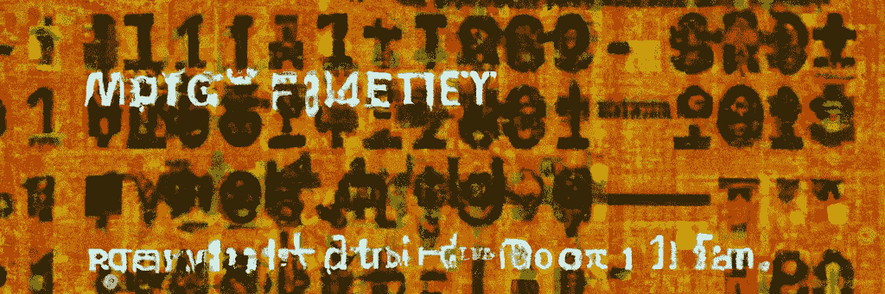

# 在 Rust 中掌握模式匹配🦀

> 原文：<https://blog.devgenius.io/mastering-pattern-matching-in-rust-e2f5e2776b36?source=collection_archive---------1----------------------->



## 💡停止纠结于杂乱的代码，开始掌握 Rust 中的模式匹配艺术吧！💪

Rust 中的模式匹配是 Rust 程序中处理数据和控制流的强大工具。有了模式匹配，我们可以轻松地分解数据并将变量绑定到我们想要使用的数据部分。这在处理复杂的数据结构(如枚举和结构)时特别有用。在本文中，我们将探索 rust 中模式匹配的一些关键特性，并了解如何使用它们来编写简洁优雅的 Rust 代码。

## 基础知识

首先，让我们看一个简单的模式匹配的例子。这里，我们有一个函数，它接受一个包含整数和字符串的元组作为参数。该函数利用模式匹配来分解元组，并将整数绑定到名为`x`的变量，将字符串绑定到名为`y`的变量。然后将`x`和`y`的值打印到控制台。

```
fn main() {
    let point = (3, "hello");

    match point {
        (x, y) => println!("x: {}, y: {}", x, y),
    }
}
```

当我们运行上面的代码时，它会将`x: 3, y: hello`打印到控制台，显示`x`和`y`已经成功绑定到元组中的值。这是模式匹配的基本语法，但是还有许多其他的特性和技术可以用来使我们的代码更具可读性。

## 模式匹配中的防护

Rust 中模式匹配的一个关键特性是能够使用 guards 为我们的匹配添加条件逻辑。保护是添加在匹配臂中的模式之后的表达式，它指定了选择该臂所必须满足的条件。如果条件不满足，将尝试下一个臂。类似于 switch 语句，但不完全是，因为它为我们提供了额外的功能来确保检查本身的安全性。

以下代码显示了保护模式

```
fn main() {
    let point = (3, "hello");

    match point {
        (x, y) if x > 2 => println!("x is greater than 2"),
        (x, y) => println!("x is not greater than 2"),
    }
}
```

在上面的代码中，匹配的第一个分支有一个检查`x`是否大于 2 的保护。如果条件满足，将执行该臂中的代码。如果条件不满足，将尝试第二个臂。

守卫可以用来为我们的匹配添加各种各样的条件逻辑，它们可以使我们的代码更具表现力。例如，我们可以使用它们来检查特定的值，检查值的类型，或者检查任何其他可以使用 Rust 强大的表达式和操作符来表达的条件。

## 间隔

Rust 中模式匹配的另一个强大功能是在单个匹配臂中使用多个模式的能力。这被称为模式交替，它允许我们为单个手臂指定多个可能的模式，由`|`操作符分隔。如果有任何模式与被匹配的值相匹配，该 arm 中的代码将被执行。

```
fn main() {
    let point = (3, "hello");

    match point {
        (x, "hello") | (x, "world") => println!("x is {}", x),
        _ => (),
    }
}
```

在上面的代码中，匹配的第一个分支有两个由`|`操作符分隔的模式。这些模式匹配一个包含整数和字符串`"hello"`或字符串`"world"`的元组。如果`point`的值与这些模式中的任何一个匹配，该 arm 中的代码将被执行，并将`x is 3`打印到控制台。如果`point`的值与这些模式中的任何一个都不匹配，默认 arm 中的代码(由`_`模式指示)将被执行，并且它什么也不做。

模式交替是匹配复杂数据结构的强大工具，它可以帮助我们编写更简洁的代码。当它与 guardss 结合使用时特别有用，guard 允许我们向模式中添加条件逻辑。例如，我们可以根据匹配数据的类型或值，同时使用模式交替和保护来匹配不同的值集。

## 一些高级概念

除了我们到目前为止所讨论的特性，Rust 中的模式匹配还有许多其他高级功能，我们可以用它们来编写功能强大且富有表现力的代码。例如，我们可以使用模式匹配来分解复杂的数据结构，如枚举和结构，匹配值的范围，匹配引用，以及将变量绑定到更大模式中的子模式。

```
#[derive(Debug)]
enum Shape {
    Circle { radius: f32 },
    Rectangle { width: f32, height: f32 },
}

fn main() {
    let shape = Shape::Circle { radius: 3.0 };

    match shape {
        Shape::Circle { radius } if radius > 2.0 => {
            println!("large circle with radius {}", radius)
        },
        Shape::Circle { radius } => println!("small circle with radius {}", radius),
        Shape::Rectangle { width, height } => println!("rectangle with width {} and height {}", width, height),
    }
}
```

在上面的代码中，我们定义了一个名为`Shape`的枚举来表示不同的几何形状。我们还定义了一个使用模式匹配来分解`Shape`枚举的匹配。匹配的第一个臂使用模式交替和保护来匹配一个半径大于 2.0 的`Shape::Circle`，并向控制台打印一条消息。第二个臂匹配一个任意半径的`Shape::Circle`，它也向控制台打印一条消息。第三个臂与一个`Shape::Rectangle`相匹配，它打印一个具有矩形宽度和高度的信息。

上面的代码展示了 Rust 中的模式匹配如何用于处理复杂的数据结构，以及如何为我们的匹配添加强大的条件逻辑。通过结合这些特性，我们可以编写出富有表现力、简洁且易于理解的代码。

## 结论

最后，值得一提的是，Rust 中的模式匹配不仅仅是针对`if` / `else`链或`switch`语句的语法糖。不像那些简单地匹配一些表达式的控制流结构，模式匹配是一个强大的表达工具，它被深深地集成到语言中。这意味着我们可以在许多不同的上下文中使用模式匹配，而不仅仅是在`match`表达式中。我们可以在函数签名中使用模式匹配来分解参数，在`let`语句中使用模式匹配来绑定变量，在`for`循环中使用模式匹配来迭代集合。

下面的代码片段展示了模式匹配的一些其他用途

```
fn main() {
    let point = (3, "hello");

    // Destructure a tuple in a function signature
    let print_point = |(x, y)| println!("x: {}, y: {}", x, y);
    print_point(point);

    // Bind variables using pattern matching in a `let` statement
    let (x, y) = point;
    println!("x: {}, y: {}", x, y);

    // Iterate over a collection using pattern matching in a `for` loop
    let points = vec![(3, "hello"), (5, "world"), (1, "foo")];
    for (x, y) in points {
        println!("x: {}, y: {}", x, y);
    }
}
```

在上面的代码中，我们在函数签名中使用模式匹配来分解元组，在`let`语句中使用模式匹配来绑定变量，在`for`循环中使用模式匹配来迭代集合。这显示了 Rust 中的模式匹配如何在许多不同的上下文中使用，以使我们的代码更加简洁和有表现力