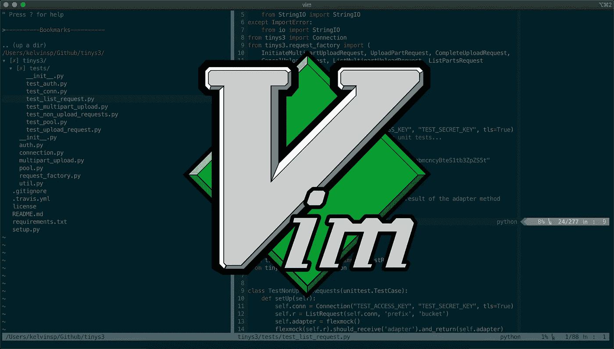
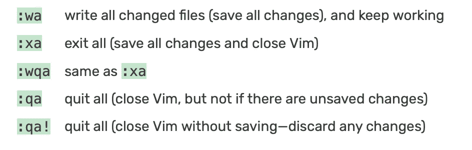
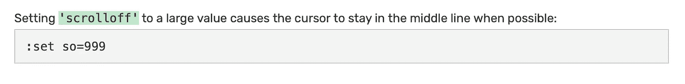
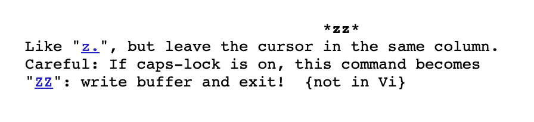
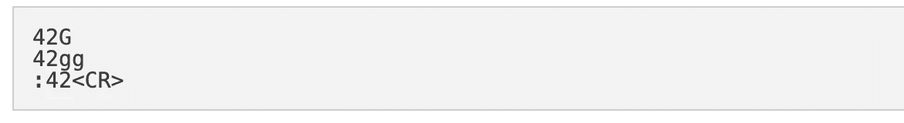

# 掌握 Vim 的艺术:改善你的书呆子气的五个技巧

> 原文：<https://blog.devgenius.io/mastering-the-art-of-vim-five-tips-to-improve-your-nerdiness-137ed3519ea4?source=collection_archive---------0----------------------->

1991 年，布莱姆·米勒着手开发一个增强的文本编辑器，它将提供一个全面集成的帮助系统、扩展的正则表达式、脚本语言和一个可选的图形用户界面。在为谷歌抛弃开源社区之前，Bram 发布了 Vim，它很快被称为“程序员的文本编辑器”。Vim，或 Vi 改进版，在 Linux 用户最喜爱的文本编辑器列表中迅速攀升，在 2006 年被 *Linux Journal* 读者选为最受欢迎的编辑器。这种成功一直持续到 2015 年，在那里 *Stack Overflow* 用户将 Vim 列为第三大最受欢迎的编辑器，并在 2019 年成为第五大最受欢迎的开发环境。虽然随着 sublime text 和 nano 等编辑器进入市场，Vim 在未来的流行程度在社区中仍有争议，但共识仍然是 Vim 为用户提供了一个强大的开发环境。如何利用 Vim 的力量来协助日常开发和任务？这里有五个有用的提示和技巧来改善你的乏味，并有效地遍历文本文档和代码:

# 5.一次保存所有打开的文档

Vim 可以打开多个文件，每个文件都在自己的缓冲区中。要保存多个文档并继续工作，或保存所有更改并退出 Vim，只需使用 *:wa 到*保存所有更改并继续工作。要退出全部，保存更改，并关闭 Vim，请使用 *:xa。*

# 4.将光标放在屏幕中央

当滚动或搜索一个大文件时，将光标线放在屏幕的中间或窗口的垂直中心会很方便。这篇技巧介绍了 *scrolloff* 选项，并展示了使用 *zz* 命令的另一种可能的技术。

# 3.显示并导航到行号

有时在左边显示行号很有用，以供参考。为此，使用*:设定编号*或*:设定 nu。*要禁用，使用*:设置编号*或*:设置 nonu* 。要导航到特定的行，至少有三种不同的方法(例如第 42 行)。

# 2.去除压痕，方便粘贴

在启用自动缩进的情况下，将文本粘贴到运行 Vim 的终端会破坏粘贴文本的缩进。这篇技巧展示了如何避免这个问题。

# 1.在插入模式下删除

要在插入模式下删除字符、单词或行，有几个快捷方式可以删除字符、单词和行！

我希望这些提示和技巧能帮助您有效地遍历文档和操作数据！

:wq！