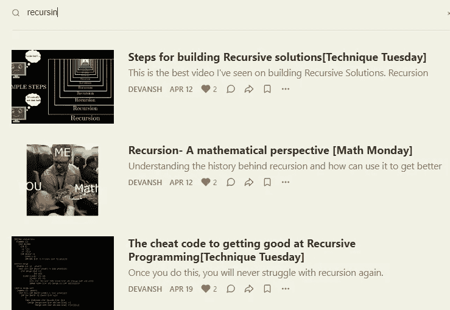
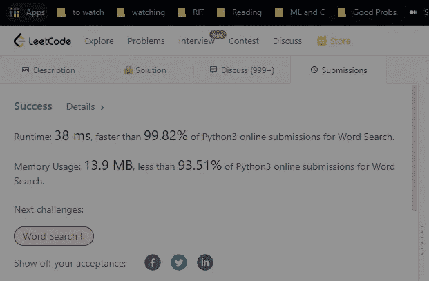
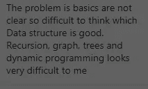
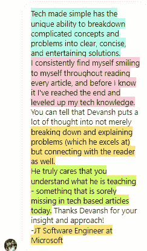
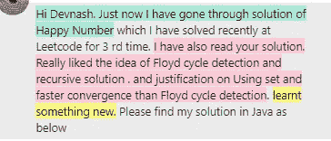

# 掌握信念的递归跳跃

> 原文：<https://blog.devgenius.io/mastering-the-recursive-leap-of-faith-9c0db5e47895?source=collection_archive---------8----------------------->

## 对于任何努力学习递归编程的人来说，这将会给你很大的帮助

为了帮助我了解您[请填写此调查(匿名)](https://forms.gle/7MfQmKhEhyBTMDUD7)

递归是大多数软件开发人员/程序员要处理的最棘手的话题之一。如果你是一个尝试了又尝试，但总是与递归斗争的程序员，我有一个非常有趣的技巧给你。这种技术可以应用于所有的递归编程，并且总是有效的(至少对于提出暴力解决方案来说)。我的这位了不起的朋友称之为**信念的递归跳跃。**



确保你们也阅读了所有其他递归帖子。会让你刀枪不入。递归理论被很多人忽视了。[找到这里](https://codinginterviewsmadesimple.substack.com/archive?sort=search&search=recursion)

我知道听起来我承诺了很多。但是相信我，这是值得的。让我们开始吧。

# 亮点

这篇文章将涵盖以下观点-

1.  **什么是信念的递归跳跃**？-简单地说，我们假设我们的递归调用将完全按照预期的那样工作。
2.  **这是如何工作的** -如果你通读了我介绍的递归理论，你会知道递归问题可以通过将问题分解成基本情况和递归步骤来解决。《信仰的飞跃》涵盖了后者。
3.  **擅长这项技术**——练习。我知道很震惊。

听起来你会感兴趣吗？让我们尽情享受吧。

# 这项技术

这项技术看似简单。简单地说，和所有递归一样，我们计算出基本情况。一旦我们创建了它们，我们就接受递归案例，然后用更新的参数调用我们的递归函数。到目前为止，很明显。我承诺的魔法在哪里？

*信念跳跃法是假设我们正在编写的方法/函数已经起作用了*。因此，如果我们在一个图上创建一个递归调用，我们将假设这个函数已经为子图工作了。

你们中的一些人可能感到有些困惑，所以让我们来看几个例子。

# 树递归的深度

让我们从小处着手。这是经典的递归问题。

```
def depthT(node, depth){

if node is null: #base case
  return depth else:
   return max(depthT(node.left, depth+1), depthT(node.right, depth+1))
}
```

注意我们是如何隐含地假设 depthT 函数将对所有子树起作用的？

你可能不相信，因为这是一个简单的例子。让我们把事情提高一个档次。

# 单词搜索

上周，我们讨论了单词搜索问题。这是很多技术面试的宠儿。让我们通过我们神奇技术的镜头来看看基线解。简而言之，假设我们只能从彼此相邻的单元格中提取字符，我们希望找出一个单词是否存在于我们的网格中。我们不能重复同一个单元格中的内容，每个单词只能重复一次。


确保你不会错过任何一个解决方案。

我们的 dfs 解决方案有几个基本案例。它们是当我们出界，已经访问了棋盘上的一个单元格，或者知道我们当前的单元格与我们要求的索引中的字符不匹配。

```
if r<0 or r>=len(board) or c<0 or c>=len(board[0]):
                return False
            if board[r][c]!=word[idx] or (r,c) in visited:
                return False
```

接下来，我们知道，如果我们的索引与我们想要的字符串的长度相同，并且我们没有达到已经提到的条件，我们就找到了匹配。

```
if idx == len(word)-1:
                return True
```

这些是我们经历的边缘情况。如果输入已经经历了这些边缘情况，并且没有触发它们，我们知道它是下面的模型

1.  到目前为止，我们还没有越界或重复这个组合中的单元格。
2.  到目前为止，我们创建的字符串是目标字符串的严格子字符串。

现在是我们可以跨越信仰的时候了。看你能不能找到它-

```
for dr,dc in neighbors:
                nr,nc = r+dr, c+dc
                if dfs( idx+1, nr, nc):
                    return True
```

简单地说，我们假设 dfs 遍历将适用于图的其余部分和剩余的子串。



仅供参考，我分享的这个问题的最终解决方案比平均速度快得多。使用它获得非凡的结果。

我可以继续下去，但我不想让这封邮件太长。幸运的是，我们已经用递归解决了很多问题。浏览它们，看看它们都是如何含蓄地运用信仰的飞跃。如果你仍然不相信，在网上浏览任何递归解决方案，你会发现信念的递归跳跃是存在的。

# 为什么会这样

既然您已经知道了它的工作原理，那么让我们花一点时间来讨论为什么这是一个如此强大的技术。**简单来说，** [**信念的递归跳跃是基于递归解**](https://codinginterviewsmadesimple.substack.com/p/recursion-a-mathematical-perspective?s=w) 的归纳性质。这些花哨的词语是什么意思？

请注意，在信念的跳跃中，我们假设我们的函数将为我们的子问题工作。当我们的递归问题被调用到子问题时，我们有两个选择-

1.  我们找到了一个基本案例。假设它们构造得很好，我们的程序以适当的结果终止。
2.  我们遇到了递归的情况，我们的假设再次生效。这次是子问题。这个过程会一直进行到我们找到一个基本案例。

如果你一直是个好男孩/好女孩/非二进制/什么的，读到推荐的帖子，你就知道这和数学归纳法为什么管用的逻辑差不多。因此递归解的归纳性质。



注意所有这些都是基于递归问题解决的。

实际上，这种方法会大大减少你的过度思考。人们与递归的斗争有一半是因为他们在解决问题时无法获得清晰性。实现信念的飞跃会给你一个明确的方向，让你更快地解决问题。

# 越来越擅长这项技术

那么，你怎样才能掌握这种神奇的技术呢？该是新闻简报无聊部分的时间了-练习。为了充分利用你所经历的问题，[在这里使用这种格式](https://medium.com/geekculture/the-4-step-method-my-students-use-to-maximize-leetcode-problems-and-ace-their-faang-interviews-2d5e0a6b1538)。

记住，编码面试是一种技能。解决 Leetcode 风格问题是一项技能。你必须投入工作来掌握这些技能。你不必做每个 Leetcode 专家在线推荐的 500 多个问题，但你确实需要一些来提高基线舒适度。


相信过程，你就会成功。

好的一面是这种技术只需要很少的额外努力。当你在网上讨论递归问题时，只需要花些时间明确地把它分解成基本情况和信念的跳跃。本来这样会觉得很慢很别扭。随着你变得更好，你将能够快速完成这个过程。

以上是我的简讯[中的一段，由简单的](https://codinginterviewsmadesimple.substack.com/)技术采访组成。更多此类高水平的免费分析，请查看。时事通讯不需要名字，不需要个人信息。只有你的邮件。而且没有垃圾邮件。永远不会。


对于机器学习来说，结合软件工程、数学和计算机科学的基础至关重要。它将帮助你概念化，建立和优化你的 ML。我的每日时事通讯，[Technology interview simpled](https://codinginterviewsmadesimple.substack.com/)涵盖了算法设计、数学、最近的科技事件、软件工程等主题，让你成为更好的开发人员。 [**我目前正在进行一整年的八折优惠，一定要去看看。**](https://codinginterviewsmadesimple.substack.com/subscribe?coupon=1e0532f2)



我创造了[技术面试，利用通过指导多人进入顶级科技公司而发现的新技术，使面试变得简单](https://codinginterviewsmadesimple.substack.com/)。时事通讯旨在帮助你成功，避免你在 Leetcode 上浪费时间。我有一个 100%满意的政策，所以你可以尝试一下，没有任何风险。[你可以在这里阅读常见问题并了解更多信息](https://codinginterviewsmadesimple.substack.com/p/faqs-and-about-this-newsletter?r=4tnbw&s=w&utm_campaign=post&utm_medium=web)



如果你也有任何有趣的工作/项目/想法给我，请随时联系我。总是很乐意听你说完。

以下是我的 Venmo 和 Paypal 对我工作的金钱支持。任何数额都值得赞赏，并有很大帮助。捐赠解锁独家内容，如论文分析、特殊代码、咨询和特定辅导:

https://account.venmo.com/u/FNU-Devansh

贝宝:[paypal.me/ISeeThings](https://www.paypal.com/paypalme/ISeeThings)

# 向我伸出手

使用下面的链接查看我的其他内容，了解更多关于辅导的信息，或者只是打个招呼。另外，查看免费的罗宾汉推荐链接。我们都得到一个免费的股票(你不用放任何钱)，对你没有任何风险。**所以不使用它只是失去免费的钱。**

查看我在 Medium 上的其他文章。:[https://rb.gy/zn1aiu](https://rb.gy/oaojch)

我的 YouTube:[https://rb.gy/88iwdd](https://rb.gy/88iwdd)

在 LinkedIn 上联系我。我们来连线:[https://rb.gy/m5ok2y](https://rb.gy/f7ltuj)

我的 insta gram:[https://rb.gy/gmvuy9](https://rb.gy/gmvuy9)

我的推特:[https://twitter.com/Machine01776819](https://twitter.com/Machine01776819)

如果你正在准备编码/技术面试:[https://codinginterviewsmadesimple.substack.com/](https://codinginterviewsmadesimple.substack.com/)

获得罗宾汉的免费股票:[https://join.robinhood.com/fnud75](https://join.robinhood.com/fnud75/)