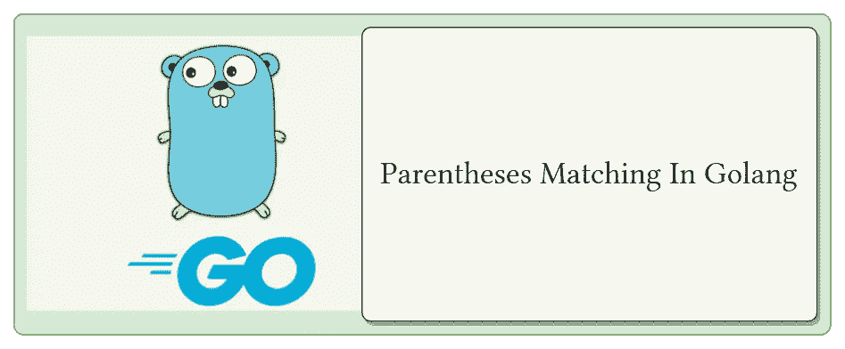

# 匹配括号 1.0 版

> 原文：<https://blog.devgenius.io/matching-parentheses-cb03bb3d7f8d?source=collection_archive---------6----------------------->

## 用通配符匹配左括号和右括号



# 问题陈述

给定一个只包含三种类型字符的字符串`s`:`'('`、`')'`和`'*'`，如果`s`有效，则返回`true`。

## 情况

1.  任何左括号`'('`都必须有相应的右括号`')'`。
2.  任何右括号`')'`都必须有相应的左括号`'('`。
3.  左括号`'('`必须在相应的右括号`')'`之前。
4.  `'*'`可被视为单个右括号`')'`或单个左括号`'('`或空字符串`""`。

# 解决办法

这里我们推导出了一个两相解。

## 第一阶段

我们将用所需的括号替换星号。

*   为了实现这一点，如果`)`括号的计数大于另一个，我们将用`(`替换`*`。
*   否则我们就用`(`代替。
*   如果左括号和右括号的数量相等，则用空字符串`""`替换`*`。

## 第二期

更换星号`*`后，我们将使用 stack 检查配对支架。如果在分析完字符串中的所有字符后，堆栈为空，则认为它是一个有效的字符串。

# 密码

> 注意:*我们使用了堆栈数据结构，这超出了本文的范围。* [*查看本文*](https://medium.com/@s.gaur/stack-in-golang-a4b4ee21c606) *以了解 golang 中堆栈实现的概况。*

```
/*
 * Q.Given a string s containing only three types of characters: 
 *   '(', ')' and '*', return true if s is valid.
 *   The following rules define a valid string:
 * - Any left parenthesis '(' must have a corresponding right parenthesis ')'.
 * - Any right parenthesis ')' must have a corresponding left parenthesis '('.
 * - Left parenthesis '(' must go before the corresponding right parenthesis ')'.
 * - '*' could be treated as a single right parenthesis ')' 
 *   or a single left parenthesis '(' 
 *   or an empty string "".
 */

package array

import (
    ds "dsa/datastructures"
    "fmt"
)
```

## 递归函数

所提供的解决方案的两个阶段都适用于此功能

```
func getStarReplacedString(closingBracketCount, openingBracketCount, countStar int, front, raw string) (int, int, string) {
    if len(raw) == 0 {
        return closingBracketCount, openingBracketCount, raw
    }
    head := string(raw[0])
    // Phase-I
    if head == "(" {
        openingBracketCount++
    } else if head == ")" {
        closingBracketCount++
    } else {
        countStar++
    }
    // fmt.Printf("%2v %2v %2v %v %v\n", closingBracketCount, openingBracketCount, countStar, head, b)
    // Recursive Call
    closingBracketCount, openingBracketCount, processed := getStarReplacedString(closingBracketCount, openingBracketCount, countStar, head, raw[1:])
    // Phase-II
    if closingBracketCount > openingBracketCount && head == "*" && countStar > 0 {
        processed = "(" + processed
    } else if closingBracketCount < openingBracketCount && head == "*" && countStar > 0 {
        processed = ")" + processed
    } else if closingBracketCount == openingBracketCount && head == "*" && countStar > 0 {
        processed = "" + processed
    } else {
        processed = head + processed
    }
    // fmt.Printf("%2v %2v %2v %v %v\n", closingBracketCount, openingBracketCount, countStar, head, b)
    return closingBracketCount, openingBracketCount, processed
}
```

# 主要的

函数来验证所提供的解决方案

```
func RunCheckMatchingBrackets() {
    input := []string{
        "()()()()()()()()()()(*))", // valid
        "(*))()()()()()()()()()()", // valid
        "(((*)))",                  // valid
        "()())*",                   // invalid
        "()*)",                     // valid
        "(((*)",                    // invalid
    }

    for index := 0; index < len(input); index++ {
        // Replace * with required (, ) or ""
        _, _, final := getStarReplacedString(0, 0, 0, "", input[index])
        // Received the final processed string
        fmt.Println("Processed String:", final)
        if len(final)%2 != 0 {
            fmt.Println("Ans: Is odd and invalid")
        } else {
            stack := ds.InitStack("")
            for i := 0; i < len(final); i++ {
                val := string(final[i])
                // fmt.Println("stack: ", i, stack.Top())
                if stack.Top() == "(" && val == ")" {
                    stack.Pop()
                } else {
                    stack.Push(val)
                }
            }
            // fmt.Println(stack.GetStack())
            if stack.IsEmpty() {
                fmt.Println("Ans: Is even and valid")
            } else {
                fmt.Println("Ans: Is even and invalid")
            }
        }
        fmt.Println()
    }
}

/* Output
Processed String: ()()()()()()()()()()(())
Ans: Is even and valid

Processed String: (())()()()()()()()()()()
Ans: Is even and valid

Processed String: ((()))
Ans: Is even and valid

Processed String: ()())(
Ans: Is even and invalid

Processed String: ()()
Ans: Is even and valid

Processed String: ((())
Ans: Is odd and invalid
*/
```

我希望这篇文章能为 golang 的上述问题提供一个有效的解决方案。如有错误或进一步建议，请在下方评论。谢谢！

> ***更新 1.0:*** *感谢@* [Esequiel 阿尔博诺兹](https://medium.com/@esequiel?source=list-4210785b3218---------------f93998f8b1af---------------------) *的投稿。* *上述解决方案已经由@* [Esequiel 阿尔博诺兹](https://medium.com/@esequiel?source=list-4210785b3218---------------f93998f8b1af---------------------) *使用两栈方法进行了优化。
> 旧代码可以在*[*github*](https://github.com/shubham-gaur/DSA-Golang/blob/9363da81d1f84d78a81f704803a3c2ab603a7590/problems/array/matchingbrackets.go)*找到。* —当新博客准备好优化代码时，将更新此处的链接。