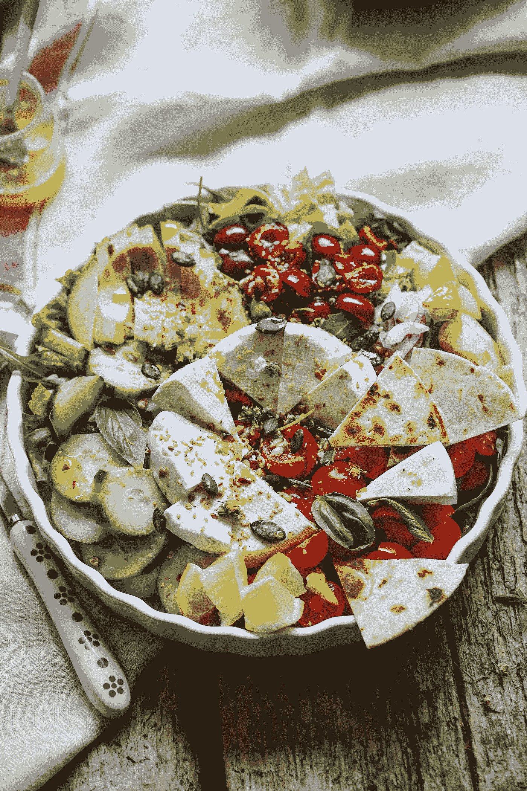

# 材料用户界面—按钮和复选框

> 原文：<https://blog.devgenius.io/material-ui-buttons-and-checkboxes-ab9585ee1c20?source=collection_archive---------1----------------------->


安娜·佩尔泽在 [Unsplash](https://unsplash.com?utm_source=medium&utm_medium=referral) 上的照片

材质 UI 是一个为 React 制作的材质设计库。

这是一组具有材质设计风格的 React 组件。

在这篇文章中，我们将看看如何添加按钮和复选框的材料设计。

# 禁用标高

我们可以用`disableElevation`道具禁用按钮的提升。

例如，我们可以写:

```
import React from "react";
import Button from "[@material](http://twitter.com/material)-ui/core/Button";
import ButtonGroup from "[@material](http://twitter.com/material)-ui/core/ButtonGroup";
import { makeStyles } from "[@material](http://twitter.com/material)-ui/core/styles";const useStyles = makeStyles(theme => ({
  root: {
    display: "flex",
    flexDirection: "column",
    alignItems: "center",
    "& > *": {
      margin: theme.spacing(1)
    }
  }
}));export default function App() {
  const classes = useStyles(); return (
    <div className={classes.root}>
      <ButtonGroup disableElevation variant="contained" color="primary">
        <Button>foo</Button>
        <Button>bar</Button>
      </ButtonGroup>
    </div>
  );
}
```

禁用提升。

# 检验盒

复选框让我们打开或关闭选项。

要创建一个，我们可以使用`Checkbox`组件:

```
import React from "react";
import Checkbox from "[@material](http://twitter.com/material)-ui/core/Checkbox";export default function App() {
  const [checked, setChecked] = React.useState(true); const handleChange = event => {
    setChecked(event.target.checked);
  }; return (
    <div>
      <Checkbox
        checked={checked}
        onChange={handleChange}
        inputProps={{ "aria-label": "checkbox" }}
      />
    </div>
  );
}
```

我们添加`Checkbox`组件来添加一个复选框。

需要`checked`道具来设置检查值。

`onChange`接受检查的值，以便我们可以设置状态。

让我们给复选框添加属性。

# 带有 FormControlLabel 的复选框

我们可以用`FormControlLabel`给我们的复选框添加一个标签。

例如，我们可以写:

```
import React from "react";
import Checkbox from "[@material](http://twitter.com/material)-ui/core/Checkbox";
import FormControlLabel from "[@material](http://twitter.com/material)-ui/core/FormControlLabel";export default function App() {
  const [checked, setChecked] = React.useState(true); const handleChange = event => {
    setChecked(event.target.checked);
  }; return (
    <div>
      <FormControlLabel
        control={
          <Checkbox
            checked={checked}
            onChange={handleChange}
            name="checked"
            color="primary"
          />
        }
        label="Primary"
      />
    </div>
  );
}
```

创建旁边带有标签的复选框。

我们将`FormControlLabel`包装在`Checkbox`外面，这样我们就可以用`label`属性给它添加一个标签。

# 带有表单组的复选框

要添加多个复选框，我们可以将它们放入一个`FormGroup`中。

例如，我们可以写:

```
import React from "react";
import Checkbox from "[@material](http://twitter.com/material)-ui/core/Checkbox";
import FormControl from "[@material](http://twitter.com/material)-ui/core/FormControl";
import FormLabel from "[@material](http://twitter.com/material)-ui/core/FormLabel";
import FormGroup from "[@material](http://twitter.com/material)-ui/core/FormGroup";
import FormControlLabel from "[@material](http://twitter.com/material)-ui/core/FormControlLabel";
import FormHelperText from "[@material](http://twitter.com/material)-ui/core/FormHelperText";export default function App() {
  const [checked, setChecked] = React.useState({
    foo: true,
    bar: false
  });const handleChange = event => {
    setChecked({ ...checked, [event.target.name]: event.target.checked });
  };return (
    <div>
      <FormControl component="fieldset">
        <FormLabel component="legend">check them all</FormLabel>
        <FormGroup>
          <FormControlLabel
            control={
              <Checkbox
                checked={checked.foo}
                onChange={handleChange}
                name="foo"
              />
            }
            label="foo"
          />
          <FormControlLabel
            control={
              <Checkbox
                checked={checked.bar}
                onChange={handleChange}
                name="bar"
              />
            }
            label="bar"
          />
        </FormGroup>
        <FormHelperText>Be careful</FormHelperText>
      </FormControl>
    </div>
  );
}
```

使用`FormControl`组件创建一组复选框。

我们在里面包了很多东西。

我们有一个`FormLabel`在顶部显示标签。

然后我们有一个`FormGroup`来保存 tge 复选框。

`FormControlLabel`有每个复选框的标签。

`FormHelperText`有我们在表单底部显示的小文本。

# 标签放置

标签位置可以更改。

为此，我们可以使用`labelPlacement`道具来改变它。

例如，我们可以写:

```
import React from "react";
import Checkbox from "[@material](http://twitter.com/material)-ui/core/Checkbox";
import FormControlLabel from "[@material](http://twitter.com/material)-ui/core/FormControlLabel";export default function App() {
  return (
    <div>
      <FormControlLabel
        value="bottom"
        control={<Checkbox color="primary" />}
        label="Bottom"
        labelPlacement="bottom"
      />
    </div>
  );
}
```

现在我们在复选框下面有了标签。

其他可能的值包括`top`、`start`和`end`。

# 自定义复选框

我们可以对复选框应用我们自己的样式。

例如，我们可以写:

```
import React from "react";
import { makeStyles } from "[@material](http://twitter.com/material)-ui/core/styles";
import clsx from "clsx";
import Checkbox from "[@material](http://twitter.com/material)-ui/core/Checkbox";const useStyles = makeStyles({
  root: {
    "&:hover": {
      backgroundColor: "transparent"
    }
  },
  icon: {
    borderRadius: 3,
    width: 16,
    height: 16,
    backgroundColor: "#ebf1f5",
    "input:hover ~ &": {
      backgroundColor: "#ebf1f5"
    },
    "input:disabled ~ &": {
      boxShadow: "none"
    }
  },
  checkedIcon: {
    backgroundColor: "#137cbd",
    backgroundImage: "blue",
    "&:before": {
      display: "block",
      width: 16,
      height: 16,
      backgroundColor: "gray"
    },
    "input:hover ~ &": {
      backgroundColor: "#106ba3"
    }
  }
});export default function App() {
  const classes = useStyles(); return (
    <Checkbox
      className={classes.root}
      disableRipple
      color="default"
      checkedIcon={<span className={clsx(classes.icon, classes.checkedIcon)} />}
      icon={<span className={classes.icon} />}
      inputProps={{ "aria-label": "decorative checkbox" }}
    />
  );
}
```

创建不带勾号的复选框。

我们将未选中状态设置为灰色。

我们将选中状态设置为蓝色。

这些都是按照我们传入`makeStyles`的样式做的。

此外，我们使用了`clsx`包在选中和未选中样式之间切换。



由[丽贝卡·g·森德鲁](https://unsplash.com/@rebeckagsendroiu?utm_source=medium&utm_medium=referral)在 [Unsplash](https://unsplash.com?utm_source=medium&utm_medium=referral) 上拍摄的照片

# 结论

我们可以用材质 UI 添加复选框。

此外，我们可以添加标签，并按照我们想要的方式设计它们的样式。