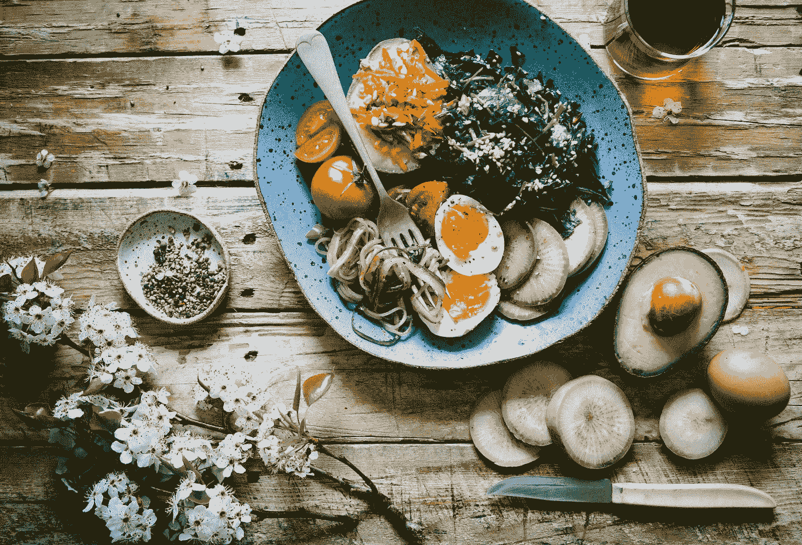

# 材料用户界面-按钮和组

> 原文：<https://blog.devgenius.io/material-ui-buttons-and-groups-5885bf9ab16b?source=collection_archive---------7----------------------->



照片由[布鲁克·拉克](https://unsplash.com/@brookelark?utm_source=medium&utm_medium=referral)在 [Unsplash](https://unsplash.com?utm_source=medium&utm_medium=referral) 上拍摄

材质 UI 是一个为 React 制作的材质设计库。

这是一组具有材质设计风格的 React 组件。

在这篇文章中，我们将看看如何添加按钮的材料设计。

# 复杂按钮

我们可以用`ButtonBase`组件添加更复杂的按钮。

例如，我们可以写:

```
import React from "react";
import { makeStyles } from "[@material](http://twitter.com/material)-ui/core/styles";
import ButtonBase from "[@material](http://twitter.com/material)-ui/core/ButtonBase";
import Typography from "[@material](http://twitter.com/material)-ui/core/Typography";const useStyles = makeStyles(theme => ({
  root: {
    "& > *": {
      margin: theme.spacing(1)
    }
  },
  image: {
    position: "relative",
    height: 200,
    [theme.breakpoints.down("xs")]: {
      width: "100% !important",
      height: 100
    },
    "&:hover, &$focusVisible": {
      zIndex: 1,
      "& $imageBackdrop": {
        opacity: 0.15
      },
      "& $imageMarked": {
        opacity: 0
      },
      "& $imageTitle": {
        border: "4px solid currentColor"
      }
    }
  },
  focusVisible: {},
  imageButton: {
    position: "absolute",
    left: 0,
    right: 0,
    top: 0,
    bottom: 0,
    display: "flex",
    alignItems: "center",
    justifyContent: "center",
    color: theme.palette.common.white
  },
  imageSrc: {
    position: "absolute",
    left: 0,
    right: 0,
    top: 0,
    bottom: 0,
    backgroundSize: "cover",
    backgroundPosition: "center 40%"
  },
  imageBackdrop: {
    position: "absolute",
    left: 0,
    right: 0,
    top: 0,
    bottom: 0,
    backgroundColor: theme.palette.common.black,
    opacity: 0.4,
    transition: theme.transitions.create("opacity")
  },
  imageTitle: {
    position: "relative",
    padding: `${theme.spacing(2)}px ${theme.spacing(4)}px ${theme.spacing(1) +
      6}px`
  },
  imageMarked: {
    height: 3,
    width: 18,
    backgroundColor: theme.palette.common.white,
    position: "absolute",
    bottom: -2,
    left: "calc(50% - 9px)",
    transition: theme.transitions.create("opacity")
  }
}));export default function App() {
  const classes = useStyles(); return (
    <div className={classes.root}>
      <ButtonBase
        focusRipple
        className={classes.image}
        focusVisibleClassName={classes.focusVisible}
        style={{
          width: "200px"
        }}
      >
        <span
          className={classes.imageSrc}
          style={{
            backgroundImage: `url(http://placekitten.com/200/200)`
          }}
        />
        <span className={classes.imageBackdrop} />
        <span className={classes.imageButton}>
          <Typography
            component="span"
            variant="subtitle"
            color="inherit"
            className={classes.imageTitle}
          >
            {"Cat"}
            <span className={classes.imageMarked} />
          </Typography>
        </span>
      </ButtonBase>
    </div>
  );
}
```

我们用图像类为`ButtonBase`设置类。

`focusVisibleClassName`拥有`focusVisible`级。

`imageBackdrop`自有阶层。

`imageButton`有按钮类。

而`imageMarked`有图像类有底部的条。

我们从材料 UI 文档中的样式开始，然后从那里修改它们。

我们把很多东西设置到一个绝对位置，放在按钮底座里。

图像标题与间距相关。

# 按钮组

我们可以添加按钮组来在一个容器中添加按钮。

例如，我们可以写:

```
import React from "react";
import Button from "[@material](http://twitter.com/material)-ui/core/Button";
import ButtonGroup from "[@material](http://twitter.com/material)-ui/core/ButtonGroup";
import { makeStyles } from "[@material](http://twitter.com/material)-ui/core/styles";const useStyles = makeStyles(theme => ({
  root: {
    display: "flex",
    flexDirection: "column",
    alignItems: "center",
    "& > *": {
      margin: theme.spacing(1)
    }
  }
}));export default function App() {
  const classes = useStyles(); return (
    <div className={classes.root}>
      <ButtonGroup color="primary">
        <Button>foo</Button>
        <Button>bar</Button>
        <Button>baz</Button>
      </ButtonGroup>
    </div>
  );
}
```

我们在我们的`ButtonGroup`中添加我们的`Button`来将它们组合在一起。

# 按钮组的大小和颜色

我们可以改变按钮组的大小和颜色。

例如，我们可以写:

```
import React from "react";
import Button from "[@material](http://twitter.com/material)-ui/core/Button";
import ButtonGroup from "[@material](http://twitter.com/material)-ui/core/ButtonGroup";
import { makeStyles } from "[@material](http://twitter.com/material)-ui/core/styles";const useStyles = makeStyles(theme => ({
  root: {
    display: "flex",
    flexDirection: "column",
    alignItems: "center",
    "& > *": {
      margin: theme.spacing(1)
    }
  }
}));export default function App() {
  const classes = useStyles(); return (
    <div className={classes.root}>
      <ButtonGroup size="large" color="primary">
        <Button>foo</Button>
        <Button>bar</Button>
        <Button>baz</Button>
      </ButtonGroup>
    </div>
  );
}
```

使尺寸变大。

# 垂直团体

为了使按钮组垂直，我们可以将`orientation`设置为`vertical`。

例如，我们可以写:

```
import React from "react";
import Button from "[@material](http://twitter.com/material)-ui/core/Button";
import ButtonGroup from "[@material](http://twitter.com/material)-ui/core/ButtonGroup";
import { makeStyles } from "[@material](http://twitter.com/material)-ui/core/styles";const useStyles = makeStyles(theme => ({
  root: {
    display: "flex",
    flexDirection: "column",
    alignItems: "center",
    "& > *": {
      margin: theme.spacing(1)
    }
  }
}));export default function App() {
  const classes = useStyles(); return (
    <div className={classes.root}>
      <ButtonGroup orientation="vertical" color="primary">
        <Button>foo</Button>
        <Button>bar</Button>
        <Button>baz</Button>
      </ButtonGroup>
    </div>
  );
}
```

# 拆分按钮

我们可以把两个按钮放在一起做成一个分体按钮。

例如，我们可以写:

```
import React from "react";
import Button from "[@material](http://twitter.com/material)-ui/core/Button";
import ButtonGroup from "[@material](http://twitter.com/material)-ui/core/ButtonGroup";
import { makeStyles } from "[@material](http://twitter.com/material)-ui/core/styles";
import ArrowDropDownIcon from "[@material](http://twitter.com/material)-ui/icons/ArrowDropDown";const useStyles = makeStyles(theme => ({
  root: {
    display: "flex",
    flexDirection: "column",
    alignItems: "center",
    "& > *": {
      margin: theme.spacing(1)
    }
  }
}));export default function App() {
  const classes = useStyles(); return (
    <div className={classes.root}>
      <ButtonGroup color="primary">
        <Button>foo</Button>
        <Button color="primary" size="small">
          <ArrowDropDownIcon />
        </Button>
      </ButtonGroup>
    </div>
  );
}
```

我们添加`ArrowDropDownIcon`来为 r8ight 按钮添加一个图标。

`size`是`small`让它比左边的小。


照片由[埃拉·奥尔森](https://unsplash.com/@ellaolsson?utm_source=medium&utm_medium=referral)在 [Unsplash](https://unsplash.com?utm_source=medium&utm_medium=referral) 上拍摄

# 结论

我们可以用`ButtonBase`组件制作复杂的按钮。

我们可以用`ButtonGroup`组件将按钮组合在一起。