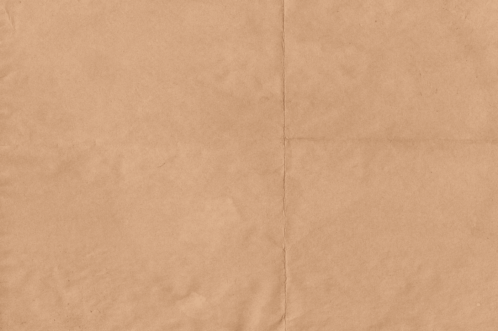

# 材料界面—纸张和卡片

> 原文：<https://blog.devgenius.io/material-ui-paper-and-card-8868edee7b3a?source=collection_archive---------1----------------------->



伊万·格罗莫夫在 [Unsplash](https://unsplash.com?utm_source=medium&utm_medium=referral) 拍摄的照片

材质 UI 是一个为 React 制作的材质设计库。

这是一组具有材质设计风格的 React 组件。

在这篇文章中，我们将看看如何用材质 UI 添加纸张和卡片。

# 纸

纸张是一种类似于现实生活中的纸张的组件。

要添加它们，我们可以使用`Paper`组件。

例如，我们可以写:

```
import React from "react";
import Paper from "[@material](http://twitter.com/material)-ui/core/Paper";export default function App() {
  return (
    <>
      <Paper elevation={0}>foo</Paper>
      <Paper>foo</Paper>
      <Paper elevation={3}>foo</Paper>
    </>
  );
}
```

添加各种深度的纸张。

深度由`elevation`支柱定义。

# 纸张变体

我们也可以添加变体道具来绘制表面轮廓。

例如，我们可以写:

```
import React from "react";
import Paper from "[@material](http://twitter.com/material)-ui/core/Paper";export default function App() {
  return (
    <>
      <Paper variant="outlined" square>
        foo
      </Paper>
    </>
  );
}
```

我们制作`variant`道具`outlined`使其轮廓分明。

# 卡片

卡片包含一些内容和动作。

例如，我们可以这样写来添加一个:

```
import React from "react";
import Card from "[@material](http://twitter.com/material)-ui/core/Card";
import CardActions from "[@material](http://twitter.com/material)-ui/core/CardActions";
import CardContent from "[@material](http://twitter.com/material)-ui/core/CardContent";
import Button from "[@material](http://twitter.com/material)-ui/core/Button";
import Typography from "[@material](http://twitter.com/material)-ui/core/Typography";export default function App() {
  return (
    <>
      <Card>
        <CardContent>
          <Typography color="textSecondary" gutterBottom>
            Word of the Day
          </Typography>
          <Typography variant="h5" component="h2">
            foo
          </Typography>
        </CardContent>
        <CardActions>
          <Button size="small">Learn More</Button>
        </CardActions>
      </Card>
    </>
  );
}
```

我们给`Card`加上一些`CardContent`。

为了添加样式化的文本，我们添加了一些`Typography`组件。

然后我们加了一个`CardAction`让我们做一些事情。

# 轮廓卡片

要绘制卡片轮廓，我们可以添加`variant`道具，并将值设置为`outlined`。

例如，我们可以写:

```
import React from "react";
import Card from "[@material](http://twitter.com/material)-ui/core/Card";
import CardActions from "[@material](http://twitter.com/material)-ui/core/CardActions";
import CardContent from "[@material](http://twitter.com/material)-ui/core/CardContent";
import Button from "[@material](http://twitter.com/material)-ui/core/Button";
import Typography from "[@material](http://twitter.com/material)-ui/core/Typography";export default function App() {
  return (
    <>
      <Card variant="outlined">
        <CardContent>
          <Typography color="textSecondary" gutterBottom>
            Word of the Day
          </Typography>
          <Typography variant="h5" component="h2">
            foo
          </Typography>
        </CardContent>
        <CardActions>
          <Button size="small">Learn More</Button>
        </CardActions>
      </Card>
    </>
  );
}
```

现在我们看到了盒子周围的轮廓。

# 复杂卡片

我们可以做一张有内容的卡片。

我们通过卡中的`Collapse`组件使其可扩展。

`in`属性指定它用`expanded`值扩展。

如果是`true`，那么我们会看到扩展的文本。

例如，我们可以写:

```
import React from "react";
import clsx from "clsx";
import Card from "[@material](http://twitter.com/material)-ui/core/Card";
import CardHeader from "[@material](http://twitter.com/material)-ui/core/CardHeader";
import CardMedia from "[@material](http://twitter.com/material)-ui/core/CardMedia";
import CardContent from "[@material](http://twitter.com/material)-ui/core/CardContent";
import CardActions from "[@material](http://twitter.com/material)-ui/core/CardActions";
import Collapse from "[@material](http://twitter.com/material)-ui/core/Collapse";
import IconButton from "[@material](http://twitter.com/material)-ui/core/IconButton";
import Typography from "[@material](http://twitter.com/material)-ui/core/Typography";
import { makeStyles } from "[@material](http://twitter.com/material)-ui/core/styles";
import FavoriteIcon from "[@material](http://twitter.com/material)-ui/icons/Favorite";
import ExpandMoreIcon from "[@material](http://twitter.com/material)-ui/icons/ExpandMore";const useStyles = makeStyles(theme => ({
  expand: {
    transform: "rotate(0deg)",
    marginLeft: "auto",
    transition: theme.transitions.create("transform", {
      duration: theme.transitions.duration.shortest
    })
  },
  media: {
    height: 0,
    paddingTop: "56.25%"
  }
}));export default function App() {
  const classes = useStyles();
  const [expanded, setExpanded] = React.useState(false); const handleExpandClick = () => {
    setExpanded(!expanded);
  }; return (
    <Card className={classes.root}>
      <CardHeader title="Cat" subheader="Small cat" />
      <CardMedia
        className={classes.media}
        image="https://placekitten.com/200/200"
        title="Cat"
      />
      <CardContent>
        <Typography variant="body2" color="textSecondary" component="p">
          Lorem ipsum dolor sit amet, consectetur adipiscing elit. Curabitur
          aliquet facilisis ligula sed gravida.
        </Typography>
      </CardContent>
      <CardActions disableSpacing>
        <IconButton>
          <FavoriteIcon />
        </IconButton>
        <IconButton
          className={clsx(classes.expand, {
            [classes.expandOpen]: expanded
          })}
          onClick={handleExpandClick}
        >
          <ExpandMoreIcon />
        </IconButton>
      </CardActions>
      <Collapse in={expanded} timeout="auto" unmountOnExit>
        <CardContent>
          <Typography paragraph>
            Aliquam efficitur sapien ac diam rutrum, ac venenatis nisi dictum.
          </Typography>
          <Typography paragraph>
            Integer eu lectus pulvinar, ornare ipsum eget
          </Typography>
        </CardContent>
      </Collapse>
    </Card>
  );
}
```

使`Collapse`组件中的卡片内容在我们点击展开更多图标时显示。

我们还添加了`CardMedia`来展示一张图。

`image`道具有图像。

`title`具有卡片媒体的可访问文本。


lexie janney 在 [Unsplash](https://unsplash.com?utm_source=medium&utm_medium=referral) 上拍摄的照片

# 结论

我们可以添加一张有文字和图像的卡片。

此外，我们可以在单击展开按钮时显示内容。