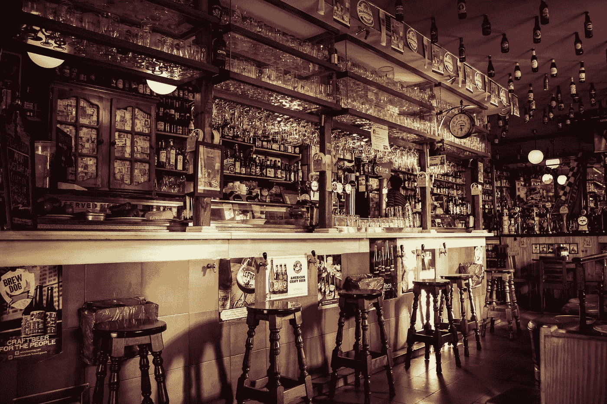
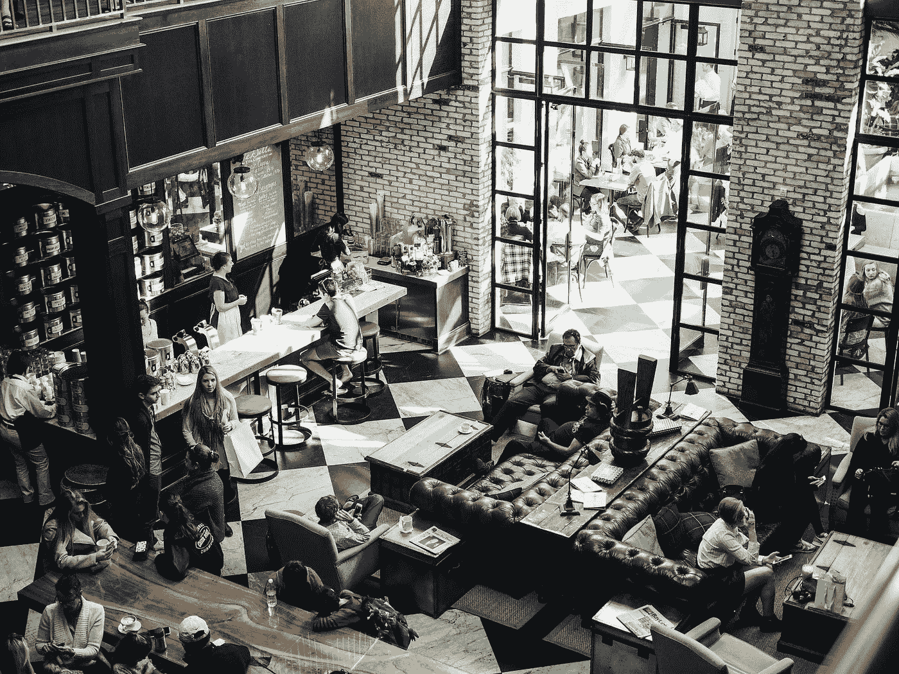

# 材料用户界面—进度条

> 原文：<https://blog.devgenius.io/material-ui-progress-bars-f20df817e2de?source=collection_archive---------1----------------------->



玛丽·丽贝卡·艾略特在 [Unsplash](https://unsplash.com?utm_source=medium&utm_medium=referral) 上拍摄的照片

材质 UI 是一个为 React 制作的材质设计库。

这是一组具有材质设计风格的 React 组件。

在这篇文章中，我们将看看如何添加带有材质 UI 的进度条。

# 线性进度条

我们可以使用`LinearProgress`组件来添加一个水平进度条。

例如，我们可以写:

```
import React from "react";
import LinearProgress from "[@material](http://twitter.com/material)-ui/core/LinearProgress";export default function App() {
  return (
    <div>
      <LinearProgress />
    </div>
  );
}
```

我们只需添加它，它会显示一个动画进度条。

要改变样式，我们可以设置`color`属性:

```
import React from "react";
import LinearProgress from "[@material](http://twitter.com/material)-ui/core/LinearProgress";export default function App() {
  return (
    <div>
      <LinearProgress color="secondary" />
    </div>
  );
}
```

现在它会变成粉红色。

# 确定进度条

如果我们想显示一个进度条，直到事情完成，我们可以设置`value`道具来控制进度。

我们还需要将`variant`道具设置为`determinate`来设置确定的进度。

例如，我们可以写:

```
import React from "react";
import LinearProgress from "[@material](http://twitter.com/material)-ui/core/LinearProgress";export default function App() {
  const [progress, setProgress] = React.useState(0); React.useEffect(() => {
    const timer = setInterval(() => {
      setProgress(oldProgress => {
        if (oldProgress === 100) {
          return 0;
        }
        return Math.min(oldProgress + 15, 100);
      });
    }, 500); return () => {
      clearInterval(timer);
    };
  }, []); return (
    <div>
      <LinearProgress variant="determinate" value={progress} />
    </div>
  );
}
```

添加一个`prigress`状态。这是一个我们用来确定进度的数字。

该值的范围从 0 到 100。

该值用`useEffect`进度更新，它调用`setProgress`来更新进度。

如果少于 100，我们就一直加 100。

否则，我们将其设置为 100。

然后我们得到一个不断来回移动的进度条。

# 线性缓冲器

我们可以将`variant`设置为`buffer`来给条添加一条虚线和一条较亮的线。

例如，我们可以写:

```
import React from "react";
import LinearProgress from "[@material](http://twitter.com/material)-ui/core/LinearProgress";export default function App() {
  const [progress, setProgress] = React.useState(0); React.useEffect(() => {
    const timer = setInterval(() => {
      setProgress(oldProgress => {
        if (oldProgress === 100) {
          return 0;
        }
        return Math.min(oldProgress + 15, 100);
      });
    }, 500); return () => {
      clearInterval(timer);
    };
  }, []); return (
    <div>
      <LinearProgress
        variant="buffer"
        value={progress}
        valueBuffer={progress * 1.1}
      />
    </div>
  );
}
```

在实际进度栏的右侧显示一个灯条。

剩余的未填充空间用虚线填充。

# 非标准范围

我们可以通过创建自己的函数将该数字标准化为 100，从而使该范围成为非标准范围。

例如，我们可以写:

```
import React from "react";
import LinearProgress from "[@material](http://twitter.com/material)-ui/core/LinearProgress";const MIN = 100;
const MAX = 200;
const normalize = value => ((value - MIN) * 100) / (MAX - MIN);export default function App() {
  const [progress, setProgress] = React.useState(MIN); React.useEffect(() => {
    const timer = setInterval(() => {
      setProgress(oldProgress => {
        if (oldProgress === MAX) {
          return 0;
        }
        return Math.min(oldProgress + 15, MAX);
      });
    }, 500); return () => {
      clearInterval(timer);
    };
  }, []); return (
    <div>
      <LinearProgress variant="determinate" value={normalize(progress)} />
    </div>
  );
}
```

我们将`MIN`和`MAX`常量设置为我们想要的值。

然后我们定义`normalize`函数将它转换成 0 到 100 之间的范围。

然后我们可以做和其他确定的进度条一样的事情。

唯一不同的是`value`属性仍然有一个介于 0 和 100 之间的值，因为我们调用了`normalize`函数来转换成这样的值。

# 定制进度

我们可以用`withStyles`高阶组件来设计进度。

例如，我们可以写:

```
import React from "react";
import LinearProgress from "[@material](http://twitter.com/material)-ui/core/LinearProgress";
import { withStyles } from "[@material](http://twitter.com/material)-ui/core/styles";const BorderLinearProgress = withStyles(theme => ({
  root: {
    height: 10,
    borderRadius: 5
  },
  colorPrimary: {
    backgroundColor:
      theme.palette.grey[theme.palette.type === "light" ? 200 : 700]
  },
  bar: {
    borderRadius: 5,
    backgroundColor: "green"
  }
}))(LinearProgress);export default function App() {
  const [progress, setProgress] = React.useState(0); React.useEffect(() => {
    const timer = setInterval(() => {
      setProgress(oldProgress => {
        if (oldProgress === 100) {
          return 0;
        }
        return Math.min(oldProgress + 15, 100);
      });
    }, 500); return () => {
      clearInterval(timer);
    };
  }, []); return (
    <div>
      <BorderLinearProgress variant="determinate" value={progress} />
    </div>
  );
}
```

我们使用了`withStyles`高阶组件，通过`bar`类的`backgroundColor`属性来改变进度条的颜色。

`colorPrimary`有未填充部分的颜色。

`height`和`borderRadius`也改变了。



照片由[在](https://unsplash.com/@thecreative_exchange?utm_source=medium&utm_medium=referral) [Unsplash](https://unsplash.com?utm_source=medium&utm_medium=referral) 上的创意交流拍摄

# 结论

我们可以制作一个线性进度条，用它来永远显示一个进度条，或者只是用它来显示进度。