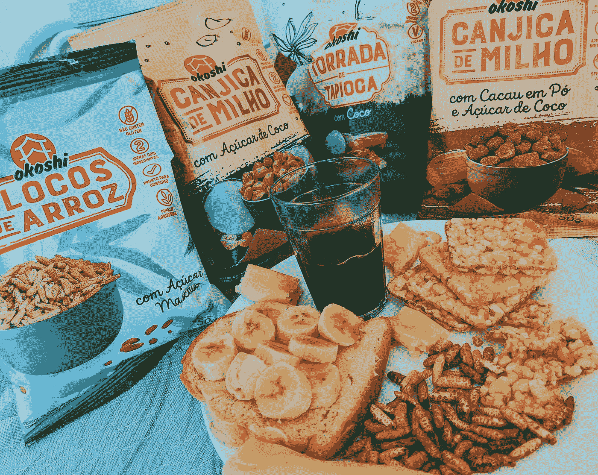

# 材料界面—小吃店

> 原文：<https://blog.devgenius.io/material-ui-snack-bars-99097d8a4545?source=collection_archive---------0----------------------->



里卡多·恩里克·韦吉利奥在 [Unsplash](https://unsplash.com?utm_source=medium&utm_medium=referral) 上拍摄的照片

材质 UI 是一个为 React 制作的材质设计库。

这是一组具有材质设计风格的 React 组件。

在本文中，我们将看看如何用材质 UI 添加小吃店。

# 小吃店

小吃店让我们显示应用程序中发生的事情的消息。

要创建一个简单的，我们可以使用`Snackbar`组件。

例如，我们可以写:

```
import React from "react";
import Button from "[@material](http://twitter.com/material)-ui/core/Button";
import Snackbar from "[@material](http://twitter.com/material)-ui/core/Snackbar";
import IconButton from "[@material](http://twitter.com/material)-ui/core/IconButton";
import CloseIcon from "[@material](http://twitter.com/material)-ui/icons/Close";export default function App() {
  const [open, setOpen] = React.useState(false); const handleClick = () => {
    setOpen(true);
  }; const handleClose = (event, reason) => {
    if (reason === "clickaway") {
      return;
    } setOpen(false);
  }; return (
    <div>
      <Button onClick={handleClick}>Open snackbar</Button>
      <Snackbar
        anchorOrigin={{
          vertical: "bottom",
          horizontal: "left"
        }}
        open={open}
        autoHideDuration={6000}
        onClose={handleClose}
        message="hello world"
        action={
          <React.Fragment>
            <Button color="secondary" size="small" onClick={handleClose}>
              ok
            </Button>
            <IconButton size="small" color="inherit" onClick={handleClose}>
              <CloseIcon fontSize="small" />
            </IconButton>
          </React.Fragment>
        }
      />
    </div>
  );
}
```

我们创建了一个小吃店，消息设置为`'hello world'`。

我们在`action`道具中有更多的内容。

它们包括一个我们可以点击的按钮和一个让我们关闭小吃店的`IconButton`。

# 定制小吃店

我们可以为小吃店设计各种风格。

为了设计风格，我们添加了`severity`道具。

例如，我们可以写:

```
import React from "react";
import MuiAlert from "[@material](http://twitter.com/material)-ui/lab/Alert";function Alert(props) {
  return <MuiAlert elevation={6} variant="filled" {...props} />;
}
export default function App() {
  return (
    <div>
      <Alert severity="error">error!</Alert>
      <Alert severity="warning">warning!</Alert>
      <Alert severity="info">info!</Alert>
      <Alert severity="success">success!</Alert>
    </div>
  );
}
```

我们没有使用`Snackbar`组件，而是使用了`Alert`组件。

它在`@material-ui/lab`包里而不是`@material-ui/core`包里。

# 定位小吃店

我们可以用`anchorOrigin`道具定位小吃店。

为了定位它，我们可以写:

```
import React from "react";
import Snackbar from "[@material](http://twitter.com/material)-ui/core/Snackbar";
import Button from "[@material](http://twitter.com/material)-ui/core/Button";export default function App() {
  const [state, setState] = React.useState({
    open: false,
    vertical: "top",
    horizontal: "center"
  }); const { vertical, horizontal, open } = state; const handleClick = newState => () => {
    setState({ open: true, ...newState });
  }; const handleClose = () => {
    setState({ ...state, open: false });
  }; return (
    <div>
      <Button onClick={handleClick({ vertical: "top", horizontal: "center" })}>
        open
      </Button> <Snackbar
        anchorOrigin={{ vertical, horizontal }}
        open={open}
        onClose={handleClose}
        message="hello world"
      />
    </div>
  );
}
```

用`anchorOrigin`支柱设定小吃店的位置。

它被设置为具有`vertical`和`horizontal`属性的对象。

我们将它分别设置为`'top'`和`'center'`以在屏幕顶部居中显示。

# 信息长度

背杆的宽度可以变化。

我们可以通过在多行中写文本来写一条长消息:

```
import React from "react";
import Snackbar from "[@material](http://twitter.com/material)-ui/core/Snackbar";
import Button from "[@material](http://twitter.com/material)-ui/core/Button";export default function App() {
  const [state, setState] = React.useState({
    open: false
  }); const { open } = state; const handleClick = () => {
    setState({ open: true });
  }; const handleClose = () => {
    setState({ ...state, open: false });
  }; return (
    <div>
      <Button onClick={handleClick}>open</Button> <Snackbar
        open={open}
        onClose={handleClose}
        message={
          "Lorem ipsum dolor sit amet, consectetur adipiscing elit.  \
          Aenean mollis, metus vitae vestibulum suscipit, eros nisi ultrices urna."
        }
        action={
          <Button color="secondary" size="small">
            lorem ipsum dolorem
          </Button>
        }
      />
    </div>
  );
}
```

我们有带字符串表达式的`message`属性，该表达式跨越多行，但没有换行符。

此外，我们有`action`道具来显示按钮。


由[奥拉·米先科](https://unsplash.com/@olamishchenko?utm_source=medium&utm_medium=referral)在 [Unsplash](https://unsplash.com?utm_source=medium&utm_medium=referral) 上拍摄的照片

# 结论

我们可以用小吃店来展示不同的信息。

他们可以设计风格，我们可以应用过渡。