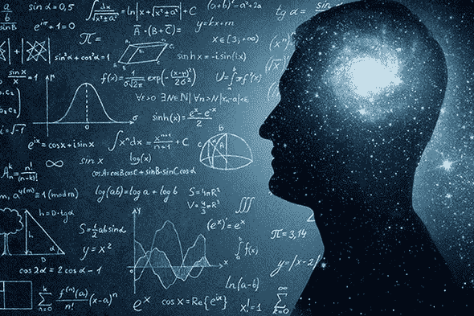

# 数学不一定要复杂和枯燥:它可以更有趣和更容易理解

> 原文：<https://blog.devgenius.io/math-doesnt-have-to-be-complicated-and-boring-it-can-be-a-lot-more-fun-and-understandable-345ff6123bbc?source=collection_archive---------5----------------------->

尽管如此，人们还是认为数学很复杂，学起来很无聊。以下是关于数学如何变得更有趣和更容易理解的细节。

## 1-使用有趣且简单的数学教学资源

不幸的是，对于学习数学和数学相关的学科来说，互联网上的大部分内容都是无趣和难以理解的。但是，像可汗学院和 Coursera 这样的不同平台上有非常有趣和简单的数学和数学相关的课程。因为他们的座右铭是为每个人提供教育，他们可以让一个人用最少的努力理解所有与数学相关的科目。

## 2-不要去找某些出版物写的教科书

教科书为每个模块提供了很好的见解，但它们缺乏令人愉快和可理解的材料，读者无法理解和理解每个主题的实时用例。此外，它们真的很长，当时间和话题进展时，它们可能会让人筋疲力尽，完全失去注意力。当你对这些主题感到厌烦时，你最终会失去兴趣，讨厌这些模块，而这正是你最需要的。但是，寻找有趣和简单的资源可以让你在更多的工作中对这个模块有更多的了解。

## 3-设定自己的速度，记住重要的点

数学不仅仅是由公式创造出来的。相反，它是一个活生生的东西，你可以根据自己的需求找到所有的奥秘。当你理解越来越多的抽象知识时，你的话题就会变得更加有趣。当记住你需要知道的东西，并从模块中丢弃所有不必要的东西时，学习和应用变得比通过大学教授或书本的步伐更容易。

## 4-记住没有必要经常复习，因为数学是建立在以前学过的科目上的

这可能使数学成为人类历史上最令人愉快和最容易理解的学科。它是用数学证明建立起来的，所有的数学证明都指向一个最基本的定理，如果你决定进一步探索宇宙的话。此外，它的简单性是通过设计来使它简单的，除非人们以一种神秘而复杂的方式在学生面前膨胀自己。

*数学能有趣且易懂吗？你如何看待数学？在下面的评论区分享你对数学的想法和经验。*