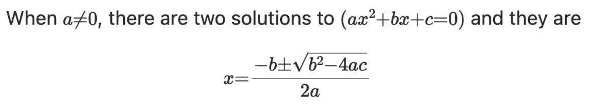

# 用 GitHub 写数学方程式

> 原文：<https://blog.devgenius.io/math-equations-with-latex-in-github-1602a4c091b9?source=collection_archive---------14----------------------->

## 感谢 *LaTeX* 支持使用 markdown，在你的 GitHub 库中编写漂亮的数学方程。


照片由[杰斯温·托马斯](https://unsplash.com/@jeswinthomas?utm_source=medium&utm_medium=referral)在 [Unsplash](https://unsplash.com?utm_source=medium&utm_medium=referral) 上拍摄

几个月前，GitHub 引入了对 LaTeX 语法的支持，可以直接在 markdown 文件中编写数学方程。八年多来，社区一直在请求这项功能。

为了呈现一个方程，你需要使用`$`符号分隔符用于内联方程，使用`$$` 用于整个块。

## 示例语法

例如，下面的降价代码:

```
When $a \ne 0$, there are two solutions to $(ax^2 + bx + c = 0)$ and they are$$ x = {-b \pm \sqrt{b^2-4ac} \over 2a} $$
```

将渲染到:



渲染结果

我最喜欢的爱因斯坦场方程可以用以下公式来表示:

```
$$R_{\mu \nu} - {1 \over 2}R \, g_{\mu \nu} + \Lambda g_{\mu \nu}= {8 \pi G \over c^4} T_{\mu \nu}$$
```

**附加参考:**

*   [我的 GitHub 演示库](https://github.com/dotcom-poland/medium-latex-support)
*   [完成 MathJax 文档](https://www.mathjax.org/)
*   [MathJax 基础教程带示例](https://math.meta.stackexchange.com/questions/5020/mathjax-basic-tutorial-and-quick-reference)

**快速提问:**这个故事对你有价值吗*？请留言支持我的工作👏鼓掌或多鼓掌以示感谢 n .谢谢🥰*