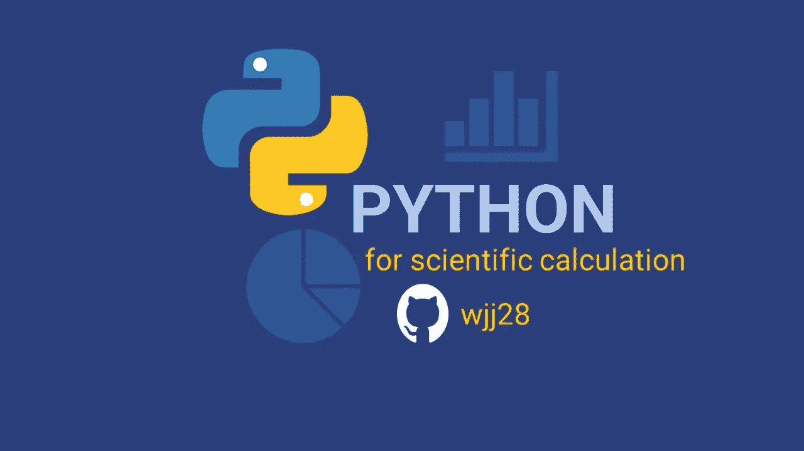
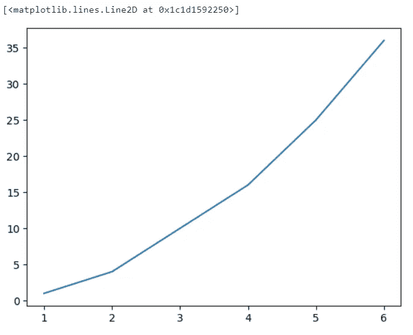
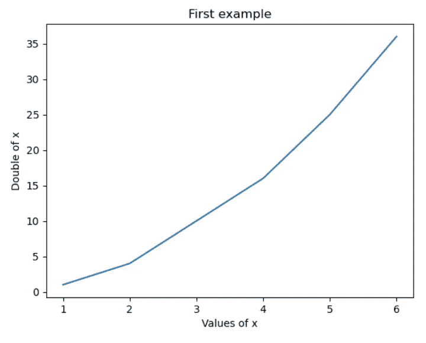
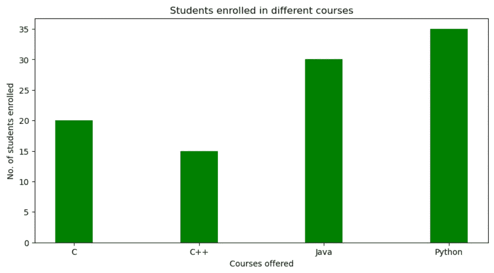
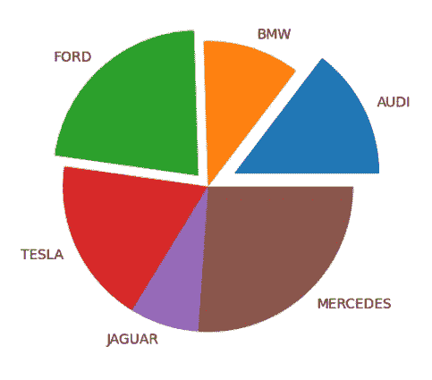
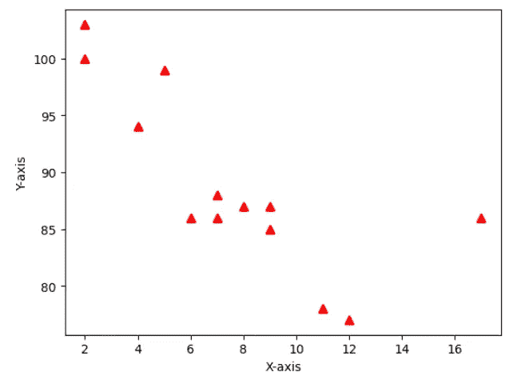
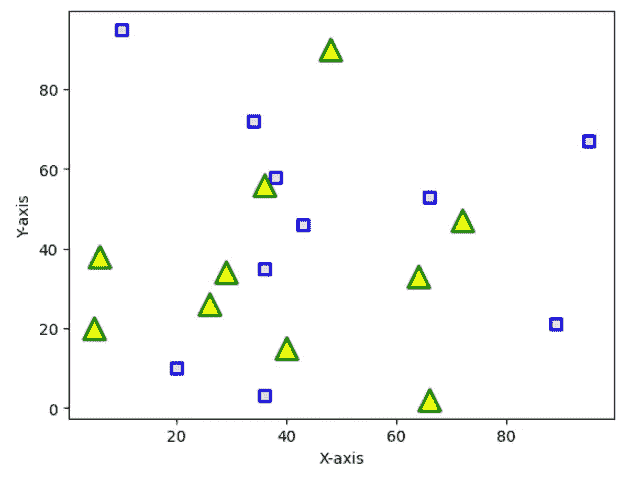

# 面向研究人员的 MatPlotLib

> 原文：<https://blog.devgenius.io/matplotlib-for-researchers-49de840e8cd5?source=collection_archive---------6----------------------->

可视化库📚



当我们用 Python 做研究时🐍，我们不会从头开始大量编码，而是导入库***。***

## 使用 Python 导入库🐍


通常，图书馆是一个藏书室📚或者是存放许多书以备后用的房间或地方。类似地，在编程中，库是一组 ***预编译代码*** 的集合，这些代码可以在程序中稍后用于一些特定的明确定义的操作。它可能包括:

*   功能
*   工具
*   班级
*   操作

# 如何安装👨🏿‍🏫图书馆📚？

我们可以使用`pip`，那是 python 安装包。

```
pip install <library_name>
```

如果我们在 Anaconda 中工作，我们也可以使用`conda`👇🏿

```
conda install <library_name>
```

或者

```
!pip install <library_name>
```

# 如何使用图书馆📚？

一些库是用 Python 预构建的，而在 Anaconda 中，一些重要的科学库是用 Anaconda 预安装的。

为了使用一个库，我们必须将它导入到我们的环境中。

计算机编程语言🐍有一组内置的数学函数，包括一个扩展的数学模块，允许您对数字执行数学任务。它叫做`math`😁

要使用它，我们必须导入`math`库:

```
# Importing math library
import math
```

一旦我们导入了`math`模块，我们就可以开始使用该模块的方法和常量。

例如，`math.sqrt()`方法返回一个数的平方根:

```
import math

a = 200

square_root = math.sqrt(a)

print(square_root)
```

`math.pi`常量，返回的值为🍰 (3.14...):

```
import math

x = math.pi

print(x)
```


Matplotlib 是一个用于 ***数据可视化*** 的综合库，用 Python 创建静态、动画和交互式可视化🐍，通常以曲线图、图形和图表的形式。

一旦我们完成了`matplotlib`的安装，我们就开始操作👷🏿‍♂️

```
import matplotlib.pyplot as plt
```

`pyplot`是 Python 的一个 [API](https://stackoverflow.com/questions/7440379/what-exactly-is-the-meaning-of-an-api) 🐍这实际上使`matplotlib`成为了 [MATLAB](https://www.mathworks.com/products/matlab.html) 的一个可行的开源替代品。

# 简单的例子

```
#Importing matplotlib and math libraries
import matplotlib.pyplot as plt
import math

x = [1, 2, 4, 5, 6]

#double of x
y = [2, 4, 8, 10, 12]
```

为了绘制我们的图表，我们需要使用`plot()`和`show()`函数:

```
plt.plot(x,y)
plt.show()
```

输出:



但是在我们的图中添加一个 ***标题*** 并标注 ***轴*** 总是一个好的做法

```
#graph title
plt.title(“First example”)

#x axis label
plt.xlabel(“Values of x”)

#y axis label
plt.ylabel(“Double of x”)

plt.plot(x,y)
plt.show()
```



更容易理解😁

# 地块类型

有不同类型的情节，我们可以根据自己的喜好/需要来选择。

## 条形图

条形图是一种用矩形条表示数据类别的图形

```
import numpy as np
import matplotlib.pyplot as plt

# creating the dataset
data = {'C':20, 'C++':15, 'Java':30,
'Python':35}

courses = list(data.keys())
values = list(data.values())

# creating the bar plot
plt.bar(courses, values, color ='green', width = 0.4)

#labels
plt.xlabel("Courses offered")
plt.ylabel("No. of students enrolled")
plt.title("Students enrolled in different courses")

plt.show()
```

输出:



学生注册条形图

## 饼图

一个**饼图**是一个只能显示一系列数据的圆形统计图。

让我们使用`pie()`函数创建一个简单的饼图:

```
# Import libraries
from matplotlib import pyplot as plt
import numpy as np

# Creating dataset

cars = ['AUDI', 'BMW', 'FORD',
        'TESLA', 'JAGUAR', 'MERCEDES']

# the value for each car
data = [23, 17, 35, 29, 12, 41]

#to make one or some of the wedges of the pie chart to stand out 
myexplode = [0.2, 0, 0.1, 0, 0, 0]

# Creating plot
plt.pie(data, labels = cars, explode = myexplode)

# show plot
plt.show()
```

输出:



## 散点图

散点图用于观察变量之间的关系，并用点来表示变量之间的关系。

```
import matplotlib.pyplot as plt

x =[5, 7, 8, 7, 2, 17, 2, 9, 4, 11, 12, 9, 6]

y =[99, 86, 87, 88, 100, 86, 103, 87, 94, 78, 77, 85, 86]

# Creating plot
plt.scatter(x, y, color ="red", marker='^',  linewidths = 2)

# labels
plt.xlabel("X-axis")
plt.ylabel("Y-axis")

# To show the plot
plt.show()
```

输出:



我们还可以在同一个图表中绘制多个数据集

```
import matplotlib.pyplot as plt

# dataset-1
x1 = [89, 43, 36, 36, 95, 10,
      66, 34, 38, 20]

y1 = [21, 46, 3, 35, 67, 95,
      53, 72, 58, 10]

# dataset2
x2 = [26, 29, 48, 64, 6, 5,
      36, 66, 72, 40]

y2 = [26, 34, 90, 33, 38,
      20, 56, 2, 47, 15]

# dataset-1 
plt.scatter(x1, y1, color ="pink",
            linewidths = 2,
            marker ="s",
            edgecolor ="blue",
            s = 50)

# dataset-2 
plt.scatter(x2, y2, c ="yellow",
            linewidths = 2,
            marker ="^",
            edgecolor ="green",
            s = 200)

# labels 
plt.xlabel("X-axis")
plt.ylabel("Y-axis")

# To show the plot
plt.show()
```

输出:



## 我建议您通读文档并探索🤯

[](https://matplotlib.org/stable/tutorials/introductory/pyplot.html) [## Pyplot 教程- Matplotlib 3.6.2 文档

### pyplot 界面介绍。另请参见快速入门指南，了解 Matplotlib 的工作原理和…

matplotlib.org](https://matplotlib.org/stable/tutorials/introductory/pyplot.html) [](https://www.geeksforgeeks.org/matplotlib-tutorial/?ref=lbp) [## Matplotlib 教程- GeeksforGeeks

### Matplotlib 易于使用，是 Python 中令人惊叹的可视化库。它基于 NumPy 阵列构建，旨在…

www.geeksforgeeks.org](https://www.geeksforgeeks.org/matplotlib-tutorial/?ref=lbp) 

如果您有任何问题或建议，请告诉我，随时联系[***【Github】***](https://github.com/wjj28)*或 [***不和谐***](https://discord.gg/agZTekUD) **😄**！或者你可以在评论区留下评论👇🏾快乐的 Coding🥳*