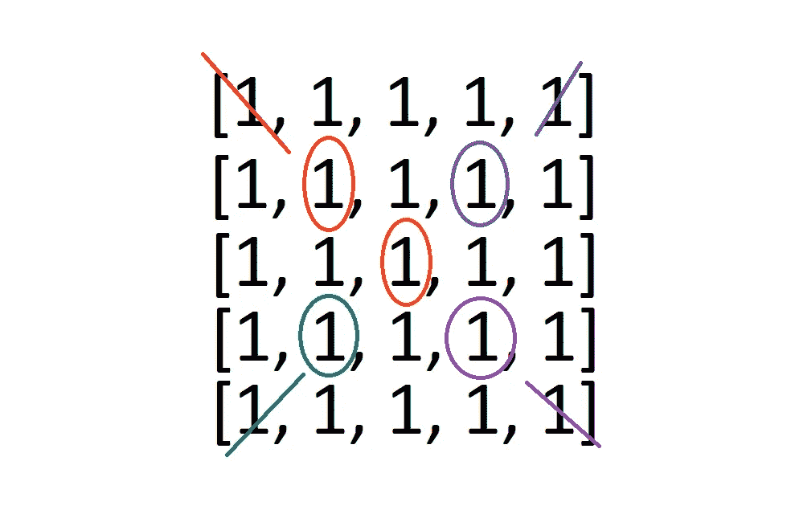

# “矩阵对角和”:LeetCode 挑战

> 原文：<https://blog.devgenius.io/matrix-diagonal-sum-leetcode-challenge-a6b49f1a7390?source=collection_archive---------7----------------------->

描述

示例 1

实施例 2 和 3

好吧，让我们来谈谈如何解决这个问题。给定一个大小为 N 乘 N 的数组，让我们从中切取一个 X，并将这些数字相加。

当解决这样的问题时，我喜欢在不同的例子中寻找相似之处，并找到一种模式，我们可以用同样的方式来解决它们。

我马上注意到的一件事是，如果数组的高度/长度是奇数，我们将只获取中间值(在本例中是值 5)一次，并将它添加到我们的总和中。然而，如果数组的长度是偶数，我们可以制作对角线切片，并将它们添加到总和***中，而不用担心意外复制中间的项目。***

***现在我们已经认识到了这一点，我们可以开始考虑如何从我们的输入数组中得到一个 X。我将通过向您展示我解决这个问题的第一种方法来开始这个解决方案，然后我们将开始寻找优化我们代码的速度/存储复杂性的方法。***

***因此，由于我们的输入数组大小为 N 乘 N(甚至长度和高度)，我们可以创建四个指针变量，每个变量都从数组的外部角开始，并随着每次迭代逐渐向中间递增。***

******

***第一次迭代***

***这里我们有四个不同的变量。在代码中，我们实际上将使用 2 个变量来跟踪每个 指针的**行**和**列**的位置，因为它朝着中间移动。我们将继续简化，但是首先，我们将使用这些变量来跟踪我们的行和列。***

******

***第二次迭代***

***在这个奇怪的数组示例中，随着变量向中间移动，它们最终会落在共享的中间值上，我们希望确保只将它添加到总和中一次，而不是 4 次。***

******

***最终迭代(第三次)***

## *****偶例*****

******

***第一次迭代***

******

***最终迭代(第二次)***

***在这个偶数的例子中，当它们到达中间时，它们有自己的值，并且可以毫无问题地将它们加到总和中。***

# ***代码***

***好吧，我们来谈谈代码。***

***通过查看示例，我认为我们要做的第一件事是考虑给我们一个只有一项的数组的可能性(顶部的示例 3)。为了避免这个问题，让我们检查数组的长度是否为 1。如果是这样，我们就退货吧。***

******

***否则，让我们做一些工作。***

***所以我们将使用一些变量来跟踪一切。这些是我们的变量。***

******

# *****循环*****

***因为我们每次迭代都将所有指针移向中间，所以我们只需要做一半长度的迭代就可以到达中间。我们的 for 循环条件将看起来像***

> *****if(I<math . floor(mat . length/2))*****

***我们使用 Math.floor()的原因是因为我们只想要长度除以多少的地板(在奇数的情况下)。***

***好吧，逻辑是这样的。***

***查看每个变量，将该索引的值添加到总和中，并相应地增加变量的索引。***

***这是每个人的样子***

******

***好的，如果我们在这一点返回 sum，我们将得到正确的长度为*偶数*的数组的 **sum** ，但是我们只迭代到 Math.floor(length / 2 ),所以在最后，我们需要检查我们正在处理的数组是否是奇数。***

***如果是，让我们取中间值并把它加到我们的和中。应该是这样的。***

******

***添加中间值***

***太好了。因此，在这一点上，一切都正常运行。这个工作的速度很快，但是我们在这里占用了相当多的空间。这是我们可以开始创造性地使用变量的地方。***

***原因是，如果我仔细观察，我会发现这些变量和其他变量的值是一样的。看一下代码，看看你是否注意到了它。这些值彼此以相同的速率增加或减少。***

***因此，我们可以将相似的组合在一起，从而节省大量空间。***

***首先，我看到**第一行**和**第一列**从 0 开始，每次迭代递增 1。对于 **fourthColumn** 和 **fourthRow 也是如此:**它们从 length-1 开始，每次迭代减 1。***

***因此，让我们创建一个名为 **inc** 和 **dec** 的变量来保存这些值。***

******

***介绍 inc 和 dec***

***因此，我们所做的是用 inc 和 dec 替换这些变量。在循环中，我们+=求和的值，并在迭代的最后增加 **inc** 并减少 **dec** *。****

***这个管用，而且更好。但是，我们仍然可以做得更好。***

***让我们用 **inc** 表示所有的增量值，用 **dec** 表示所有的减量值。只需 ***确保*** 不要更改 **inc** 或 **dec** 的值，直到记录完这些值。***

******

***2 可变解决方案***

***看看我们摆脱了多少代码！我必须说，我们以前的方法可读性更好，但这个解决方案节省了更多的空间，因为我们只使用两个变量来跟踪一切。***

***现在，只是为了好玩，让我们看看是否可以减少到只有一个变量。***

# ***变量 inc 和 dec 有关系。***

***它们都是彼此的反义词。为了得到相邻值的位置，我们只需要做一些数学运算。***

***我们可以使用单个变量“距离”,并按照 inc 的工作方式将其递增 1。***

***为了得到相反的结果，我们只需要做***

> ***[材料长度-距离-1]***

******

***一元解***

************

***这是最终结果。***

# ***我们所做的。***

***我们使用 4 个指针来跟踪我们在这个二维数组中的位置。***

***然后我们通过用 inc 和 dec 替换我们的 4 个递增和递减变量来减少代码。***

***最后，我们将其减少到一个变量，以最大化存储效率。这是一个有趣的挑战！敬请关注更多类似内容。***