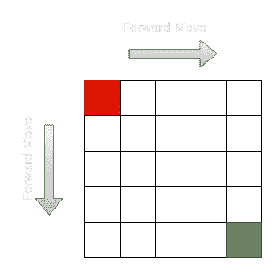
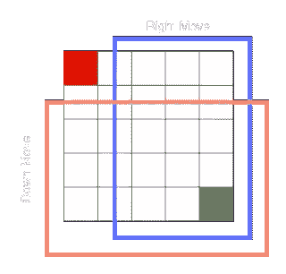
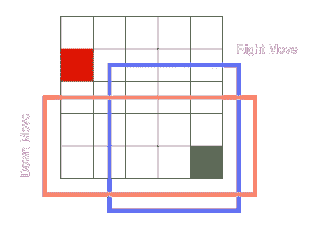
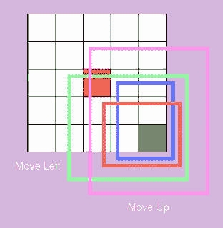
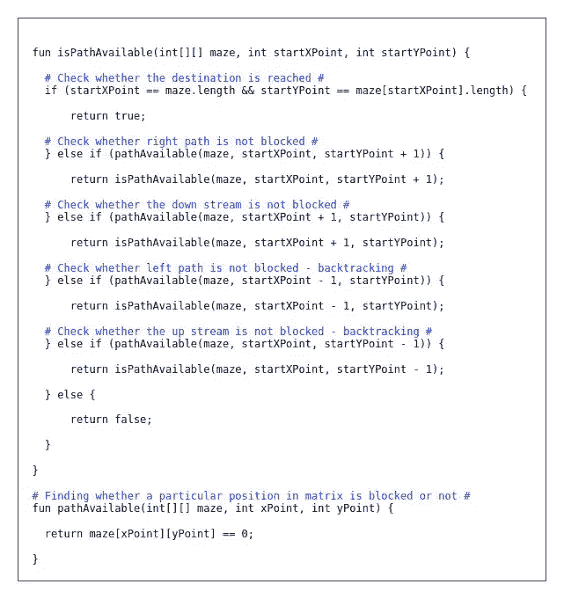
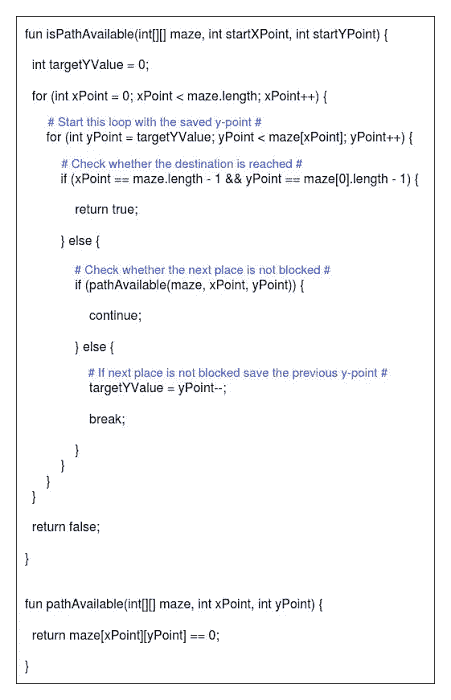
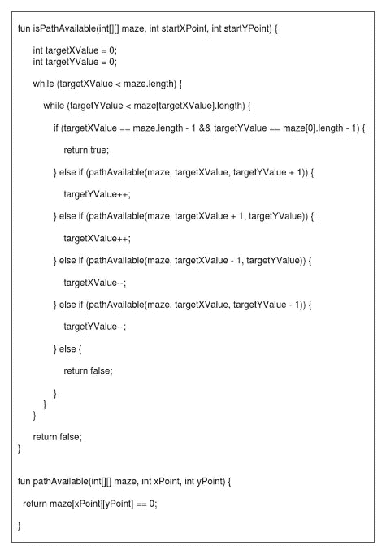

# 带回溯的矩阵遍历

> 原文：<https://blog.devgenius.io/matrix-traversal-with-backtracking-9bec469ca3b3?source=collection_archive---------2----------------------->

# 问题

最近我遇到了这个矩阵遍历的问题，我必须找到一条从起始索引到最后一个索引的路径。这里我需要做的是找到一条路径是否存在。矩阵中充满了 0 和 1，1 意味着你不能前进。“0”表示您可以前进。你可以向右、向左、向上或向下移动。不允许对角移动。

# 我的方法

最初，我无法解码，因为我只有 10 分钟来提供解决方案。我的思维过程就像一个普通的程序员。我在想当务之急。我最初的矩阵是这样的。

我试图运行两个循环(循环中的循环)。但无法在规定的时间内完成任务。然后在我的任务之后，我试图再次解决这个问题。我找到了一个解决方案，它具有向前移动的基本遍历(向右走和向下走)。其中一个主要的担心是我不能回溯(向左或向上)。

在我的作业中，我得到了一个提示，关于[递归](https://en.wikipedia.org/wiki/Recursion_(computer_science))来思考这个问题。所以，我开始用递归重新思考。

# 递归解

所以，如果你递归地思考，你必须把这个问题分成更小的部分。我们能分割的是矩阵。最初，我被误导了，认为我必须物理地分割这个矩阵(我的意思是实际上从当前矩阵创建一个部分矩阵)。但后来我认定这种划分应该是合乎逻辑的。

如果你仔细看上面的图表。你可能会看到初始矩阵的逻辑划分看起来像这样。如果右边的单元格没有被阻塞，遍历可以通过右移来完成。如果右边的单元格被阻塞了，但是初始单元格下面的单元格没有被阻塞，那么我们可以继续向下移动遍历。如果他们两个都被挡住了，那么我们就没有行动了。

让我们认为下移是可能的。那么我们最新的逻辑矩阵如下。

如果你以这种方式思考，你可能会看到，如果你向前移动，当你考虑所有可能的移动时，将会产生四个逻辑矩阵。

你可能会注意到，这里有两个新的逻辑矩阵。也就是说，我们有左移和上移(主要用于回溯)。下面是我的递归算法。

# 强制性解决方案

当我们考虑递归解决方案时，我们总是处于堆栈溢出或内存不足的危险中，因为函数调用的深度可能会重复出现(查看[此处](https://www.cs.drexel.edu/~jsalvage/2005/CS131/lectures/07.3_recursion_intro/Dangers.html?CurrentSlide=7)了解更多信息)。因此，实现问题的强制性解决方案比递归解决方案更好。

因此，我试图改进我的初始解决方案(用一种强制性的方法),它有两个 for 循环。

在上面的算法中，你可以看到有一个问题。你不能往回走(换句话说，你不能向左或向上走)。这里的问题是关于 for 循环的结构，以及我所考虑的进行到矩阵的下一个位置的逻辑。

所以，我想的是混合动态矩阵操作(动态更新遍历矩阵)&集成递归算法的遍历逻辑。

这里的关键区别是我用 while 循环替换了 for 循环。并且循环运行的逻辑矩阵将动态改变。

上述算法的 Java 实现可以在[这里](https://github.com/AyeshAlmeida/java/tree/master/matrix-traversal-sample/src/com/ayesh/sample)找到。

*最初发表于*[T5【http://ayeshforyou.blogspot.com】](http://ayeshforyou.blogspot.com/2020/10/matrix-traversal-with-backtracking.html)*。*