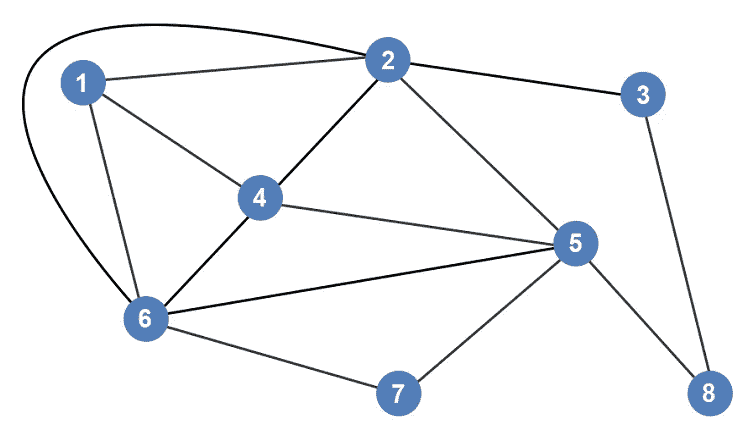
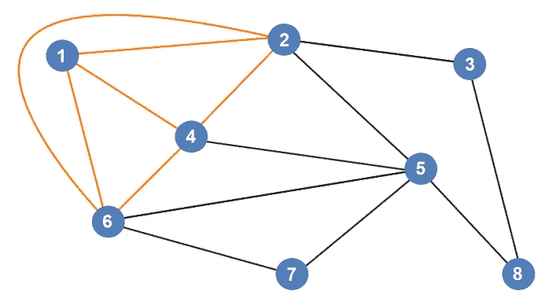
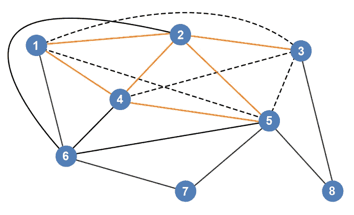
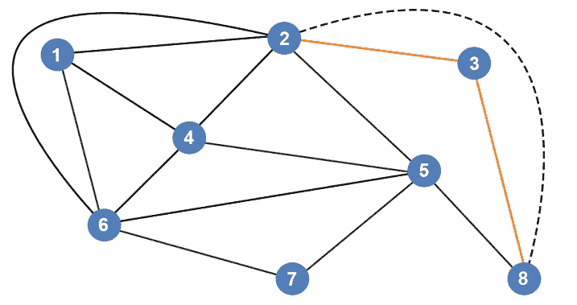
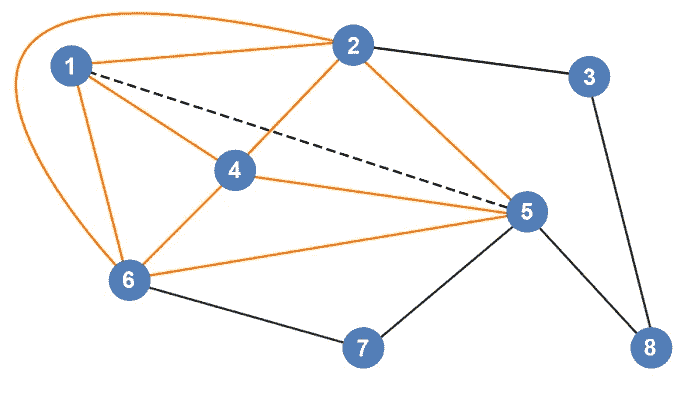
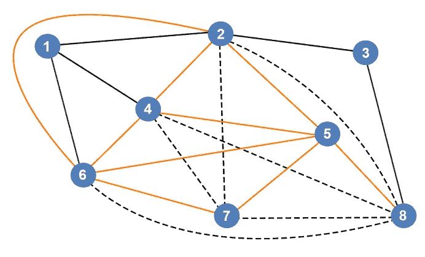
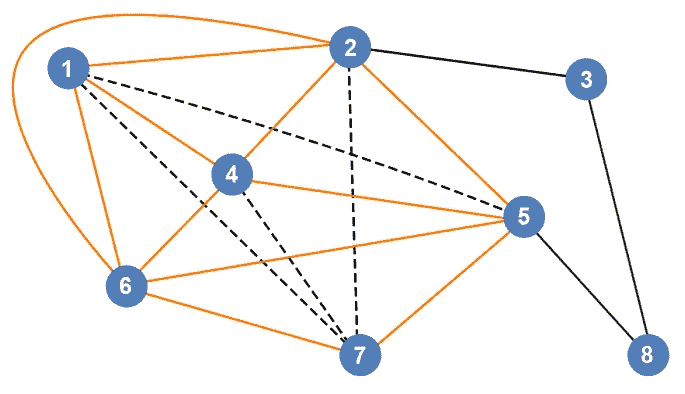
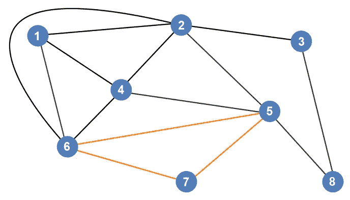
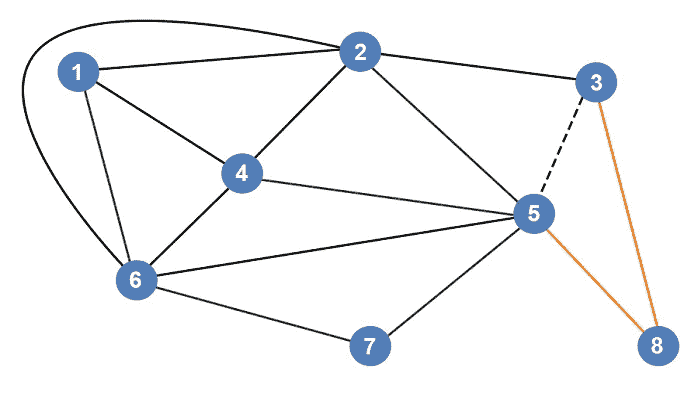
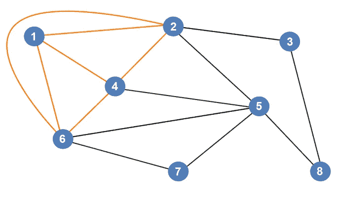

# 最大团直观解释

> 原文：<https://blog.devgenius.io/maximum-clique-visually-explained-6bc114c697ce?source=collection_archive---------15----------------------->

最大团是一种用于寻找每个顶点相互连接的最大顶点簇的技术。让我们看一个例子。我们将检查每个顶点，看看下图中最大的簇是什么。

我们来看第一个顶点。顶点 1 连接到顶点 2、4 和 6。我们需要确保这些顶点中的每一个都有相互连接。

*   顶点 2 和顶点 4 相连吗？是
*   顶点 2 和顶点 6 相连吗？是
*   顶点 4 和顶点 6 相连吗？是

看起来所有的顶点都是相互连接的，所以我们观察到的当前最大团由 4 个顶点组成:1、2、4 和 6。

让我们检查顶点 2。顶点 2 连接到顶点 1、4、3 和 5。我们需要确保这些顶点中的每一个都有相互连接。

*   顶点 1 和顶点 3 相连吗？不

继续下去没有意义。看起来我们不能使用那个顶点作为 max-clique 创建的中心点。要使顶点 2 成为最大团的中心点，所有的顶点都需要连接起来，如下图所示。

让我们检查顶点 3。顶点 3 连接到顶点 2 和 8。

*   顶点 2 和顶点 8 相连吗？不

要成为团的一部分，连接顶点 2 和 8 的边必须存在。

让我们检查顶点 4。顶点 4 连接到顶点 1、2、4、5 和 6。我们需要确保这些顶点中的每一个都有相互连接。

*   顶点 1 和顶点 2 相连吗？是
*   顶点 1 和顶点 5 相连吗？不

我们不能使用顶点 4 作为最大团创建的中心点。要创建团，顶点 1 必须有一条到顶点 5 的边。

让我们检查顶点 5。顶点 5 连接到顶点 2、4、6、7 和 8。我们需要确保这些顶点中的每一个都有相互连接。

*   顶点 4 和 6 相连吗？是
*   顶点 4 和 7 相连吗？不

我们不能使用顶点 5 作为最大团创建的中心点。要创建一个团，所有的顶点都需要连接起来，如下图所示。

让我们检查顶点 6。顶点 6 连接到顶点 1、2、4、5 和 7。我们需要确保这些顶点中的每一个都有相互连接。

*   顶点 1 和 2 相连吗？是
*   顶点 1 和 4 相连吗？是
*   顶点 1 和 5 相连吗？不

我们不能使用顶点 6 作为最大团创建的中心点。要创建一个团，所有的顶点都需要连接起来，如下图所示。

让我们检查顶点 7。顶点 7 连接到顶点 5 和 6。我们需要确保这些顶点中的每一个都有相互连接。

*   顶点 5 和 6 相连吗？是

顶点 5、6 和 7 确实形成了一个团，但是，我们已经发现了一个比这个团更大的团，所以这不是一个最大团。

让我们检查顶点 8。顶点 8 连接到顶点 3 和 5。我们需要确保这些顶点中的每一个都有相互连接。

*   顶点 3 和 5 相连吗？不

我们不能使用顶点 8 作为最大团创建的中心点。要创建团，顶点 3 需要连接到顶点 5。

我们已经看完了每个顶点。我们能够找到的最大团是由顶点 1、2、4 和 6 组成的团。

如果你喜欢你所读的，看看我的书，**算法的说明性介绍。**

**

*Dino Cajic 目前是 [LSBio(寿命生物科学公司)](https://www.lsbio.com/)、[绝对抗体](https://absoluteantibody.com/)、 [Kerafast](https://www.kerafast.com/) 、 [Everest BioTech](https://everestbiotech.com/) 、 [Nordic MUbio](https://www.nordicmubio.com/) 和 [Exalpha](https://www.exalpha.com/) 的 IT 负责人。他还是我的自动系统公司的首席执行官。他有十多年的软件工程经验。他拥有计算机科学学士学位，辅修生物学。他的背景包括创建企业级电子商务应用程序、执行基于研究的软件开发，以及通过写作促进知识的传播。*

*你可以在 [LinkedIn](https://www.linkedin.com/in/dinocajic/) 上联系他，在 [Instagram](https://instagram.com/think.dino) 上关注他，或者[订阅他的媒体出版物](https://dinocajic.medium.com/subscribe)。*

*阅读 Dino Cajic(以及 Medium 上成千上万的其他作家)的每一个故事。你的会员费直接支持迪诺·卡吉克和你阅读的其他作家。你也可以在媒体上看到所有的故事。*