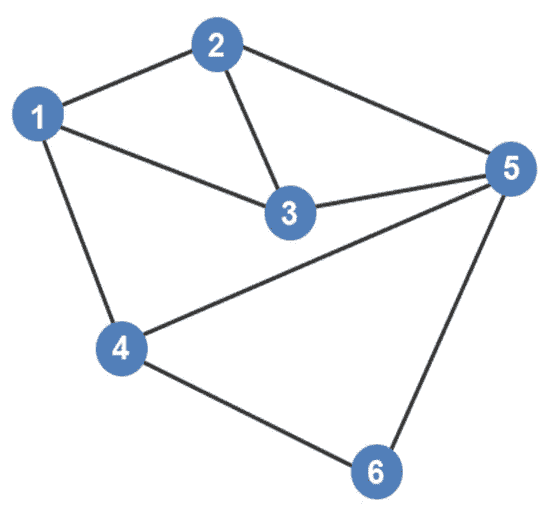
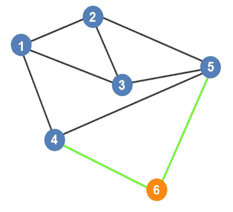
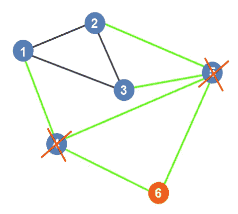
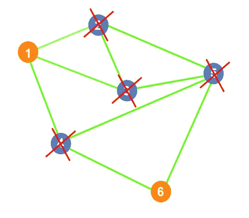

# 最大独立集直观解释

> 原文：<https://blog.devgenius.io/maximum-independent-set-visually-explained-48f7333fe049?source=collection_archive---------9----------------------->

给定一个图，如果子集中的顶点之间没有边，那么这个子集就是一个独立集。让我们看一个简单的例子，看看这是什么意思。

我们可以看到以下几点之间有一个优势:

*   第 1 点和第 2 点
*   第 1 点和第 3 点
*   第 1 点和第 4 点
*   第 2 点和第 3 点
*   第 2 点和第 5 点
*   第 3 点和第 5 点
*   第 4 点和第 5 点
*   第 4 点和第 6 点
*   第 5 点和第 6 点

当试图寻找最大独立集时，我们将试图寻找不直接相连的点的最大数量。我们从哪里开始？通常，我们会寻找一个与另外两个点相连的点。在这种情况下，唯一符合标准的点是点 6。点 6 连接到点 4 和点 5。

我们知道，由于点 4 和 5 与点 6 相连，它们不可能是最大独立集的一部分，并且连接这些点的任何边都被切断。

我们可以看到图中还剩下三个点:点 1、点 2 和点 3。如果我们选择其中任何一个点，其他两个点将自动不属于最大独立集。这很好，因为可以有多个最大独立集。对于这个例子，我们将选择顶点 1。顶点 2 和 3 将被划掉，它们所连接的所有边都将被切断。这个例子的最大独立集是 1，6。

*如果你喜欢你所读的，看看我的书，***算法说明性介绍。**

**

*迪诺·卡希奇目前是 [LSBio(寿命生物科学公司)](https://www.lsbio.com/)、[绝对抗体](https://absoluteantibody.com/)、 [Kerafast](https://www.kerafast.com/) 、[珠穆朗玛生物科技](https://everestbiotech.com/)、[北欧 MUbio](https://www.nordicmubio.com/) 和[艾阿尔法](https://www.exalpha.com/)的 IT 主管。他还担任我的自动系统的首席执行官。他有十多年的软件工程经验。他拥有计算机科学学士学位，辅修生物学。他的背景包括创建企业级电子商务应用程序、执行基于研究的软件开发，以及通过写作促进知识的传播。*

*你可以在 [LinkedIn](https://www.linkedin.com/in/dinocajic/) 上联系他，在 [Instagram](https://instagram.com/think.dino) 上关注他，或者[订阅他的媒体出版物](https://dinocajic.medium.com/subscribe)。*

*阅读迪诺·卡吉克(以及媒体上成千上万的其他作家)的每一个故事。你的会员费直接支持迪诺·卡吉克和你阅读的其他作家。你也可以在媒体上看到所有的故事。*