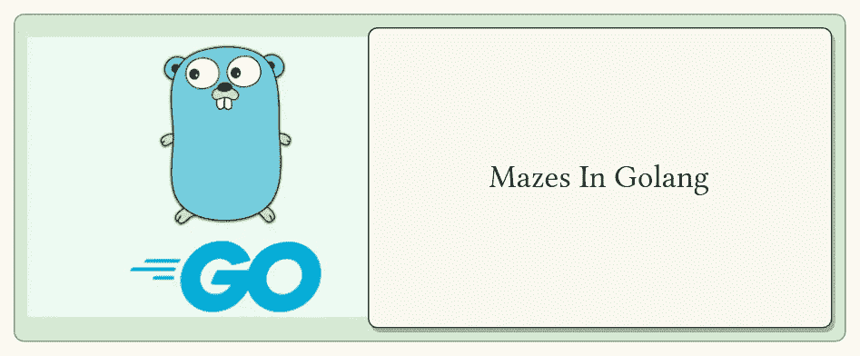

# 1.1 戈朗的迷宫

> 原文：<https://blog.devgenius.io/mazes-in-golang-bdd247c39a79?source=collection_archive---------1----------------------->

## 递归和回溯-第 1 部分



## 定义

> **数组:** *连续分配和收集同质元素。* **2D 数组:** *二维数组表示大小为[r×c]的矩阵，其中 r 表示行数，c 表示列数。*

## 先决条件

*   数组/ 2D 数组中的遍历。

# 递归

***问:什么是递归？***
*A.* 递归是**就自身而言被定义的东西**。在编程界，这个**东西**是一个叫做递归函数的函数。

***问:什么是递归函数？***a .*递归函数是通过调用自身的副本来解决问题的函数；因此就其本身而言。*

****问:我们如何中断这个函数调用？这不是无限通话吗*😕*…*** *a .*这些函数旨在通过将较大的问题分解成较小的子问题来解决，直到问题得到解决或达到终止条件。让我们用一个例子来理解这一点。
**对于 Eg.** 从`A -> B -> C -> D`有一条路径。问题说“我能从 A 点到 D 点吗？”
所以我们可以问自己以下问题…*

***主要问题:** *我能到达 A 点到 D 点吗？* **子问题 1:** *我能到达 A 点到 C 点吗？* **子问题 2:** *我能到达 A 点到 B 点吗？* **子问题 3:** *我能到达 B 点到 C 点吗？* **子问题 4:** *我能到达 C 点到 D 点吗？**

*每次我都问自己同一个问题，即两点之间是否存在路径。并且，每个问题的中间点数减少 1。如果我得到了这些问题的答案，我可以肯定地说，我们可以到达 d 点。现在关于走出环路的问题，很容易得出结论，当我们完成所有景点的旅行时，我们可以走出环路。如果我们达到 D，那就是成功，否则就是失败。*

****问:为什么要递归？*** *A.* 简单的回答是，每当一个巨大的任务需要被分解成更小的任务时，我们可以借助递归；条件是，即使我们将任务分解成多个子任务，每个子任务的问题陈述保持不变。*

## *递归树*

> *n**ote:**在递归下，我们要多次求解同一个子问题。这可以使用动态编程进一步优化(**)。***

**让我们用下面的问题来理解这一点**

****

****Q .打印从点 A (3，3)到 B(1，1)的所有可能路径数。
Q .打印从 A 点(3，3)到 B 点(1，1)的所有可能路径。****

> ****约束:** *为了简单起见，只有合法的步骤是向右移动和向下移动。***

****分析:**根据给定的约束条件，我们只有两种可能的选择，要么向右移动，要么向下移动。**

**由于一个矩阵是行和列的组合，我们可以在到达目的地时观察以下几点:
*1 .每当我们向右移动时，我们就向下移动一列，即列值减一。例如(3，3)——>(3，2)
2。类似地，每当我们向下移动时，我们就向下移动一行，即行值减一。例如(3，3)——>(2，3)
3。当这个减量达到第 1 行和第 1 列时，我们就到达了目的地。
4。每当我们到达最后一列时，我们不能继续下一列，即列值为 1，我们需要停止递归。
5。每当我们到达最后一行时，我们不能继续下一行，即行值为 1，我们需要停止递归。***

****目标 1:** 显示从源(3，3)到目的地(1，1)的所有可能的路径计数。**

****

**我们来评价一下条件:
*1。每当我们到达 row:1 或 column:1 时，我们就可以得到路径的数量。当我们到达 row:1 或 column:1 时，有一条从该行到最后一个单元格(1，1)的路径。
2。我们需要避免超出行:1 或列:1，即在行:1 或列:1 终止函数调用。***

****目标 2:** 显示从源(3，3)到目的地(1，1)的所有可能路径。**

****

**我们来评估一下条件:
*1。我们需要遍历列，直到列:1，
2。我们需要遍历行，直到行变成行:1。
3。当我们到达最后一个单元格时，即(1，1)，我们需要避免超出行:1 和列:1，即行:1 和列:1 处的终止函数调用。我们可以打印整个路径。***

# **密码**

**包有助于维护代码。它还提高了代码的可读性。go 中的本地包只不过是一个包含 go 文件的目录。这里我们有一个包含`maze.go`文件的迷宫文件夹。**

> ****注意:** *一个包目录下的所有文件必须涉及相同的包名。***

```
**// Directory Structure
.
├── go.mod            // Mod File  
├── main.go           // Main
└── maze              // Package
    └── intmaze.go**
```

## **1.带进口的包装定义**

```
**package mazeimport "fmt"**
```

## **2.类型定义**

```
**type MazeServicer interface {
    RightDown()
}type maze struct {
    rows int
    cols int
}**
```

## **3.方法**

```
**func (m *maze) RightDown() {
    fmt.Println("Count:", countRightDown(m.rows, m.cols))
    printPathRightDown("", m.rows, m.cols)
}**
```

## **4.递归函数**

*   **统计从`Point(3,3)`到`Point(1,1)`的可用路径总数。**

```
**func countRightDown(r, c int) int {
    if r == 1 || c == 1 {
        return 1
    }
    down := countRightDown(r-1, c)
    right := countRightDown(r, c-1)
    return down + right
}**
```

*   **打印从`Point(3,3)`到`Point(1,1)`的所有可用路径。**

```
**func printPathRightDown(path string, r, c int) {
    if r == 1 && c == 1 {
        fmt.Println(path)
        return
    }
    if r > 1 {
        printPathRightDown(path+"D", r-1, c)
    }
    if c > 1 {
        printPathRightDown(path+"R", r, c-1)
    }
}**
```

## **5.构造器**

**用所需的行和列初始化迷宫指针(r，c)。返回迷宫指针。**

```
**func InitMaze(r, c int) MazeServicer {
    return &maze{
        rows: r,
        cols: c,
    }
}**
```

# **主要的**

```
**package mainimport "dsa/maze"func main() {
    m := maze.InitMaze(3, 3)
    m.RightDown()
}/*
Count: 6
DDRR
DRDR
DRRD
RDDR
RDRD
RRDD
*/**
```

***希望这篇文章有助于对 golang 中的递归有一个基本的了解。如有错误或进一步建议，请在下方评论。谢谢！***