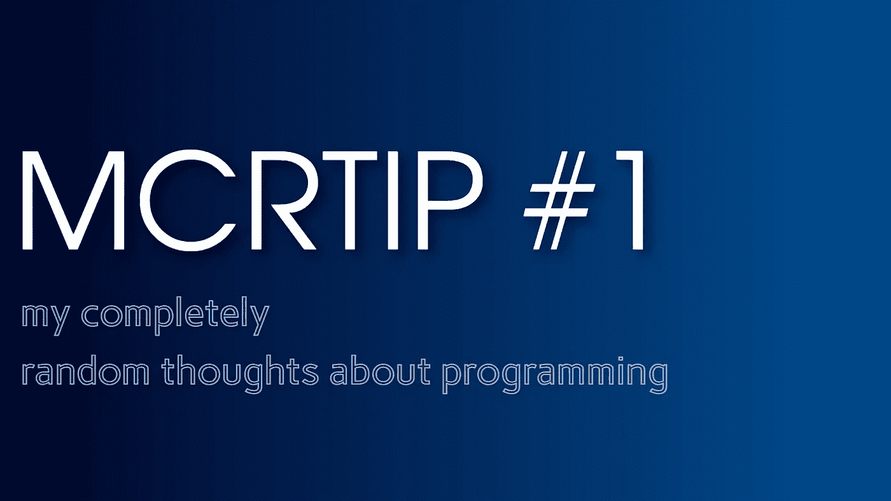
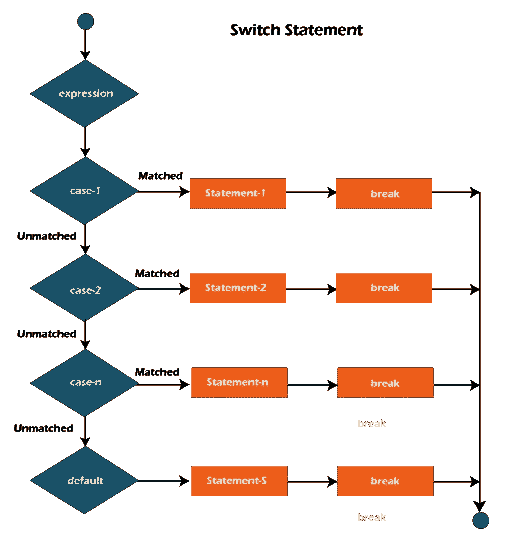
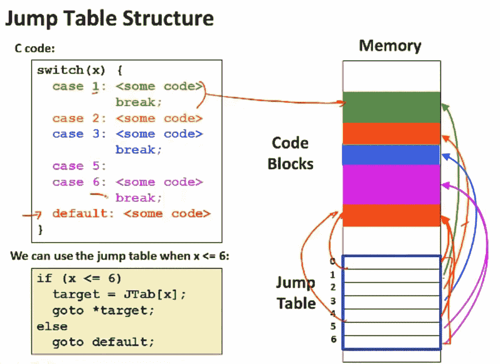
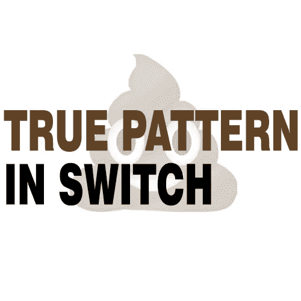
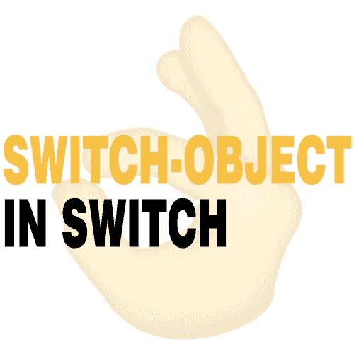

# MCRTIP #1 /简单的困难

> 原文：<https://blog.devgenius.io/mcrtip-1-difficult-about-simple-2df82ad79e52?source=collection_archive---------5----------------------->



> **MCRTIP** 只是我对编程的一些想法的汇编。仅依我看。

## 今天我们来谈谈:

1.  用**三元运算**代替 **if/else 语句**
2.  **对象【案例】**而不是**开关/案例**
3.  **合成**和**分解**
4.  **CSS-IN-JS** 和**原生 html 标签**
5.  **数学题*数学题*数学题**而不是关于**数学题**

# #1 |使用三元运算代替 if/else 语句。

**不喜欢 if/else 语句，**

这真的很难解释为什么，但当我看到 ***if*** 语句时，我总是用三元运算重写它。

```
if (condition) {
 action1()
} else {
 action2()
}
```

我认为 ***if*** 语句看起来像一个肮脏的黑客，但这是一个非常有争议的案例。当你使用它的时候，你只是说你有一些特殊的情况，当默认计算不合适的时候。

> B *ut 当你*实现*一个算法的时候——你可以使用它。*

## ***为什么我不喜欢 if 语句:***

1.  ***如果*** 看起来像一个肮脏的黑客，我们使用另一个不适合其他规则的规则来处理当前值。
2.  ***如果*** 是语句，我喜欢用表达式代替语句。
3.  当我声明一个变量时，我不能使用 ***如果*** 但是使用三元运算对我有帮助。
4.  对于自动化和给你的函数添加多态性- ***切换*** 更容易理解。
5.  通常低级编程语言不会为数据类型**提供内置方法，但是在高级编程语言中**会提供内置方法，通常这些方法使用封装。 ***通常是*** ，如果你在类中传递一些参数——这个类建议你改变输入参数的方法*。* ***接下来是*** ，你关于输入值的异常行为和为这些情况添加检查的想法已经实现，你所有的 ***if*** 操作你也使用过。 ***随便用。***

> 当然，当我谈论 **if** 时，我指的是在 if 语句中不能使用 return 替换 else 块的情况**。**

我更喜欢三进制运算**，但是**如果你只是在编程——你可以想:“只有在语句使用三进制时，我才能替换**？”。 ***没办法。不可能。酪*** 我用 ***逻辑运算*** 。**

我不知道为什么，但我很少看到开发人员使用不带语句的逻辑运算的情况。同时，我在任何可能的地方和真正需要的地方使用它。

```
const fbi_bd = [
  { name: "John Alvin", arrested: true, age: 35 },
  { name: "John Paul", arrested: true, age: 21 },
  { name: "John Doe", arrested: false, age: 23 }, 
  { name: "John Doe", arrested: false, age: 19 }, 
];const names = ["John Paul", "John Alvin"];
const criminals = [];const arrested = fbi_bd.forEach((criminal) => {
  if (criminal.arrested === true && criminal.age >= 20) {
    if (names.filter(name => name === criminal.name)) {
      criminals.push(criminal);
    } else {
      criminals.push("-")
    }
  } else if (criminal.age <= 20) {
    criminals.push([criminal, "young"]);
  } else {
    return criminal;
  }
});console.warn(criminals);
```

使用逻辑运算，我们可以更新这个。

```
const fbi_bd = [
  { name: "John Alvin", arrested: true, age: 35 },
  { name: "John Paul", arrested: true, age: 21 },
  { name: "John Doe", arrested: false, age: 23 }, 
  { name: "John Doe", arrested: false, age: 19 }, 
];const names = ["John Paul", "John Alvin"];
const criminals = [];const arrested = fbi_bd.forEach((criminal) => {
  criminal.arrested === true && criminal.age >= 20
  ?
    names.filter(name => name === criminal.name) && criminals.push(criminal)
    || criminals.push("-")
  : criminal.age <= 20 
    ? criminals.push([criminal, "young"])
    : criminal
});console.warn(criminals);
```

> 我同意，这只是一个有争议的情况，你可以用 **if** 代替三元运算。

# #2 |使用 object[key]而不是 switch/case

为了公平起见，我们来谈谈 switch/case 和 if/else 的区别。



[来源](https://www.javatpoint.com/java-switch)

当我们使用 ***开关*** 语句时，编译器使用 ***跳转/分支表*** 并且当 ***开关*** 得到一个数据——编译器将 ***开关*** 中的一个数据与其它情况下的值进行比较。同时， ***if*** 计算每种情况下的数值，并进行比较。



[来源](https://www.youtube.com/watch?v=1r6oflIjC6Q&t=275s&ab_channel=LuisCeze)

> D 不要害怕 **goto** 语句和 **C** 编程语言，这个例子只是展示了**跳转/分支表**如何工作。

## 我应该关心这个吗？

**不**，这些微优化不太可能影响你的代码。

## 您可能听说过 switch 中的真实模式。

*我也是* ***我不喜欢*** *。*



关于这种模式的争议比没有更重要。如果有孩子问我***` if 和 switch 有什么区别？`*** 下面我来回答一下:

> 让我们想象我们在图书馆里。

1.  ***/***
    当你知道谁写了***'*'*'***-*时，你会发现书立上有字母***【G】。
    ‘戈尔丁’***是值为 ***的开关*** ，其他书立用字母从’***一个*** 到***【Z】***都是 ***的情况为开关*** 。
    *我们用* ***切换*** *因为* ***所有情况下都是静态的*** *和* ***我们不应该做任何计算*** *因为我们已经把* ***中的所有字母都摊上了*** *。**
2.  ****IF /*** 当你不知道这是谁写的时候——打开你的阅读书单找到它，当你找到的时候——发现这是谁写的。之后，像第一个例子一样做同样的动作。
    ***让我们想象一下*** ，那个 ***阅读书单是数组，*** 我们迭代它，为 ***添加条件如果*** 并且当我们找到书名相当于'**《蝇王》** -我们返回作者的姓氏。*

*我希望你明白 switch 和 if 之间的区别，但有些人不明白。有些人在开关中使用 ***真实模式*** :*

```
*switch(true) {
 case 2 + 1 === 3:
  return "yep";
 case 2 + 1 === 4:
  return "nope";
 default:
  return "wait";
}*
```

> *我不喜欢这种模式，我有一些理由:*

1.  *我们在 ***用例*** 中没有任何静态值，编译器必须计算每个*用例，并将此与*真值进行比较——它会杀死**j*UMP/分支表结构*** 。***
2.  *****your object【key】***完全取代了 ***switch*** 并使用 ***nullish 聚结*** 可以取代 ***默认*** 行为。
    ***我下面谈谈吧(2)*****
3.  *****开关*** 更多的是关于可读代码而不是代码速度，并且在 ***情况下包含这个单静态值*** 优于表达式。**
4.  **使用这种模式，你不用等待哪种情况是真的，这种逻辑杀死你的应用系统。**

****在第二点(2)** ，我写了关于*对象*和*开关*。我经常用 object 代替 switch。这种模式我称之为 ***开关——对象*** 。**

****

**让我们举一些例子**

```
**// using true pattern
switch(true){
 case 2 + 3 === 5:
  action();
  return "Yes";
 default:
  return false;
}// using switch-object pattern
const keys = {
 5: () => {
  action()
  return "yes"
 } 
}// make some operations
keys[5]() ?? false // default behavior**
```

## **总的来说:**

1.  **switch/case 比 if/else 可读性更强，速度更快。**
2.  *****真实模式*** 不好，用 ***切换-对象模式*** 。**

## **汇编**

**如果说实话，如果你不在乎怎么切换作品——不在乎。当编译器读取开关/case 时，它创建相同的 if/else 语句。**

# **#3 |成分和分解**

**我每天都在创建应用程序的*。***Piece***——是组件、新功能、类以及一切我们可以用来创建应用的东西。 ***通常是*** ，当你在开发一个*片-* 时，你分解你的功能。***

****即**你需要创建*新闻页面*——你创建*文章组件*，在*文章组件*——你渲染/更改/删除一个数据**和*为这个*** 你使用函数。**

*****你到处用函数。*** 当你编写大组件并分解它们以便更好地理解时，通常你也试图按含义分解不同的东西，即你不应该为 ***新闻页面*** 和****用户页面*** 中的****get 但是有些情况下你应该忘记这一点。 ***例如*** ，你创建 ***NewsProvider*** ，它建议你使用 ***News page*** 的函数，同时在 ***News page*** 中你创建 ***文章组件*** ，它也需要一个用于本地工作的函数——你提供它们。最后， ***NewsProvider*** 有 10 多个函数，而***article Provider***只有 2 个函数:***‘我应该为这个案例创建一个新的提供者吗？’。**********

***否**。提供商将你的应用程序包装在一个布局中，以获得两个功能，这是**不允许的**。只要把两个你的供应商合二为一，顺其自然不是分解而是有时常识取胜。*

> *如果你明白你的作品用途超出了建议的范围——不要分解它。*

# *#4 | **CSS-IN-JS** 和**原生 html 标签***

*在我们的项目中，我们在可能的地方到处使用 ***CSS-IN-JS 模式*** 。通常，当你使用 ***CSS 模块模式*** 或者不同的模式时。你可能会使用一种命名方式，可以是 ***BEM、SMACSS、SMACSS*** 和其他。我没有看到***CSS-IN-JS 的相同模式，只有*** 是这样的:*

1.  ***包装器**——组件中的主标签。*
2.  ***内容** -包装标签后的标签。*

**和不同的标记。**

*但是如果你在某些情况下不改变标签的一个原始行为- **为它们创建样式化的标签。我总是为它们创建标签，因为另一个开发人员在看到你的代码时可能不明白这是什么。***

> *创建一个风格化的标签而不是本地标签，即使本地标签的行为适合你。*

# *# 5 |***math . functions***但不约 ***math****

*当我们创建 ***应用程序/网站/微控制器/人工智能时，我们到处都在使用数学函数。*** 许多开发者认为 ***数学函数*** 仅仅是关于数学，但是**数学函数是 clean 函数的例子。为什么？***

## **首先我们应该定义什么意思——明确功能？**

*清晰函数是包含****确定性*** 和 ***无副作用的函数。来说说这些:*****

## **副作用**

**当你的函数执行退出函数上下文，然后改变全局环境: ***更新状态，可变值等*** 。这就是所谓的 ***副作用。*****

## **决定论**

**这种函数返回相同值的可能性，即使参数不变。**

```
**console.warn(“Test”); // "Test"
console.warn("Test"); // "Test"Math.abs(-3); // 3
Math.abs(-3); // 3**
```

**如你所见，我们可以随意调用这些函数——结果不会改变。**

## ****幂等的****

**这种函数返回相同值的可能性没有副作用。如果说实话，我看不出任何*的决定论函数使*产生副作用，但这是值得了解的。****

***在这之后，我们可以说 ***Math.functions*** 的价值不仅在于它们封装了数学运算的算法，而且它们也是 c***lear function***的好例子。***

> **如你所知***math . random()***不清楚，希望你知道原因。**

# **结论**

**我希望你喜欢它，并为自己发现一些新的东西。**

**谢谢，祝你好运！**