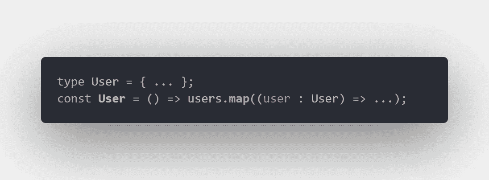
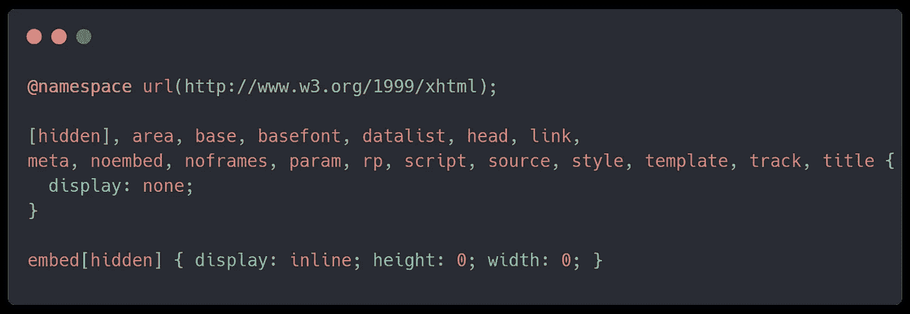
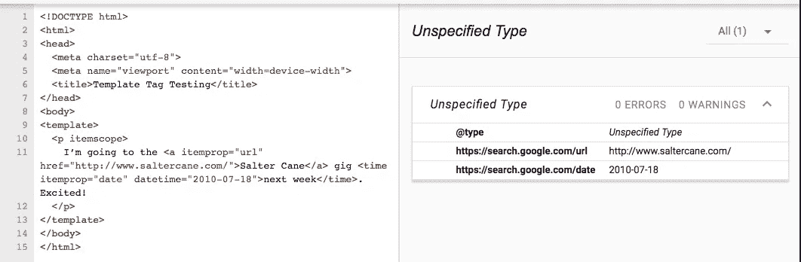

# MCRTIP #2 /小而快

> 原文：<https://blog.devgenius.io/mcrtip-2-small-and-fast-4d485710edb0?source=collection_archive---------18----------------------->


> ***MCRTIP*** *只是我对编程的一些想法的汇编。仅依我看。*

**今天我们来谈谈:**

1.  为什么我不在 CSS 中使用十进制数**和**
2.  为什么我使用类型关键字导入类型
3.  为什么我不用**像素**来表示**字体大小**
4.  为什么我不在 TS 中使用**匈牙利符号**和**前缀**
5.  **显示:块**和**脚本标签**
6.  *模板标签*和 **seo**

## #1 |不要在 CSS 中使用十进制数

```
padding: 25.7px;
font-size: 12px;@media screen and (max-width: 1200px) {
 .Header {
  padding: 12.3px 20px;
 }
}
```

正如你所看到的，在这个例子中，我使用十进制数填充和字体大小，当我想改变媒体查询中的标题填充时，我也使用它。

> ***不幸的是*** ，这个错误让 90%的 HTML/CSS 初学者犯。

我们来谈谈可以看到这一点的案例:

1.  你的布局不够灵活和灵敏。 ***你的布局是石头*** 。
2.  当您使用 ***N*** 设备时，您突然发现您的布局被破坏，并且您只想更改 ***N x N*** 的样式。

> 当我看到这个时，我有两个问题:

1.  ***N - 1*** 和 ***N + 1*** 之间发生了什么如果你在用***N . decimal part***。比如你为什么用 ***16.7px*** ？那么 ***16px*** 或者 ***17px*** 呢？
2.  你确定像素是最好的单位吗？

# 为什么你不应该用这个？

我们不能说 16.7px 就一定是用户浏览器里的 16.7px。 ***不同的浏览器舍入数字不同。***

```
Chrome 20 rounds to 15 decimal places
Firefox 3.0 truncate to 3 decimal places
...
```

如你所理解的，你的想象你的内容会有填充: ***16.7px*** 可能是假的*。*

**还有**，当你创建一个复杂的布局，例如网格布局，并且你使用十进制数作为容器，例如 ***102.542px -*** 所有子元素的宽度百分比都将使用 ***102.542px*** 来计算，并且你理解内存中的大数字，当你创建一个包含许多子元素的布局时，你应该理解它。

# 但是…

1.  **使用像素时不要使用十进制数**
2.  **用百分比代替 px。
    当你使用百分比像***50.5%***-***50.5%***会在每个浏览器中出现。**
3.  **为包装添加一个十进制数 px，为您要更改的项目添加一个百分比。**

## **#2 |导入类型时使用 type 关键字**

> **[这个特性是大多数用户可能永远不会想到的](https://www.typescriptlang.org/docs/handbook/release-notes/typescript-3-8.html#type-only-imports-and-export:~:text=This%20feature%20is%20something%20most%20users%20may%20never%20have%20to%20think%20about%3B%20however%2C%20if%20you%E2%80%99ve%20hit%20issues%20under%20isolatedModules%2C%20TypeScript%E2%80%99s%20transpileModule%20API%2C%20or%20Babel%2C%20this%20feature%20might%20be%20relevant.)**

**当 u 使用 **type** 关键字导入 *type/interface* 时，u 只能将其用作引用值。**

# **为了什么？**

1.  **装入胶囊**
2.  **提高处理性能。
    **如何？****

**关于捆绑，webpack 使用不同的逻辑来导入带有 ***类型的*** 关键字。**

## **#3 |使用 rem 代替 px**

**作为字体大小的单位，rem 更容易扩展，当你开发你的应用程序时，你应该明白你的显示器并不是最大的测试框架。**特别注意，**我知道 px 用起来更舒服，因为你可以只创建一个静态值，它会被硬编码，但当你使用 rem 时，你必须这样计算:**

```
:root {
 font-size: 18px;
}1.2rem = 21px(~)
```

**但在现实生活中，当我使用一些网站看电影时，我总是看到小界面，因为所有内容都是用 px 单位创建的。为了避免这种情况，当我们谈论字体大小时，用 rem 代替 px。**

## **#4 |我不在 ts 和匈牙利符号中使用前缀**

**我没有对类型 使用 ***T，对接口*** 等使用 ***I。当您使用这些前缀作为命名的一部分时，会破坏封装。我看到很多开发商。NET 对类型使用前缀，但我没有这样做。我认为写前缀就像匈牙利记谱法的一个子风格。你应该把你代码的每一个部分都看作是独立的个体。 ***提供一个名字，意思不是返回值的类型。描述函数逻辑的唯一名称。********

# **但是如果我们重复名字呢？**

****

**我经常看到这样的情况。我们使用一个 ***用户*** 名称作为类型，因为我们想作为独立的东西引用，我们也为 React 组件这样做。 ***如何修复？*****

1.  **添加 ***信息*** 前缀为 ***用户类型*** 。**
2.  **将地图中的 ***用户名*** 改为 ***当前用户*****

> **尝试为你的东西创建一个唯一的名字，不要使用任何系统前缀。**

## **#5 |关于标记脚本和显示:块**

**试添加一个标签脚本- ***显示:block*** 。你看到了什么？你看你用标签脚本写的代码。**但是为什么呢？**因为脚本是一个标签，它有一个 shadow-dom。如你所知，默认的脚本标签是 ***显示:无*** 。**

****

## **#6 |模板和搜索引擎优化之争**

**当我们谈论 SSR 和 CSR 时，我们通常认为 SSR 比 CSR 更快，但我们必须明白，当我们创建一个大的架构并且可能有困难的性能时，我们可以谈论速度。当我们只是创建一个单一的项目应用或一个简单的登陆时，我们可以使用 CSR 和 ***不要担心性能*** 。如你所知，当我们使用 CSR 时，我们得到一个 HTML 文件，用户的浏览器将 JavaScript 语法转换成由 ECMAScript5 标准编写的 JS 代码，然后在 HTML 中添加 JavaScript。但是许多开发者认为这是 SSR 优于 CSR 的主要原因。**

****但是 CSR 和 SSR 的主要区别是 SEO 优化。** SEO 僵尸程序只运行两次 JS 代码*。**第一次**，JS 代码前**和**后【当我们得到这个。但是当我们使用 CSR 时，我们不能说第二次浏览器就停止发送 JS/CSS/Images 请求。并且 SEO bot 不能理解页面的内容，因为它没有这方面的任何信息，或者没有足够的关键字来理解内容。***

******但是在同一时间*** ，我们有一个**模板**标签，为使用 JS 向 HTML 添加内容添加超时。***

******

***[src](https://stackoverflow.com/questions/41411960/does-google-crawl-content-inside-html5-template-tags)***

***正如你所见，谷歌搜索引擎优化机器人看到了我们使用**模板**标签添加的内容。为什么会发生这种情况？因为第二次 SEO bot 读取 JavaScript 并使用。***

# ***结论***

***我希望你喜欢它，并为自己发现一些新的东西。***

***谢谢，祝你好运！***