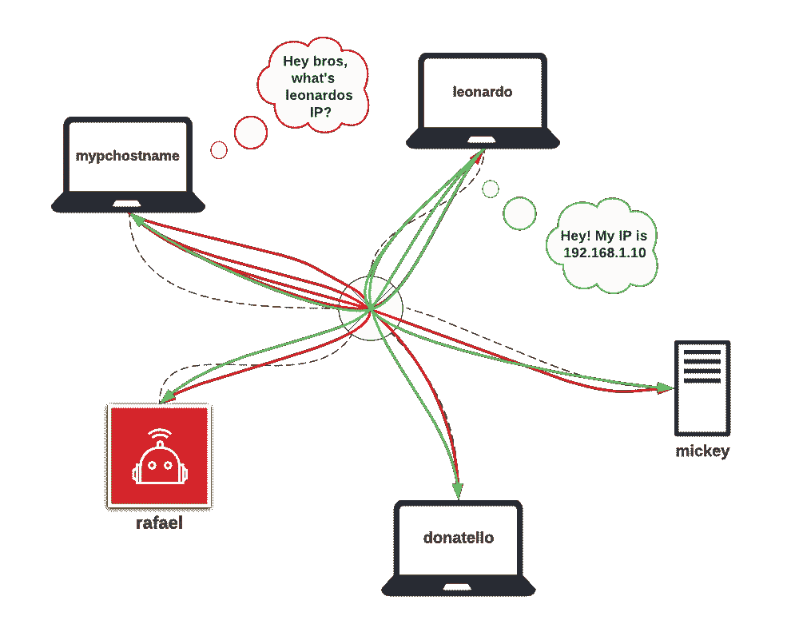

# 释放 mDNS 的力量:理解和实施开发运维、机器人和物联网技术

> 原文：<https://blog.devgenius.io/mdns-and-why-should-you-care-c8c947403322?source=collection_archive---------5----------------------->

无论你是 DevOps 工程师，从事机器人工作，还是管理物联网设备，mDNS 都是游戏规则的改变者。它已经存在了一段时间，但许多专业人士仍然不了解它的全部潜力。在这篇文章中，我将向你展示它是多么容易设置，以及它如何能把你的网络技能提高到一个新的水平。


照片由来自 [Pexels](https://www.pexels.com/) 的 Brett Sayles 拍摄

# 多播域名系统== mDNS

让我们首先打破神话——**代表[多播 DNS](https://en.wikipedia.org/wiki/Multicast_DNS) (域名系统)，它是一种**协议，在不包括本地名称服务器的小型网络内将主机名解析为 IP 地址。**在**一群**技术娴熟的人群中，你会经常听到这是一种[零配置](https://en.wikipedia.org/wiki/Zero-configuration_networking#Name_service_discovery)服务。因此，如果你以前使用过 DNS，这可能会让你大吃一惊，但是你实际上并不需要一个 DNS 来解析本地网络上的主机名。但是怎么做呢？**

**对于新手来说，我还是想强调一下**为什么一开始就要费心在 IP 和主机名之间进行转换呢？**基本上，我不知道有谁喜欢记住一个 32 位的数字(IPv4)或 128 位的数字(IPv6 ),而不是一个像 *myserver 这样简单的名字。*也许有一个，他可以跳过这篇文章:)换句话说，当你 SSH 或 ping 你的本地服务器时，你会喜欢做这样的事情吗:**

```
**ping leonardo.local**
```

**或者**

```
**ssh ubuntu@leonardo.local**
```

**而不是:**

```
**ping 192.168.1.12**
```

**或者**

```
**ssh ubuntu@192.168.1.12**
```

**如果你有一个静态 IP 的设备，记住它可能不是这样一个问题，但是想象一下你正在你的房子周围运行一群 Raspberry Pis 或物联网设备——你真的能够记住它们吗？**

**好吧，对于你们中已经了解 SSH 的一些人来说，是的，有一个简单的解决方案，只需简单地配置`***~/.ssh/config***`，但这只是客户端配置，而 mDNS 也可以作为服务器端配置，我们将在后面看到。**

**在 Linux 中，有几种方法可以配置主机名解析，但是让我来告诉您为什么以及何时最好的选择是使用 mDNS。**

# **/etc/hosts 文件**

**配置您的分辨率的最明显和最简单的方法是将网络上每个主机的条目添加到`***/etc/hosts***`文件中。给你一个例子——你可以为这篇文章这样配置它，一切都会工作:**

```
**127.0.0.1 localhost**
**127.0.1.1 mypchostname****192.168.1.10 leonardo**
**192.168.1.11 mickey**
**192.168.1.12 donatello**
**192.168.1.13 rafael**
```

**所以当我使用`***leonardo***`关键字时，在这个文件中的查找会将它翻译成`***192.168.1.10***`。很简单，但是这种方法有什么问题吗？**

**这只是一个**客户端配置**，所以解析只能在这个`***/etc/hosts***`文件所在的设备上工作，而不能在`***leonardo***`上工作。除此之外，我个人不喜欢它，因为你必须**手动更新文件**并且在有许多设备加入和离开的网络上——那个任务只是乏味的。此外，由于 DHCP，每台设备的 IP 会随着时间的推移而改变，但确实可以通过在服务器上设置静态 IP 来缓解这种情况，这也是一种静态配置。**

# **在路由器上配置 DNS 表**

**其他选择是在路由器本身上配置 DNS 表，但是**不是所有用户都可以访问路由器配置**，尤其是当你在总部或研究实验室中做这件事的时候。如果每个人都可以自由访问路由器，您可能需要与您的网络管理员沟通，因为任何人都可以更改其配置并影响整个本地网络。**

**令人难过的是，大多数人仍然不会费心去配置`***/etc/hosts***`，但我对自己说:*“好吧，肯定有更好的方法来做这件事”。*还有就是！**

# ****mDNS 的优雅解决方案****

**它是如何工作的？一位智者曾经说过:*“一图胜千言”*。从`***mypchostname***` 开始，向本地网络上的所有设备广播查询(红线)。然后`***leonardo***`做出响应(绿线)并将其广播给网络的其他部分。**

****

**mDNS 程序**

**同样，**红线**表示一个[**IP 多播**](https://en.wikipedia.org/wiki/IP_multicast) **查询**消息，该消息要求具有该名称的主机识别其自身。**绿线**代表`***leonardo***`****响应****组播包含其 IP 地址的消息，因此，该子网中的其他机器可以使用该信息更新其 mDNS 缓存(并且不需要后续调用*`***leonardo***`*是谁】*)。因此，当机器需要解析名称时，它会检查其 mDNS 缓存，如果主机名的 IP 不可用，它会在映像上执行该过程。*******

*****请注意，**没有必要使用路由器或交换机来连接设备，只要两台设备之间有网络连接，mDNS 也可以使用接入点(AP)** 。我提到 AP 是因为我曾经很好地利用了它。*****

*****长话短说，我在用户连接到其 AP 的机器人上设置了一个 mDNS。因此，用户可以使用以下方式*开箱即用*连接到我的机器人:*****

```
*****ssh ubuntu@mybestrobotintheworld.local*****
```

*****而不是:*****

```
*****ssh ubuntu@10.42.0.1*****
```

*****听起来更酷，对吧？*****

*****说得够多了，我们怎样才能做到呢？这就像安装和运行服务一样简单。首先，安装:*****

```
*****sudo apt install libnss-mdns avahi-daemon avahi-utils*****
```

*****然后确保以下两项服务都处于活动状态:*****

```
*****sudo service systemd-resolved status**
**sudo service avahi-daemon status*****
```

*****就是这样。您可以继续尝试 ping 您的机器。就我而言:*****

```
*****ping mickey.local*****
```

# *****网络管理器配置*****

*****我必须提到，如果你正在使用 [**网络管理器**](https://ubuntu.com/core/docs/networkmanager) 网络服务，有一些额外的配置，以使 mDNS 工作。您需要通过取消注释并更改为以下内容来启用 mDNS:*****

```
*****MulticastDNS=yes*****
```

*****在`***/etc/systemd/resolved.conf***`T35。同样，你需要追加到`***/etc/NetworkManager/conf.d/mdns.conf***`:*****

```
*****[connection]**
**connection.mdns=2*****
```

*****你可以在这里找到更多关于这个配置[(搜索`***mdns***`)。为了应用配置，请重新启动服务:](https://developer-old.gnome.org/NetworkManager/stable/settings-connection.html)*****

```
*****sudo service NetworkManager restart**
**sudo service systemd-resolved restart*****
```

# *****结论*****

*****告别 mDNS 管理 IP 和主机名转换的头痛问题。只需几个简单的步骤，您就可以毫不费力地将主机名解析为本地网络中的 IP 地址。不再为本地域名服务器或复杂的配置而烦恼。就这么简单！最棒的是。您终于可以告别管理 IP 和主机名转换的繁琐任务了。*****

> *****感谢阅读！😎如果你喜欢这篇文章，点击下面的按钮👏*****
> 
> *****对我来说意义重大，也有助于其他人了解这个故事。在 [Linkedin](https://www.linkedin.com/in/teodor-janez-podobnik/) | [Twitter](https://twitter.com/TeodorJanez) 上打招呼*****
> 
> *****要不要开始读 Medium 上的独家故事？使用此[推荐链接](https://medium.com/@tp4348/membership)🔗*****
> 
> *****如果你喜欢我的帖子，你可以[给我买一个热狗](https://www.buymeacoffee.com/tp4348)🌭*****
> 
> *****你是一个热情的工程师，但缺乏能力来编写引人注目和鼓舞人心的技术内容吗？雇用我做🛠️的升级工作*****
> 
> *****在 Teodor J. Podobnik，@dorkamotorka 上查看我的其他内容，并关注我的更多内容，干杯！*****