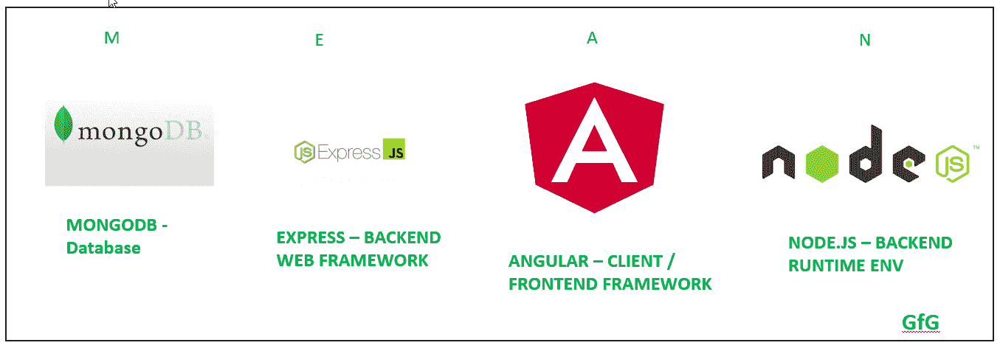
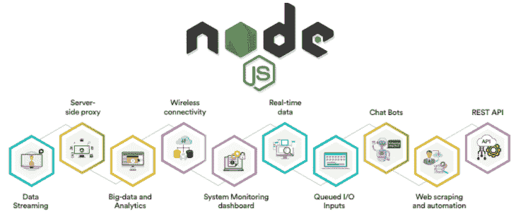

# MEAN Stack 开发|为什么企业应该为他们的业务选择 MEAN？

> 原文：<https://blog.devgenius.io/mean-stack-development-why-should-businesses-pick-mean-for-their-business-8355ad7c8e93?source=collection_archive---------9----------------------->

构建应用程序时，选择使用哪种技术组合会对应用程序的整体性能、效率和稳定性产生严重影响。当今最流行的堆栈选项之一是均值堆栈。

这个首字母缩写代表 MongoDB、ExpressJS、AngularJS 和 NodeJS——所有开源框架都提供了强大的工具，可以比以往任何时候都更快、更高效地开发复杂的应用程序！

**什么是 MEAN Stack？**

完整的首字母缩写词 MEAN 代表 MongoDB、ExpressJS、AngularJS 和 Node.js。这是当今最流行的四种开源 web 应用程序框架，特别是；它们一起用于创建 web 应用程序。

[图片来源](https://www.geeksforgeeks.org/introduction-to-mean-stack/)

为什么？这比听起来容易得多！想象一下，我们有一个网站的想法，我们想把它变成现实。

如果我们只使用一种语言/框架，我们的应用程序将在它所能处理的特性方面受到限制。但是通过使用几个独立的工具(MEAN stack ),我们在开发应用程序时比只依赖一种语言/框架获得了更多的灵活性。

***那么，为什么语言的组合比只依赖一种工具要好呢？***

这是因为每个工具都有自己的专长:JavaScript 轻松处理逻辑，而 MongoDB 处理数据。然后我们再添加两个部分:Laravel(PHP)和 Redis(NoSQL 数据库)。总之，它们给了我们几乎无限的选择来开发新类型的应用程序！

换句话说，对于任何想了解现代 web 应用程序是如何构建和维护的人来说，熟悉这些技术中的一部分或全部是必不可少的。而且，同样重要的是 [**雇佣意味着为你的项目堆叠开发者**](https://www.valuecoders.com/hire-developers/hire-mean-stack-developers?utm_source=hire_mean&utm_medium=Guest_Blog&utm_campaign=devgenius&utm_id=NKY) 。

通过添加来自不同软件库的各种组件，您可以提高作为一名活跃开发人员的技能，以及在竞争激烈的行业中寻求就业机会时的价值！

**MongoDB**

MongoDB 是一个 NoSQL 数据库管理系统。它是一个开源的面向文档的数据库，将数据存储在灵活的类似 JSON 的文档中，这意味着它可以以不同于传统关系数据库的方式进行查询和索引。

MongoDB 不支持连接或其他关系操作；它非常适合需要存储因文档而异的数据的应用程序。

这种问题的一个简单例子是存储电影:每部电影都有自己的剧情简介、类型、上映日期等等，而不是试图将这些建模为一部电影的属性(就像您可能使用关系数据库一样)。

它们是独立的文件。数据库设计人员经常发现，规范化(将大型数据集划分为具有单独字段的表)会使他们的系统变慢，因为这意味着要搜索更多的数据。因此，许多现实世界的问题最好使用非结构化数据库来解决。

NoSQL 数据库提供的灵活性意味着许多项目不是纯粹的关系型或纯粹的 NoSQL，而是在适当的时候使用这两种技术。如果你**雇佣一个普通的栈开发人员，**他/她总是建议 MongoDB 对于保持无缝的数据呈现非常重要。

**快递**

ExpressJS 是一个 Node.js web 应用程序框架，它为 web 和移动应用程序提供了一组强大的功能，可以用更少的代码实现快速开发。

主要特性包括强大的请求路由功能、通过 Handlebars 模板的简单模板支持，以及简单但强大的中间件功能。

Express 起源于 Express Web Framework (EWF)，它是 2010 年从 Connect 中提取出来的，作为一个独立的模块，跟随 LinkedIn 的一个内部项目，在开源许可下使用 Connect 创建企业级 Node.js 应用程序。

首次公开发布是在 2011 年 4 月 11 日。默认情况下，它捆绑了 Mustache、Chunkify、EJS 和现在已经过时的 Jade 编译引擎。它的完整文档可以在网上找到。由此， [**意为栈开发服务**](https://www.valuecoders.com/top-mean-stack-development-services-company-india?utm_source=mean_comp&utm_medium=Guest_Blog&utm_campaign=devgenius&utm_id=NKY) 大受追捧。

实际上，Express 比 Connect 更受欢迎，因为它足够小，如果需要的话可以放在一个文件中，同时仍然提供了其更大的前身框架的许多关键组件，包括路由器和主体解析器中间件系统。

**棱角**

AngularJS 是一个现代的 web 应用框架。它允许您使用 HTML 作为模板语言，并允许您扩展 HTML 的语法以清晰简洁地表达应用程序的组件。

AngularJS 是一个完整的包，包括在当今要求苛刻的单页面应用程序中构建结构良好的动态 web 应用程序所需的一切。当你[**雇佣一个开发人员**](https://www.valuecoders.com/hire-developers?utm_source=hire_dev&utm_medium=Guest_Blog&utm_campaign=devgenius&utm_id=NKY) 来创建一个前端体验时，你必须保证他/她在 Angular 方面有专长。

Angular 有几个强大的特性，比如双向数据绑定、模块化架构、依赖注入和动画。

这意味着您可以通过编写比以往更少的代码和管理更少的依赖项来创建一个与后端服务平稳交互的高响应用户界面。

这些应用程序易于单元测试(因为每个组件都与相邻组件相隔离)，易于维护，并且在其上开发更有趣！我们不需要额外的包或框架来处理我们的数据库。当然，对于不同类型的数据库，我们有不同的软件包，

MongoDB 的 MongoDB 包或 MySQL 数据库的 MySQL 包等。但是如果我们想要支持所有类型的数据库而不需要任何包呢？

嗯！NodeJS 出现了；它提供了一个机会，只需编写一个代码，就可以在所有类型的数据库上工作，而不需要使用任何额外的包。简直太神奇了，不是吗？那么，你还在等什么？**立即雇佣印度 MEAN stack 开发商**来获得最佳解决方案。

**节点 JS**

Node.js 是基于 Chrome 的 V8 JavaScript 引擎构建的 JavaScript 运行时。Node.js 利用事件驱动的非阻塞 I/O 模型。它使 node.js 变得轻量和高效，非常适合跨分布式设备运行的数据密集型实时应用程序。

Node.js 的包生态系统 npm 是有史以来最大的开源库生态系统。成千上万的开发者利用其资源，使用简单的 JavaScript 包而不是复杂的框架或 API 来构建各种软件。

除了开发服务器端 web 应用，Node.js 还支持 Kafka & Storm 等流处理平台以及以太坊等 Dapps 和协议等大数据项目。

[图像来源](https://medium.com/technofunnel/node-js-single-threaded-event-based-architecture-9f73daee37a1)

以下给出了这些要点的意思。JS 是用 MongoDB 作为数据库服务器创建 web 和移动应用程序的最流行的框架之一。

Express 作为 web 框架，Angular 作为客户端开发的 MV*框架，Node.js 作为运行时环境。

通过使用每个模块，我们可以节省时间，而且，它允许我们编写模块化代码，这使得我们的项目在未来更具可伸缩性或可维护性。简而言之，这意味着我们已经找到了合适的工具集来满足我们的业务应用需求。

**使用均值叠加的优势如下:**

更少的编码和更高的生产率:使用均值堆栈的优点是其高生产率的编码特性。它不仅生成样板代码，而且有助于轻松地组织代码，使它们在项目中可重用。

认证和授权等常用功能是现成可用的，无需我们付出任何努力，因此开发人员可以更专注于他们的核心功能，而不是编写样板代码。

**非常适合多层 web 应用程序开发:**它还可以用于开发多层复杂的 Web 应用程序解决方案，方法是适当处理它的所有层，如前端(角度)、中间层(节点。Js)，以及 DB 层(MongoDB)。

**更快、更易于维护的代码库:**该框架为开发人员提供了自由，让他们可以通过创建动态但高度组织化的应用程序来表达自己的创造力，这为一个地方带来了许多好处。

所有必需的库都捆绑在一个平均堆栈中。因此，没有必要花费不必要的时间在网上搜索图书馆。

开发人员可以更专注于特定的任务，而不是在开发应用程序时在配置过程中花费不必要的精力。

**由于灵活性，它可以得到有效的改进:**由于它用于不同模块(如 Angular(客户端)和 Node.js(服务器端)之间的数据传输的高效网络功能，Mean stack 工作迅速。

这种技术被称为双向数据绑定，其中在任何一端所做的更改都会自动更新另一端的数据，而无需再次发出任何网络请求。

**为什么选择 MEAN 进行业务应用开发？**

**#01:平均堆栈可扩展**

MEAN Stack 最大的好处之一就是高度可扩展。使用 MongoDB、ExpressJS、AngularJS 和 Node。JS 一起工作，你可以创建能够轻松处理大量流量的应用程序。

这使得 MEAN Stack 成为希望开发增长型应用的企业的绝佳选择。

**#02:均值叠加性价比高**

MEAN Stack 是一个非常强大的平台，但也是最经济实惠的选择之一。使用 MEAN Stack，您可以创建复杂的业务应用程序，而无需在开发上花费大量资金。

从长远来看，MEAN Stack 还可以通过降低维护成本和提高效率来为您节省资金。

**#03:平均堆栈是开源的**

MEAN Stack 为您的业务应用带来的最大好处之一是，它是一个开源平台。这意味着任何人都可以使用 MEAN Stack 来创建自己的应用和软件产品。

MEAN Stack 还可以免费下载和使用，这使得它成为预算有限的企业的绝佳选择。

**#04:均值叠加简单易学**

如果您不熟悉 Stack，或者想要了解更多关于该平台的信息，可以从网上获得大量资源。MEAN Stack 是最受欢迎的开发平台之一，因此您可以找到大量关于如何使用它的信息和教程。

此外，MEAN Stack 简单的模块化结构便于学习和使用。

**#05:均值叠加多才多艺**

MEAN Stack 是一个非常通用的平台，这使它成为各种规模企业的绝佳选择。MEAN Stack 可以用于创建 web 和移动应用程序，这使它成为希望获得更广泛受众的企业的一个好选择。

MEAN Stack 也非常适合开发企业级应用。为了利用它的真正潜力，你需要联系一个有相关行业经验的专家 **MEAN stack 开发公司**。

**#06:平均堆栈灵活**

MEAN Stack 允许您创建具有各种特性和功能的应用程序，非常适合在应用程序中需要特定功能的企业。MEAN Stack 也非常灵活，允许开发者根据需要定制平台。

MEAN Stack 的灵活性使企业可以轻松开发创新产品，而不必担心技术限制。

**好处#07:平均堆栈是安全的**

MEAN Stack 是一个非常安全的平台，这使得它成为希望保护其数据和应用程序免受黑客攻击的企业的绝佳选择。MEAN Stack 的安全功能包括加密、认证和授权系统，可以保护您的信息免受外部威胁。

MEAN Stack 还具有内置的安全功能，可以抵御病毒和恶意软件。MEAN Stack 的安全特性使其成为需要保护数据安全的企业的绝佳选择。

**#08:均值堆栈易于使用**

MEAN Stack 是一个非常用户友好的平台，这使得它非常适合那些希望开发应用程序而不必学习大量编程语言的企业。

MEAN Stack 也易于使用，非常适合编程新手或没有太多软件开发经验的人。MEAN Stack 的简单性使其成为需要简单解决方案而不需要复杂特性和功能的企业的绝佳选择。

**#09:平均堆栈快**

MEAN Stack 是一个非常快速的平台，这使得它成为希望快速高效地构建应用程序的企业的绝佳选择。

MEAN Stack 的速度允许您在创纪录的时间内开发应用程序，使 MEAN Stack 成为需要快速解决方案而又不牺牲质量的企业的完美选择。

MEAN Stack 的速度也使其成为需要跟上市场变化趋势和发展的企业的良好选择。

**结束**

MEAN stack 为希望开发 web 应用程序的企业提供了许多优势。因此，每一个**平均栈开发服务公司**每年都有巨大的需求。

NodeJS 的可扩展性和速度、MongoDB 的灵活性、ExpressJS 的易用性、AngularJS 的强大功能以及 Node 可用的丰富模块使 MEAN stack 成为商业应用开发的一个有吸引力的选择。

如果你正在考虑开发一个商业应用程序，那么 MEAN stack 应该是你的首选。联系顶尖的 MEAN 应用程序开发公司，了解我们如何帮助您利用 MEAN stack 的力量构建下一款出色的商业应用程序。