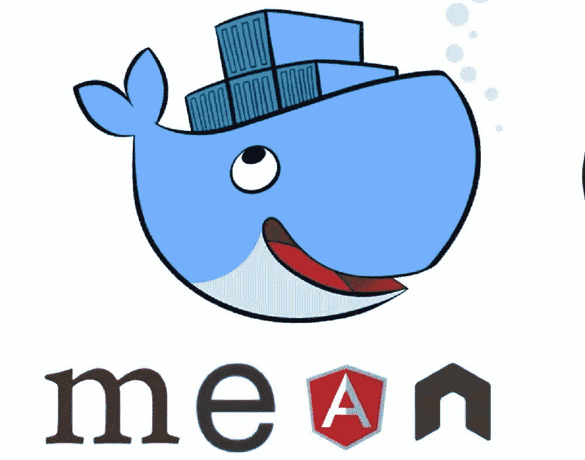
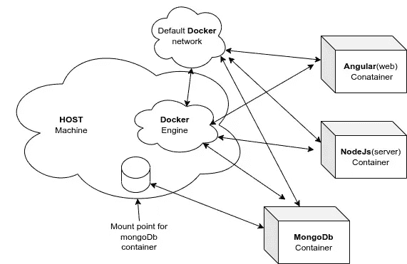
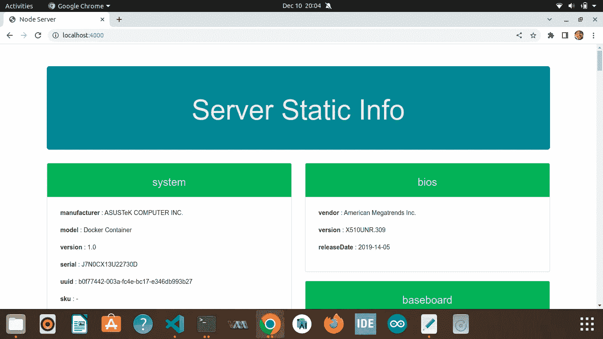
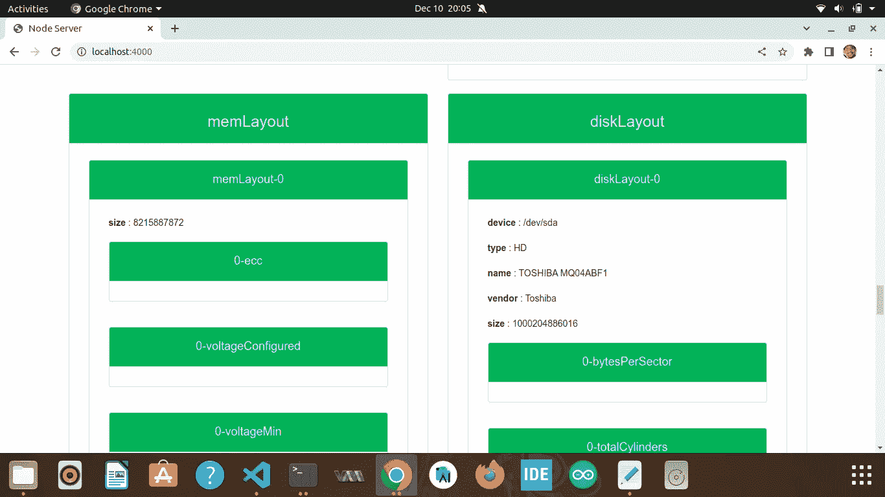
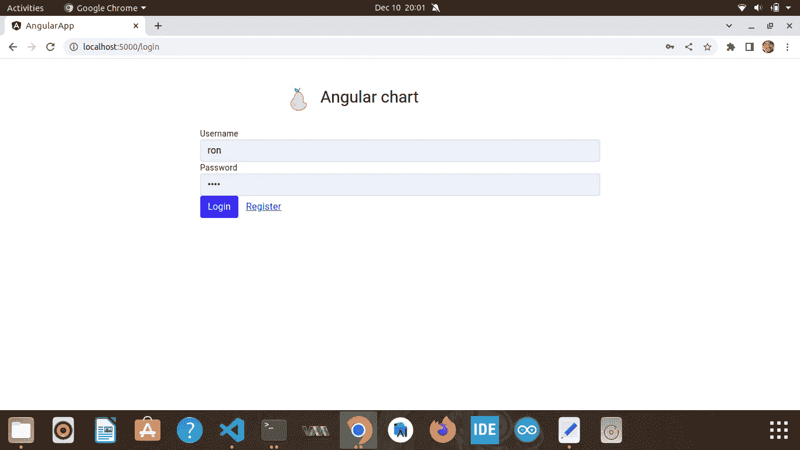
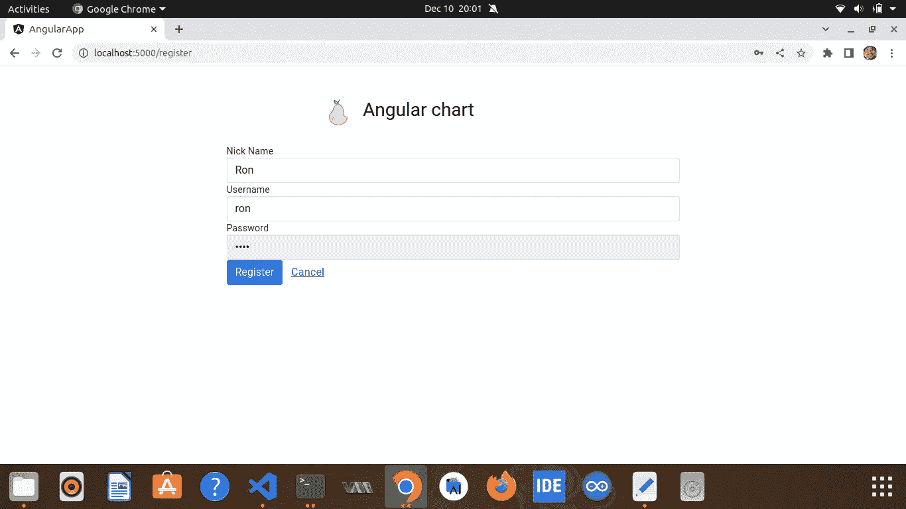
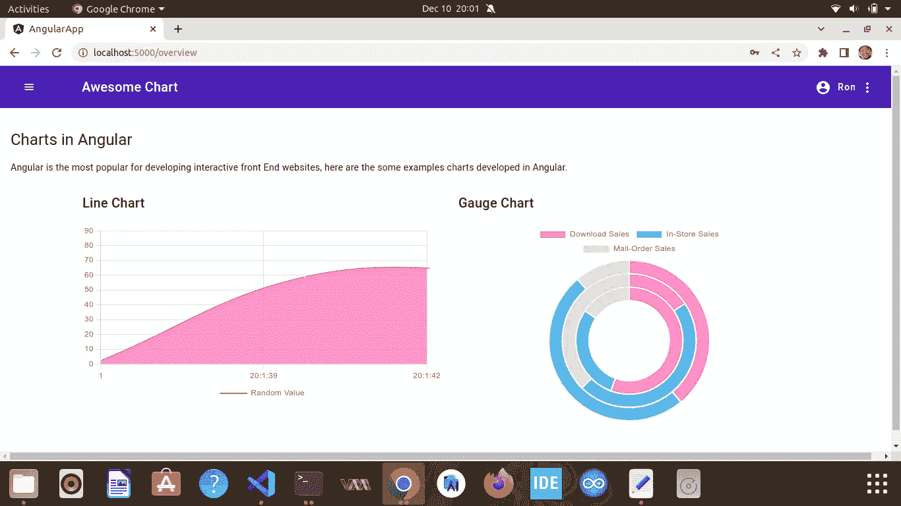

# 带 Docker 的平均堆栈

> 原文：<https://blog.devgenius.io/mean-stack-with-docker-904dfef68606?source=collection_archive---------8----------------------->

在这里，我如何实现**意味着**栈与 **Docker** ，意味着代表 MongoDb、ExpressJs、Angular 和 NodeJs。



## 什么是 Docker…？

Docker 是一个开发、发布和运行应用程序的开放平台。它提供了在松散隔离的环境(称为容器)中打包和运行应用程序的能力。容器非常适合持续集成和持续交付(CI/CD)工作流。

更多信息请参考:[https://docs . docker . com/get-started/overview/# the-docker-platform](https://docs.docker.com/get-started/overview/#the-docker-platform)

## 实现框图



# 所以我们开始吧！！

## 安装和运行 Docker

我的笔记本电脑安装了 ubuntu 20.04 操作系统，所以我只安装了 docker 引擎:[https://docs.docker.com/engine/install/](https://docs.docker.com/engine/install/)

我们也可以试试桌面版的 linux 或者 windows 或者 MAC:[https://docs.docker.com/desktop/](https://docs.docker.com/desktop/)

要检查安装，请键入:

```
$ sudo docker info
 Client:
  Context:    default
  Debug Mode: false
  Plugins:
  ...
 Server:
   Containers: 3
   Running: 2
   Paused: 0...

##.....some useful command...##
$ docker image ls   #-> will display all available images
$ docker container ls #-> will diplay all active containers
$ docker image rm <ImageId> #-> will remove image
$ docker container (stop or rm) #-> will stop or remove container
```

Docker 以 root 权限安装，去掉 sudo 跟随链接:[https://docs.docker.com/install/linux/linux-postinstall/](https://docs.docker.com/install/linux/linux-postinstall/)

## 通过 Docker 运行 MongoDB 服务器映像

从 docker 官方页面拉蒙哥图片:[https://hub.docker.com/_/mongo](https://hub.docker.com/_/mongo)

```
$ docker pull mongo  #-> will pull mongo image 
$ docker image ls
   ...
   mongo               latest    0850fead9327   2 days ago      700MB
   hello-world         latest    feb5d9fea6a5   14 months ago   13.3kB

## Run the container..
$ docker run --name mongo_container -p 3000:27017 -v ./mongoData:/data/db mongo
  ...
  2022-12-07T16:14:46.306+0000 I CONTROL  [main] Automatically disabling TLS 1.0, to force-enable TLS 1.0 specify --sslDisabledProtocols 'none'
  2022-12-07T16:14:46.311+0000 I CONTROL  [initandlisten] MongoDB starting : pid=1 port=27017 dbpath=/data/db 64-bit host=0b26e5b03843
  2022-12-07T16:14:47.677+0000 I CONTROL  [initandlisten] 
  ...
```

**论据详情:**

```
" --name " -> Name of the container
" -p " ->     Host machine mapping port : Container expose port
" -v " -> Host machine mount point path : Container data folder path
```

现在我们可以用端口 **3000 从**主机** **机器**连接 mongo Db 连接。**它还将用户信息存储在**【用户】**集合中，例如:

```
{
  "nickname":"<string>",
  "username":"<string>",
  "password":"<string>"
}
```

## 运行 Nodejs 服务器映像

我已经为 node app 创建了一个 **Dockerfile** 。Docker 文件看起来像:

```
FROM node:16.18.1       #-> Pull node:16.18.1 image from docker-hub repo
RUN mkdir -p /usr/src/app #-> Create folder in container
COPY . /usr/src/app/    #-> Copy all code from host machine current path to container folder
WORKDIR /usr/src/app
RUN ls -al
RUN npm install    #-> install all node package in container
EXPOSE 4000        #-> Expose the port 4000 of container
CMD ["node", "index.js"]   #-> Run the command in container
```

**节点 app** 的所有代码都在**节点-服务器**文件夹下的[*https://github.com/rohitCodeRed/mean-stack-docker-image*](https://github.com/rohitCodeRed/mean-stack-docker-image)中。

用于构建节点服务器应用程序映像的命令。

```
$ docker build -t node_server_image .  #-> assuming you are folder "node-server"
  ...  
  Sending build context to Docker daemon 29.58 MB
  Step 1/6 : FROM node:14.15.4
  8: Pulling from library/node
  Digest: sha256:3422df4f7532b26b55275ad7b6dc17ec35f77192b04ce22e62e43541f3d28eb3
  Status: Downloaded newer image for node:16.18.1
   ---> 8198006b2b57
  ...
```

**让我们运行容器**

```
$ docker run --rm --name node_server_container -p 4000:4000 node_server_image
  Example app listening on port: 4000
  Mongo DB connection error: 
```

现在 Nodejs 服务器运行在[http://localhost:](http://localhost:3001/)4000/

在上面的示例中，由于“ **mongo_container** ”未与“ **node_server_container”链接，导致 mongoDb 连接错误。**让链接它，运行它。

```
$ docker run --rm --name node_server_container -p 4000:4000 --link=mongo_container:db node_server_image
  Example app listening on port: 4000

  **-----------MongoDB connection established------------**
   DB: Chart 
   Host: db 
   Port: 27017
```

参数详细信息:

```
" --link " -> Container name which link to : with hostname of container

node_server_container can connect to mongo_container with hostname="db"
```

现在带有 Express framework 的节点服务器运行在 [http://localhost:4000](http://localhost:4000) 上，并连接了 mongodb 连接。

它为**主页** **页面**提供静态服务器信息，例如机器名称、cpu 数量、硬件信息等。

也有用户**注册**、**登录**和**注销**的端点:

```
'http://localhost:4000/api/user/loggedIn'
'http://localhost:4000/api/user/loggedOut'
'http://localhost:4000/api/user/register' 
```

## 节点服务器的快照



## 运行角度应用程序映像

*   用 **angular:15** 创建了一个简单的 angular app，里面有**登录页面**和总览页面**动态线图**和一个**甜甜圈。**
*   为了认证用户，将调用 REST API "**/API/user/logged in**"，进行注册:" **/api/user/register** "

代码回购:[*https://github.com/rohitCodeRed/mean-stack-docker-image*](https://github.com/rohitCodeRed/mean-stack-docker-image)文件夹名称:-“**angular-app**”。

有关安装指南，请遵循:[https://angular.io/guide/setup-local](https://angular.io/guide/setup-local)

**docker 文件创建**

```
FROM nginx           #-> pull nginx image for docker hub
COPY nginx.conf /etc/nginx/conf.d/default.conf    #-> Copy nginx.conf from current folder "angular-app" to container
COPY dist/angular-app/ /usr/share/nginx/html     #-> Copy all build files from folder "dist/angular-app/" to container
EXPOSE 80
```

**nginx 配置**文件看起来像:

```
server {
    listen 80;
    location / {
        root /usr/share/nginx/html;
        index index.html index.htm;
        try_files $uri $uri/ /index.html =404;
    }
}
```

在构建图像之前构建**角度应用**:

```
$ ng build
  ...
   ...

#-> it will create folder ./dist/angular-app/ put all build file into this
```

构建角度应用程序图像:

```
$ docker build -t angular_app_image .         #-> from current dirctory "angular-app"
  ..
  ..

#Run the container with build image
$ docker run --rm --name angular_app_container -p 5000:80 angular_app_image 
```

*   实际上这里的 **-p** 指定了端口**主机** : **容器**的映射。
*   这里我们不需要链接 **nodejs 容器**，因为我们正在从主机的**网络浏览器**运行 angular app。

现在运行在 [http://localhost:5000](http://localhost:4200/) 上。

## Angular 应用的快照



# 从单个脚本构建映像并运行容器

*   创建了映像构建脚本，文件名: **buildImage.sh**

```
 #!/bin/sh

# Install docker, docker-compose and Node.

# go to node server folder.
cd node-server

## build the image with docker file
docker build -t node_server_image .

cd ..

#-----------Angular build started------------
cd angular-app

npm install

##build angular project
npx -p @angular/cli@15.0.3 ng build

## build the image with docker file
docker build -t angular_app_image .

cd ..

##create folder for data mount point
mkdir ./dbData

##remove folder to clean space
rm -rf angular-app/

rm -rf node-server/ 
```

*   创建了 **docker-compose.yml** 文件，更多信息如下:[https://docs.docker.com/compose/gettingstarted/](https://docs.docker.com/compose/gettingstarted/)

```
version: "3.3"
services:
  server:
    container_name: node
    image: node_server_image
    restart: always
    ports:
      - "4000:4000"
    depends_on:
      - db

  db:
    container_name: mongo
    image: mongo
    ports:
      - "3000:27017"
    volumes:
      - ./dbData:/data/db

  web:
    container_name: angular
    image: angular_app_image
    restart: always
    ports:
      - "5000:80"
    depends_on:
      - server
```

*   上面有三个服务**服务器**、 **db 和 web，web** 服务依赖**服务器**和**服务器**服务依赖 **db 服务。**
*   所有三个服务都可以通过**缺省网络(<项目目录> _default)** 与它们的服务名相互通信。
*   默认网络由 **docker-compose up** 命令自动创建。https://docs.docker.com/compose/networking/

创建了 **startContainer.sh** 脚本，该脚本一次构建映像并运行容器:

```
#!/bin/sh

#run build image script
sh buildImage.sh

## Finally run deployment script...
docker-compose up
```

## 在一个 o 中运行三个容器的步骤:

克隆存储库:

*   git 克隆[https://github.com/rohitCodeRed/mean-stack-docker-image/](https://github.com/rohitCodeRed/mean-stack-docker-image/)
*   cd 均值-堆栈-docker-图像
*   开始容器

```
$ sh startContainer.sh

  Sending build context to Docker daemon  117.2kB
  Step 1/8 : FROM node:16.18.1
   ---> 993a4cf9c1e8
  Step 2/8 : RUN mkdir -p /usr/src/app
   ---> Running in d7f7d4a8c493
  Removing intermediate container d7f7d4a8c493
   ---> 98faa00c2313
  Step 3/8 : COPY . /usr/src/app/
   ---> 353e763a2703
  ...
  ..
  Successfully built d845a572d1c2
  Successfully tagged node_server_image:latest
  ..
  Removing intermediate container 7a0b063132a8
   ---> 60604dd294d2
  Successfully built 60604dd294d2
  Successfully tagged angular_app_image:latest

  ..
  Creating mongo ... done
  Creating node  ... done
  Creating angular ... done
  Attaching to mongo, node, angular
  mongo     | {"t":{"$date":"2022-12-10T14:12:24.714+00:00"},"s":"I",  "c":"NETWORK",  "id":4915701, "ctx":"-","msg":"Initialized wire specificati
  ...
  angular   | /docker-entrypoint.sh: /docker-entrypoint.d/ is not empty, will attempt to perform configuration  
  ..
  node      | 
  node      | **-----------MongoDB connection established------------**
  node      |  DB: Chart 
  node      |  Host: db 
  node      |  Port: 27017
  ..
```

**图像列表:**

```
$ docker image ls

  REPOSITORY          TAG       IMAGE ID       CREATED         SIZE
  angular_app_image   latest    60604dd294d2   46 hours ago    143MB
  node_server_image   latest    d845a572d1c2   46 hours ago    939MB
  mongo               latest    0850fead9327   3 days ago      700MB
  node                16.18.1   993a4cf9c1e8   6 days ago      910MB
  nginx               latest    ac8efec875ce   6 days ago      142MB 
```

**集装箱清单:**

```
$ docker container ls

CONTAINER ID   IMAGE               COMMAND                  CREATED          STATUS          PORTS                                         NAMES
491169cec5a3   angular_app_image   "/docker-entrypoint.…"   13 seconds ago   Up 13 seconds   0.0.0.0:5000->80/tcp, :::5000->80/tcp         angular
23d875e998ba   node_server_image   "docker-entrypoint.s…"   14 seconds ago   Up 13 seconds   0.0.0.0:4000->4000/tcp, :::4000->4000/tcp     node
370b8c448411   mongo               "docker-entrypoint.s…"   14 seconds ago   Up 14 seconds   0.0.0.0:3000->27017/tcp, :::3000->27017/tcp   mongo 
```

对于所有代码，去我的 git 回购:[https://github.com/rohitCodeRed/mean-stack-docker-image/](https://github.com/rohitCodeRed/mean-stack-docker-image/)

希望这篇文章能对大家有所帮助。

感谢阅读。