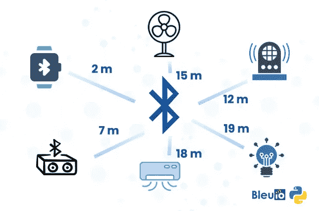
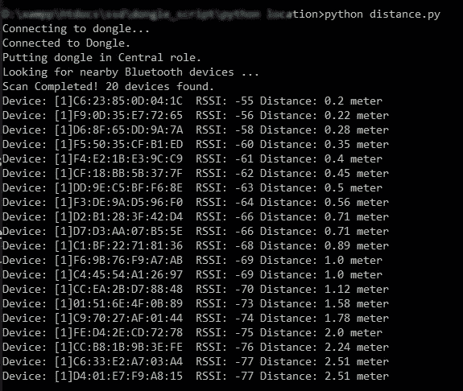

# 使用 Python 实现室内环境下蓝牙测距

> 原文：<https://blog.devgenius.io/measuring-distance-with-bluetooth-in-indoor-environment-using-python-a36b344f9711?source=collection_archive---------1----------------------->



蓝牙测距技术非常流行。存在许多基于信标的定位系统。信标技术通常使用接收信号强度(RSSI)来估计设备之间的距离。

追踪某物时，蓝牙是在近距离缩小搜索范围的绝佳方式。这一特性可用于多个领域。例如建筑物和汽车的安全锁、资产定位和跟踪、室内导航等

GPS 跟踪在提供近距离的精确测量方面并不出色，尤其是在室内环境中。另一方面，蓝牙在短距离内表现出色，因为电波可以穿透墙壁。这可能会填补 GPS 跟踪在室内空间跟踪设备时的空白。

然而，两个蓝牙设备之间的距离的大多数计算都是估计。很难确定两个蓝牙设备之间的准确距离，因为许多因素会影响计算。尽管存在挑战，但仍有方法可以确定两个蓝牙设备之间的距离，精确度至少为 80%。

该测距方法实现简单，并且具有计算两个蓝牙设备之间距离的公式。顾名思义，这两种设备都需要在蓝牙范围内才能估计距离。

本文将分享一个简单的 python 脚本来确定附近的蓝牙设备及其距离(以米为单位)。

该脚本扫描附近的蓝牙设备，并通过使用众所周知的 RSSI 到距离公式获得距离的近似值。

阅读更多关于如何计算距离的信息

[如何根据 BLE 信标的 RSSI 值计算距离](https://iotandelectronics.wordpress.com/2016/10/07/how-to-calculate-distance-from-the-rssi-value-of-the-ble-beacon/)

# 要求

*   【https://www.bleuio.com】蓝牙低能耗 USB 加密狗 BleuIO
*   [Pyserial](https://pypi.org/project/pyserial/) 。

# 说明

*   在[https://GitHub . com/smart-sensor-devices-ab/python _ bluetooth _ device _ distance _ meter . git](https://github.com/smart-sensor-devices-ab/python_bluetooth_device_distance_meter.git)从 GitHub 获取脚本
*   将 BleuIO 连接到您的电脑。该脚本使用 pyserial 连接到蓝牙 USB 加密狗 BleuIO。
*   更新脚本并编写正确的 COM 端口，在该端口上连接加密狗。
*   连接到加密狗后，我们将加密狗置于中心角色，以便它可以扫描附近的蓝牙设备。
*   然后，我们使用 AT+GAPSCAN=3 命令进行简单的间隙扫描，扫描附近的蓝牙设备 3 秒钟。
*   之后，我们从串行端口读取输出，并使用我们的 RSSI 到距离公式来获得以米为单位的距离。
*   最后，我们将结果按距离排序，然后在屏幕上打印出来。

这是最终的脚本文件。

```
import serial
import timeyour_com_port = "COM18"  # Change this to the com port your dongle is connected to.
connecting_to_dongle = Trueprint("Connecting to dongle...")
# Trying to connect to dongle until connected. Make sure the port and baudrate is the same as your dongle.
# You can check in the device manager to see what port then right-click and choose properties then the Port Settings
# tab to see the other settingswhile connecting_to_dongle:
    try:
        console = serial.Serial(
            port=your_com_port,
            baudrate=57600,
            parity="N",
            stopbits=1,
            bytesize=8,
            timeout=0,
        )
        if console.is_open.__bool__():
            connecting_to_dongle = False
    except:
        print("Dongle not connected. Please reconnect Dongle.")
        time.sleep(5)print("Connected to Dongle.")# function to convert rssi to distance in meter
def rssiToDistance(rssi):    
  n=2
  mp=-69
  return round(10 ** ((mp - (int(rssi)))/(10 * n)),2) #put the dongle in dual role, so we can scan for nearby device
console.write(str.encode("AT+CENTRAL"))
console.write("\r".encode())
print("Putting dongle in Central role.")
time.sleep(0.1)
# Scan for nearby devices for 3 seconds
console.write(str.encode("AT+GAPSCAN=3"))
console.write("\r".encode())
time.sleep(0.1)
print("Looking for nearby Bluetooth devices ...")
dongle_output2 = console.read(console.in_waiting)
time.sleep(3)
print("Scan Complete!")
filtered = []
# Filter out unncecssary outputs and keep only the list of devices (also remove index)
for dev in dongle_output2.decode().splitlines():
    if len(dev)>20:
        filtered.append(dev.split(maxsplit=1)[1])
# Get unique device by device id and add distance to each raw        
seen = set()
out = []
for elem in filtered:
    prefix = elem.split(' ')[1]
    if prefix not in seen:
        seen.add(prefix)
        out.append(elem + " Distance: "+str(rssiToDistance(elem.split()[3]))+" meter") # sort list by closest device
out.sort(key=lambda x:int(x.split()[3]),reverse=True)# print(out)
for i in range(0, len(out)):
    print (out[i]) time.sleep(0.1)
console.close()
```

# 输出

运行脚本后，我们看到附近总共有 20 台设备。该列表以米为单位显示了它们与中央设备的距离。

