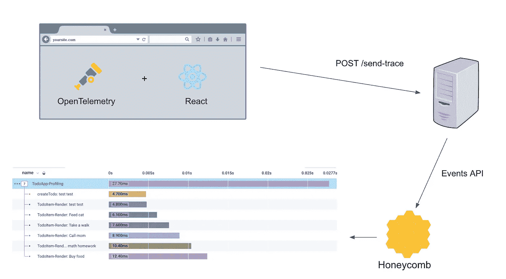
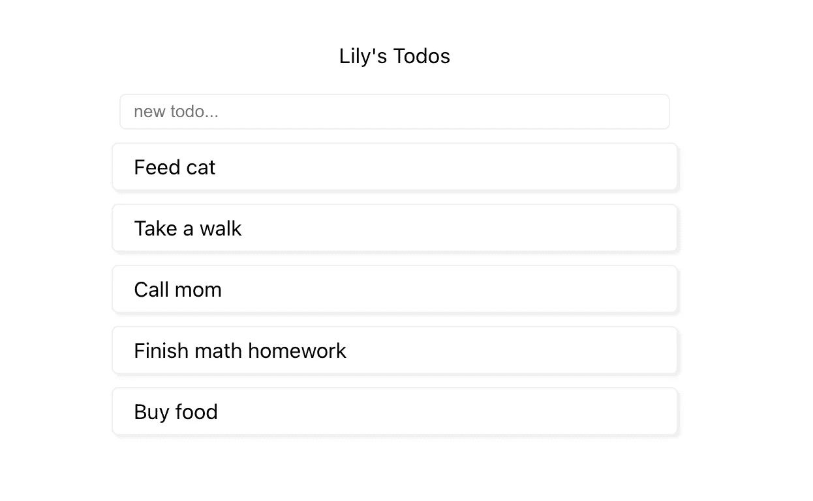
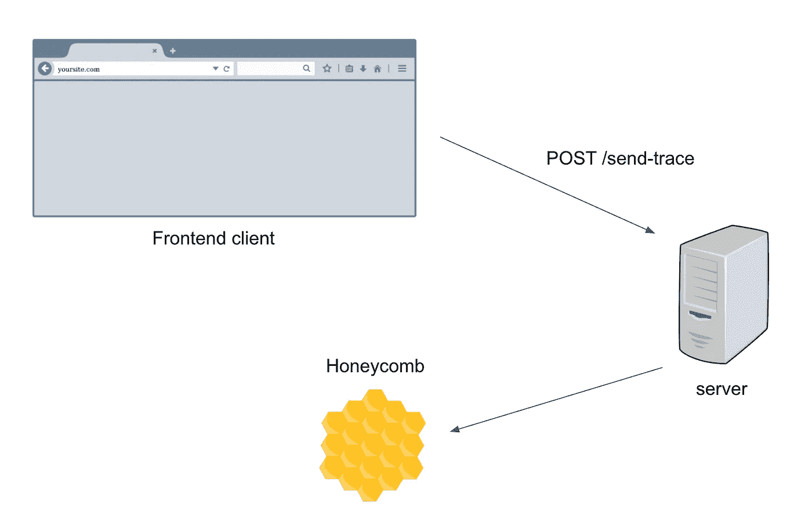
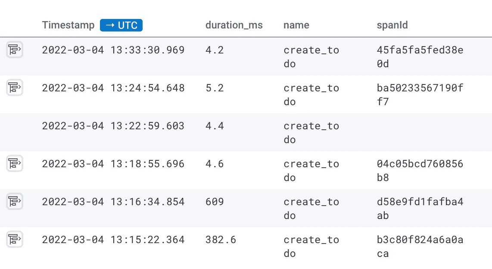
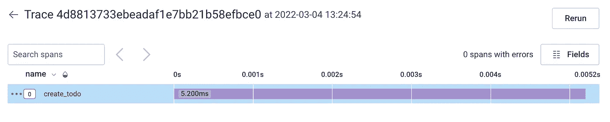
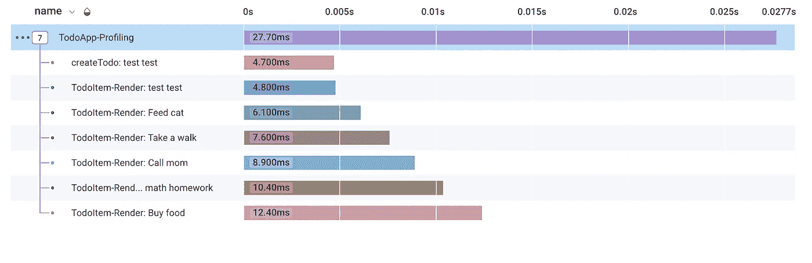

# 利用 OpenTelemetry 和 Honeycomb 测量反应性能

> 原文：<https://blog.devgenius.io/measuring-react-performance-with-opentelemetry-and-honeycomb-2b20a7920335?source=collection_archive---------2----------------------->

## POC 到前端的性能可观察性



作者图片

性能是一个很难解决的问题。有许多方法可以达到这个目标——有些容易成功，有些不那么简单。一个简单的优化是通过使用选择器和 PureComponents 来消除不必要的 React 渲染。另一种方法是找到性能瓶颈，并从那里进行优化。那么，如何找到这些性能瓶颈呢？

也有许多方法。一种方法是使用 Chrome 性能分析器进行分析。然而，这种方法虽然有帮助，但是不可扩展。这对于轶事证据来说是好的，但是对于批量分析来说不是很好。如果客户有性能问题，他们必须收集并向您发送他们的分析数据。最后，对于初学者来说，这是一个强大的工具，没有源地图，火焰图很难阅读。

注意:现在有一个 [JS 自分析 API](https://wicg.github.io/js-self-profiling/) 可以自动分析你的代码。我将在以后的文章中讨论这项新技术。

这篇文章是关于追踪的。在这里，我展示了一个简单的概念验证跟踪系统，它将自动收集和发送 React 性能数据，以便于可视化。

本文大致分为四个部分。第一部分只是让应用程序运行起来。第二部分是关于收集痕迹。第三部分是关于如何评测 React 代码。在最后一部分中，我将讨论如何将这个概念验证转化为适用于实际生产环境的东西。

# 第 1 部分:创建一个在节点上运行的简单应用程序

我使用`[create-react-app](https://create-react-app.dev/docs/getting-started)`创建了一个简单的 TodoApp，我将通过跟踪来收集性能数据。



用于创建和编辑待办事项的简单待办事项应用程序

这是一个简单的界面，你在输入框中输入一个待办事项，然后点击“回车”将它添加到待办事项列表的顶部。

你可以在这里找到完整的 [Github 回购](https://github.com/lilychencodes/profiling-demo)。

## 创建节点服务器

节点服务器是向蜂巢发送跟踪数据所必需的。创建一个简单的 express 服务器很容易。你只需要遵循 3 个简单的步骤:

1.  同时安装 express、nodemon 和。

```
npm i express --save
npm i nodemon concurrently --save-dev
```

2.在根文件夹中创建一个`server.js`文件。

```
const express = require('express');const app = express();
const port = process.env.PORT || 5000;app.get('/send-trace', (req, res) => {
  // TODO: send trace data to Honeycomb res.send({ status: 'done' });
});app.listen(port, () => console.log(`Listening on port ${port}`));
```

3.更新 package.json 脚本和代理。

```
"scripts": {
    "client": "react-scripts start",
    "server": "nodemon server.js",
    "start": "concurrently \"npm run server\" \"npm run client\""
},
"proxy": "[http://localhost:5000](http://localhost:5000)",
```

现在您需要运行一个应用程序，我们准备开始分析我们的前端 Javascript。

# 第 2 部分:使用 OpenTelemetry 和蜂巢收集踪迹

[OpenTelemetry](https://opentelemetry.io/docs/) 是一个开源项目，它提供了用于收集度量和跟踪的工具库。我们将使用 OpenTelemetry 跟踪我们的代码。[蜂巢](https://www.honeycomb.io/)是一个软件，让你可视化和分析你的痕迹。我们将把通过 OpenTelemetry 收集的跟踪数据发送到蜂巢。

有许多方法可以建立这样一个系统。一种做法是将跟踪数据发送到收集器[并设置收集器将数据发送到蜂巢。为此，您必须在 Docker 容器中运行收集器。我可能会在某个时候这样做，但是对于本文，我采用了一种更为人工但熟悉的方法:即将跟踪数据发送到我自己的端点，然后通过它们的](https://docs.honeycomb.io/getting-data-in/otel-collector/)[事件 API](https://docs.honeycomb.io/api/events/) 将数据推送到蜂巢。



追踪架构

为了将浏览器跟踪发送到蜂巢，我使用了蜂巢文档。

1.  下载必要的软件包。

```
npm i @opentelemetry/sdk-trace-web @opentelemetry/context-zone @opentelemetry/instrumentation-fetch @opentelemetry/api libhoney --save
```

2.实例化跟踪检测。

```
const provider = new WebTracerProvider(...);provider.register({
  contextManager: new ZoneContextManager()
});const fetchInstrumentation = new FetchInstrumentation({});fetchInstrumentation.setTracerProvider(provider);// Registering instrumentations
registerInstrumentations({
  instrumentations: [
    fetchInstrumentation,
  ],
});export default function TraceProvider({ children }) {
  return (
    <>
      {children}
    </>
  );
}
```

然后，您可以将顶级组件包装在 TraceProvider 中。

```
ReactDOM.render(
  <React.StrictMode>
    <TraceProvider>
      <App />
    </TraceProvider>
  </React.StrictMode>,
  document.getElementById('root')
);
```

你可以在我的 Github repo [这里](https://github.com/lilychencodes/profiling-demo/blob/master/src/trace-provider.js)找到完整的代码。

3.创建跨度并开始收集数据。

要创建一个跨度，使用`.startSpan()`方法。当工作完成时，不要忘记通过调用`.end()`来关闭跨度。

```
// inside a component
  const createTodo = useCallback(
    (e) => {
      if (e.key !== 'Enter') return; withTracing('create_todo', async () => {
        const newTodos = [
          { title: currentTodo },
          ...todos
        ];
        await setTodos(newTodos);
      });
    },
    [todos, setTodos, currentTodo, setTodo]
  )// withTracing utility function
async function withTracing(name, cb) {
  const tracer = api.trace.getTracer('profiling-demo');
  const span = tracer.startSpan(name); await cb(); span.end(); reportSpan(span);
}function reportSpan(span) {
  const payload = { ... }; // span id, name, duration, etc. fetch('./send-trace', {
    method: 'POST',
    headers: {
      'Content-Type': 'application/json'
    },
    body: JSON.stringify(payload),
  });
}
```

在这个例子中，我想知道重新计算待办事项列表需要多长时间。

4.将跟踪数据从后端发送到蜂巢。

为了向 Honeycomb 发送跟踪数据，我使用了 Honeycomb 的 [libhoney](https://docs.honeycomb.io/getting-data-in/libhoney/javascript/) 库。

```
const honeycomb = new Libhoney({
  writeKey: HONEYCOMB_API_KEY,
  dataset: 'profiling-demo',
});// /send-trace endpoint
app.post('/send-trace', (req, res) => { const event = honeycomb.newEvent();
  const payload = { ... }; // processed payload from req.body
  event.add(payload);
  event.send(); res.send({ status: 'done' });
});
```

虽然您可以直接从浏览器向 Honeycomb 发送数据，但这通常不是一个好的做法，因为像 API 密钥这样的敏感数据在浏览器中永远不会真正安全。

这些都完成后，我们可以看到蜂巢中的数据:



更新 todos 所用的持续时间。

您也可以单击单个轨迹。



跟踪示例

当然，我们的痕迹仍然很少。在现实生活中，您可以使用嵌套跨度实现更复杂、更有洞察力的跟踪。请继续阅读一些例子！

# 第 3 部分:测量反应性能

使用跟踪可以做很多事情！有没有想过你的 React 组件会因为一些用户动作而重新渲染多少次？你的应用程序响应用户交互需要多长时间？

React 确实提供了一个 [React 分析器](https://reactjs.org/docs/profiler.html)。然而，根据文档，Profiler 组件在 prod 中是默认禁用的，应该仅在必要时使用。每次使用都会给应用程序增加一些 CPU 和内存开销。我们将尝试使用我们的开放式遥测系统来分析反应。

让我们在创建新的 todo 时跟踪主 TodoApp 及其子 TodoItems 的呈现。

为了测量 React render，在组件顶部开始一个新的跨度，并关闭`useEffect`钩子内的跨度。完整的代码可以在[这里](https://github.com/lilychencodes/profiling-demo/blob/master/src/components/TodoItem.tsx)找到。



用户交互的应用响应时间

如上所示，每个 TodoItem 组件在创建新的 todo 时都会重新渲染，每次渲染大约需要 5–10 毫秒。从按下“回车”到`useEffect()`钩子触发(相当于`componentDidUpdate`)的总时间约为 27 毫秒。

# 第 4 部分:利用可观察性解决生产中的性能问题

在过去的几年里，我花了很多时间研究性能的可观察性。这是一个难题空间。尽管有太多的工具，但是仍然不容易找出造成性能瓶颈的因素。追踪提供了可见性，但是仍然需要人工来检测和分析痕迹。

在过去的几年里，我学到的一个有用的策略是利用 metatags 的 sh*t。

元标记是可以添加到跟踪中的标记。在 Honeycomb 中，您可以基于标签值查询和比较数据。前端性能世界中一些有用的元标记是 Redux 存储大小、A/B 测试变量和[网络信息](https://developer.mozilla.org/en-US/docs/Web/API/Navigator/connection)。例如，我发现 Redux 大小与应用程序响应用户交互的速度密切相关。在我目前的公司，我们投入了大量精力来减少 Redux 大小(例如，通过延迟加载数据、缓存回收等)。).

我希望这篇 POC 文章对您有所帮助。在真实的生产环境中，您可能还需要做一些额外的事情。

1.  对您的数据进行采样。
2.  限制 api 调用的批处理事件。
3.  为开发和生产使用单独的数据集。
4.  将前端跟踪(反应时间)与后端跟踪(api 时间)连接起来，以获得更完整的用户监控画面。

感谢您的阅读！如果你有任何问题，请不要犹豫来找我。你可以在我的 [Github repo](https://github.com/lilychencodes/profiling-demo) 中找到这篇文章的代码。